CUDA Path Tracer
================

**University of Pennsylvania, CIS 565: GPU Programming and Architecture, Project 3**

* Di Lu
  * [LinkedIn](https://www.linkedin.com/in/di-lu-0503251a2/)
  * [personal website](https://www.dluisnothere.com/)
* Tested on: Windows 11, i7-12700H @ 2.30GHz 32GB, NVIDIA GeForce RTX 3050 Ti

## Introduction

In 3D rendering, Pathtracing is a technique that generates realistic looking scenes/images by simulating light ray bounces. For this project, I implemented a CUDA path tracer for the GPU. In order to get the least noisy final output, 5000 calls to pathtrace are made whenever the camera is moved. The result of all 5000 pathtrace calls are then averaged to produce the final output. For each call to pathtrace, the light rays in the scene will bounce a maximum of 8 times.

For this pathtracer, we parallelize operations by Rays (AKA Path Segments), and made sure to sync all threads before moving on to the next parallel operation.

Overall, this project is a continuation of learning how to write CUDA kernel functions, optimize performance by adding memory coalescence, and very simple acceleration structures. The second part of the project introduced me to using TinyObjLoader, CudaTextureObjects, and various rendering techniques to get specific visual effects.

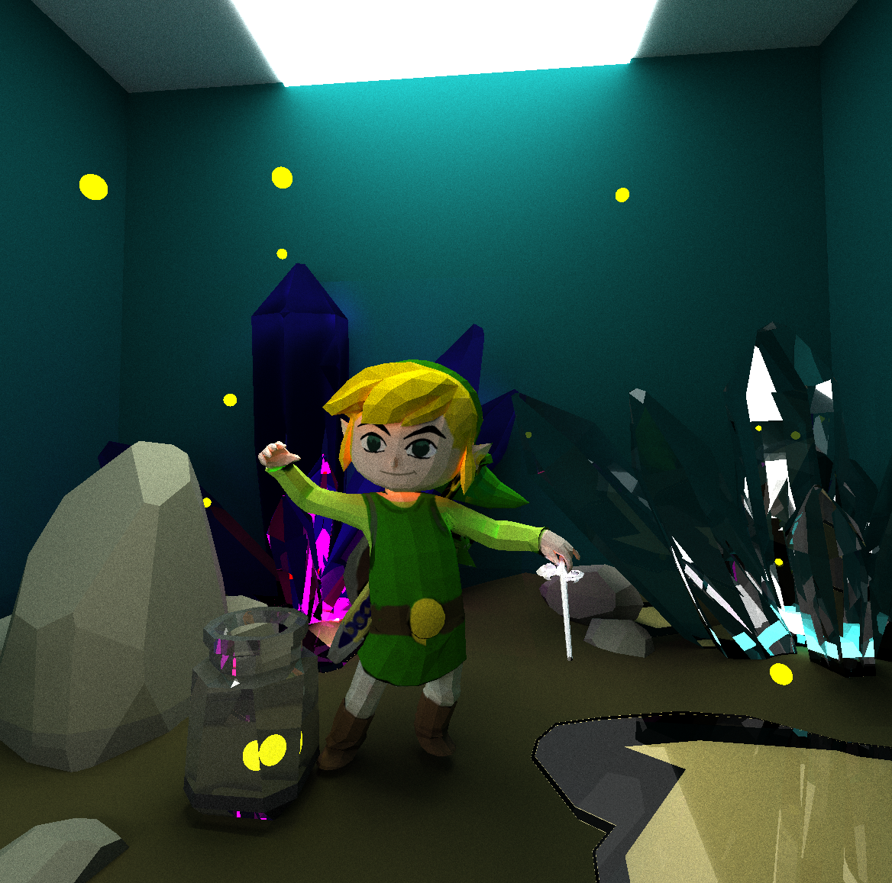

_OBJ credit goes to SketchFab:_
* _Toon Link: [ThatOneGuyWhoDoesThings](https://sketchfab.com/3d-models/ssbb-toon-link-c4737326bee4445ab2a565952ad32eab) I painted over the model in Blender_
* _Stones: [Michael Hooper](https://sketchfab.com/3d-models/low-poly-rocks-9823ec262054408dbe26f6ddb9c0406e)_
* _Quartz: [Vergil190202](https://sketchfab.com/3d-models/crystalpack-25ff46fd33624c91b36307575b000891)_
* _Bottle: modified from [Steva_](https://sketchfab.com/3d-models/simple-low-poly-potion-bottles-a13c6858e8174bebbd58babc52f769c0)_

[Core Features](https://github.com/dluisnothere/Project3-CUDA-Path-Tracer#core-features): 
*  Simple Diffuse, Specular, and Imperfect Specular BSDF shading
*  Path continuation/termination using stream compaction
*  Continugous arrangement of materials based on materialId
*  First-bounce-cache for a specific camera angle.

[Additional Features](https://github.com/dluisnothere/Project3-CUDA-Path-Tracer#additional-features)
*  Refractive materials using Schlick's approximation
*  Depth of Field
*  Direct Lighting
*  Stochastic-sampled antialiasing
*  Arbitrary Mesh Loader with TinyObjLoader
*  UV Texturing, Procedural Texturing, and Bump Mapping

## Scene File Description

The scene files used in this project are laid out as blocks of text in this order: Materials, Textures (if any), and Objects in the scene. Each Object has a description of its translation, scale, and rotation, as well as which material it's using, and if it's a basic shape (such as sphere or cube), then that is also specified. If not a basic shape, then it specifies a path to its obj. If the Object also has a texture, then it will refer to the Id of the texture. Using Ids to keep track of scene attributes prevent over-copying of shared data between Objects.

## Core Features
**Shading kernel with BSDF Evaluation for Diffuse and Perfect/Imperfect Specular.**

Each Object in the scene has a reference to its material. Each material has attributes representing Reflection, Refraction, Specular, Index of Refraction, Color, and Emittance. For each ray, once it has gotten information about the object it has hit, I use a random number generate to generate a float between 0 and 1. Using this number, each ray will behave in a probabilistic manner and will either reflect, refract, or completely diffuse randomly in a cosine-weighted hemisphere (for lambertian reflection) based on the Reflection and Refraction material values in the scene file. 

**Path continuation/termination using Stream Compaction**

In order to avoid processing any unnecessary information, all paths which do not hit any of the Objects in the scene are removed from the list of active paths. This is done through the thrust library's built in stream-compaction function. Stream Compaction takes an array, runs a predicate on each element, and returns another list containing all the elements for which the predicate is true. 

**Contiguous arrangement of materials based on materialId**

For scenes which have a lot of different materials, sorting materials based on materialId makes sense to make reading from global memory faster.

**First bounce caching**

Since we restart rendering the scene whenever the camera moves, we know that the first bounce for each call to pathtrace for one particular camera angle will always be constant. We know exactly which object our first rays will hit and where. This way, we can avoid re-computing the first intersections for each of the 5000 calls to pathtrace. 

**Results of Core Features**

_All Materials Diffuse_            |  _Specular Sphere_ | _Imperfect Specular_
:-------------------------:|:-------------------------:|:--------------------:
 |  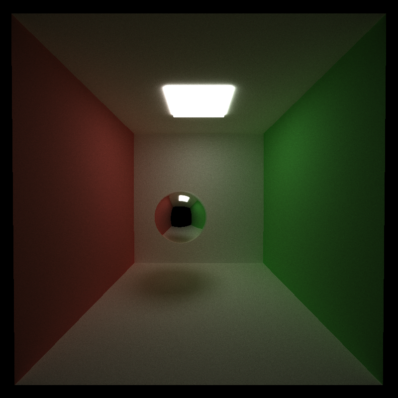 | 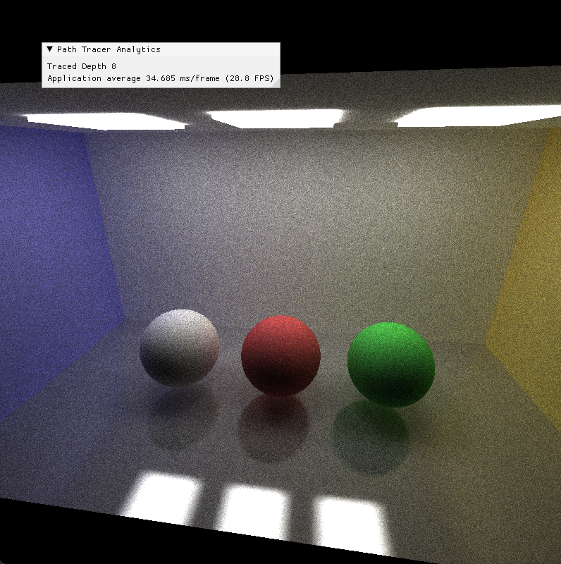

## Additional Features
### Refractive Material

My implementation for refractive materials comes from [Physically Based Rendering](https://www.pbr-book.org/). If a ray decides it will refract, then I first get the material properties of material 1 and material 2 (in most cases, material 1 is air, which means it has an IOR of 1.003). Then, I obtain the incidence angle of my ray and the normal of the intersection point. Using this information, I can figure out if the angle is a critical angle or not. If it's a critical angle, then the light ray will simply bounce off the surface. Otherwise, it will refract. If the ray is inside the Object and a critical angle is hit, tjhen there will be total internal reflection.

This is the result of my refraction implementation:

_View 1_            |  _View 2 without specular sphere_ 
:-------------------------:|:-------------------------:
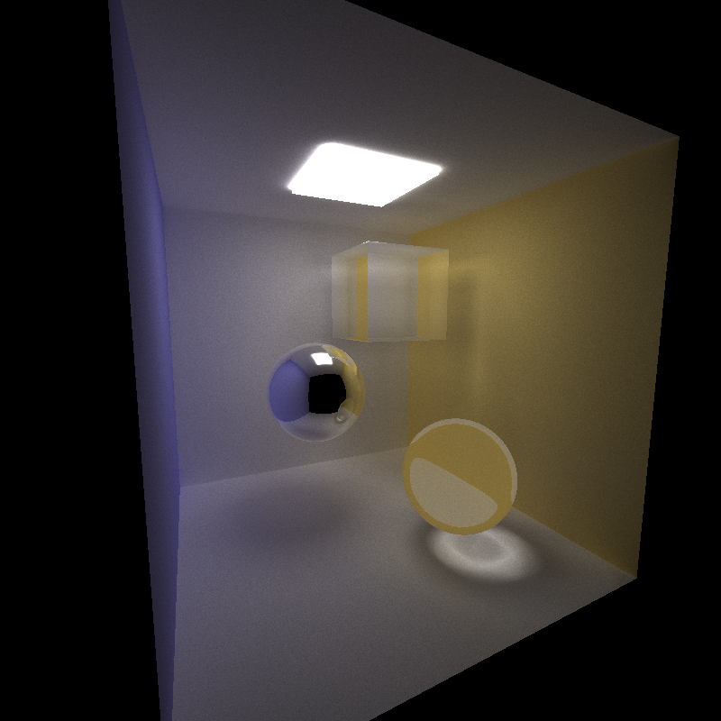 |  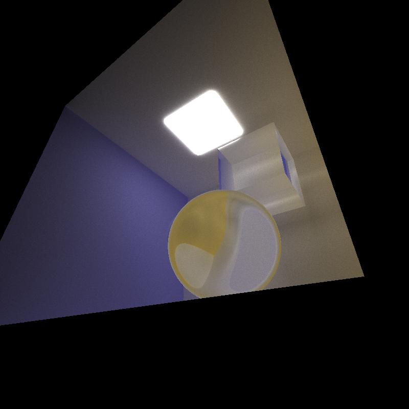

### Depth of Field

In order to obtain a depth of field effect, I referenced this online article: [Depth of Field in Path Tracing](https://medium.com/@elope139/depth-of-field-in-path-tracing-e61180417027#:~:text=Implementing%20depth%20of%20field%20in,out%20of%20focus%20will%20appear). Essentially, we determine two variables: FOCAL_LENGTH and APERTURE. FOCAL_LENGTH specifies how far away your focus point is (where the object becomes sharp). APERTURE is a proxy for how blurry everything out of focus should be. Once we know where the focal point P is in the scene, we can blur the rest of the scene by shifting our ray's origin and then recalculate direction such that it starts at the new origin and goes towards the focal point. These are my results:

_No Depth of Field_            |  _Depth of Field_ 
:-------------------------:|:-------------------------:
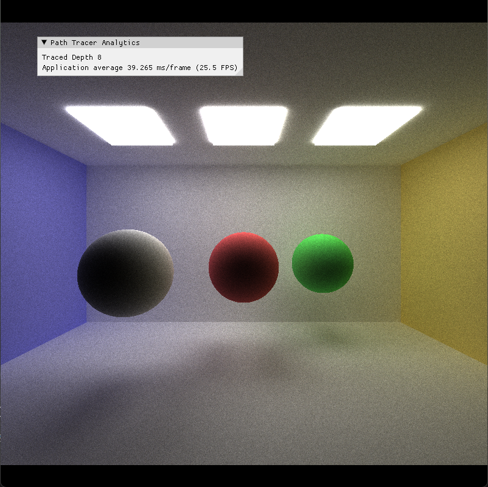 |  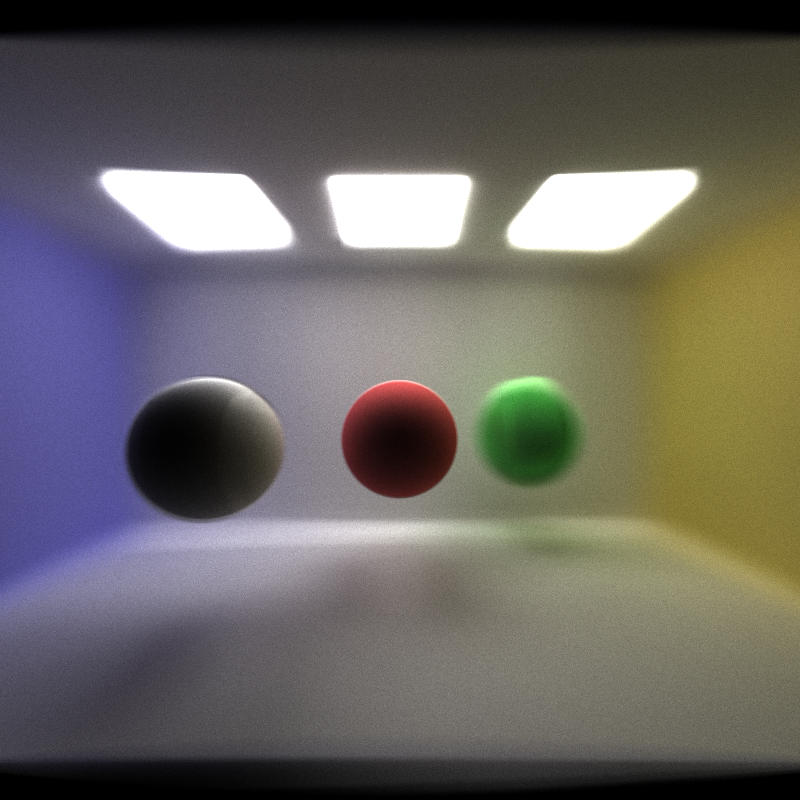

### Stochastic Sampled Anti-Aliasing

Stochastic Sampled Anti-Aliasing can be implemented by applying a slight amount of random noise to the camera ray so that the direction of the ray gets information from its neighbors and can average out the color between neighbors, providing a softer transition. However, this means the first intersection will not always be determinant between pathtrace calls, which renders cache first bounce useless.

_No Antialiasing_            |  _Antialiasing_ 
:-------------------------:|:-------------------------:
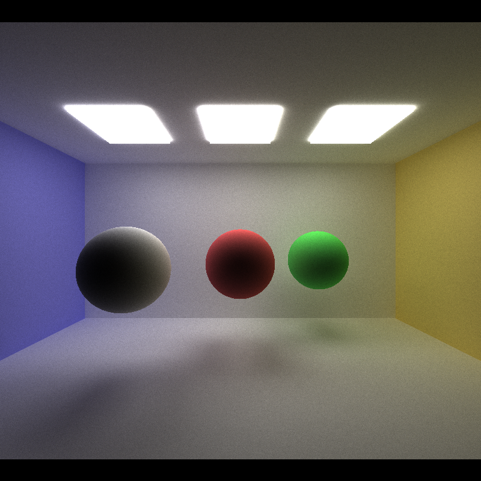 |  
:-------------------------:|:-------------------------:
_No Antialiasing Closeup_            |  _Antialiasing Closeup_ 
:-------------------------:|:-------------------------:
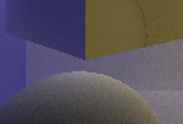 |  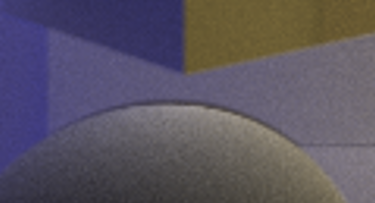

### Direct Lighting

Direct Lighting was implemented by sending every ray with only 1 bounce left directly to a randomly selected lightsource in the scene. Here are the implementation results:

_No Direct Lighting_            |  _Direct Lighting_ 
:-------------------------:|:-------------------------:
 |  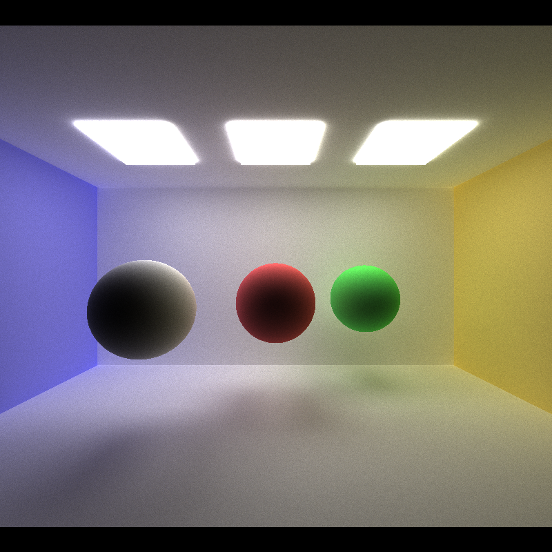

### Arbitrary Mesh Loading with TinyObjLoader

In order to parse through an obj file, I used [tinyobjloader](https://github.com/tinyobjloader/tinyobjloader). After parsing, I created triangles and stored points within these triangles, alongside the normal and any other useful information like uv. If the bounding box is turned on, then the Obj geom would contain an array of triangles (host and device). This way, if there is only one obj, we only loop over triangles if the bounding box is hit. If the bounding box is turned off, then each triangle becomes its own geom, meaning we will iterate over all of them check for intersections, potentially wasting loops. 

In order to initialize the device pointers for triangles, I cudaMalloc'd each geom's list of device triangles. To cudaFree them, I performed a cudaMemcpy for the outer pointers (geom pointers) and used those host-accessible pointers to cudaFree the member device vectors.

Here is the result:

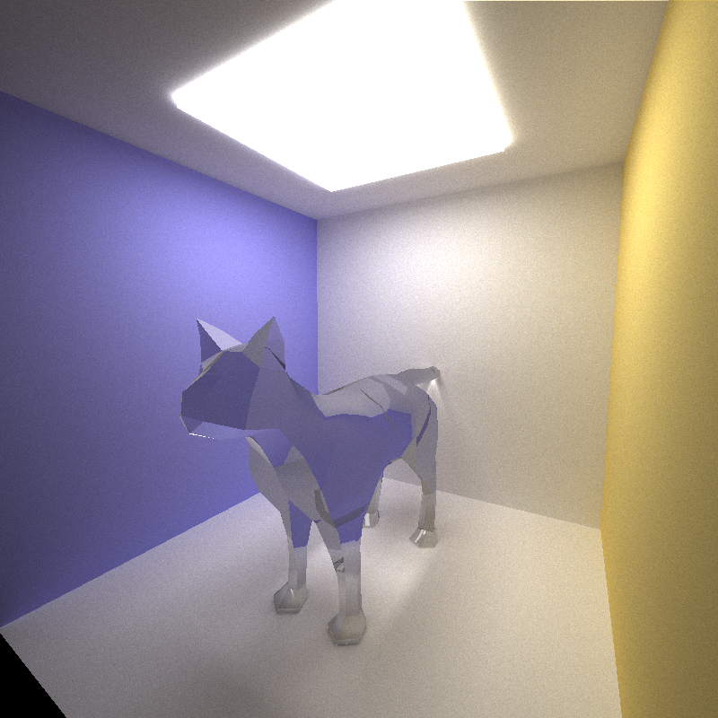

_OBJ credit goes to [volkanongun](https://sketchfab.com/3d-models/low-poly-cat-1e7143dfafd04ff4891efcb06949a0b4) on SketchFab!_

### UV Texture, Procedural Texture and Bump Mapping

In order to read UV values and map them to a texture file (png, bmp, etc), I used CudaTextureObject (Documentation). First, I used stbi_loader to parse pixel information from a given png file. Then, I sent pixel information to an array of cudaArray objects, where each cudaArray object contains all pixels associated with a specific texture. I also have an array of cudaTextureObjects, where each cudaTextureObject acts as a "wrapper" for the pixel information so that sampling functions can be called on the pixel information. (However, as a result of using this, I have had to flip my textures vertically to work properly).

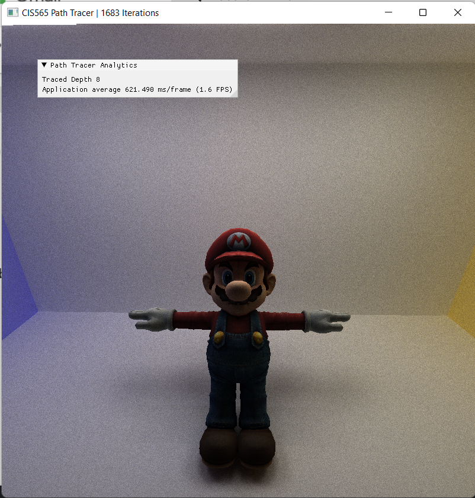

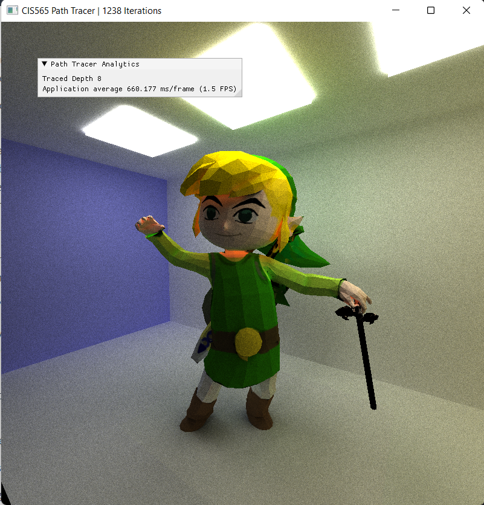

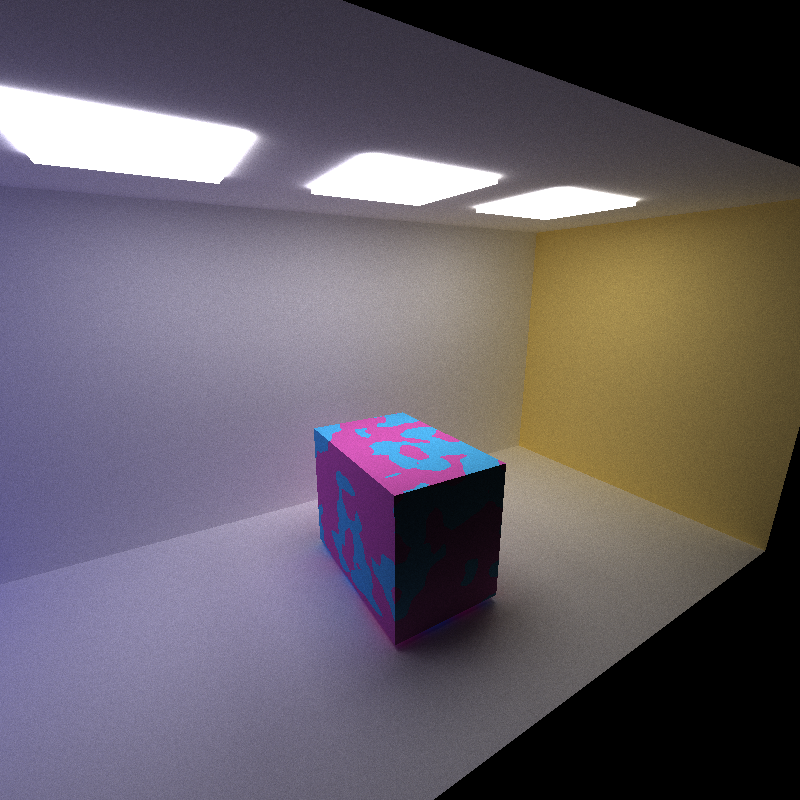

I also implemented bump mapping for uv textures. I followed these slides for instructions on bump map calculations: https://www.ics.uci.edu/~majumder/VC/classes/BEmap.pdf 

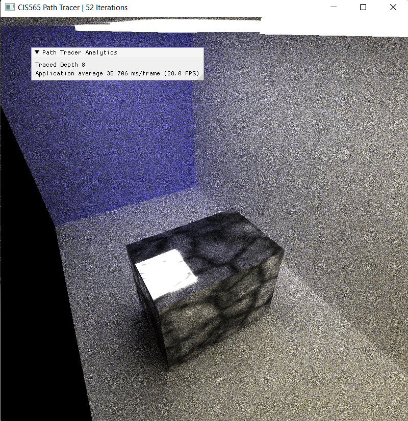

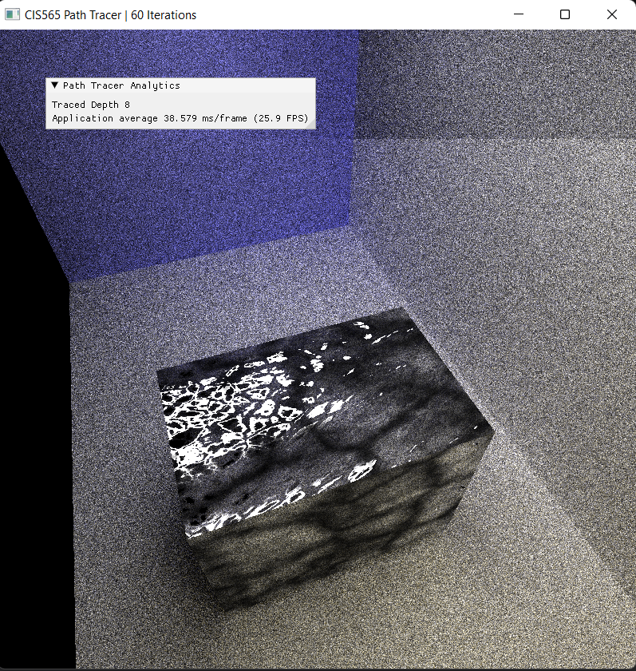

## Performance Analysis

**Stream compaction helps most after a few bounces. Print and plot the effects of stream compaction within a single iteration (i.e. the number of unterminated rays after each bounce) and evaluate the benefits you get from stream compaction.**

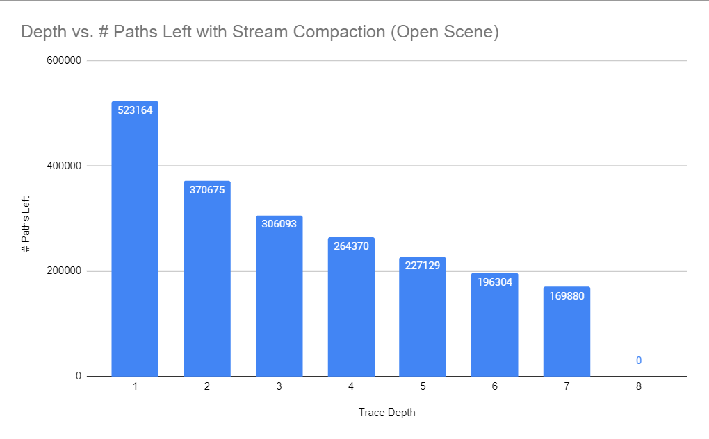

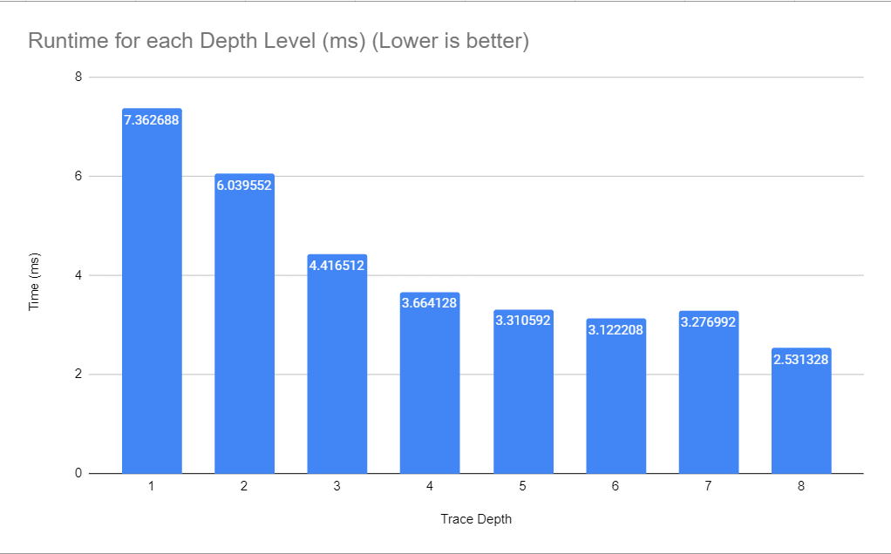

From the above, I printed out the number of remaining paths after each iteration of the while loop inside pathtrace(). It shows Stream Compaction filtering out paths that don't hit anything. Similarly, the second graph shows that since the number of paths decrease on each loop, the runtime also decreases.

**Compare scenes which are open (like the given cornell box) and closed (i.e. no light can escape the scene). Again, compare the performance effects of stream compaction! Remember, stream compaction only affects rays which terminate, so what might you expect?**

My hypothesis is that since the scene is closed, all rays will hit something on each bounce. If the user starts within the cornell box, this means stream compaction won't remove any rays unless the light is hit or the path has run through its entire depth, since rays shot out of the camera cannot escape the box and "not hit" anything. 

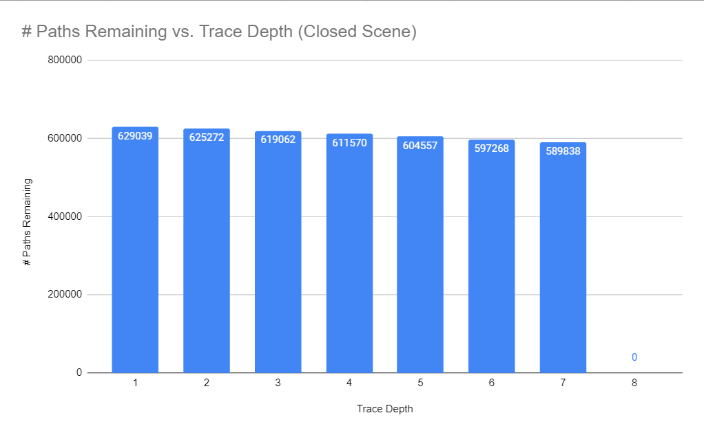

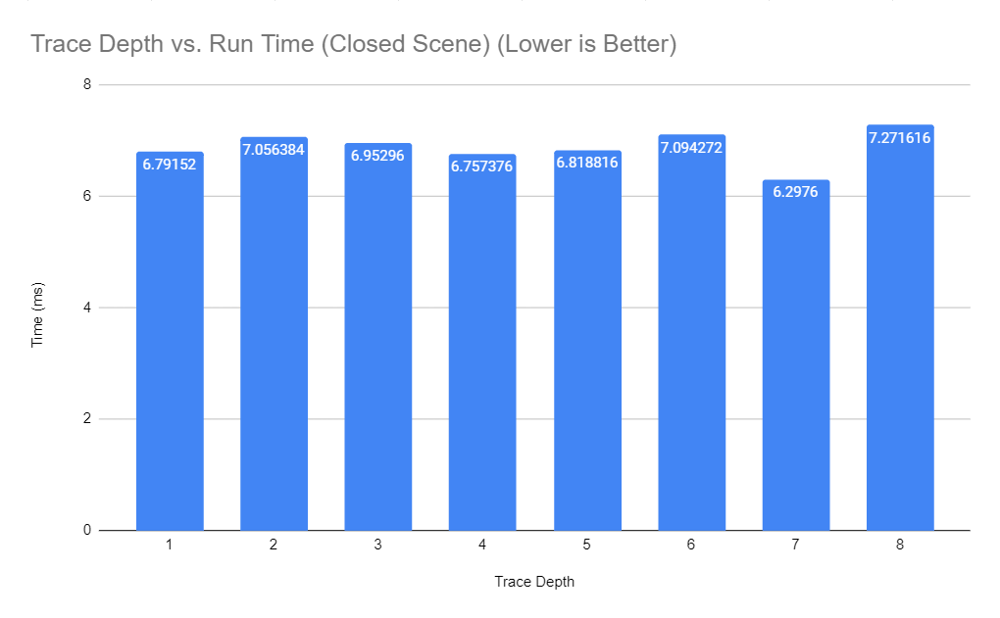

The results fit my origial hypothesis. 

**Material Sorting Performance**

Implementing material sorting actually decreased the performance for scenes with 7 different types of materials and 27 different types of materials both. My understanding is that sorting the materials would make sense if the scene had a lot of materials (we could see a performance improvement if we had over 100 materials in one scene). However, compared between the performance with material sorting in 7Mat Scene vs. 27 Mat Scene, we can curiously see that 27 materials generally has lower runtime than 7 materials once we get to trace depth 4 and above.

***LOWER IS BETTER***
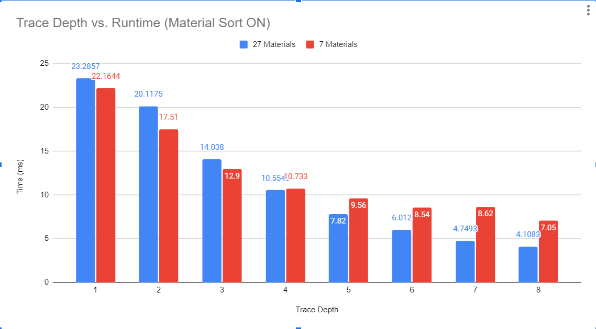

**First Bounce Caching**

As explained earlier, first bounce caching is useful when we have one camera angle and running 5000 calls of pathtrace() on that one camera angle, because the first intersections by shooting rays from the camera to each pixel is deterministic. Based on the results below, we can see a slight increase in FPS by using first bounce cache.

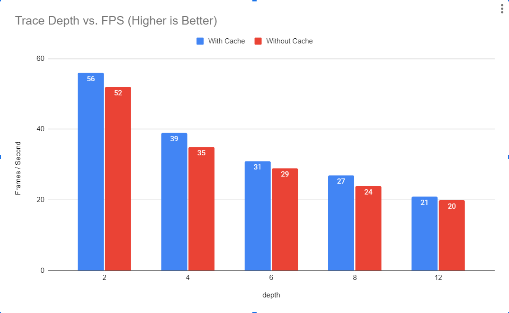

**Bounding Box for OBJ**

Based on the results below, using a bounding box for OBJ will generally decrease the Runtime requried for the program overall. In this case, I recorded the output of the first 17 iterations. It can be observed that each iteration's runtime has the bound box scene running much faster than the non bound box scene.

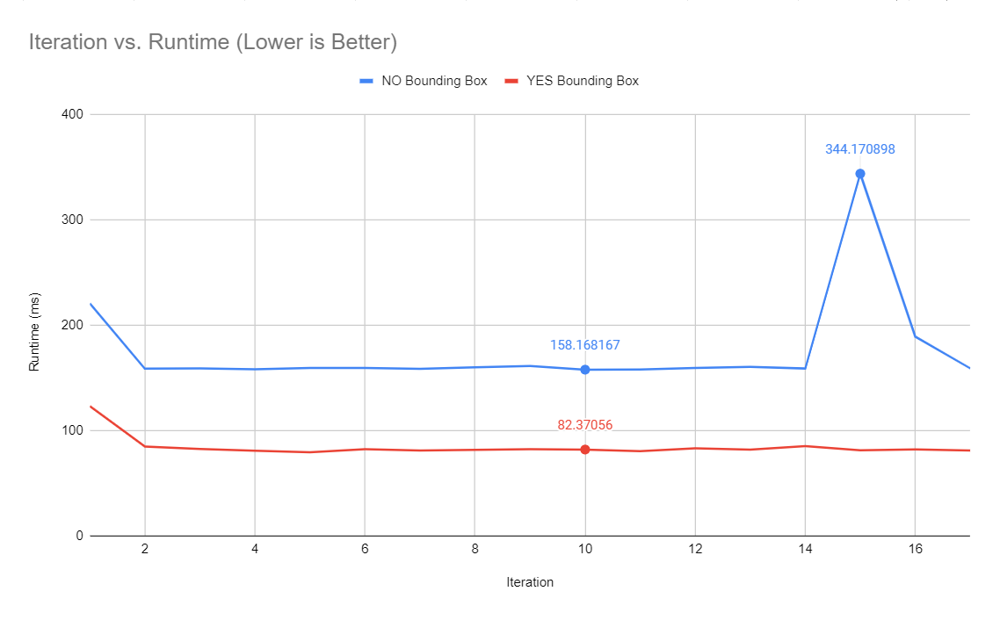

## Bloopers! :)

Too much antialiasing: me without my contacts

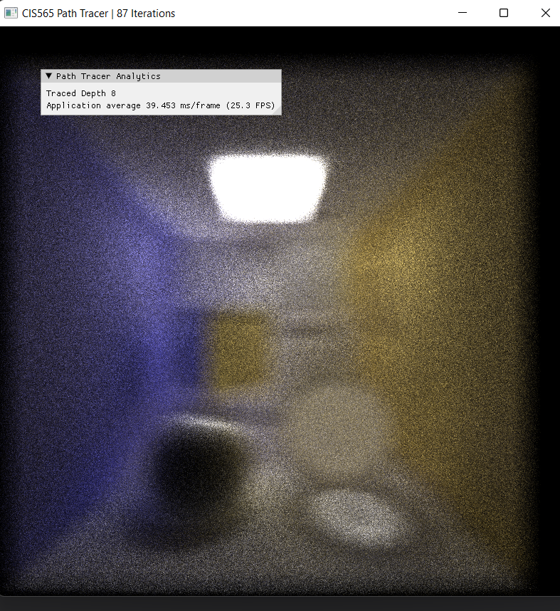

Cursed Black Hole Wahoo

