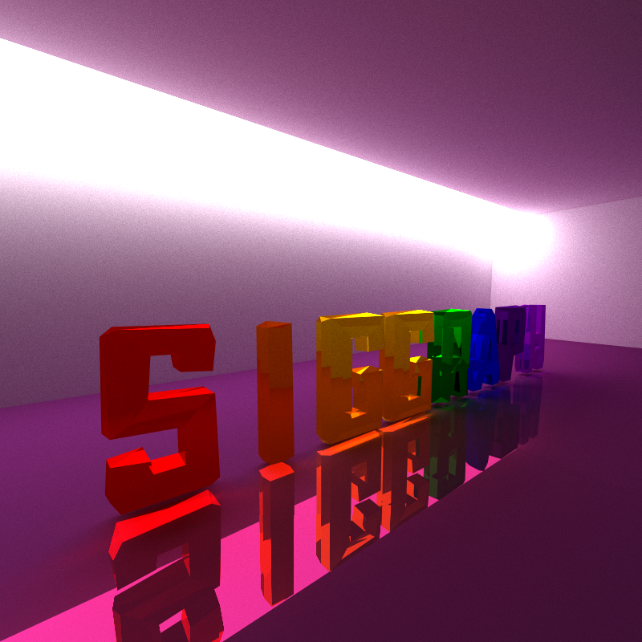
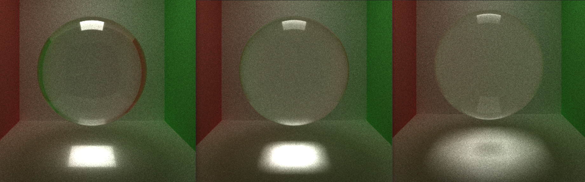
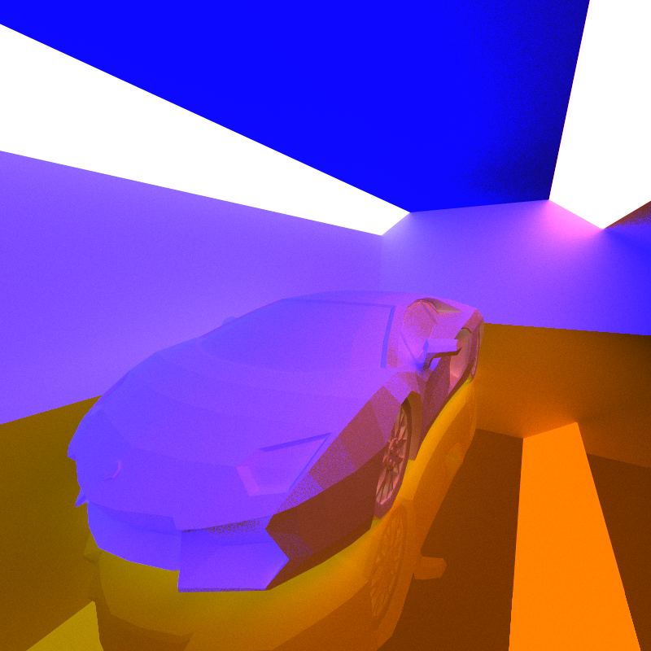
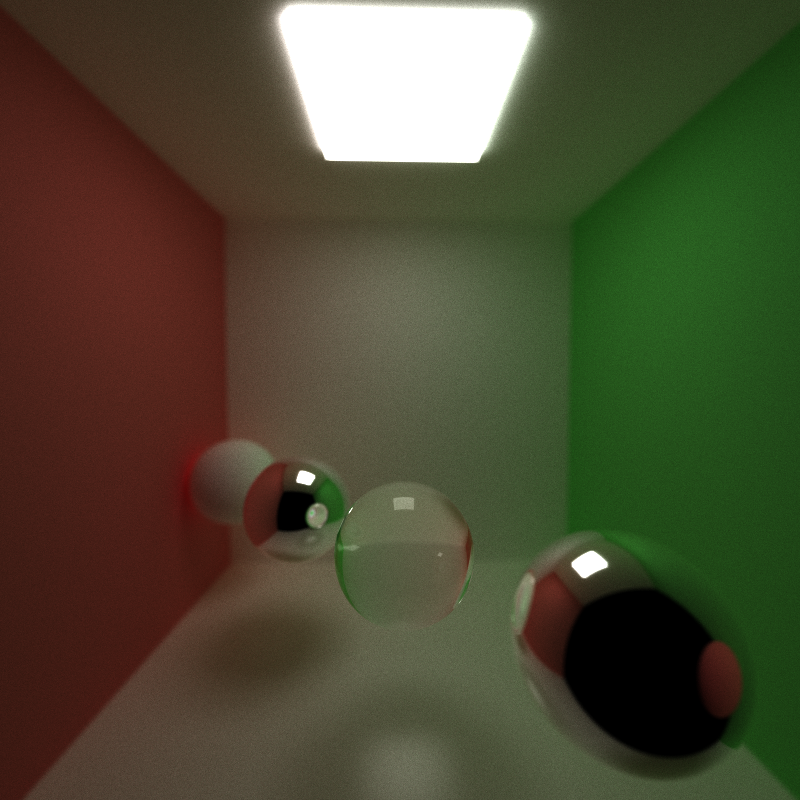
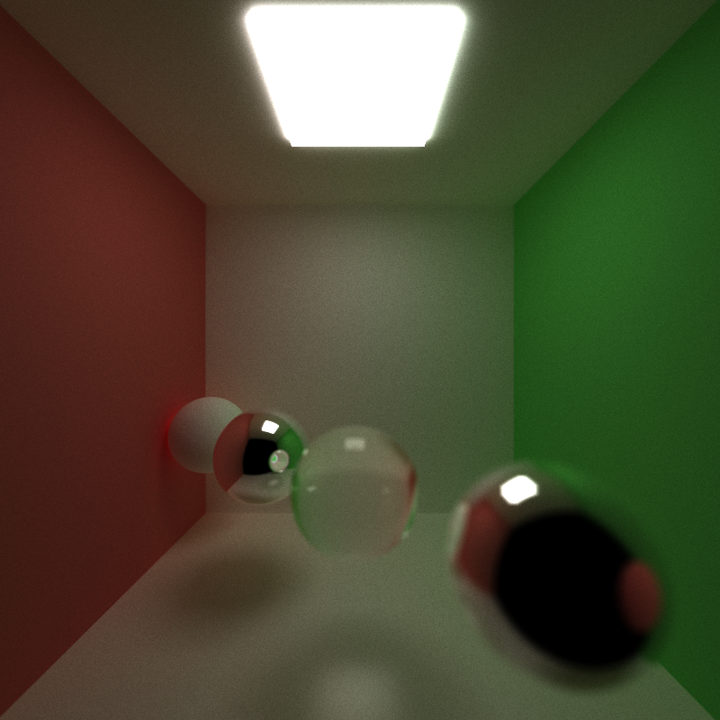
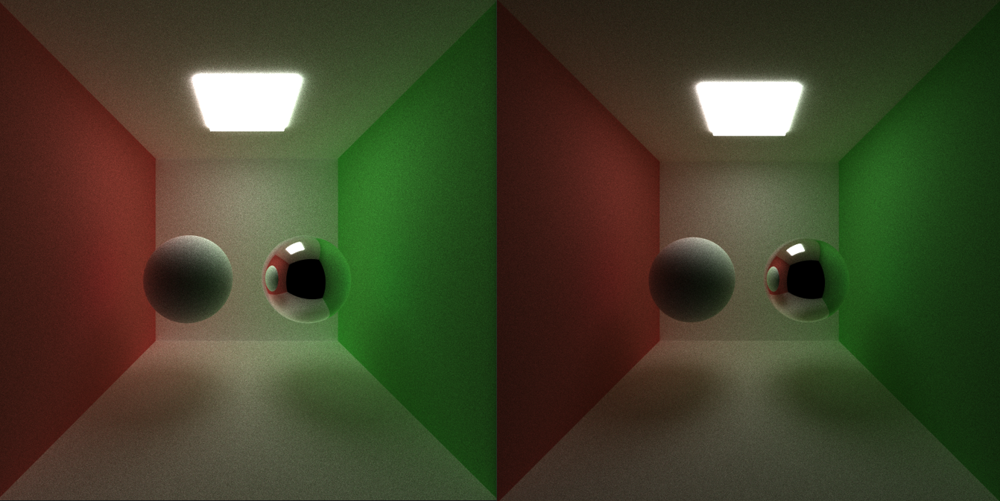
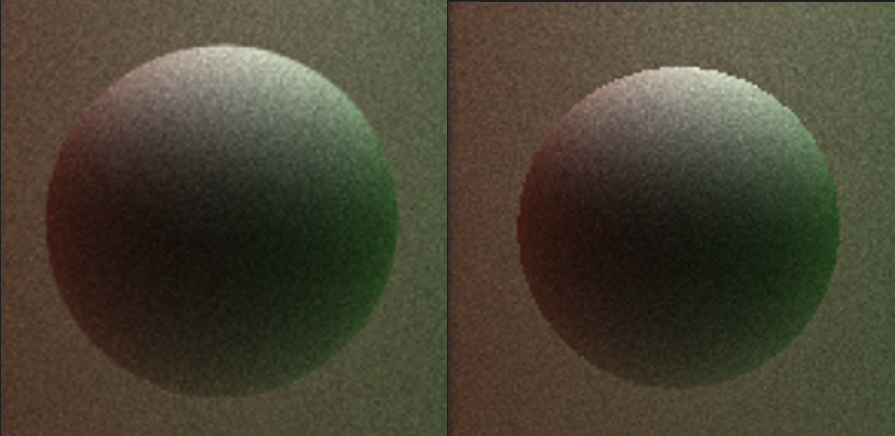
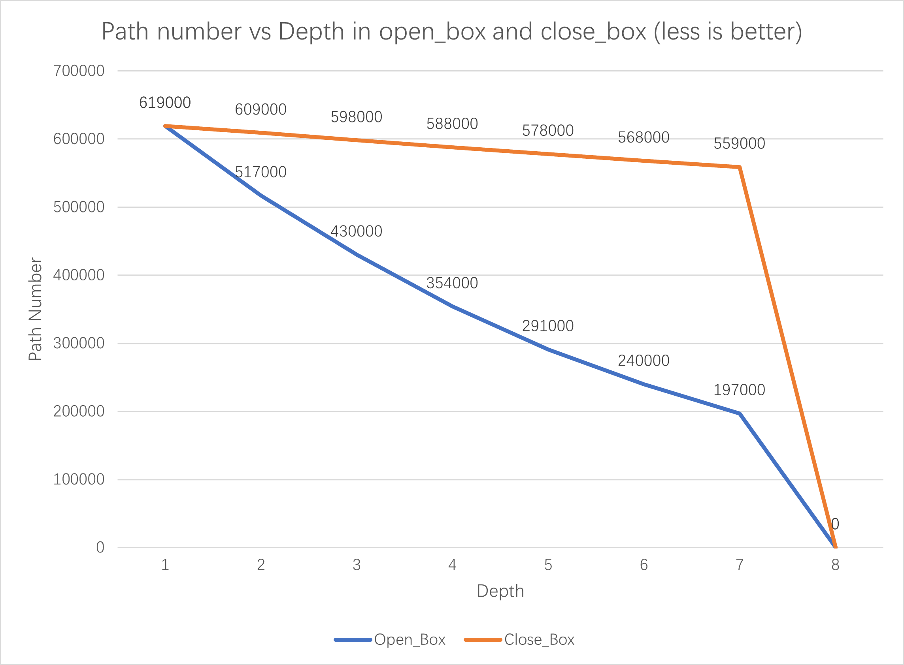
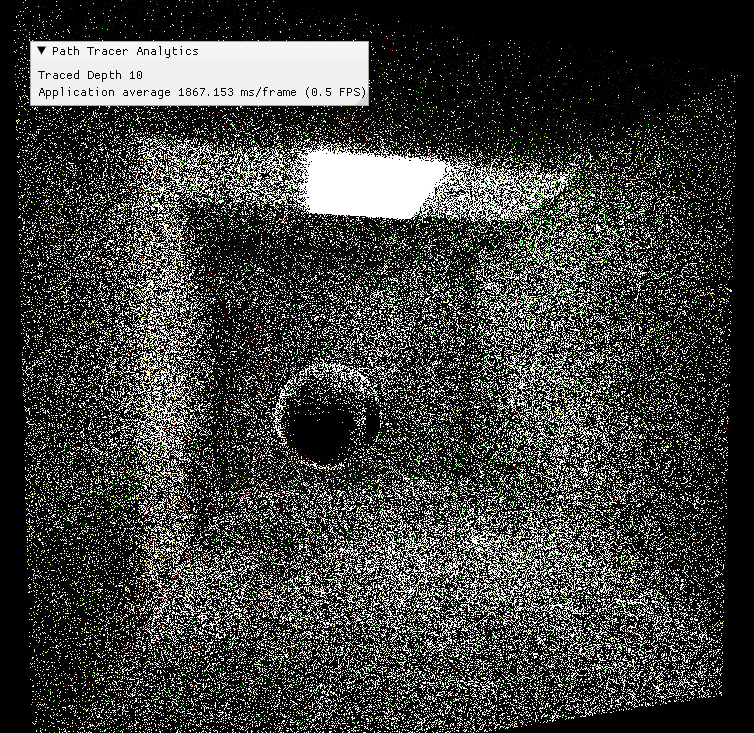

CUDA Path Tracer
============================

**University of Pennsylvania, CIS 565: GPU Programming and Architecture, Project 3**

* Runshi Gu
  * [LinkedIn](https://www.linkedin.com/in/runshi-gu-445648194/)
* Tested on: Windows 10, AMD Ryzen 7 5800X 8-Core Processor @ 3.80 GHz 32GB, RTX3070 24538MB, Personal

## Features Implementation
* Basic pathtracer

* Diffuse surface
* Specular reflective
* Specular refractive (Fresnel dielectric)
* OBJ Loading with bounding volume
* Toggleable Camera Depth of Field
* Toggleable Direct Lighting
* Stochastic Anti-Aliasing
* Thread termination using Stream Compaction
* Toggleable thread sorting by material type
* Toggleable first bounce intersection cache

# Specular Refractive surface

This project supports diffuse, reflective and refractive materials. I used Schlick's approximation to produce the Frensel effects

Index Of Refraction from left to right: 2, 1.5, 1.2

# Mesh Loading

I used the tinyobj_loader library to import obj files into path tracer. I storge all tirangles into one device buffer and assign start index and end index for each mesh so that they can access their triangles for intersection testing. 

Each mesh is also bounded by a bounding box, for intersection testing of the mesh, we will test with bounding box first then triangles in the mesh.

# Camera Depth of Field

The camera can be set to use Depth of Field effect to create foreground and background blur at desired distance

* Focal Length 6

* Focal Length 10

# Direct Lighting

After changing to direct lighting, the ray at depth 0 will show a ray to a random point of a random light instead of scatter randomly. This brings the whole scene bit brighter with more contribution of the light.

* Left With Direct Lighting; Right Without Direct Lighting

# Anti-Aliasing

With anti-aliasing using subpixel sampling, geometry edges become smoother in render. Need to notice that anti-aliasing and first bounce cache can't work together since first bounce cache needs that all iterations shoot out ray as exact pixel position, while anti-aliasing will jitter them around.

* Left With Anti-Aliasing; Right without Anti-Aliasing

## Performance Analysis

# Stream Compaction

Stream compaction terminate inactive threads (ray paths that have 0 remaining bounce), which are caused by hitting nothing, hitting lights or reaching the maximum depth. In closed box case, rays can only become inactive by hitting lights or reach the max depth which is 8, so before depth 8, most rays are still bouncing around and active. However, in the open box senario, a lot of rays become inactive gradually because they exit the box and hit nothing. Stream compaction terminates those inactive rays so that following intersection test have lesss rays to test. 

# Blooper

* Incorrect refraction

