CUDA Path Tracer
================

**University of Pennsylvania, CIS 565: GPU Programming and Architecture, Project 3**

  
`motorcycle.txt, motorcycle.gltf`: 5000 samples, depth 8, 960 x 720 px

Constance Wang
  * [LinkedIn](https://www.linkedin.com/in/conswang/)

Tested on AORUS 15P XD laptop with specs:  
- Windows 11 22000.856  
- 11th Gen Intel(R) Core(TM) i7-11800H @ 2.30GHz 2.30 GHz  
- NVIDIA GeForce RTX 3070 Laptop GPU  

### Features
This is a Monte-Carlo pathtracer with GPU-accelerated intersection tests, shading, and path culling in CUDA.

- Core features
  - Diffuse and perfect specular shaders
  - Performance optimizations
    - Sorting rays by material
    - Path termination using stream compaction
    - Cache first bounce intersections
- Additional features
  - Gltf 2.0 loading & rendering
  - Texture mapping & bump mapping
  - Metallic shader
  - Bounding volume hierarchy
  - Stochastic sampled anti-aliasing

### Usage
The base code has been modified to take two arguments. The first argument is a filepath to the original txt scene format, and the second, optional argument is a filepath to a gltf file.

```
./pathtracer.exe [motorcycle.txt] [motorcycle.gltf]
```

#### Dependencies
- Clone and add [tinygltf.h](https://github.com/syoyo/tinygltf) to external includes

### Feature Toggles
All macros are defined in `sceneStructs.h`.  
- Performance
  - `SORT_BY_MATERIALS`
  - `BVH`: toggle bounding volume hierarchy
  - `CACHE_FIRST_BOUNCE`
- Visual
  - `ANTI_ALIAS`
  - `ROUGHNESS_METALLIC`: render metallic shader
- Debugging
  - `SHOW_NORMALS`: render normals as colour
  - `SHOW_METALLIC`: render metallicness as colour
  - `DEBUG_GLTF_TEXTURES`: render Lambert instead of gltf texture
  - `MEASURE_PERF`: print runtime

### Core

The dragon and ball are perfect specular surfaces; the walls and box are diffuse surfaces.

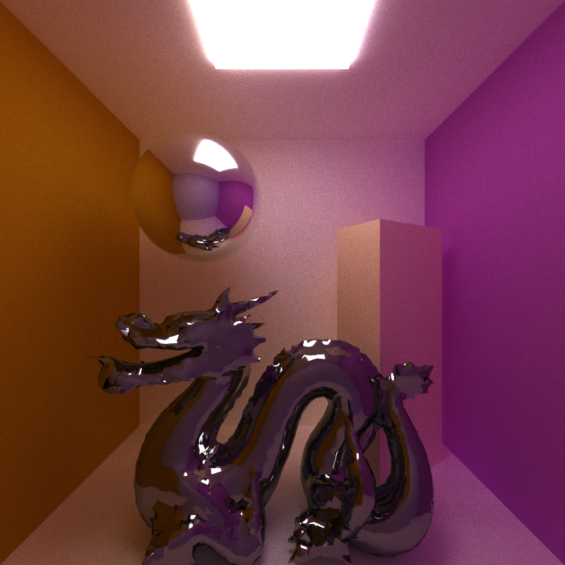  
`avocado_cornell.txt, low_res_dragon.gltf`: 2000 samples, depth 8, 800 x 800 px 

Stream compaction is used to filter out rays that don't hit anything, at each depth.

### Sorting Rays by Material
I added a toggle to sort the path segments by material before shading them. In theory, this should improve performance because more threads that are shading the same material will be in the same block. Since they are shading the same material, there won't be any divergence, which will increase the amount of parallellism, whereas if there were random materials in each block, there would be more divergence, causing the threads to delay each other. The effects should be more noticeable when there are more materials (up until each ray hits a different material; in that case there's no reason to sort...).

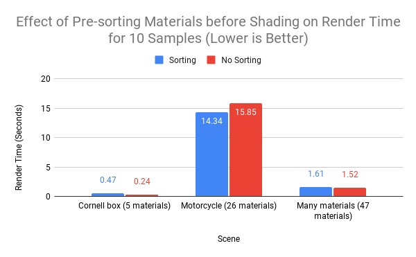

However, it seems that the overhead of shading is too costly - at 5 materials for the cornell box, sorting is twice as slow as not sorting. At 26 materials in the motorcycle scene, sorting is marginally better than not sorting.

I even tried using a scene with as many materials as I could find (40 materials in `many_materials.gltf` + 7 materials in `avocado_cornell.txt` = 47 materials), and the runtime is very similar with and without sorting. However, many of these materials don't diverge in terms of how they are actually shaded - eg. they are different materials but simply index into the image buffer at a different place.

The shading stage may not be complex enough for sorting to be helpful. In addition, this optimization would be effective if done in constant time without an extra kernel sort, which would probably be wavefront pathtracing.

### First Bounce Caching
The first ray cast from the camera to the scene will always be the same, so it makes sense to cache it (unless the rays should vary due to depth of field or anti-aliasing).

However, I found that the performance is almost exactly the same, with or without caching, even at depth = 1.

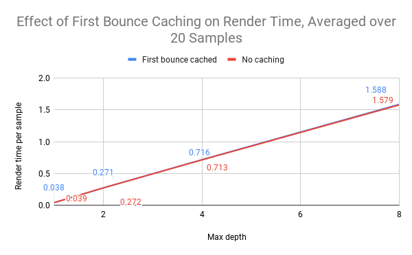

Looking at the calculations in `generateRayFromCamera`, they are all pretty lightweight, so it seems that this kernel has about the same runtime as a cudaMemcpy of the cache into the path segments buffer.

### GLTF
Most arbitrary gltf files (.gltf file + separate textures) exported from Blender can be loaded and rendered without errors. The base code's file parser is used to load the lights and camera while tinygltf is used to load meshes.

- Scene graph traversal is supported
  - Both matrix and translation/rotation/scale attributes are supported to describe local transformations of nodes
  - See `motorcycle.gltf` for an example of a complex scene with many nodes in a tree-like structure
- Copies position, normal, tangent, UV, and index buffers into an interleaved array on the GPU
- Texture loading

### Texture Mapping
Tinygltf loads the images into arrays, which are then copied over to the GPU in one contiguous images array (dev_imageBuffers). The dimensions of the image are stored separately and used to index into the images buffer. UV's are interpolated and converted to pixel space to sample the image buffer for the colour.

#### Normal Map
Gltf normal textures must be in tangent space. They are transformed into world space using a TBN matrix. Intersection surface normals and tangents are interpolated from the vertex normal and tangent buffers from the file. The resulting normals can be debugged as colours by setting `SHOW_NORMALS` to 1.

| Surface normals | Normal texture map | Combined: TBN * normal texture map |
| ----------------| ----------------- | -----------------|
|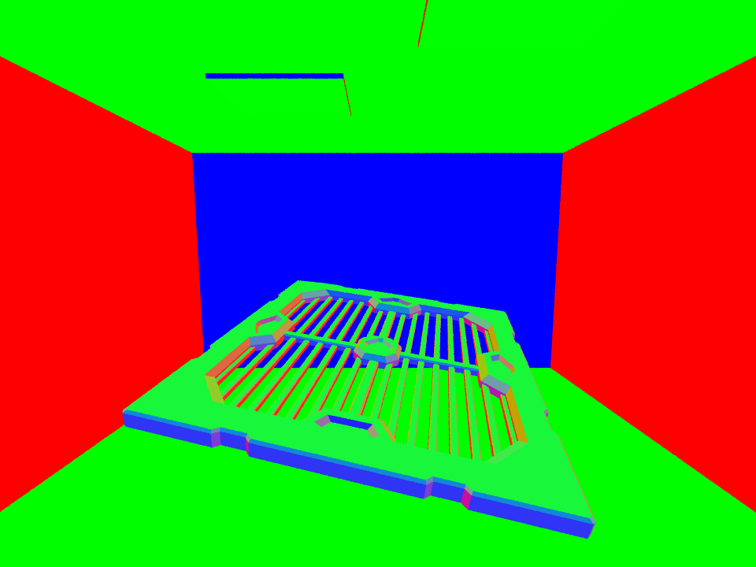 | 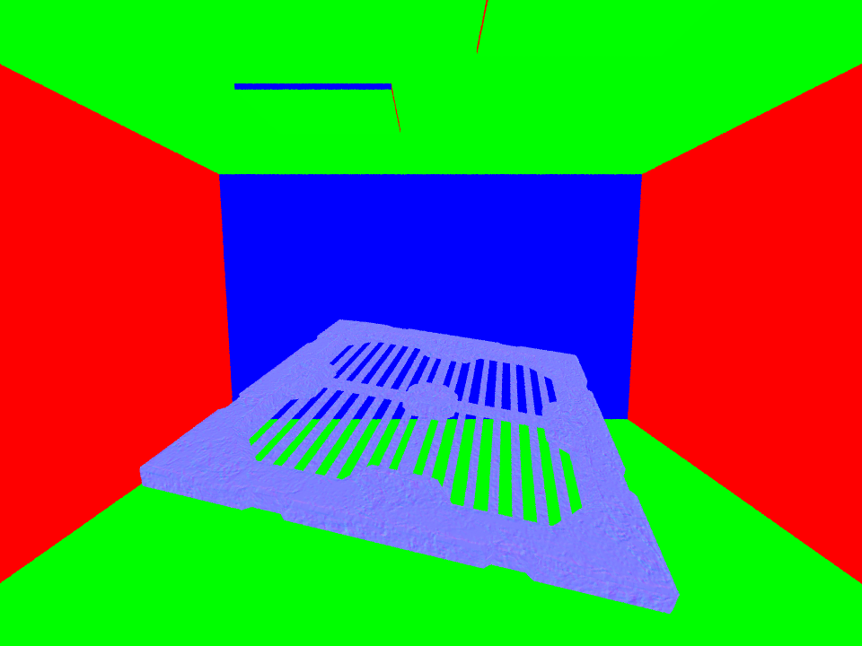 | 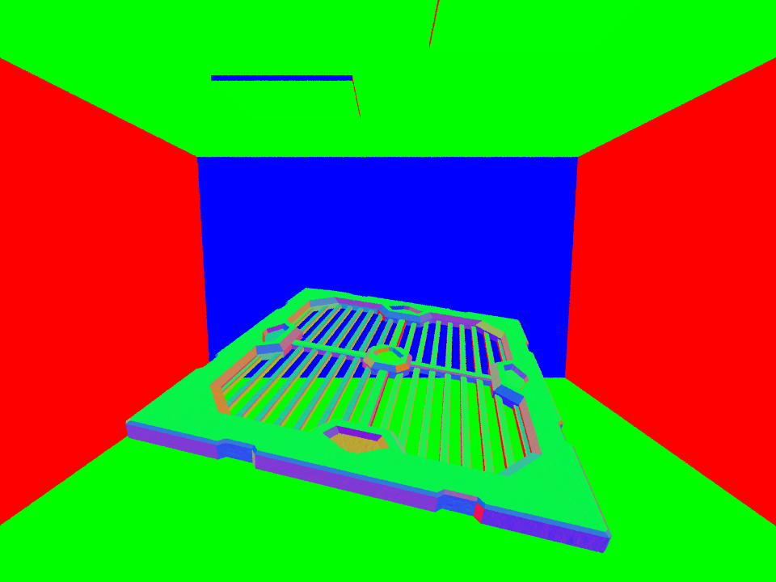 |

With diffuse shaders, a normal map is hard to notice because the light bounces in a random hemisphere around the normal anyway; the resulting bounce won't be too different from before. That's why I also tested the normal map with the metallic shader.

| Metallic shading with surface normals | Metallic shading with normal map |
| ----------------| ----------------- |
| 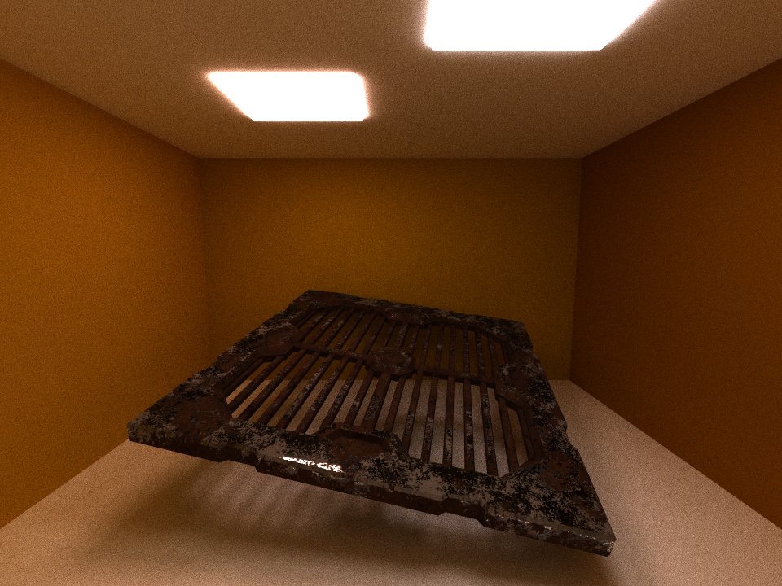 | 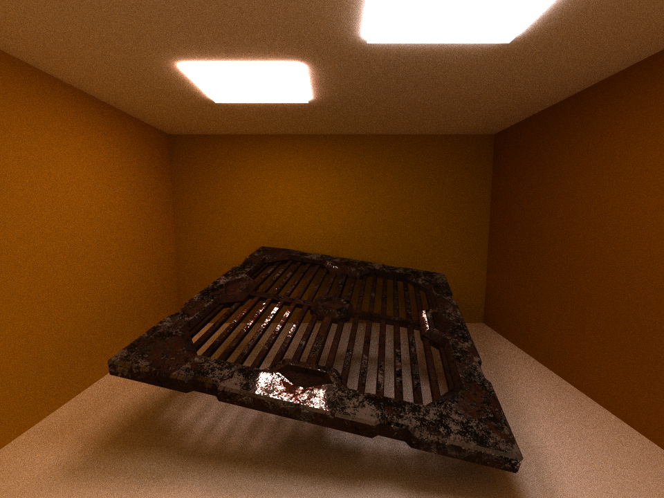 |

`metal.txt, metal.gltf`: 2000 samples, depth 8, 800 x 800 px

The render with the normal map has more highlights and the highlights line up better with the texture, making it look more like a rusty piece of metal than the render using interpolated surface normals.

### Metallic Shader
I partially implemented gltf's microfacet (PBR metallic/roughness) workflow by adding a metallic shader. The metallic value from 0 to 1 comes from either the gltf material's `pbrMetallicRoughness.metallicFactor` or is read from a texture, where the blue channel is the metallic value. The metallic value is used to interpolate the diffuse and metallic shaders. The metallic shader is simplified to a specular shader multiplied by the tint of the base color.

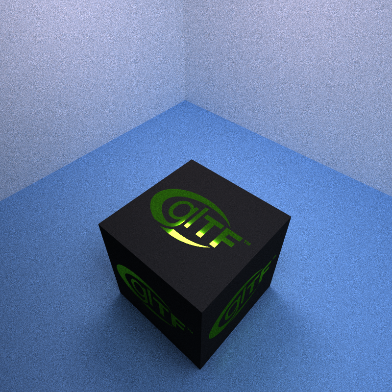  
`box.txt, Box With Spaces.gltf`: 1000 samples, depth 8
z
According to the box's texture, only the GLTF letters are metallic, so there is no highlight on the black part. By setting `#define SHOW_METALLIC 1`, we can debug the metallic value. Here is what it looks like for the motorcycle scene. Brighter blue means more metallic. On the motorcycle, the metallic factor is defined for the entire material, whereas on the vending machine, the metallic factor comes from a texture. 

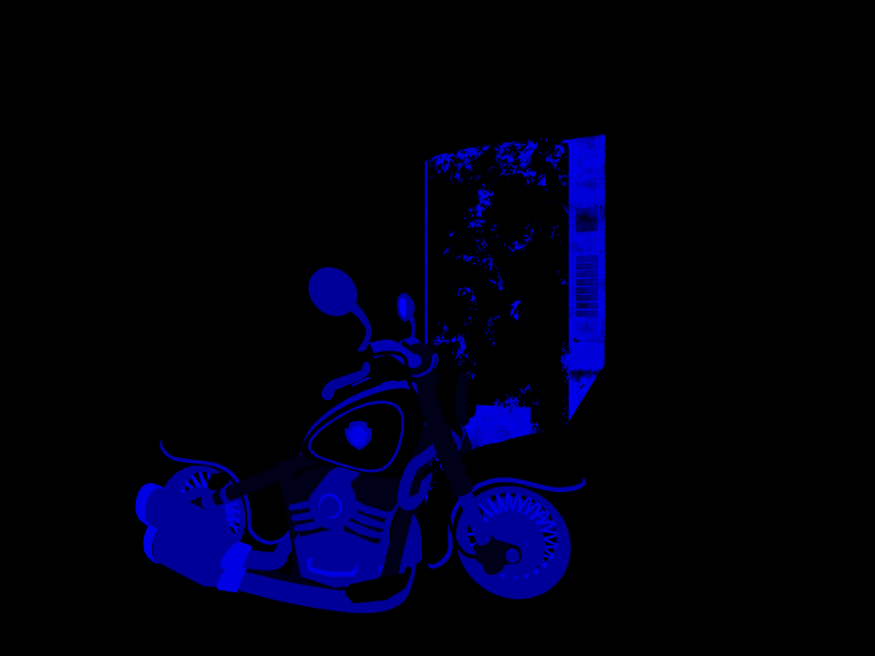

### Bounding Volume Hierarchy

As we get into hundreds of thousands of triangles, testing ray intersections quickly becomes a bottle-neck. I implemented a bounding volume hierarchy (BVH) data structure and sorted vertices by their bounding boxes. The constructor in `bvh.cpp` creates one BVH for each primitive `Geom`, which is necessary because primitives can have different transformations. One challenge was to serialize the tree structure of the BVH, since it's unpleasant to copy data structures with pointers from the CPU to GPU.

The resulting code was adapted from [this site](https://jacco.ompf2.com/2022/04/13/how-to-build-a-bvh-part-1-basics/), except the BVH tree traversal is implemented on the GPU not using recursion. Recursively traversing the BVH on the GPU quickly causes a stack overflow, even on the Avocado mesh, which has only 83 total nodes, which shows how expensive local memory is. Instead, I traversed the GPU using a fixed-size stack to keep track of the next BVH nodes to search.

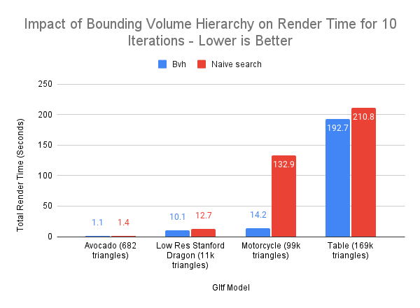

Bounding volumes are split by their longest axis, which worked better for the motorcycle scene than others like the table.

The tree structures can give some insight. Each scene can have multiple meshes, and therefore multiple BVHs with different structures. If there are multiple BVHs then, the values in each column correspond to the worst case, aka. the maximum out of all the BVH trees generated for the scene.

| Gltf Scene | Number of BVHs | Total Number of nodes  | Depth | Maximum leaf size |
|-----|-----|-----|----| --- |
| Avocado | 1 | 83 | 10 | 191 |
| Low Res Dragon | 1 | 1731 | 18 | 1534 |
| Motorcycle | 98 | 1777 | 21 | 1242 |
| Table | 3 | 3265 | 24 | 10607 |

Because the threads need to sync after one iteration of path-tracing, as long as there is a ray passing through the bounding box of a large leaf, the other threads will have to wait for those intersection tests to finish. As a result, each iterations' speed is bottlenecked by the max leaf size. With more time, it would be ideal to implement a better BVH splitting algorithm, or convert the BVH into a 4-nary or 8-nary tree to flatten it a bit more.

### Anti-Aliasing
Implemented anti-aliasing by jittering the camera ray in the up and right directions by the amount `boxSize`, aka. jitter ~ uniform(-boxSize/2, boxSize/2). This looks visually pleasing enough that it wasn't worth using a Gaussian distribution, since calculating its pdf would be much more expensive.

When anti-aliasing is ON, first bounce caching must be turned OFF. AA has a negligible performance cost, its actual cost is that we need to recompute the first bounce each time.

| boxSize | Scene | Close-up |
|--------|------|-------|
| 0 (no AA) | | 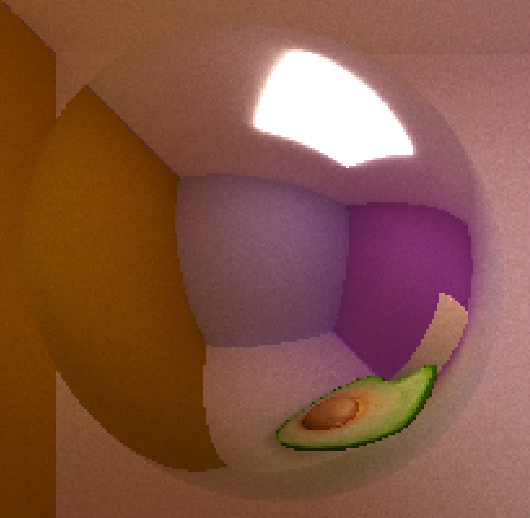 |
|1| | 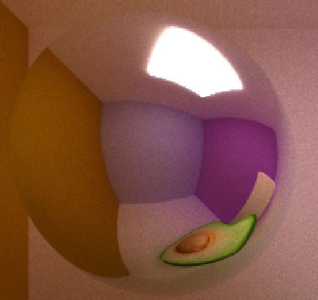|
|2| 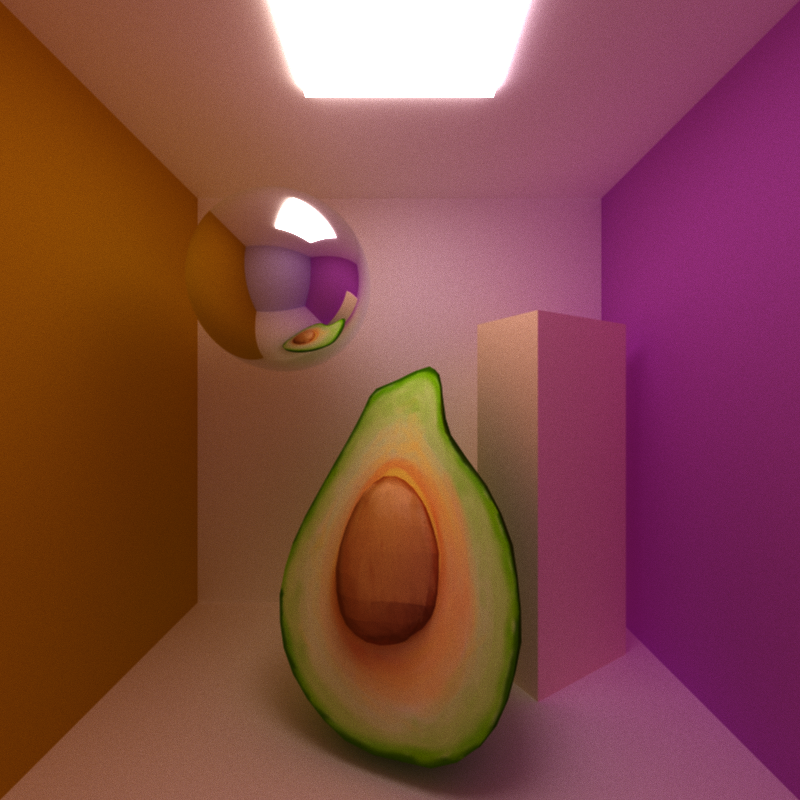 | 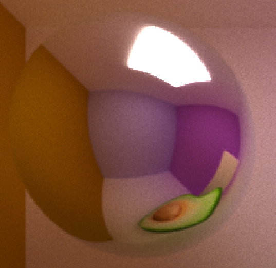

`avocado_cornell.txt, avocado.gltf`: 5000 samples, depth 8, 800 x 800

### Object sources
I grabbed objects from Sketchfab or the [gltf sample models repo](https://github.com/KhronosGroup/glTF-Sample-Models), re-arranged them in Blender, and re-exported as gltf.
- [Avocado](https://github.com/KhronosGroup/glTF-Sample-Models/tree/master/2.0/Avocado)
- [Soda machines](https://sketchfab.com/3d-models/soda-machines-d0b81fdb4e514859bfcc95165144e8c7)
- [Motorcycle](https://sketchfab.com/3d-models/motorcycle-38404e2077ca4b209cd2f1db30541b94)
- [Rusty metal grate](https://sketchfab.com/3d-models/rusty-metal-grate-d814366c9dd24463bfc753a88f4d3ad0)
- [Gltf cube](https://github.com/KhronosGroup/glTF-Sample-Models/tree/master/2.0/Box%20With%20Spaces)
- [Low res stanford dragon](https://sketchfab.com/3d-models/stanford-dragon-vrip-res4-4c0714c7a68444f4b8a51cb5edda68aa)
- [Many materials](https://sketchfab.com/3d-models/gltf-test-pbr-material-2fe88c82edf24a9f8b608c11a0eb6920)

### Bloopers
They're all [here](https://docs.google.com/document/d/1BJmclri4VJY_IXbsLU8Er_CQihQnfmzTQRi5cz9FthM/edit#heading=h.3ah9h2xfckz8).