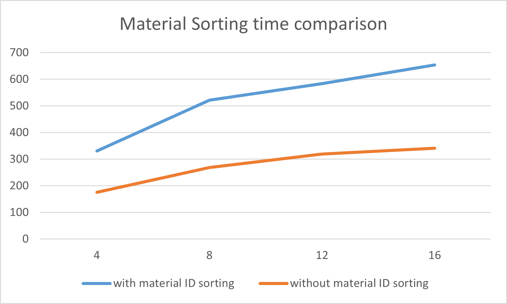
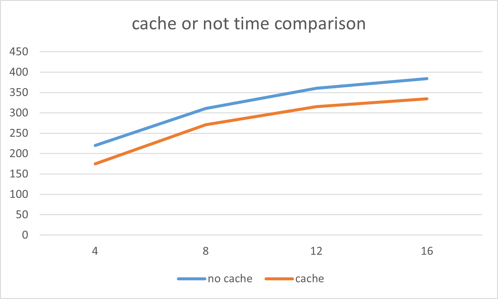
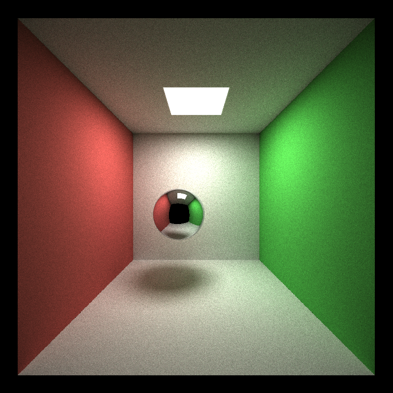
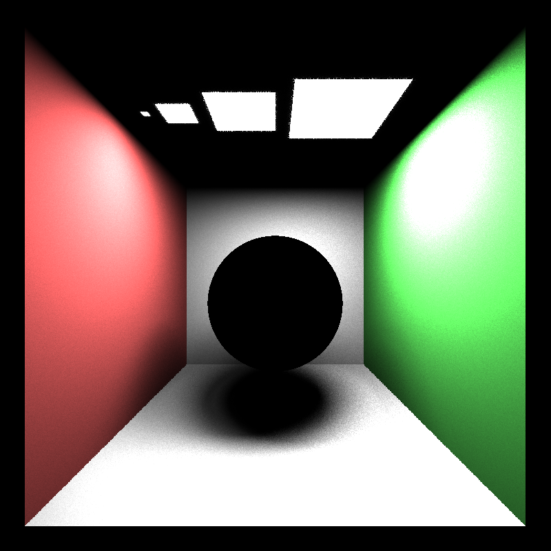
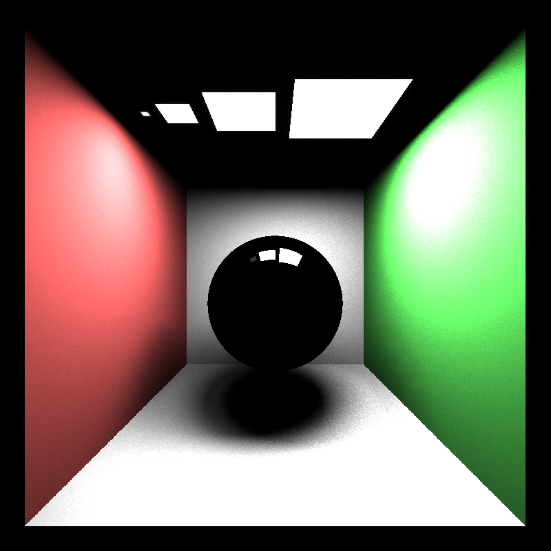
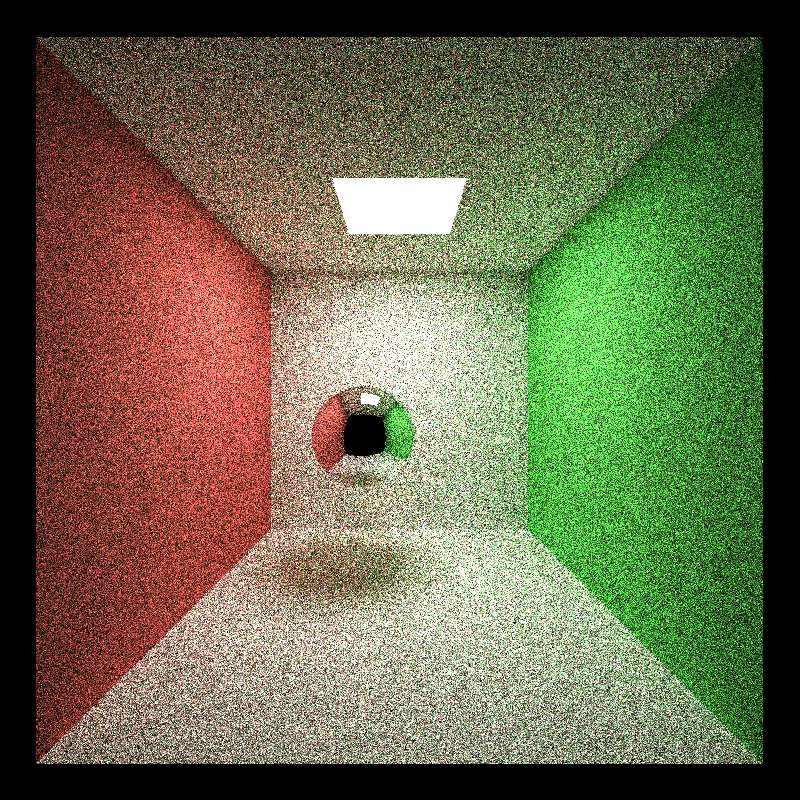
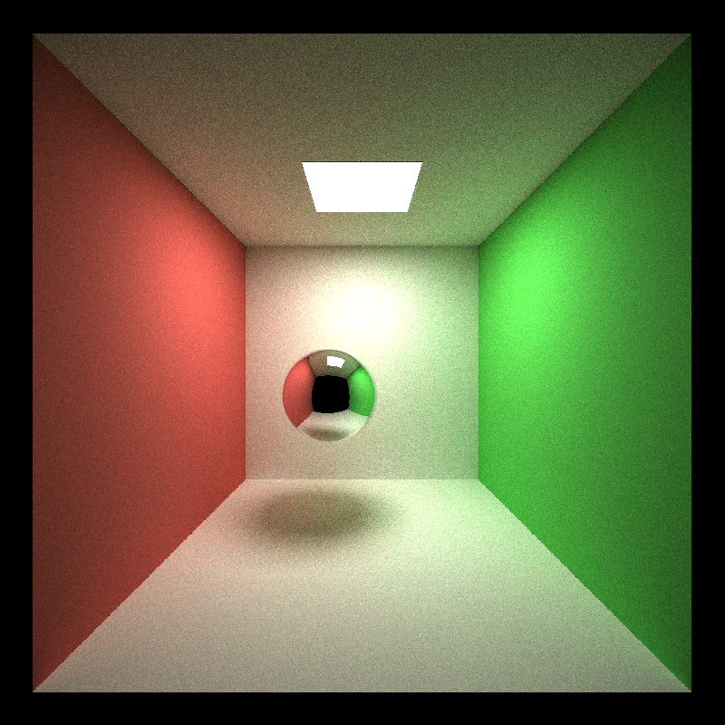
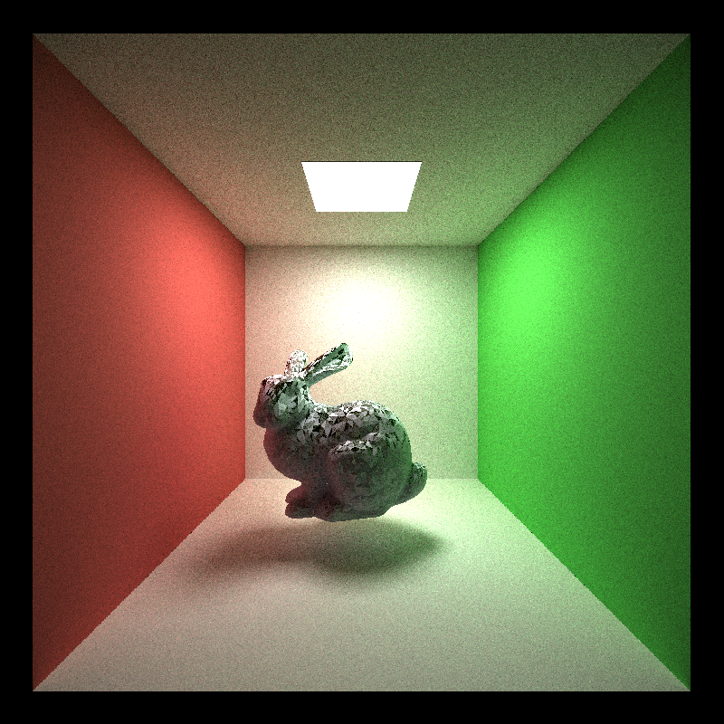

CUDA Path Tracer
================

**University of Pennsylvania, CIS 565: GPU Programming and Architecture, Project 3**

* XiaoyuDu  
* Tested on: Windows 10, i9-11900KF @ 3.50GHz, RTX 3080 (Personal PC)
  
### Description  
This project built a GPU-based path tracer.
  
### Feature  
* I implemented all the features for part 1.  
Below is a comparison between sorting rays by material type and not. Sorting material by type can shrink the branch condition in each warp, thus increase the overall efficiency. However, I actually find out that sorting by materials make each iterations much slower. My guess is that there are still not so many material types contained in the scene, thus not creating enough branch conditions. Below is a graph that compare the time(in ms) each iteration took with different depth and with sorting by materials ID or not.  
  
Below is a comparison between caching intersections of the first bounce or not.  The graph records the time(in ms) to complete each iteration with different depth.  
  
Here is an example image rendered with naive method, with depth of 5 and iterations of 5000.  
  
  
Feature for part 2.  
* Direct Lighting & MIS sampling  
Below is a image shown for direct light integrator. We can't see any glass on the color since we are trying to sample ray from the light source.  
  
Here in comparison, we used MIS, now we can see the light been reflected.  
  
* Full Light Integrator  
In full light integrator, we sample MIS for each ray bounces around the scene to try to get the light information as much as possible. Thus, it can converge much faster than the naive integrator. Below is a scene rendered with naive integrator in 100 iterations.  
  
Below is the same scene rendered with full light integrator in 100 iterations. We can see that the image converge much faster than the naive integrator. Although each iterations now takes about 3 more times than the naive integrator, it still converge way more faster than the naive integrator.  
  
* obj Mesh loading  
I also implemented a mesh loading function to load a obj file.  

