CUDA Path Tracer
================

**University of Pennsylvania, CIS 565: GPU Programming and Architecture, Project 3**

Jiajun Li

Linkedin: [link](https://www.linkedin.com/in/jiajun-li-5063a4217/)

Tested on: Windows 10, i7-12700 @ 2.10GHz, 32GB, RTX3080 12GB

CUDA Compute Capability: 8.6

## **Overview**

This is a CUDA based Path Tracer project. It differs from traditional CPU based Path Tracer in applying  parallism for each ray and thus can coverging results in a much faster manner. 

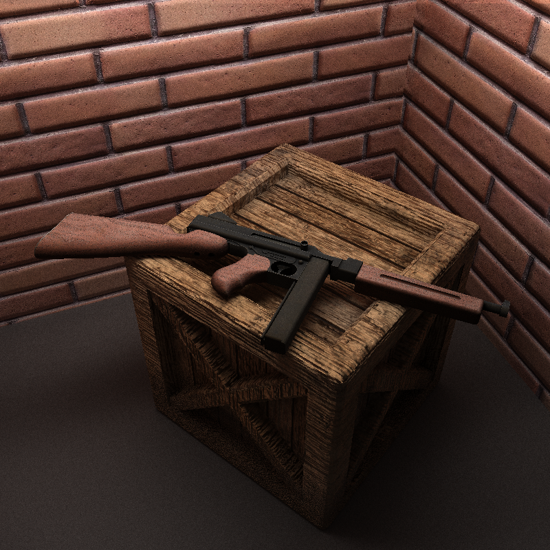

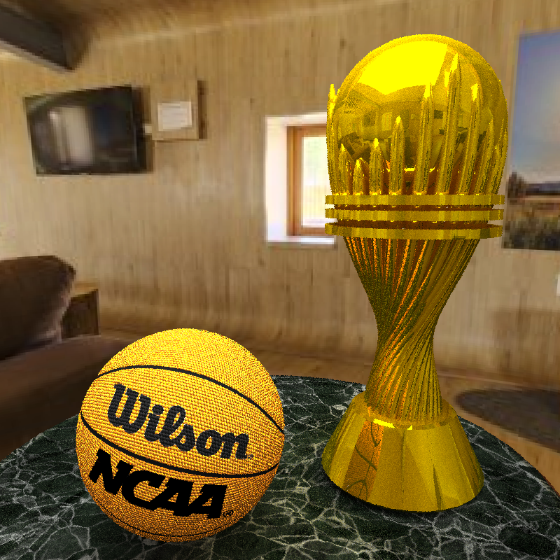

## **Features**

The following features have been implemented for this project:

- Path Tracer Core Algorithm
- Refrection
- Metallic property control
- Stochastic Anti-Aliasing
- Obj Loading
- Texture Mapping with base color and normal map
- Bounding Volume Hierarchy to accelerate object rendering
- Spherical Skybox using raycast method

## **Path Tracer Core**

The core to utilize CUDA is to perform the same actions for all rays at the same time so we can devide path trace procedures into different CUDA kernels:

1. GenerateRayKernel: Shooting rays for each pixel from screen. 

2. IntersectionKernel: Perform rays intersection tests.

3. ShadeKernel: Accumulate ray color results along the way and add it to the final output.

Two of the basic diffuse and specular properties are implemented in this project. For diffuse property, spawned ray direction is randomly picked in the hemisphere. For specular, the ray direction is generated by perfect reflection.

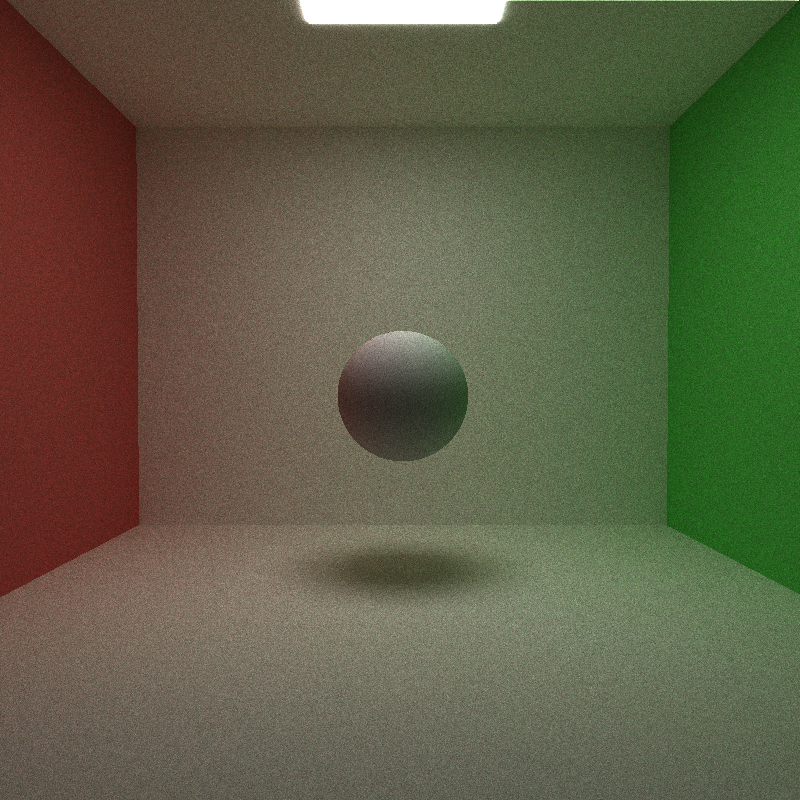

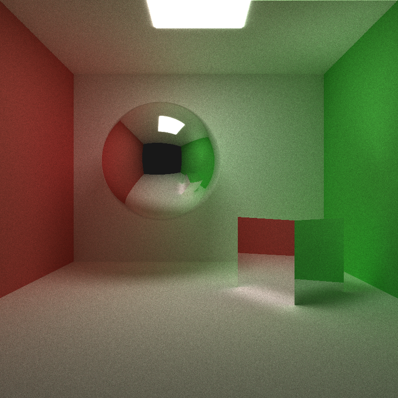

## **Refraction**

Implemented using [Schlick's approximation](https://en.wikipedia.org/wiki/Schlick%27s_approximation#:~:text=In%203D%20computer%20graphics%2C%20Schlick's,(surface)%20between%20two%20media.). Since only one ray is traced for each pixel in one iteration, picking between reflection ray or refraction ray is achieved by comparing coefficients to a ramdon number. If the coefficent R for reflection is greater than the random number, then the program will trace reflection. Otherwise it will trace refraction ray.

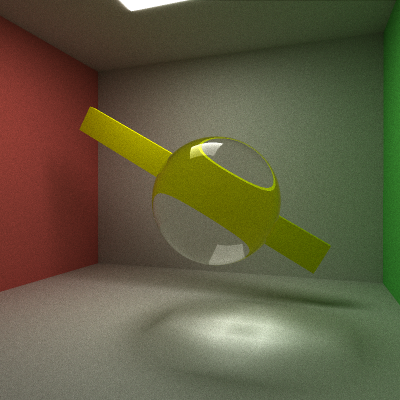

### **Metallic and Specular Control**

Metallic property is implemented by coloring the reflection ray with material color. The metallilc coefficient measures the probability of the reflection ray colored by material color. The same idea applies to controling the amount of specular property. 

| Specular 0.2 | Specular 0.5 | Specular 1.0 |      
| ---------------------------------| ----------------------------------|----------------------------------|
| 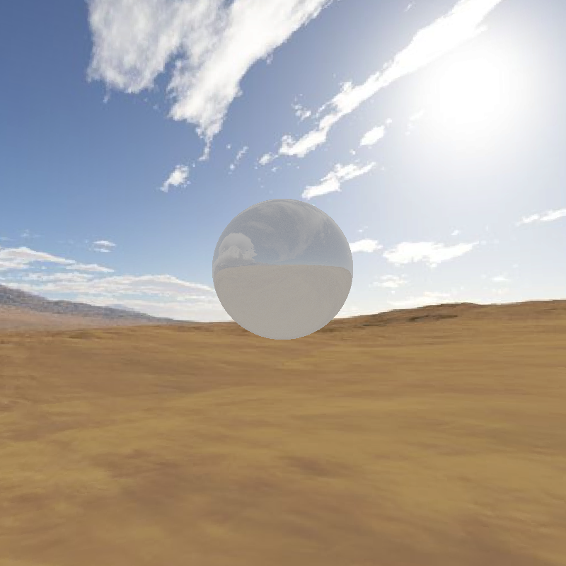   | 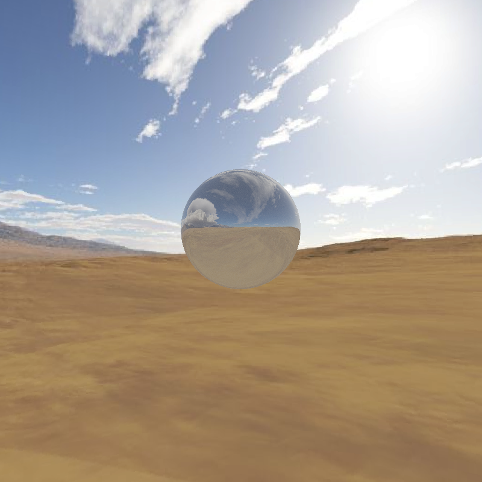   |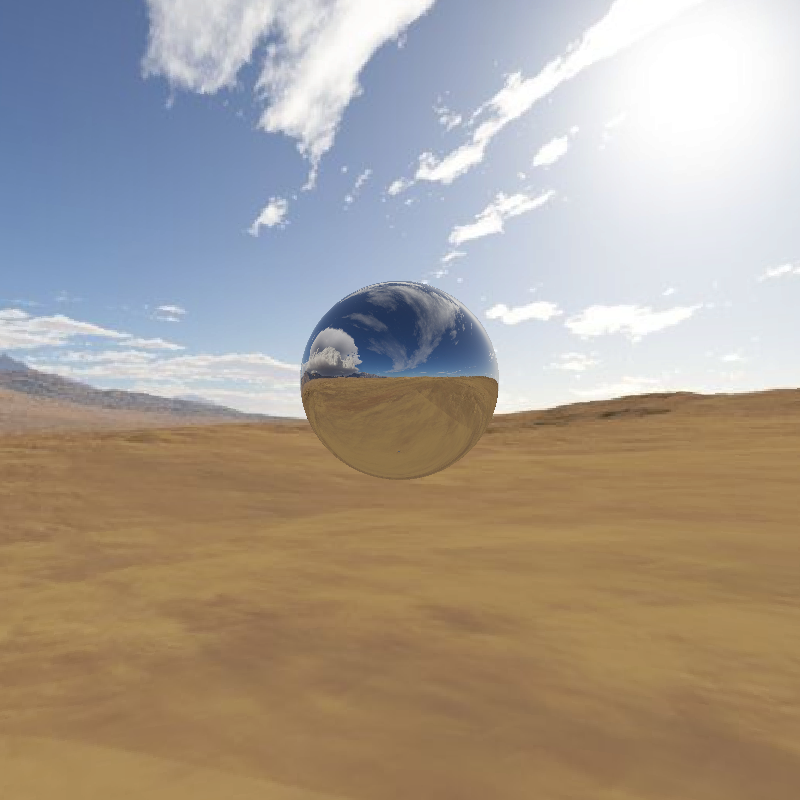 |

| Metallic 0.0 | Metallic 0.3 | Metallic 1.0 |      
| ---------------------------------| ----------------------------------|----------------------------------|
| 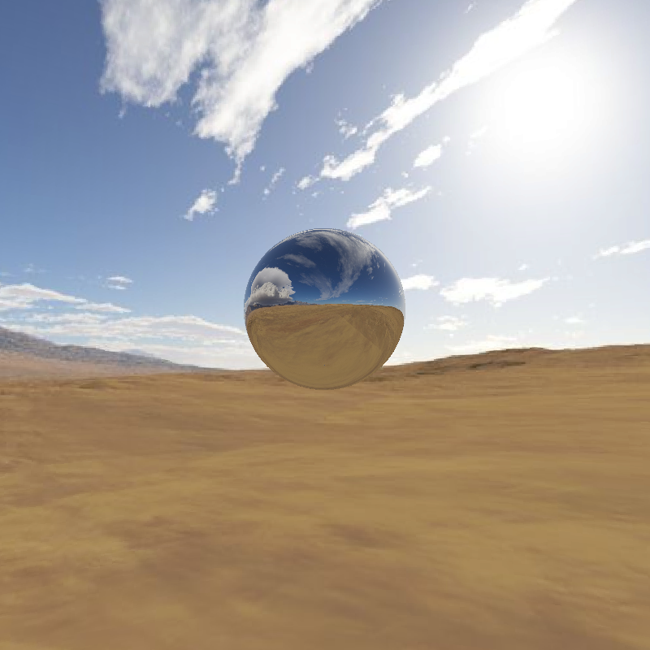   | 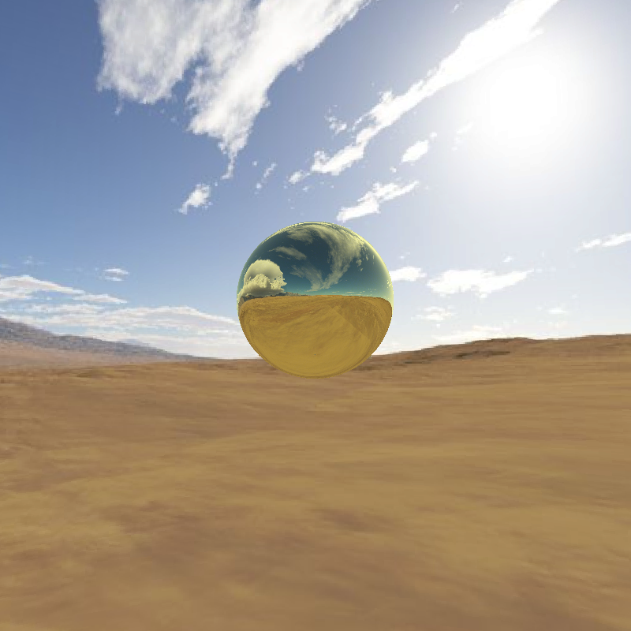   |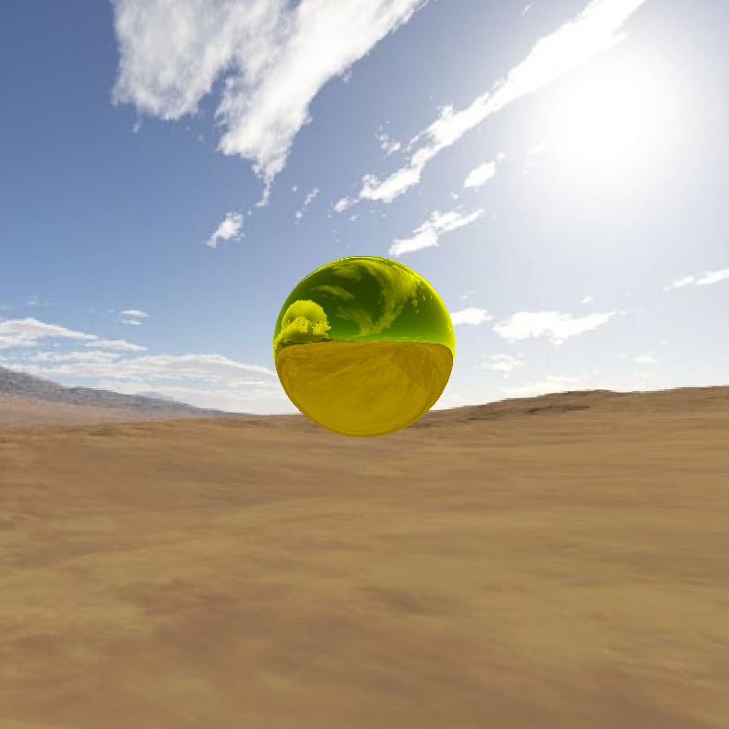 |

### **Anti-Aliasing**

Anti-Aliasing is achieved by jittering the generated rays from camera so that each pixel can get more scene information from a larger scale.

| No Anti-Aliasing                 | Anti-Aliasing                     |                 
| ---------------------------------| ----------------------------------|
| 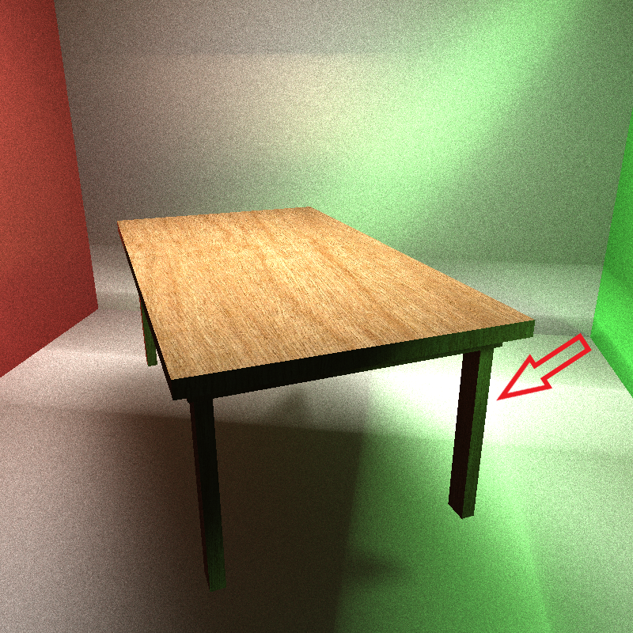   | 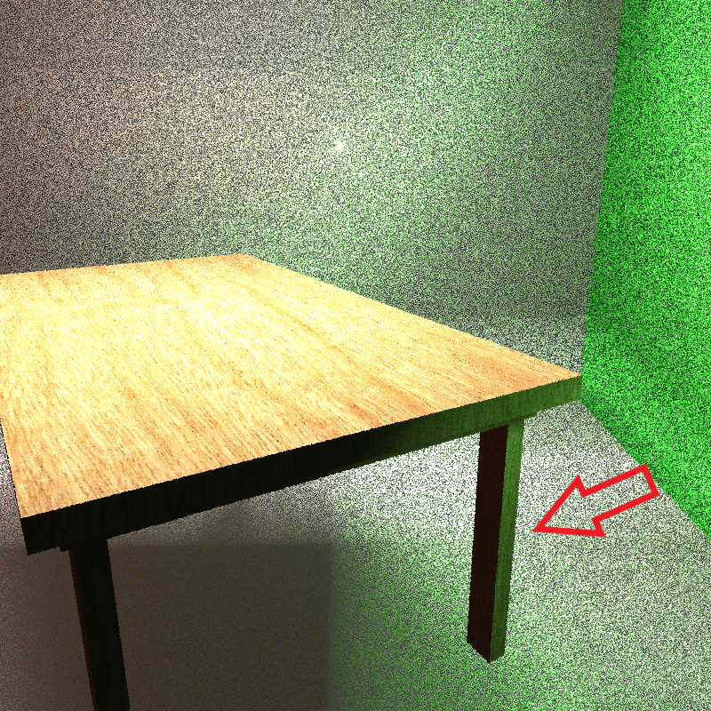   |

## **Obj Loading and Texture Mapping**

Load obj files with [tiny_obj_loader](https://github.com/tinyobjloader/tinyobjloader). The loaded obj will be assembled into triangles for intersection and shading later.

For textures, [stb_image](https://github.com/nothings/stb) are used to load base color textures and normal maps. Note that for normal maps, RGB values need to be converted into normal values first:

    normal = rgb * 2.0 - 1.0 

Another thing to be aware is that the read normal is in tangent space. A TBN matrix is then used to convert it to model space.

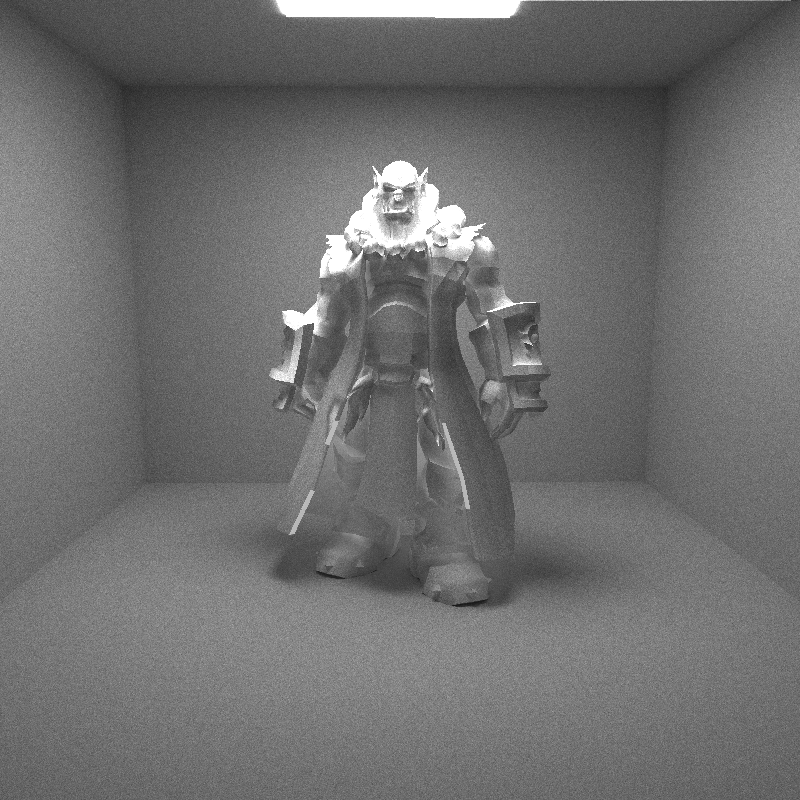

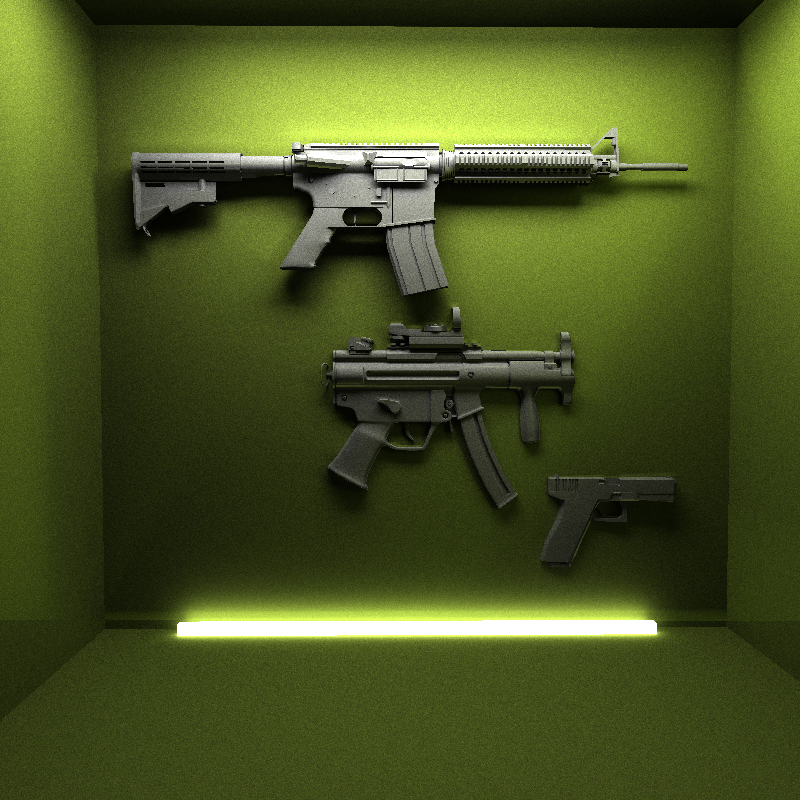

## **Bounding Volume Hierarchy**

This project mostly adapts the recursive Bounding Volume Hierarchy build method from [PBRT](https://www.pbr-book.org/3ed-2018/Primitives_and_Intersection_Acceleration/Bounding_Volume_Hierarchies#fragment-BVHAccelLocalDeclarations-1). The difference is that this program will construct a BVH for each obj insead of the whole scene. Algorithm can be described as the following:

1. Construct a BVH tree structure by dividing and assigning triangles to BVH nodes by Surface Area Heuristic method.

2. Convert the tree structure into a compact array by copying tree nodes into lienar BVH nodes.

3. Once the first two steps are done in CPU side, pass the linar BVH nodes array to device before iteration begins.

4. During intersection tests, the tests will only proceed when the rays hit the linear node bouding volume.

By skipping the unecessary intersection tests with out-of-bound trianlges, this method makes a great improvement in rendering speed. Belows are the performance analysis of BVH vs. no BVH:

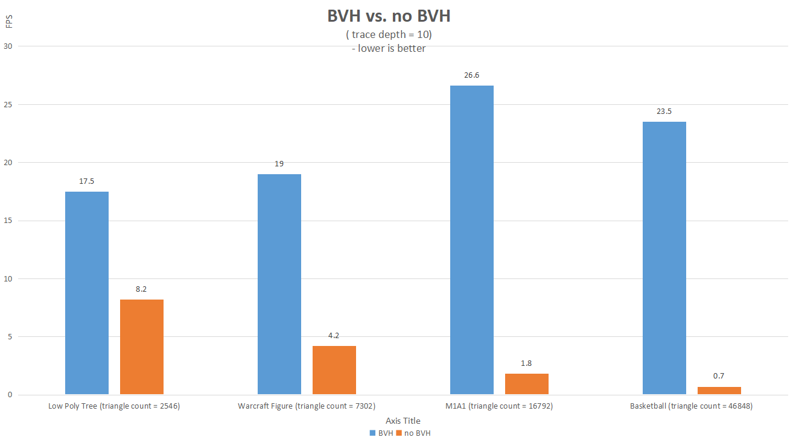

### **Skybox**

This project implements a spherical skybox using raycast method. Ray hits skybox when it has no intersection with any of the objects in scene. Ray direction will then be converted into 2D UV coordinate by angular displacement. Finally the project uses the same sample methods from obj texturing to sample skybox texure. Note that this requires the skybox texture be spherically mapped beforehand. 

## **Future Improvements**

- HDR texture support. Currently the program does not support HDR image.

- G buffer. Currently the program renders objects in their loading orders and we need to manage their orders carefully for now.

- More texture mapping such as roughness and specular texture.

- More material properties. 

## **Bloppers**

Mistaken useage of n1, n2 in Schlick's approximation

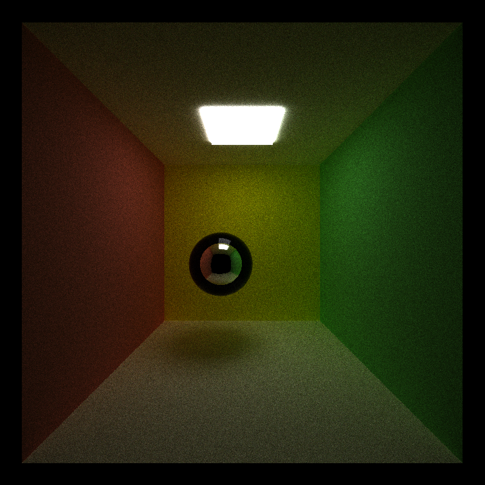

Forgotting to transform barycentric coordinate into normal coordinate in ray triangle intersection tests

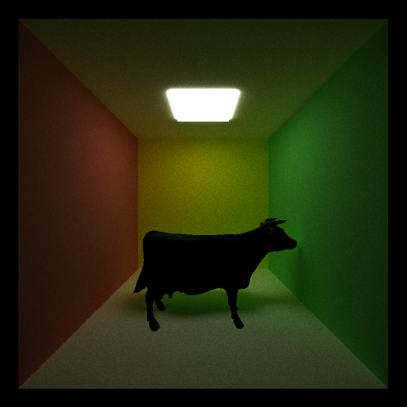

## **Additional Reference**

Bary Position: https://www.scratchapixel.com/lessons/3d-basic-rendering/ray-tracing-rendering-a-triangle/barycentric-coordinates

Normal Mapping: https://learnopengl.com/Advanced-Lighting/Normal-Mapping

