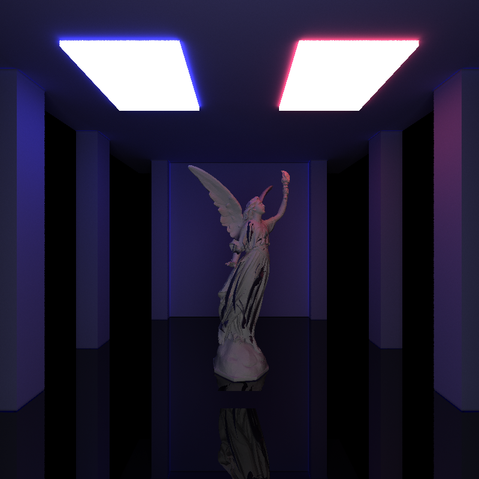

CUDA Path Tracer
================

**University of Pennsylvania, CIS 565: GPU Programming and Architecture, Project 3**

* David Li
* [LinkedIn](https://www.linkedin.com/in/david-li-15b83817b/)
* Tested on: Windows 10, Intel(R) Core(TM) i9-10980HK CPU @ 2.40GHz 32Gb, GTX 2070 Super (Personal Computer)

[Repo Link](https://github.com/theCollegeBoardOfc/Project3-CUDA-Path-Tracer)

### Why Path Trace?

The primary motivation behind path tracing is to properly render light in a scene. This is done essentially by shooting several rays into a scene, letting them bounce around and accumulate color. If however, this is only performed once, the render looks rather poor, thus we instead will repeat the process hundreds sometimes thousands of times and take an average of all those colors to yield a final sample. This takes a rather long time: an 800x800 resolution image would have 640000 pixels, we would shoot out at least one ray (sometimes more) per pixel for each sample, if we take 5000 samples, then the path tracer would be shooting out 3.2 billion rays. This rendered scene shoots out four times more rays than that.

