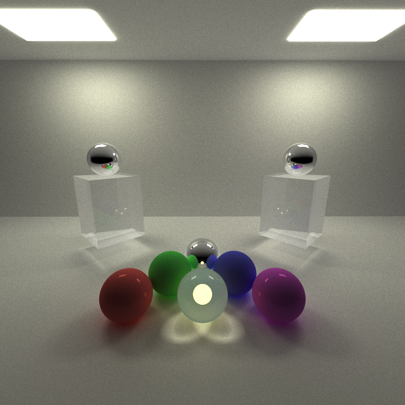
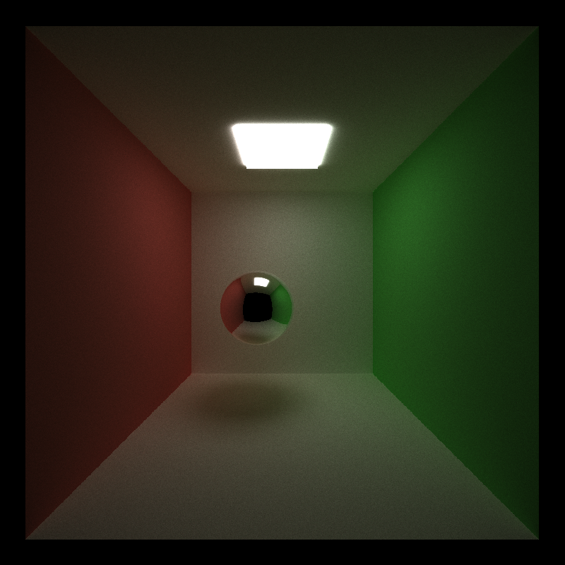
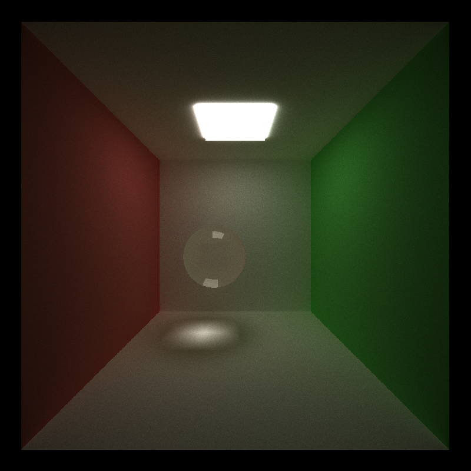
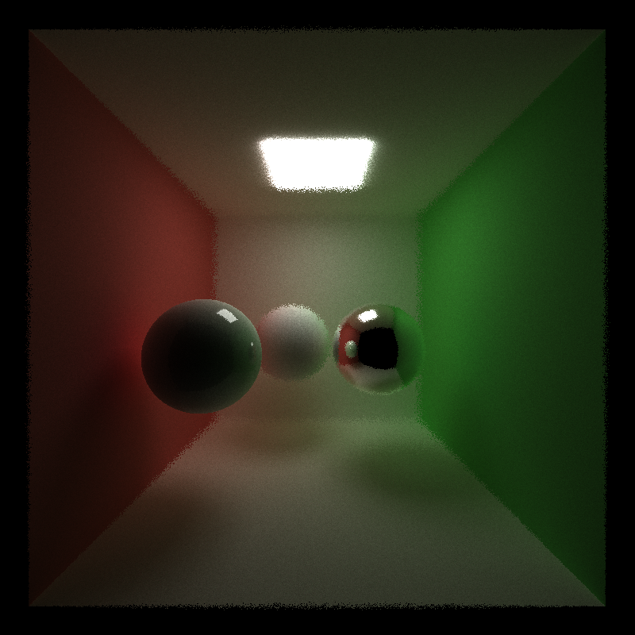
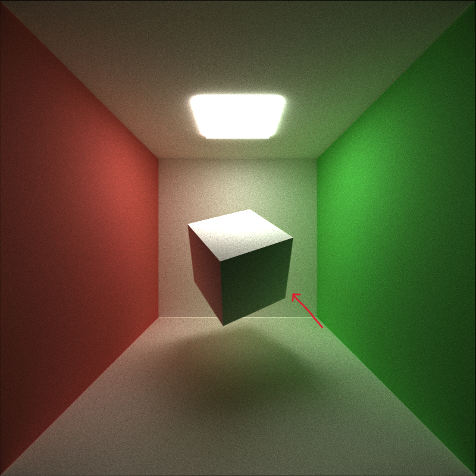
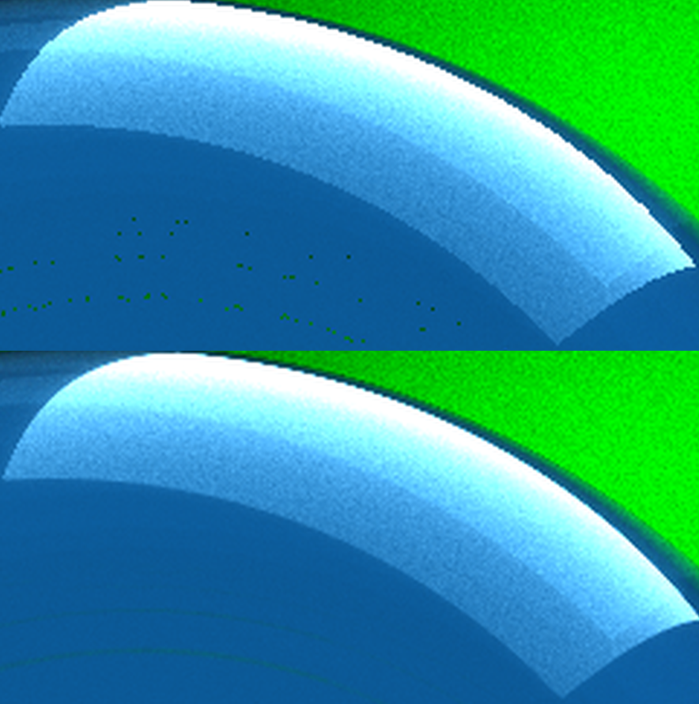
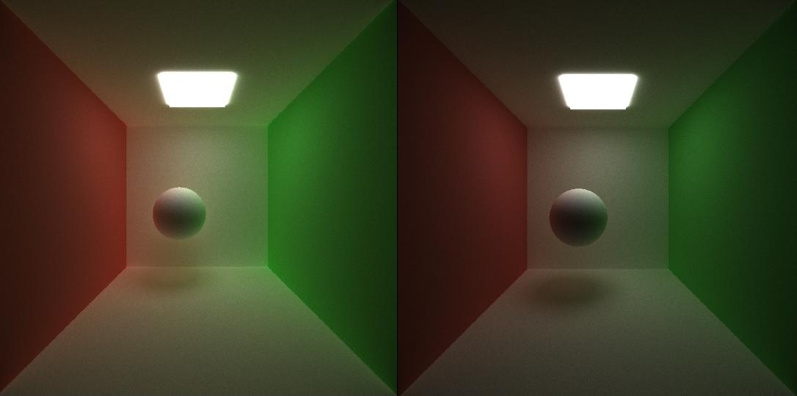
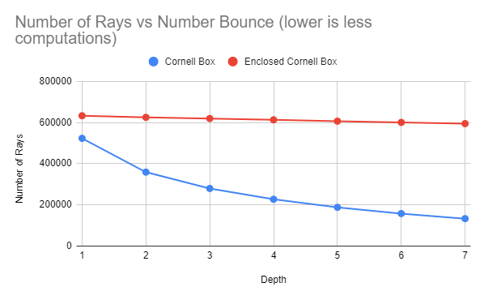
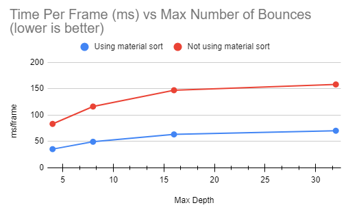
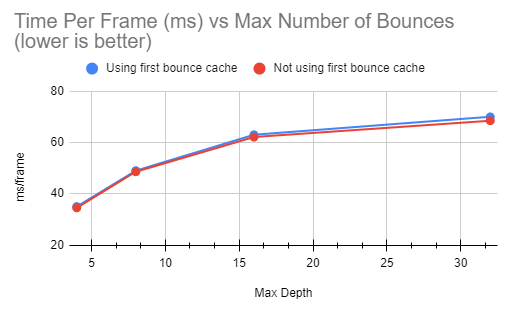

CUDA Stream Compaction
======================

**University of Pennsylvania, CIS 565: GPU Programming and Architecture, Project 2**

* Ryan Tong
  * [LinkedIn](https://www.linkedin.com/in/ryanctong/), [personal website](), [twitter](), etc.
* Tested on: Windows 10, i7-8750H @ 2.20GHz 16GB, GeForce GTX 1060 6144MB (Personal Laptop)

### Project Description
This project is a path tracer implemented on the GPU using CUDA. Specifically, the path tracer shoots out rays from the camera and bounces the rays around to accumulate a color and does this over many iterations to generate an image. By using path tracing, we are able to render images with features such as global illumination, color bleed, and 'free' soft shadows.

### Project Features
This project has the following features:
1. Diffuse surfaces where rays bounce of the surface randomly
2. Specular surfaces where rays bounce of the surface in a predictable way
3. Imperfect specular surfaces where rays probabilistically bounce of the surface in a diffuse or specular way
4. Refractive surfaces where rays are refracted into the object
5. Physically based depth of field
6. Stochastic sampled anti-aliasing
7. Direct Lighting

### Different Materials
The effect of different materials (diffuse/specular/refractive) is acheived through a shading kernel which evaluates the direction that the incoming ray should bounce. Specifically, diffuse surfaces reflect rays randomly in the hemisphere of intersection, specular surfaces reflect rays in the surface normal direction, and refractive surfaces refract rays into the object according to snells law. This gives the following effect:
### Perfectly Diffuse

### Perfectly Specular

### Imperfect Specular (Diffuse and Specular)

### Refractive

### Physically Based Depth of Field
A depth of field effect can be achieved by simulating a lens effect. To do this, we must determine a lens size and focal length where the image will be in focus. 
### Close Object (Focal Length = 9)

### Far Object (Focal Length = 13)

### Stochastic Sampled Anti-Aliasing
Anti-aliasing can be achieved by jittering the rays shot from the camera such that they no longer always point to the center of the pixel. Since we do this randomly at the beginning of each iteration, the first bounce caching optimization (disscussed below) is no longer valid since the rays no longer intersect at the same spot for every iteration.
### Anti-Aliasing Comparison

### Anti-Aliasing on Left

### Direct Lighting
A path traced scene can be made brighter by having rays have their final bounce directed towards a lightsource. In my implementation, if a remaining ray only has used its last bounce, then I randomly select a light source and randomly select a point on the light source and set the ray direction to that point. 
### Direct Lighting Comparison (Direct Lighting on Left)

### Performance Analysis: Stream Compaction
Stream compaction is used to remove any terminated rays. This allows for rays that hit a light or no object to be terminated and improves performances as the number of rays that needs to be used in each bounce decreases over the iteration length. One key factor that affects how many rays remain after each bounce is how much "openness" there is and how big/many light sources there are. This is because the more the open space, the more the likely rays are to hit nothing and terminate and the similarly with lights. The following chart shows the number of remaining active rays over the course of a single iteration in a closed and not closed cornell box.
### Stream Compaction Analysis

### Performance Analysis: Material Sorting
The type of material that a ray hights greatly affects the amount of time it takes for the new ray direction to be determined (same material do the same math). This is important on a GPU because within a warp, threads that are executing divergent code (if statements) wait for the other threads in the warp to finish before continuing. Since the shading kernel has these if statements to case on the material type, by sorting the rays by material, we can make it such that rays taking the same branch are on the same warp on the GPU and thus there are less idle threads. Theoretically, this would improve performance. However, based on the chart below we can see that this optimization actually is worse. This is due to the fact that we do not have very complex BSDFs in our shading kernel meaning that the math done for each kernel is relatively similar in run time. This would negate any performance gain because threads already run for similar amounts of time despite divergence in the kernel. Therefore, the sorting time dominates any gains made with divergence. Similarly, there are not many different types of materials used in my renderings which would further negate the effects of divergence. In a path tracer with more complex BSDFs and more materials this would likely be better. 
### Material Sorting Anaylsis

### Performance Analysis: First Bounce Caching
When we shoot rays from the camera, the point of intersection is the same for each iteration. Therefore, we can cache these intersections so that we do not need to recompute the same thing at the start of each iteration. This is especially impactful because the number of rays at the beginning is always the greatest (since no rays have terminated yet) and thus we can save a lot of computation. We can see these performance enhancements in the graph below. One thing to note is that this graph was generated using the Cornell box scene which is very closed off (only one open face). Therefore, the number of rays terminated is lower and thus more computations are needed throughout each iteration. For a more open scene, after the first bounce, most rays may be terminated which means that the first intersection computation becomes more dominant in the run time. 
### First Bounce Caching Analysis

