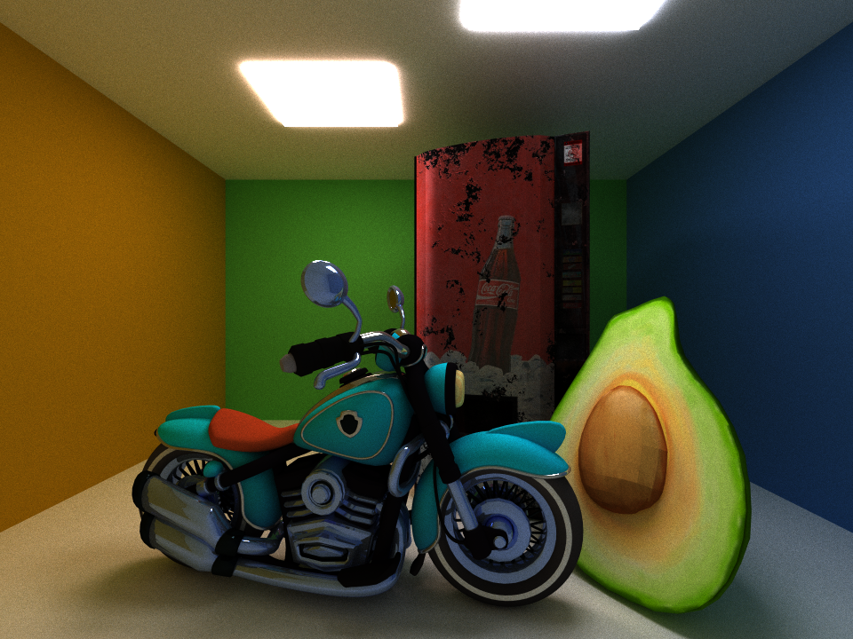

CUDA Path Tracer
================

**University of Pennsylvania, CIS 565: GPU Programming and Architecture, Project 3**




Constance Wang
  * [LinkedIn](https://www.linkedin.com/in/conswang/)

Tested on AORUS 15P XD laptop with specs:  
- Windows 11 22000.856  
- 11th Gen Intel(R) Core(TM) i7-11800H @ 2.30GHz 2.30 GHz  
- NVIDIA GeForce RTX 3070 Laptop GPU  

### Features
This is a Monte-Carlo pathtracer with GPU-accelerated intersection tests, shading, and path culling in CUDA.

- Core features
  - Diffuse and perfect specular shaders
  - Performance optimizations
    - Sorting rays by material
    - Path termination using stream compaction
    - Cache first bounce intersections
- Additional features
  - Gltf 2.0 loading & rendering
    - Scene graph traversal
    - Reads normal, tangent, UV, index buffers
    - Renders base color texture, normal map, metallic map
  - Bounding volume hierarchy
  - Stochastic sampled anti-aliasing

### Usage
The base code has been modified to take two arguments. The first argument is a filepath to the original txt scene format, and the second, optional argument is a filepath to a gltf file.

```
./pathtracer.exe [motorcycle.txt] [motorcycle.gltf]
```

### Toggleable features
All macros are defined in `sceneStructs.h`.  
- Performance
  - `SORT_BY_MATERIALS`
  - `BVH`: toggle bounding volume hierarchy
  - `CACHE_FIRST_BOUNCE`
- Visual
  - `ANTI_ALIAS`
  - `ROUGHNESS_METALLIC`: render metallic shader
- Debugging
  - `SHOW_NORMALS`: render normals as color
  - `SHOW_METALLIC`: render metallicness as color
