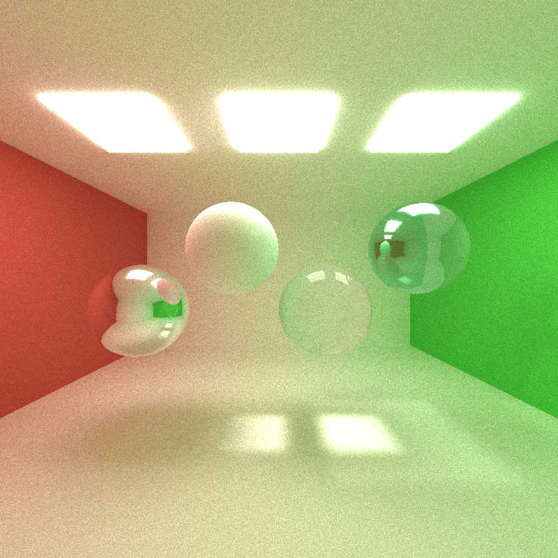
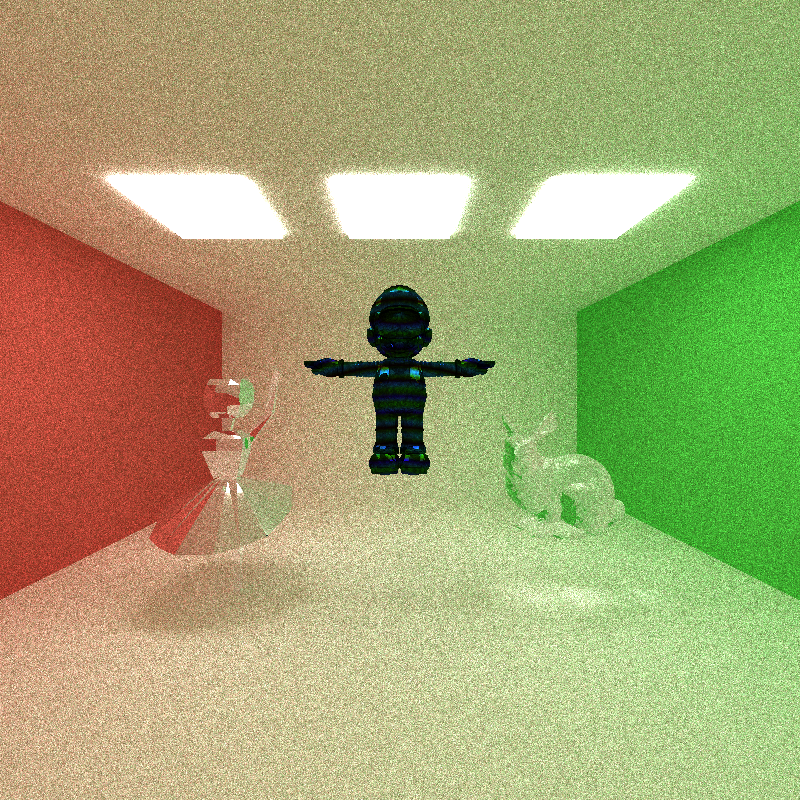
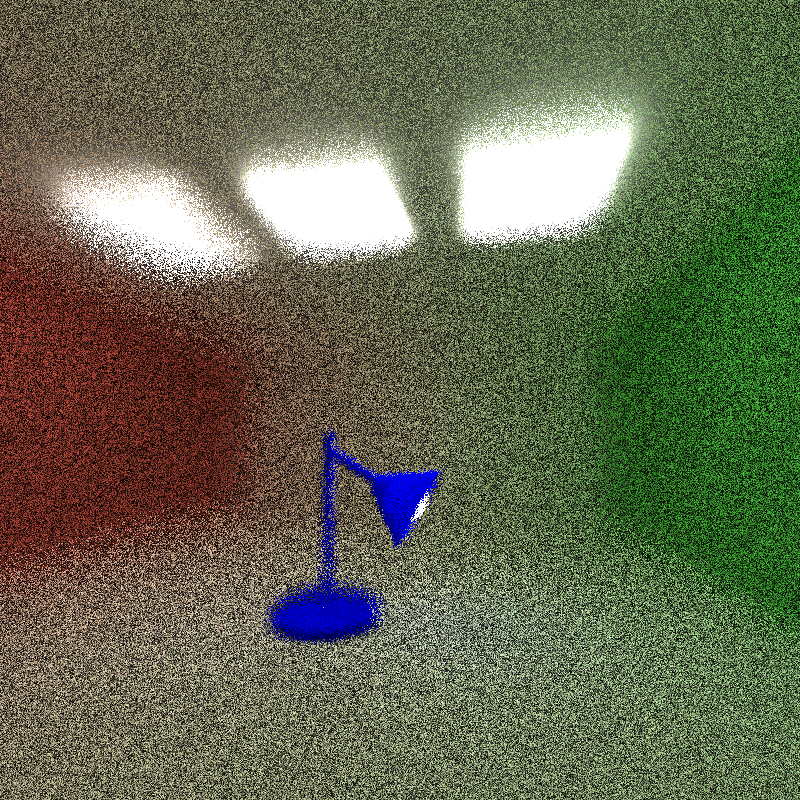

CUDA Path Tracer
================

**University of Pennsylvania, CIS 565: GPU Programming and Architecture, Project 2**

* RHUTA JOSHI
  * [LinkedIn](https://www.linkedin.com/in/rcj9719/)
  * [Website](https://sites.google.com/view/rhuta-joshi)

* Tested on: Windows 10 Home, i5-7200U CPU @ 2.50GHz, NVIDIA GTX 940MX 4096 MB (Personal Laptop), RTX not supported
* GPU Compatibility: 5.0

## Features

- Material Types
- Mesh OBJ loading
- Procedural Shapes
- Procedural Textures
- Depth of Field
- Anti-aliasing
- First bounce cache

### Material Types
---

Implemented diffused, specular reflective, specular refractive, glass

### Mesh OBJ loading
---

Implemented OBJ mesh loading tested within bounding box

 

### Depth of Field
---

Following image shows depth of field with focal length 10 and lens radius 0.5. The scene is 20 units in length along z
Nearest and farthest spheres are blurred, spheres in the middle are in focus

### Procedural Shapes
---

Using sdf operations

