CUDA Path Tracer
================

**University of Pennsylvania, CIS 565: GPU Programming and Architecture, Project 3**

* Nick Moon
  * [LinkedIn](https://www.linkedin.com/in/nick-moon1/), [personal website](https://nicholasmoon.github.io/)
* Tested on: Windows 10, AMD Ryzen 9 5900HS @ 3.0GHz 32GB, NVIDIA RTX 3060 Laptop 6GB (Personal Laptop)


**This is an offline Physically-Based Path Tracer accelerated on the GPU with CUDA. Path Tracing is a
technique of simulating the actual way light bounces around a scene from light sources towards an eye or
camera. Physically-Based implies energy conservation and plausibly accurate light simulation via solving
the Light Transport Equation originally proposed by Kajiya.** \
\
**I used this project to: learn path tracing
optimization techniques by utilizing the parallel nature of the GPU; review, reimplement, and extend
my work from CIS 561: Physically-Based Rendering; use this as an opportunity to learn and implement the
Bounding Volume Hierarchy acceleration structure, keeping in mind the limitations of GPU programming.**

## RESULTS


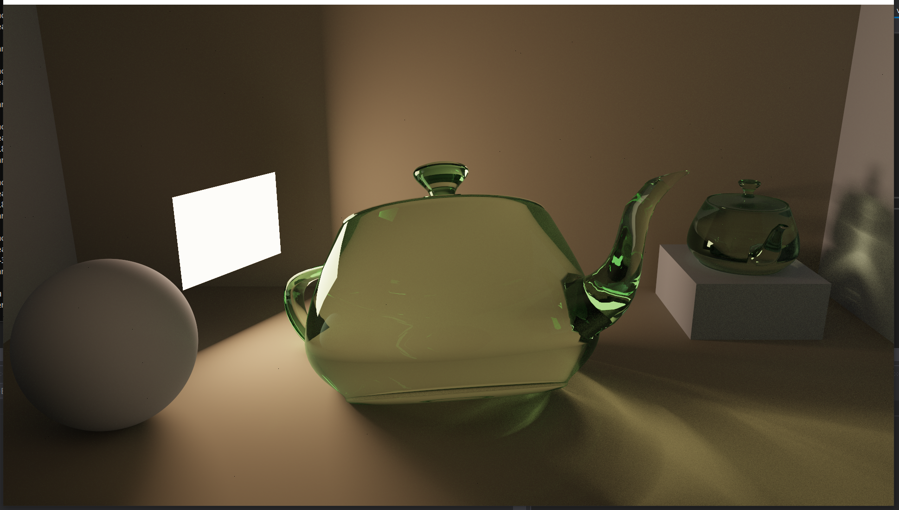


## IMPLEMENTATION

### Physically-Based Rendering

The following explanation is borrowed from Adam Mally's explanation of the Light Transport Equation

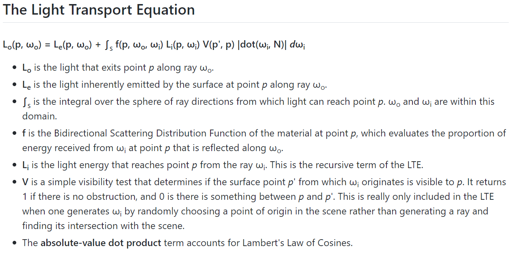

### Bidirectional Scattering Distribution Functions (BSDFs)

Bidirectional Scattering Distribution Functions describe the scattering of energy on a surface as a result
of the surface's material properties. Components of a BSDF can include the 
Bidirectional Reflectance Distribution Function and the Bidirectional Transmittance Distribution Function.
These describe the reflective and transmissive properties respectively.

#### Diffuse BRDF

The Diffuse BRDF scatters light in all directions


#### Specular BRDF


#### Specular BTDF


#### Specular Glass BxDF


#### Specular Plastic BxDF


### Multiple Importance Sampling (MIS)


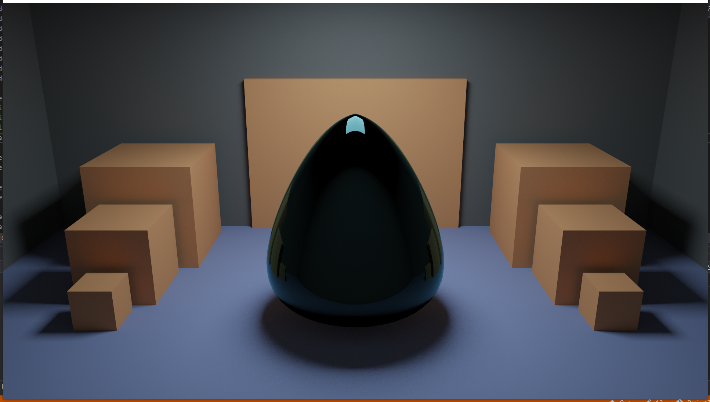
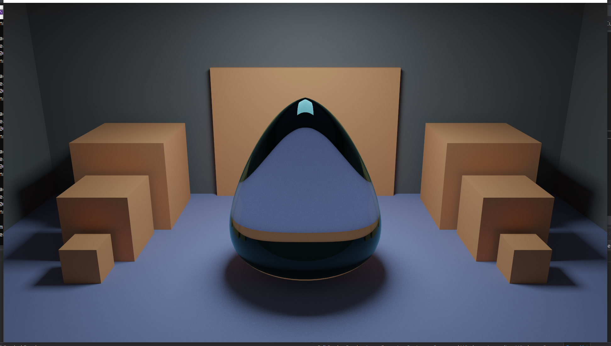
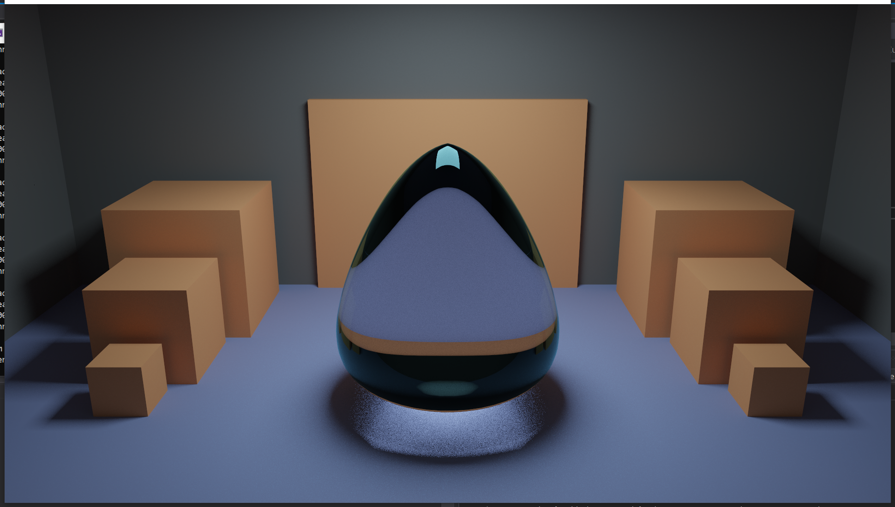
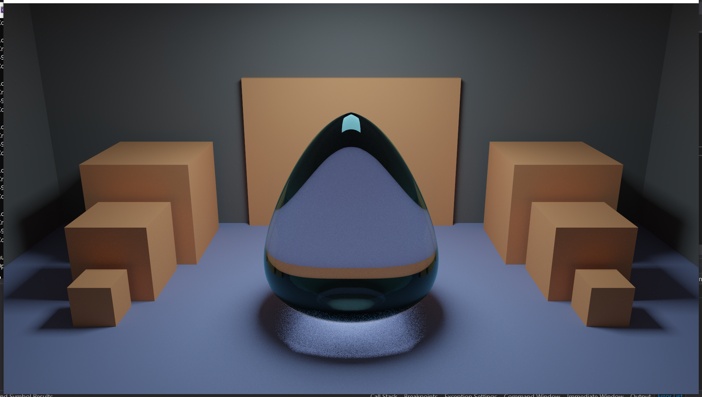


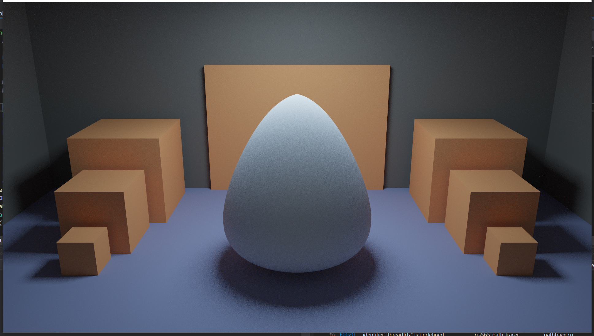

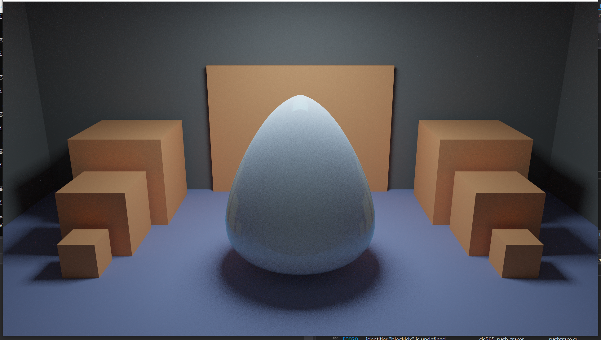

### Depth of Field


### Stochastic Anti-Aliasing


### Tone Mapping and Gamma Correction


### OBJ Loading with TinyOBJ


P.S. In order to render this wireframe version while still in a physically-based framework and in an
easy and quick to implement way, I changed my triangle intersection test. In the final check for if
the barycentric coordinates of the hit point are within the triangle, I simply added an upper limit to
the distance from an edge a point is that will still count as an intersection.


### Optimizations Features
 
#### Bounding Volume Hierarchy (BVH)

#### Russian Roulette Ray Termination

Russian Roulette Ray Termination is an optimization that seeks to remove ray paths that have no additional
information to contribute to the scene by bouncing more times. For my renderer, I enable a ray termination
check if the depth is greater than 3. This is because, for a scene made of mostly diffuse surfaces,
4-5 bounces is usually enough to get the majority of the global illumination information for a path (assuming
MIS/direct light sampling is also used). Thus, on depth 4 and greater, a random number is generated for each
ray path. If the max channel of the throughput of the ray (the value which gets attenuated when hitting
diffuse surfaces) is less than this random number, then the ray is terminated. However, if the max channel
is greater, then the ray path continues bouncing (for at least one more bounce if applicable). Additionally,
the throughput of a ray path that passes this check is divided by it max channel. This is to counter
the "early" termination of the rays which did not pass this check on earlier (or later) samples, thus
preserving the overall light intensity at each pixel. The image would be slightly darkened without this,
as energy would no longer be conserved.

#### Stream Compaction Ray Termination

The following explanation is from my HW 02: Stream Compaction README:

"Stream compaction is an array algorithm that, given an input array of ints ```idata``` of size ```n```,
returns an output array ```odata``` of some size ```[0,n]``` such that ```odata``` contains only the
values ```x``` in ```idata``` that satisfy some criteria function ```f(x)```. This is essentially 
used to compact an array into a smaller size by getting rid of unneeded elements as determined by 
the criteria function ```f(x)```. Values for which ```f(x)``` return ```true``` are kept, while
values for which ```f(x)``` return false are removed."

For the purposes of path tracing, we have an array of ray paths, with the remaining bounces of a path
being the amount of bounces a ray has left to take in the scene. We obviously don't want to be doing
unecessary intersections and shading for rays that no longer contribute color to the final
image. We thus define the ```f(x)``` from Stream Compaction to be that a ray path's remaining bounces
is not equal to 0. By using the Thrust library's Stream Compaction function, we can thus move unneeded rays
to the back of the array of paths, and only call the intersection and shading kernels on the rays that
will actually contribute to the rendering.

#### Material Sorting

Another optimization that can be made is by recognizing that all the material shading is currently done in
a single "uber" kernel. This means that individual threads in a warp might be calculating the f, pdf, and wi
terms for the hit surface using different BSDFs.

#### First Bounce Caching

## Performance Analysis

## Bloopers


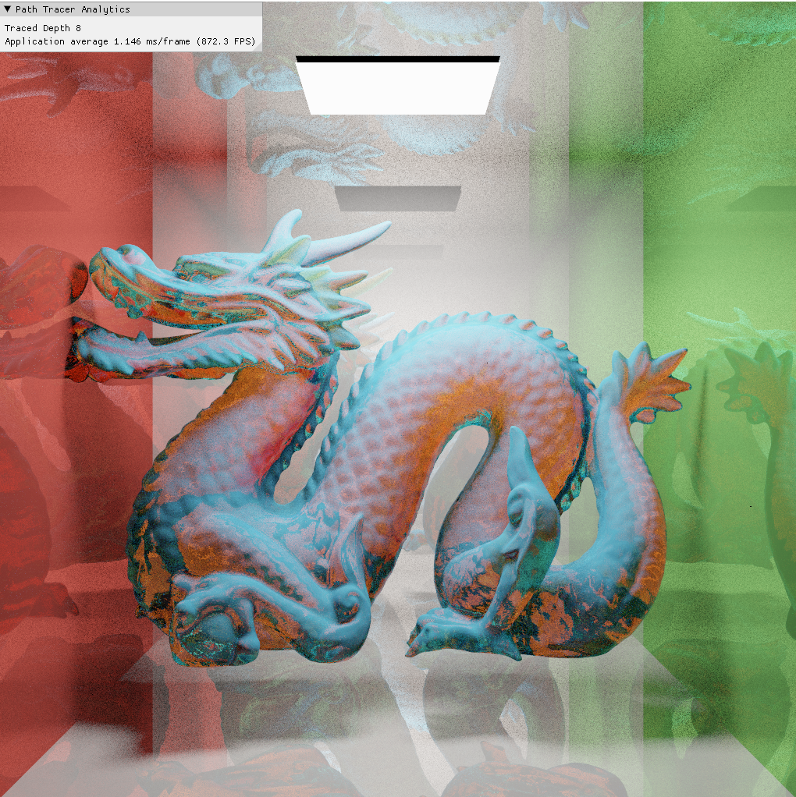

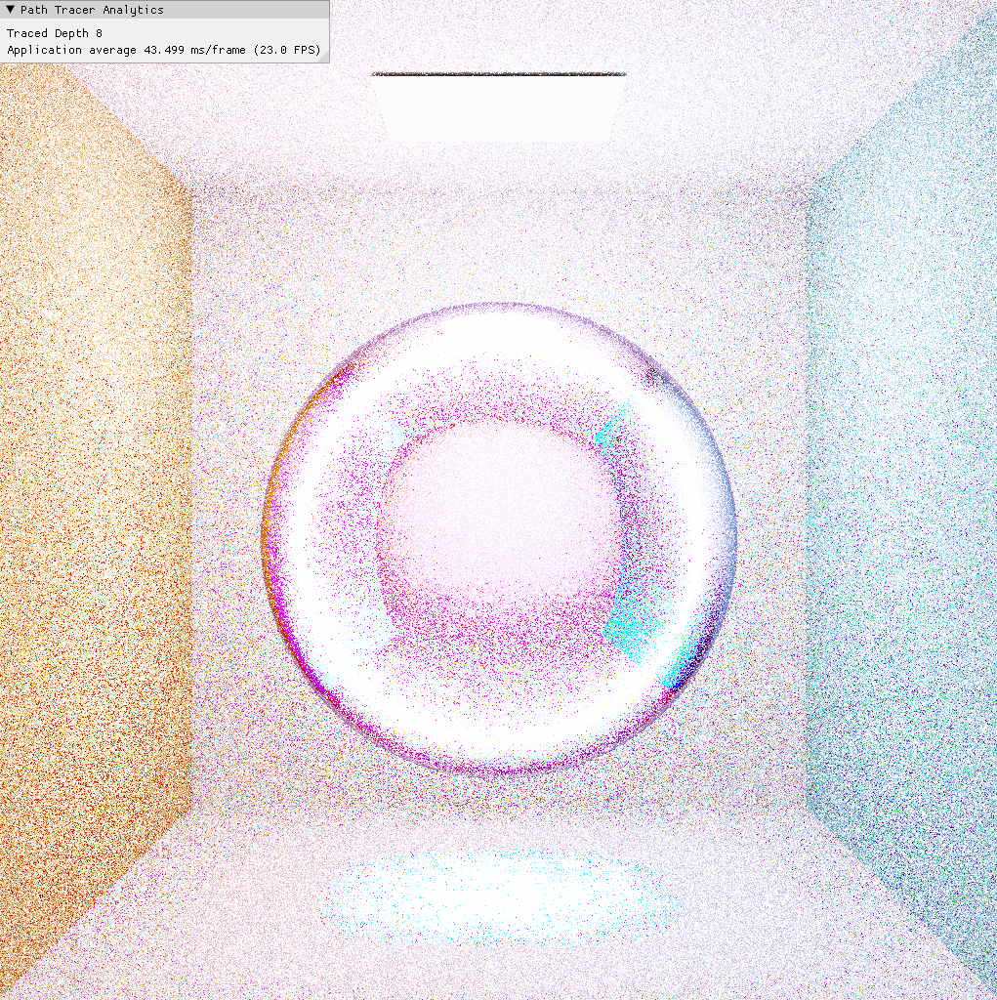

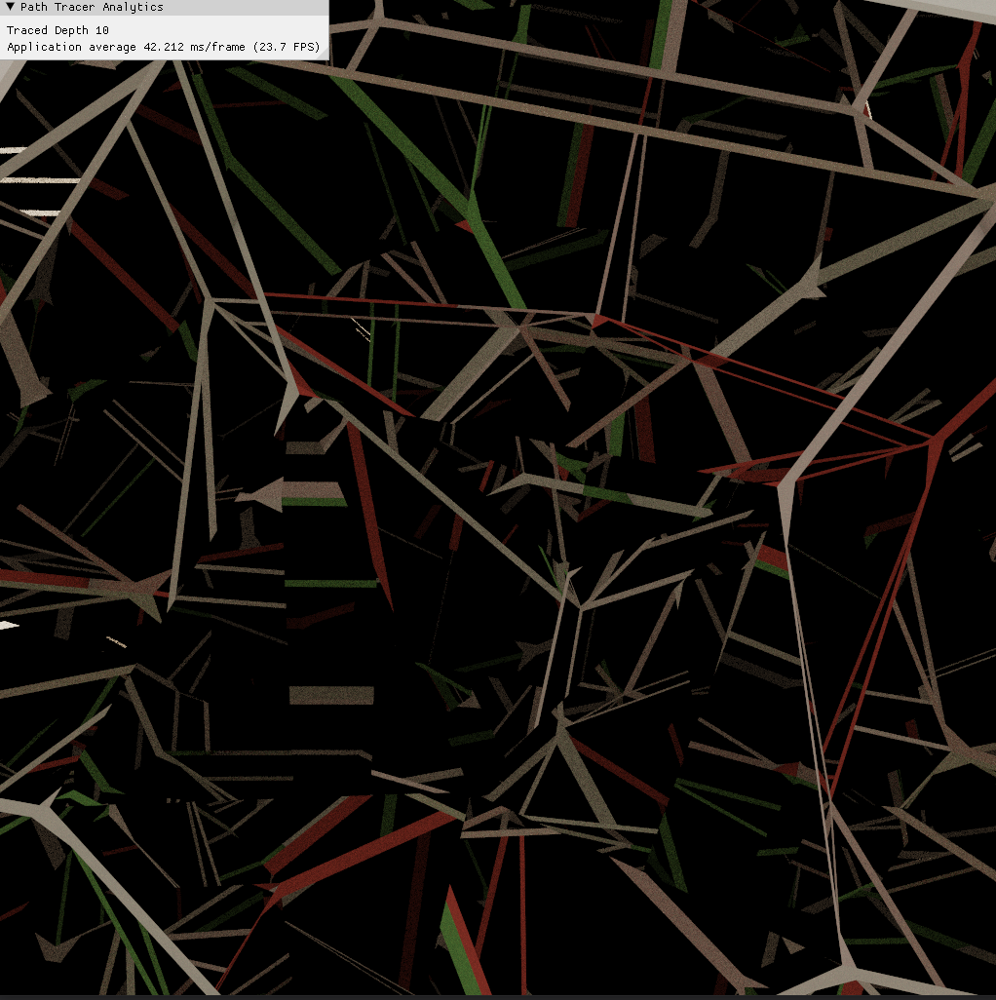

