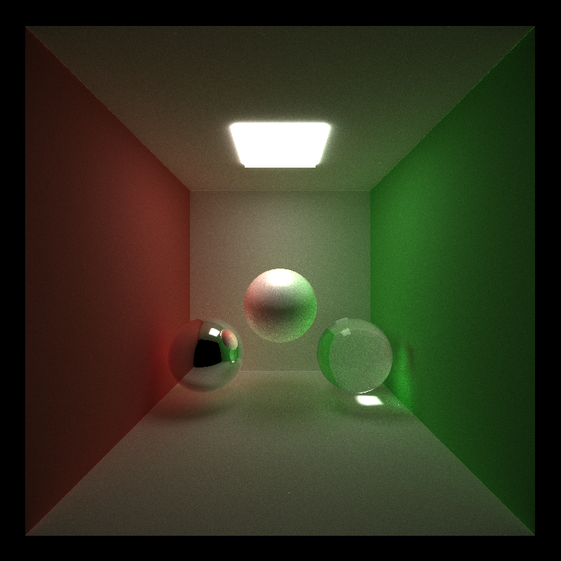
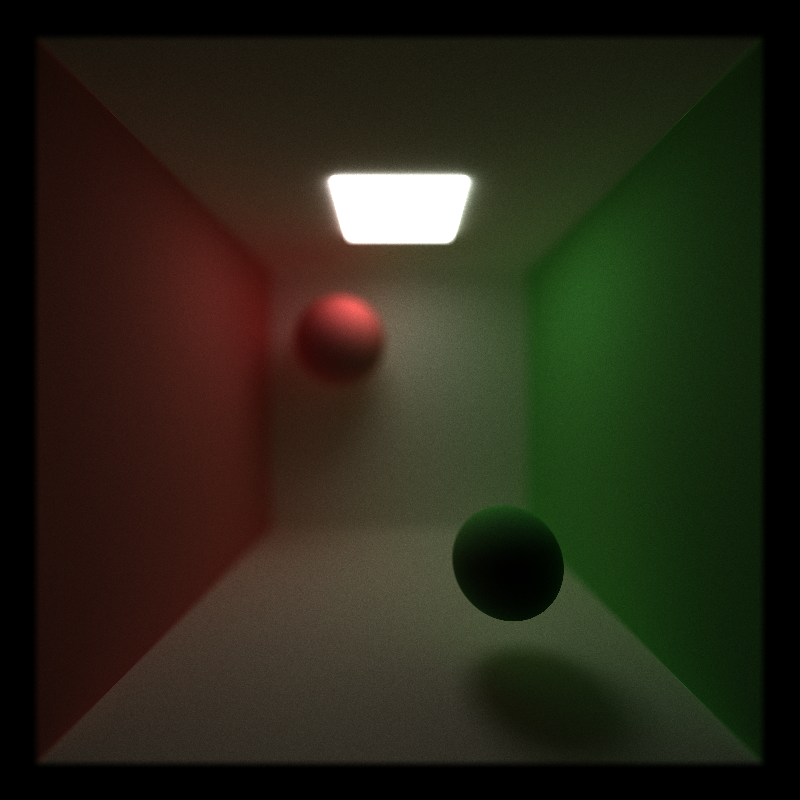
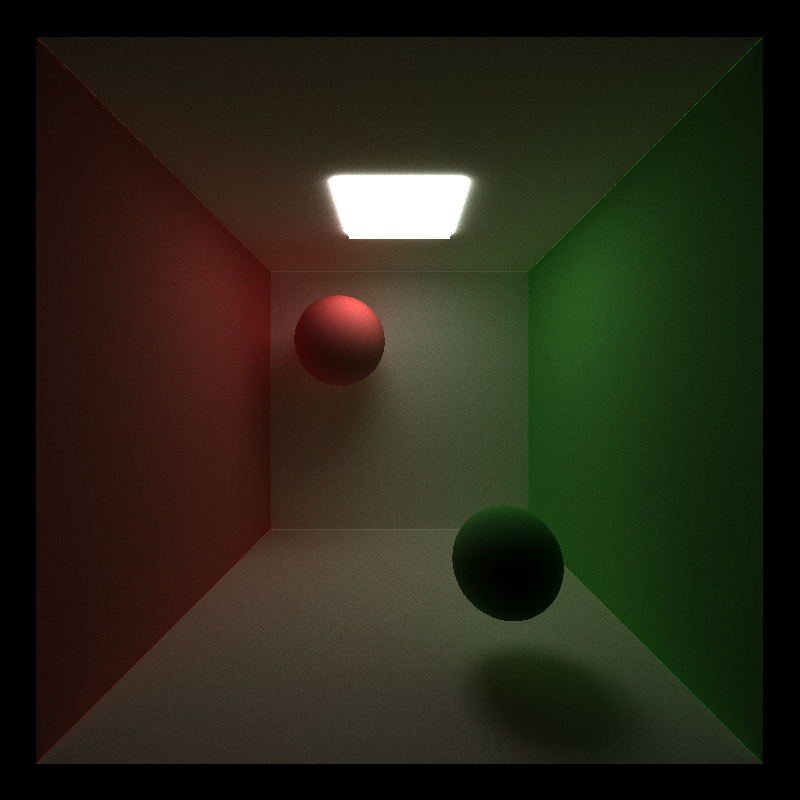
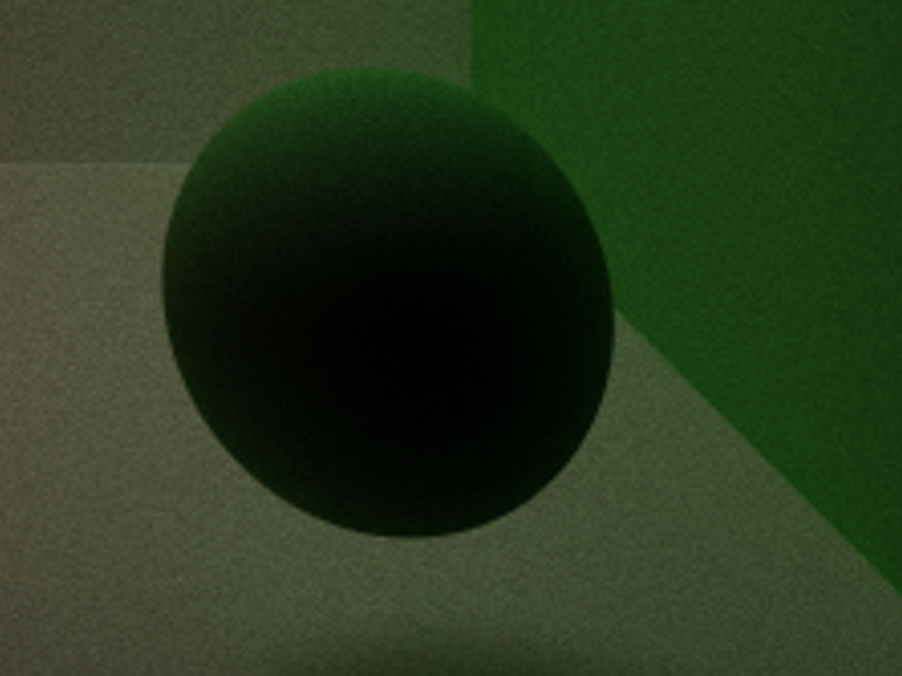
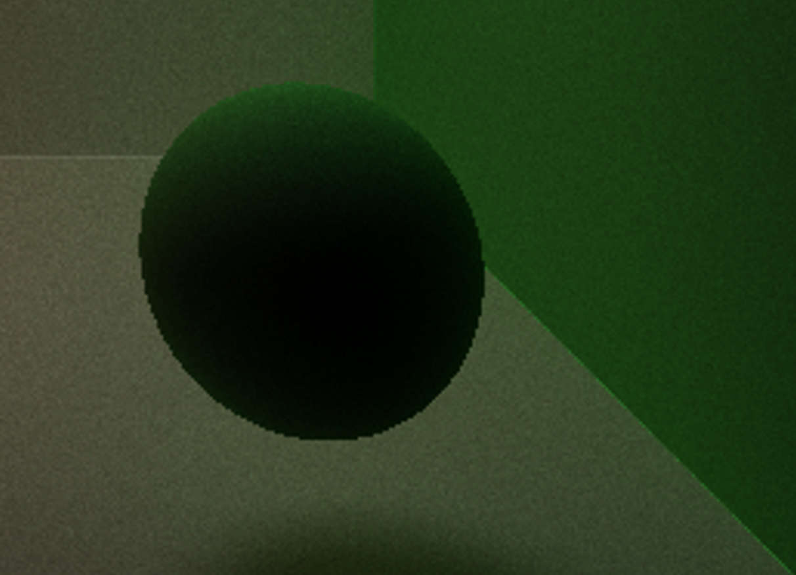
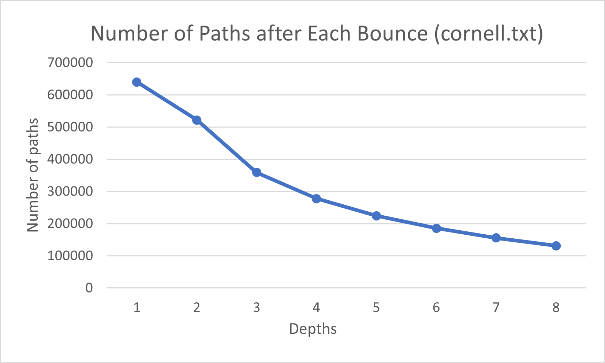
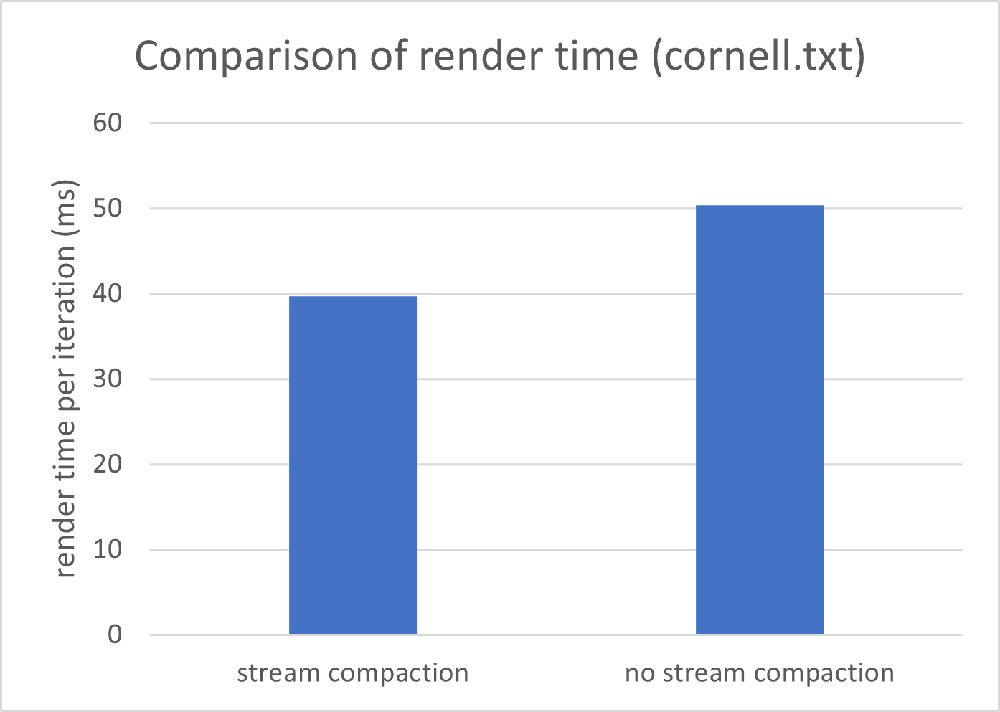
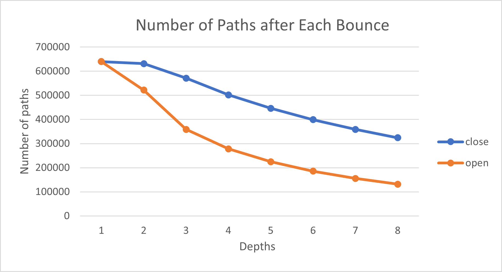
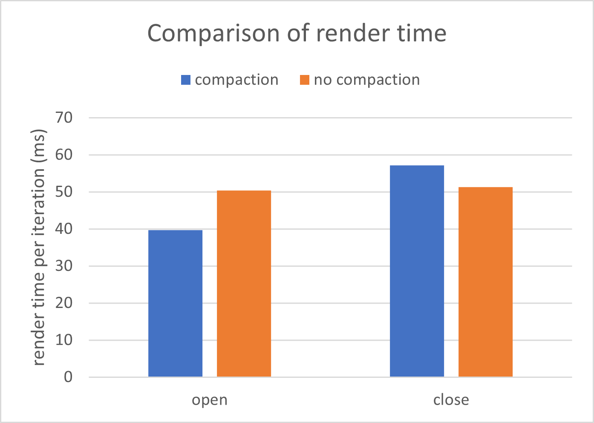
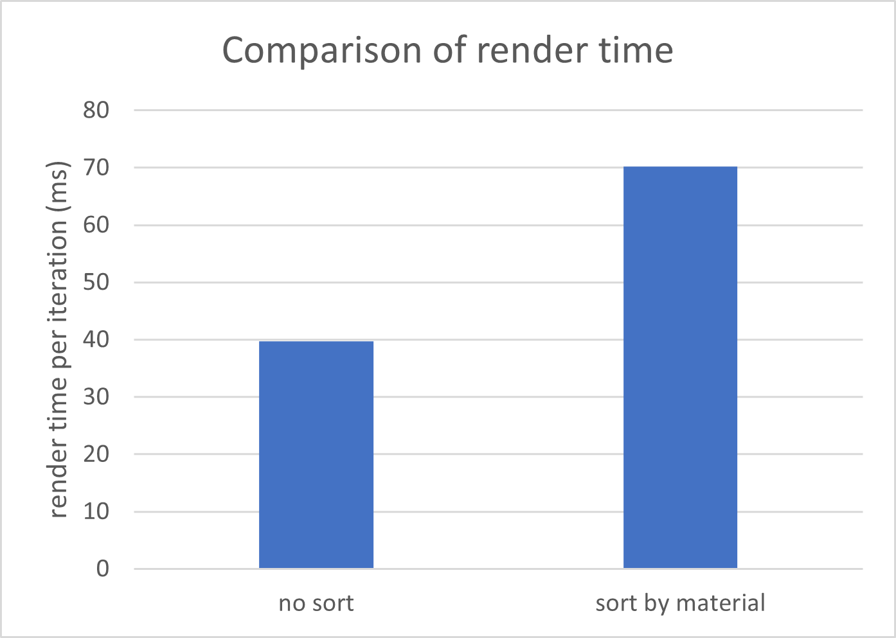

CUDA Path Tracer
================

**I used two late days in this project.**

**University of Pennsylvania, CIS 565: GPU Programming and Architecture, Project 3**

* Yiyang Chen
  * [LinkedIn](https://www.linkedin.com/in/yiyang-chen-6a7641210/), [personal website](https://cyy0915.github.io/)
* Tested on: Windows 10, i5-8700k @ 3.7GHz, GTX 1080, personal computer

## My Work

### BSDF Evaluation

*cornell.txt*

See the above image (I modified the scene file `cornell.txt`)
* Ideal diffuse surfaces (the wall)
* Perfectly specular-reflective surfaces (the left ball)
* Imperfect specular-reflective surfaces (Phong shading) (the middle ball)
    * After I got the rendered image, I found that because the Phong shading model is not physically based, I had to carefully set parameters to make the ball real.
* Perfectly refractive surfaces [PBRT 8.2] (the right ball)

### Path Continuation/Termination
I terminated path that r, g, b are all smaller than EPSILON or hitting the light source, using thrust::partition. In performance analysis I will show that it improve performance significantly.

### Memory Contiguous
I used thrust::sort_by_key to sort path segments and intersections by material ids after computing intersection. However, in performance analysis I will show that it may not improve performance.

### Cache First Intersections
I made a toggleable option to cache the first bounce intersections when antialiasing and depth-of-field are not enabled.

### Physically-based Depth-of-field [PBRT 6.2.3]

*depth_of_field.txt. Enable depth-of-field*

*depth_of_field.txt. No depth-of-field*

See the above image

### Stochastic Sampled Antialiasing

*Enable antialiasing*

*Disable antialiasing*

See the above comparison. There's obvious difference at the edge of the ball. 

When generating a ray from a pixel coordinate, I add uniform noise between `[-0.5, 0.5]` for pixel coordinate's `x` and `y`.

### Better Hemisphere Sampling Methods
Sample a cosine-weighted random direction in a hemisphere can be done by first sample uniformly in a circle and then get `z` by `z = sqrt(1-x^2-y^2)`. I rewrote functions in `interctions.h`, and added 2 different method to sample uniformly in a circle. (reference: http://www.josswhittle.com/concentric-disk-sampling/)

However the rendered images are almost the same, so I don't put comparison here.

### Re-startable Path Tracing
Press `Enter` to stop rendering temporarily, and press `Enter` again to start

## Analysis

### Core questions
* Stream compaction helps most after a few bounces. Print and plot the effects of stream compaction within a single iteration (i.e. the number of unterminated rays after each bounce) and evaluate the benefits you get from stream compaction.

Stream compaction reduce approximately 2/3 paths in an iteration. However, the `thrust::partition` function also takes some time, so the overall benefit in my scene (which is not complex) is not so obvious.

* Compare scenes which are open (like the given cornell box) and closed (i.e. no light can escape the scene). Again, compare the performance effects of stream compaction! Remember, stream compaction only affects rays which terminate, so what might you expect?

In closed scene there are also termintaed paths. They are paths hitting light source or the rgb is too small. From the above graphs we can know that more paths terminated in open scene, and the render time is smaller. In addition, notice that in close scene, no compaction is even faster than compaction, I think it's because stream compaction also takes some time, it's considerable when the scene is simple. 

### Memory Contiguous

The above graph is comparison of render time in my `cornell.txt` scene. 
As mentioned in above section, using sort to make the memory contiguous doesn't improve performance. I think it's because although shading is a bit faster, sorting itself takes more time. Maybe sorting will work in a much more complex scene.

### Physically-based Depth-of-field & Stochastic Sampled Antialiasing
The two features are all about jittering rays when generating rays from camera, so I discuss them togethor.
* Performance impact: I found that the rendering time is almost the same, because I just jitter rays in the function `generateRayFromCamera`, which is relatively simple
* Compare to hypothetical CPU version: I think it's almost same to implement on the GPU. On CPU we generate rays in a loop, and on GPU we just make the process parallel.
* Optimization: The sample method (on the aperture) might be changed. 

Overview write-up of the feature along with before/after images.
Performance impact of the feature
If you did something to accelerate the feature, what did you do and why?
Compare your GPU version of the feature to a HYPOTHETICAL CPU version (you don't have to implement it!)? Does it benefit or suffer from being implemented on the GPU?
How might this feature be optimized beyond your current implementation?

### Refraction
* Performance impact: almost the same. Although I thought computing the fresnel may cost some time, it came out that my `shadeFakeMaterial` function always takes about 10 microseconds with or without a glass ball in my `cornell.txt`.
* Compare to hypothetical CPU version: The computation is in the kernal, and independent with other rays. So I think the GPU version has no difference with CPU version (maybe just `__host__ __device__`).
* Optimization: Imperfect refraction, and even other BSDF like microfacet BSDF.

### Better Hemisphere Sampling Methods
* Peformance impact: just different methods of sampling, peformance is almost the same
* Compare to hypothetical CPU version: Sample is in the kernel, and independent with other rays. So I think the GPU version has no difference with CPU version (maybe just `__host__ __device__`)
* Optimization: The method of uniformly sampling in a square can be optimized, using grid sampling, stratified sampling, etc.

### Re-startable Path Tracing
* Peformance impact: None
* Compare to hypothetical CPU version: None
* Optimization: Save some render state and data in files so that the program can save a project when still incompleted and then close, and when it open it can resume the work.