CUDA Path Tracer
================

(leading img here)

**University of Pennsylvania, CIS 565: GPU Programming and Architecture, Project 3**

* Evan S
* Tested on: Strix G15: Windows 10, Ryzen 7 4800H @ 2.9 GHz, GTX 3050 (Laptop)

## Background
This program takes in a text file describing a scene(objects, locations, materials) and renders it with the canonical path tracing algorithm. 

Features:
* Different materials
	* Diffusive
	* Reflective
	* Refractive
* Depth of field
* Stream compaction
* Sorting rays by intersected material type
* Caching first intersection

This README contains many images. Click on them (on Github) to open the full size.

## Feature Breakdown and Performance Analysis

### Visual Effects

The following visual effects are achieved in-code by manipulating the inital raycasts. As this is done during parallelized per-pixel ray generation, this benefits from being a GPU operation. They generally have very little performance impact.   
Nonetheless, performance could be improved at the cost of less true-to-life DOF behavior(e.g., instead of jittering rays on a circular disk to mimic a lens, which requires concentric mapping from square to circle, one could just use the square). 

#### Antialiasing
Antialiasing (AA) is the process of removing artifacts (alias) that occur when representing an image on a pixelated screen. A smooth line, if crossing vertically or horizontally across a pixel, creates a stair-like artifact called "jaggies".      
AA is implemented by altering the direction of casted rays in a normally distributed(standard deviation of 0.5 pixel length) manner. The result is that a pixel color is determined by the average colors of its surrounding pixels. This is nondeterministic, so it is incompatible with caching first intersection.

AA is disabled if ANTIALIAS(in the scene file camera) equals 0; otherwise it is enabled. 

| Effect | None | Anti-aliased |
| :------- | :-------: | :-------: |
| FPS | 53.0 | 52.8 |
| Scene | 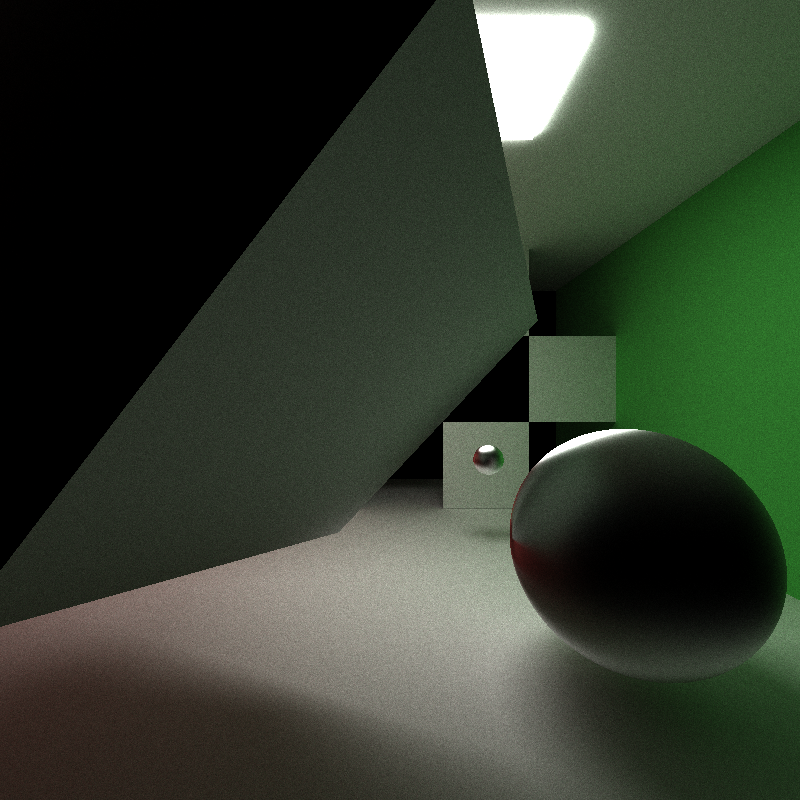 |  |
| Zoom | 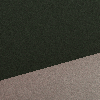 | 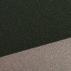 |

The zoom demonstrates how jaggies in the aliased image is smoothed out after anti-aliasing.

#### Depth of Field
Depth of field (DOF) is the distance between the closest and furthest things that look clear in an image. The focal distance specifies the distance at which the image should be the most clear. Wider camera lens means pictures come out with lower DOF; things at the focal distance plane get clearer, but everything else becomes blurrier. This is implemented by spreading ray origins about a disk and directions toward a specific distance, mimicking a lens and its ability to focus light. 

FOCAL_DIST and LENS_RAD are specified as part of the camera values in the scene file. DOF is disabled if either value is less than or equal to 0.

| Effect | None | DOF(LENS_RAD = 0.2) | DOF(LENS_RAD = 1) | 
| :------- | :-------: | :-------: | :-------: |
| FPS | 48.7 | 47.4 | 47.1 |
| Scene |  | 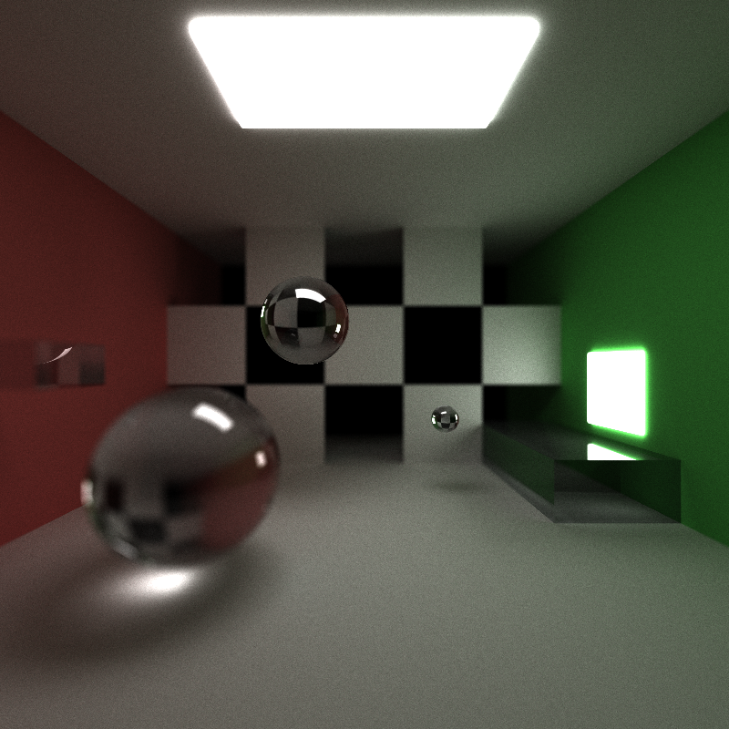 | 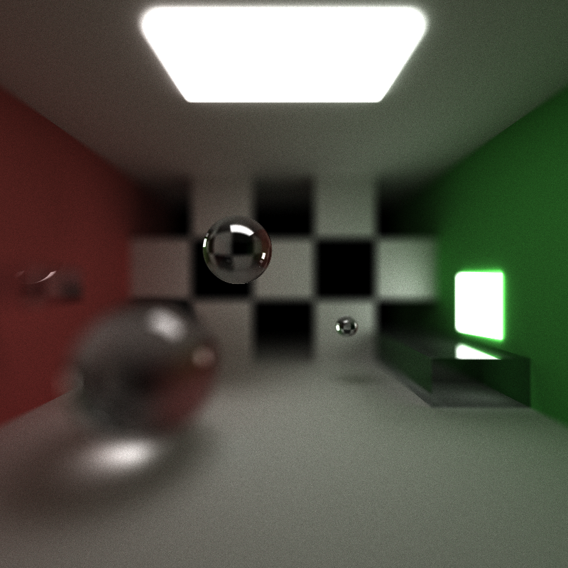 |

The scene dielectrics have IOR = 2.42 (diamond). The FOCAL_DIST is kept constant, at 12.5. Note how as LENS_RAD = 0.2 increases, the clarity decreases on everything not on the plane defined by the focal distance.      

### Notable Material Types
Material types can be specified in the scene text files.   
A material type is means a different BSDF, an inherent part of the ray tracing evaluation. Any CPU path tracer that tries to implement the same thing will be orders of magnitude slower.  
Adding approximations to respective material types could improve performance, at the cost of physical accuracy (e.g., Schlick approximation for Fresnel equations).

#### Refraction
The material type DIELECTRIC specifies a material to both reflects and refracts light according to its index of refraction(IOR). I used the [Schlick approximation](https://en.wikipedia.org/wiki/Schlick%27s_approximation), of the Fresnel equations since it achieves results at up to 32x speed for less than 1% average error (see Ray Tracing Gems II).    
The frames per second(FPS) - a rough benchmark of rendering speed - of this material is comparable to diffuse or specular. 
| Material | Diffuse | Specular | Dielectric(IOR = 1.52) | 
| :------- | :-------: | :-------: | :-------: |
| FPS | 51.8 | 52.6 | 52.1 |
| Scene | 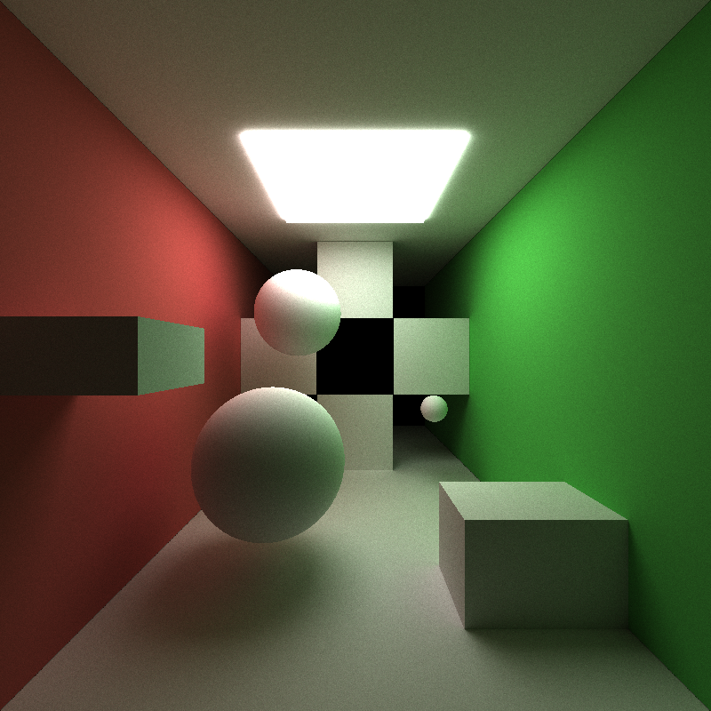 | 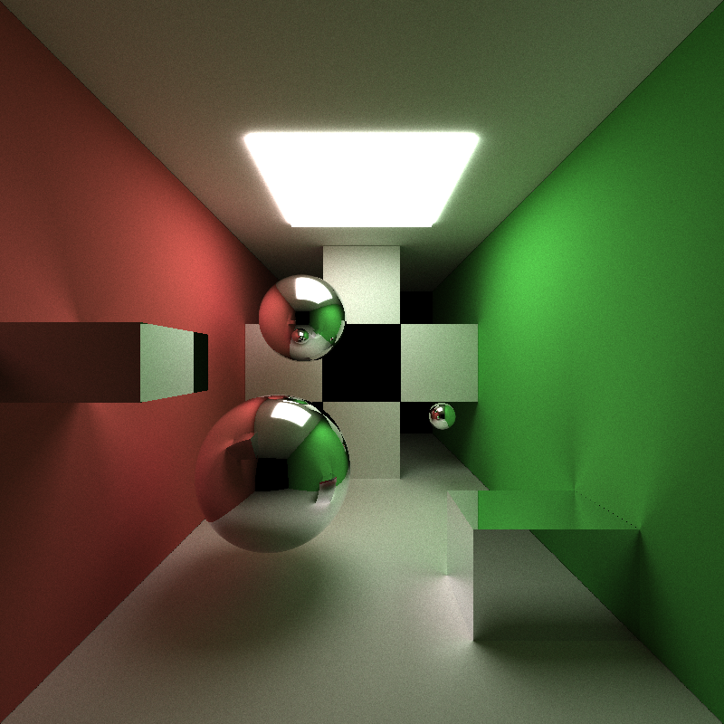 | 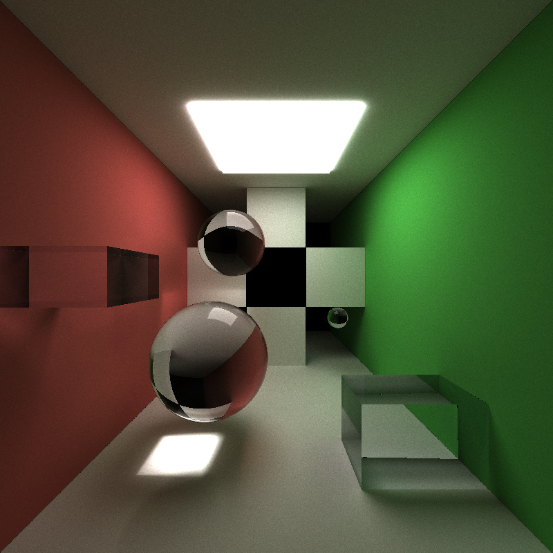 |

Note the subtle reflection of the light on the dielectric spheres; that is the light reflection contribution.   

#### Imperfect Specular

The material type SPECULAR specifies a material to reflect light; the degree of this is determined by the specular exponent(SPECEX). The higher the SPECEX, the more reflective.

| Material | Diffuse | SPECEX = 80 | SPECEX = 5000 | 
| :------- | :-------: | :-------: | :-------: |
| FPS | 51.8 | 52.6 | 52.6 |
| Scene |  | 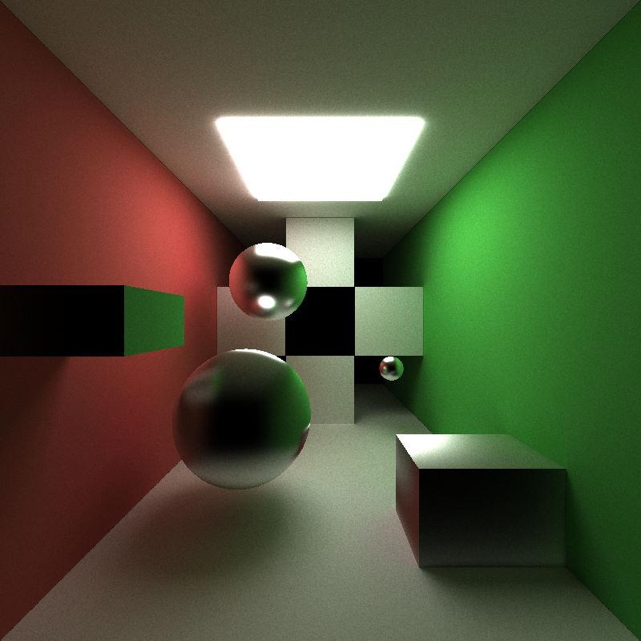 |  |

Note the way the reflections look muddled, like a dirty mirror as a consequence of the lower SPECEX.

### Core Feature Benchmarks

A basic Cornell box scene, used for benchmarks.     
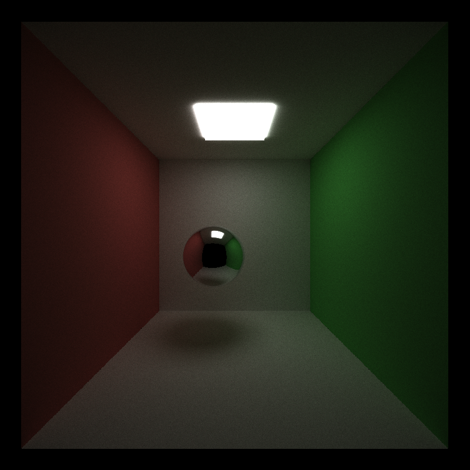

#### Stream compaction
Stream compaction/partitioning of terminated paths allows warps to go offline early. The below graph gives the average FPS (a benchmark of the speed of the path tracing) of path tracing with and without stream compaction as depth of the tracing goes up on the (above) basic Cornell box scene.   
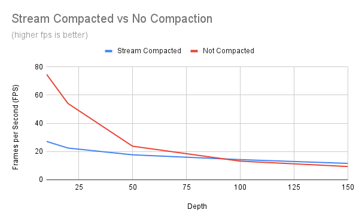    
The chart indicates that while tracing depth is low, the overhead of partitioning the rays presents a huge slowdown. However, when depth is higher (when it is expected that rays have to bounce numerous times before terminating), the ability to free up threads operating on terminated rays from stream compaction becomes worthwhile. 

#### Sorting rays by intersected material type
Sorting rays by the material type they intersect with means that the code path of contiguous threads (warps) will be grouped together when calculating the BSDF, ensuring parallelization and therefore performance improvement. The average FPS of this sorting on the basic Cornell box scene as well as a modified box scene with 8 spheres, some diffusive and some specular, is noted in the table below: 
| (FPS) | Sorting | No Sorting |
| :------- | :-------: | :-------: |
| Basic scene | 9.1 | 75.3 |
| More materials | 9 | 70.4 |

Clearly sorting causes enormous slowdown on these simple scenes. The greater dip in the object heavy scene when sorting(compared to the basic) implies that the two different materal types causes some serialization in the program, where thread paths have to go down either the diffusive or specular BSDF. Still, sorting only seems like a worthwhile thing to enable if there is a huge variety of materials/code paths. 

#### Caching first intersection
The first intersection of rays is static, as it is initiated by the static ray casts per-pixel of the render. Caching the first intersection for use across subsequent iterations is expected to boost performance overall at a slight memory cost. The table below compares the average time(over 5 tries) for 5000 iterations between caching and no caching for the basic Cornell box scene:
| (seconds) | Caching | No caching |
| :------- | :-------: | :-------: |
| Basic scene | 69 | 70 |   

Curiously, the difference is negligible, though weighed toward the caching. The simplicity of the Cornell box scene makes it difficult to ascertain clear winners when it comes to different rendering options.

## References
[Ray Tracing Gems II](http://www.realtimerendering.com/raytracinggems/rtg2/)     
[Ray Tracing in One Weekend](https://raytracing.github.io/)      
[Fresnel Equations, Schlick Approximation, Metals, and Dielectrics](http://psgraphics.blogspot.com/2020/03/fresnel-equations-schlick-approximation.html)      
[GPU Gems III](https://developer.nvidia.com/gpugems/gpugems3/part-iii-rendering/chapter-20-gpu-based-importance-sampling)     