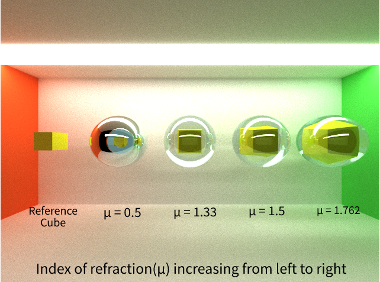
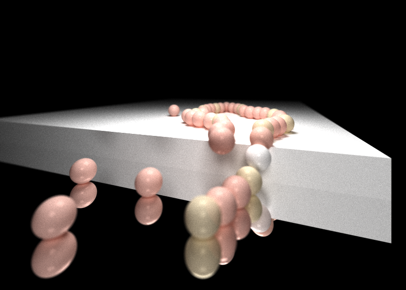
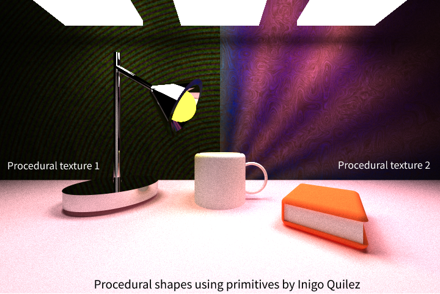
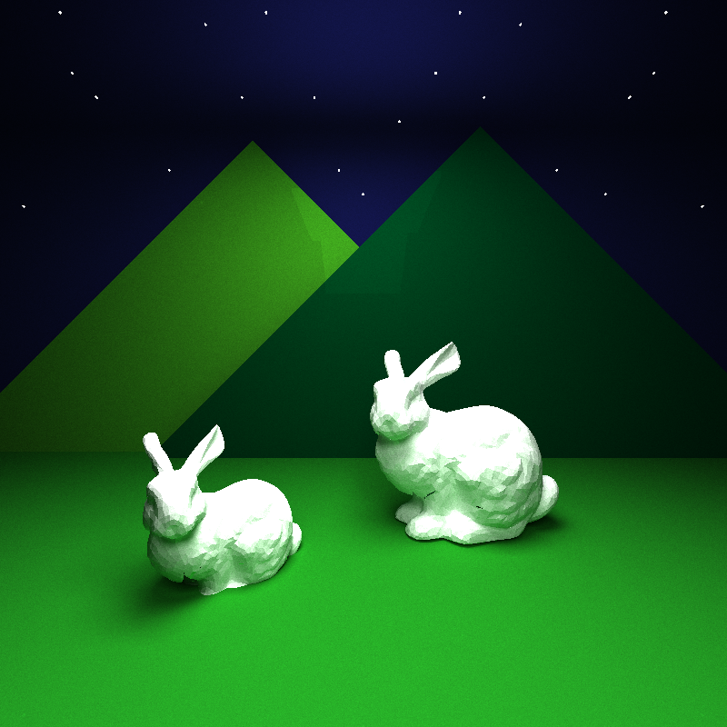
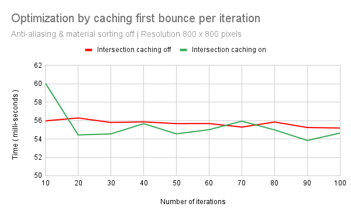
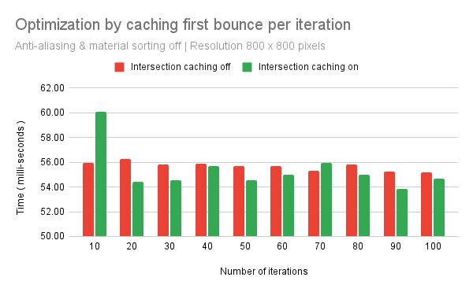
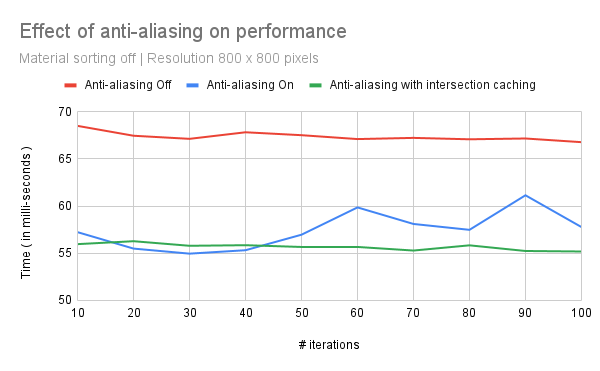
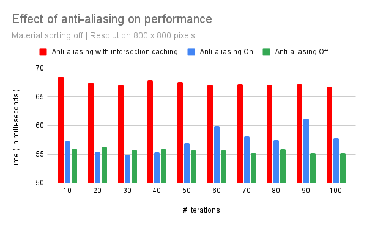

CUDA Path Tracer
================

**University of Pennsylvania, CIS 565: GPU Programming and Architecture, Project 2**

* RHUTA JOSHI
  * [LinkedIn](https://www.linkedin.com/in/rcj9719/)
  * [Website](https://sites.google.com/view/rhuta-joshi)

* Tested on: Windows 10 - 21H2, i7-12700 CPU @ 2.10 GHz, NVIDIA T1000 4096 MB
* GPU Compatibility: 7.5

## Introduction

Ray-tracing is a computer graphics technique in which we calculate the exact path of reflection or refraction of each ray and trace them all the way back to one or more light sources. Path tracing is a specific form of ray tracing that simulates the way light scatters off surfaces and through media, by generating multiple rays for each pixel(sampling) and bouncing off those rays based on material properties.

Since this technique involves computing a large number of rays independently, it can be highly parallelized. In this project, I have used CUDA to compute intersections and shading per iteration for multiple rays parallelly.

## Features

|Implemented features|
|---|
||

Some of the visual improvements implemented include:
- [Specular refraction and reflection](#specular-refraction-and-reflection)
- [Physically based depth of field](#physically-based-depth-of-field)
- [Stochastic sampled antialiasing](#stochastic-sampled-antialiasing)
- [Procedural shapes and textures](#procedural-shapes-and-textures)
- [Aritrary obj mesh loading](#aritrary-obj-mesh-loading)

Some performance improvements implemented include:
- [First bounce cached intersections](#first-bounce-cached-intersections)
- [Path continuation/termination using stream compaction](#path-continuationtermination-using-stream-compaction)
- [Sorting rays by material](#sorting-rays-by-material)

## Visual Improvements

### Specular refraction and reflection
The following render has a cube placed inside spheres of varying refractive index. Note how the size distortion of the refracted sphere varies
|Schlick's approximation for varying index of refraction|
|---|
||

### Physically based depth of field

The following renders of a string of pearls show depth of field as cameras with different lens radius generate varying depth of field.
|As lens radius increases, the blur/jitter on non-focused objects increases|
|---|
|  |

We can set the focal length of our camera to focus on foreground, mid-ground or background. The render comparisons are as follows.
|Lesser focal length focuses on objects closer to camera and blurs the rest|
|---|
||

### Stochastic sampled antialiasing

|Observe aliasing along the surface of the sphere in the left image|
|---|
||

### Procedural shapes and textures

|Using SDF operations by [Inigo Quilez](https://iquilezles.org/articles/distfunctions/) and noise functions|
|---|
||

### Aritrary obj mesh loading

|OBJ mesh loading with bounding box intersection culling|
|---|
||
 
## Performance Optimizations

### First bounce cached intersections

|Tested on basic cornell box with 1 diffused sphere in the center|
|---|
||
||

For the above observations, anti-aliasing was turned off. Anti-aliasing is an expensive operation. However, it becomes even more expensive if implemented along with intersection caching.

|Anti-aliasing tested with intersection caching|
|---|
||
||

### Path continuation/termination using stream compaction

### Sorting rays by material
