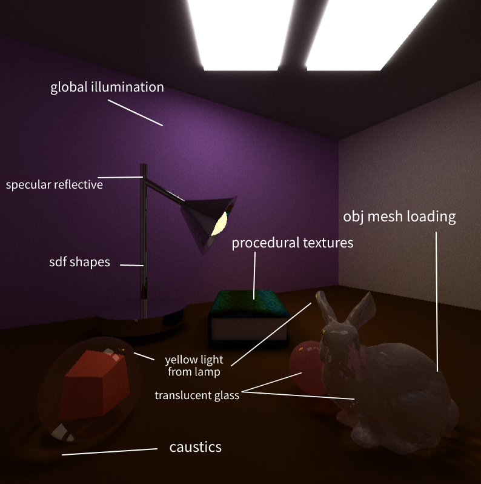
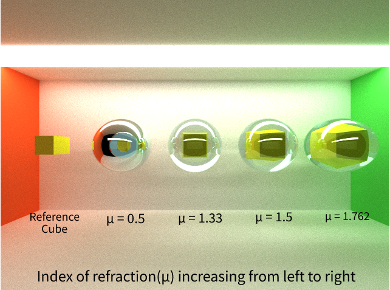
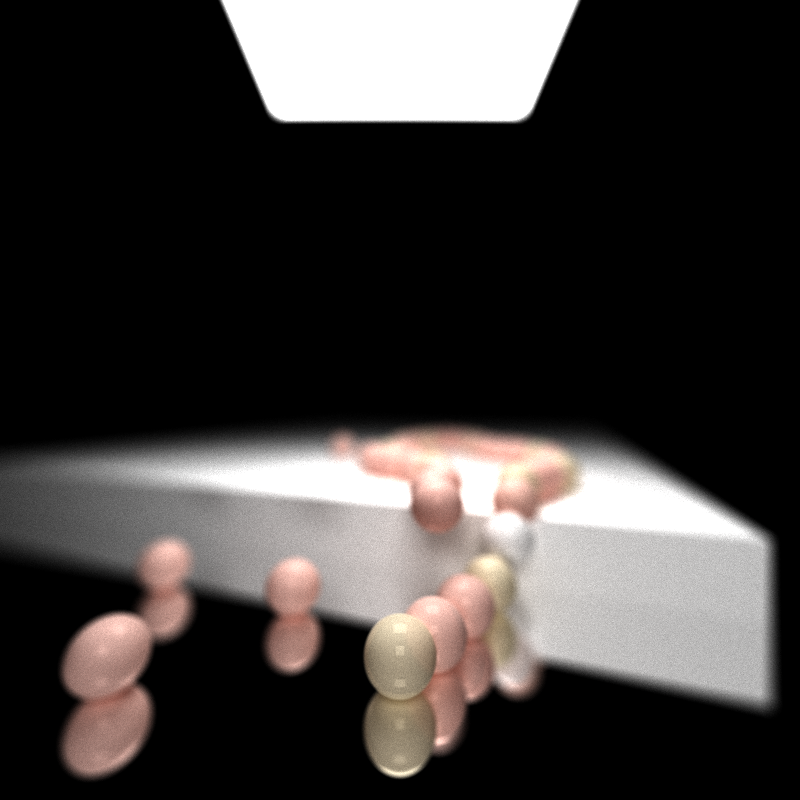
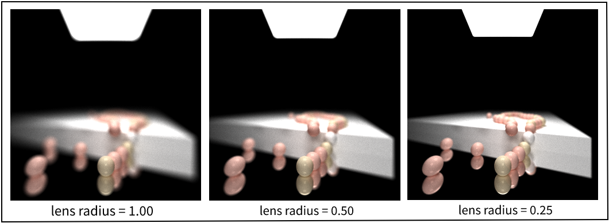
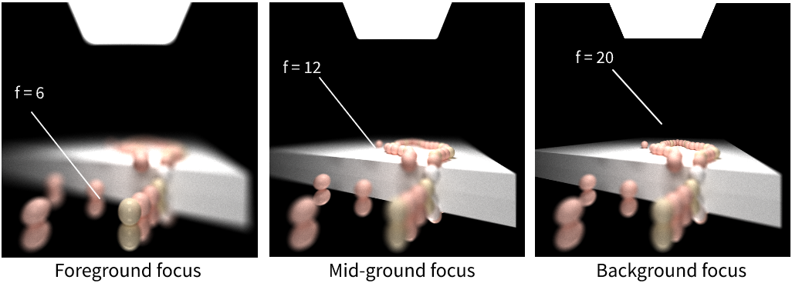
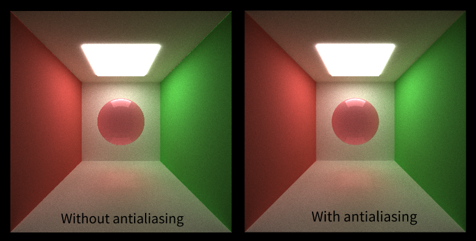

CUDA Path Tracer
================

**University of Pennsylvania, CIS 565: GPU Programming and Architecture, Project 2**

* RHUTA JOSHI
  * [LinkedIn](https://www.linkedin.com/in/rcj9719/)
  * [Website](https://sites.google.com/view/rhuta-joshi)

* Tested on: Windows 10 Home, i5-7200U CPU @ 2.50GHz, NVIDIA GTX 940MX 4096 MB (Personal Laptop), RTX not supported
* GPU Compatibility: 5.0

# Introduction

Ray-tracing is a computer graphics technique in which we calculate the exact path of reflection or refraction of each ray and trace them all the way back to one or more light sources. Path tracing is a specific form of ray tracing that simulates the way light scatters off surfaces and through media, by generating multiple rays for each pixel(sampling) and bouncing off those rays based on material properties.

Since this technique involves computing a large number of rays independently, it can be highly parallelized. In this project, I have used CUDA to compute intersections and shading per iteration for multiple rays parallelly.

# Features

Some of the visual improvements implemented include:
- [Specular refraction and reflection](specular-refraction-and-reflection)
- [Physically based depth of field](physically-based-depth-of-field)
- [Stochastic sampled antialiasing](stochastic-sampled-antialiasing)
- [Procedural shapes and textures](procedural-shapes-and-textures)
- [Aritrary obj mesh loading](aritrary-obj-mesh-loading)

Some performance improvements implemented include:
- First bounce cached intersections
- Path continuation/termination using stream compaction
- Sorting rays by material

# Visual Improvements

## Specular refraction and reflection

Implemented diffused, specular reflective, specular refractive, glass

## Physically based depth of field

The following renders of a string of pearls show depth of field as cameras with different lens radius generate varying depth of field effect.

We can set the focal length of our camera to focus on foreground, mid-ground or background. The render comparisons are as follows.

## Stochastic sampled antialiasing

## Procedural shapes and textures

Using sdf operations

## Aritrary obj mesh loading

Implemented OBJ mesh loading tested within bounding box

 
