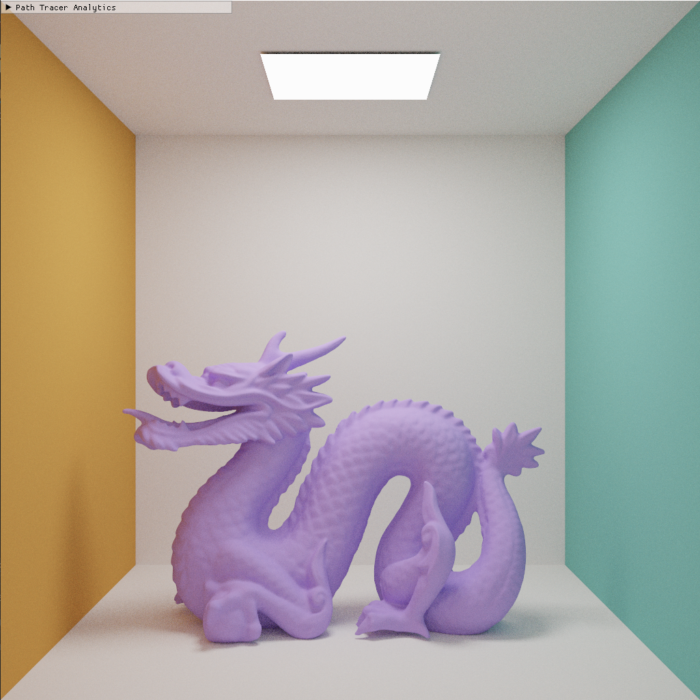

CUDA Path Tracer
================

**University of Pennsylvania, CIS 565: GPU Programming and Architecture, Project 3**

* Nick Moon
* Tested on: (TODO) Windows 22, i7-2222 @ 2.22GHz 22GB, GTX 222 222MB (Moore 2222 Lab)

### (TODO: Your README)

Will complete more fully by tuesday

Part 2 Implemented features:

Stochastic AA,

Depth of Field,

Conversion to physically based shading

Refraction and Glass

OBJ Loading With Acceleration structure

Full Multiple Importance Sampling

BVH acceleration structure

*DO NOT* leave the README to the last minute! It is a crucial part of the
project, and we will not be able to grade you without a good README.

