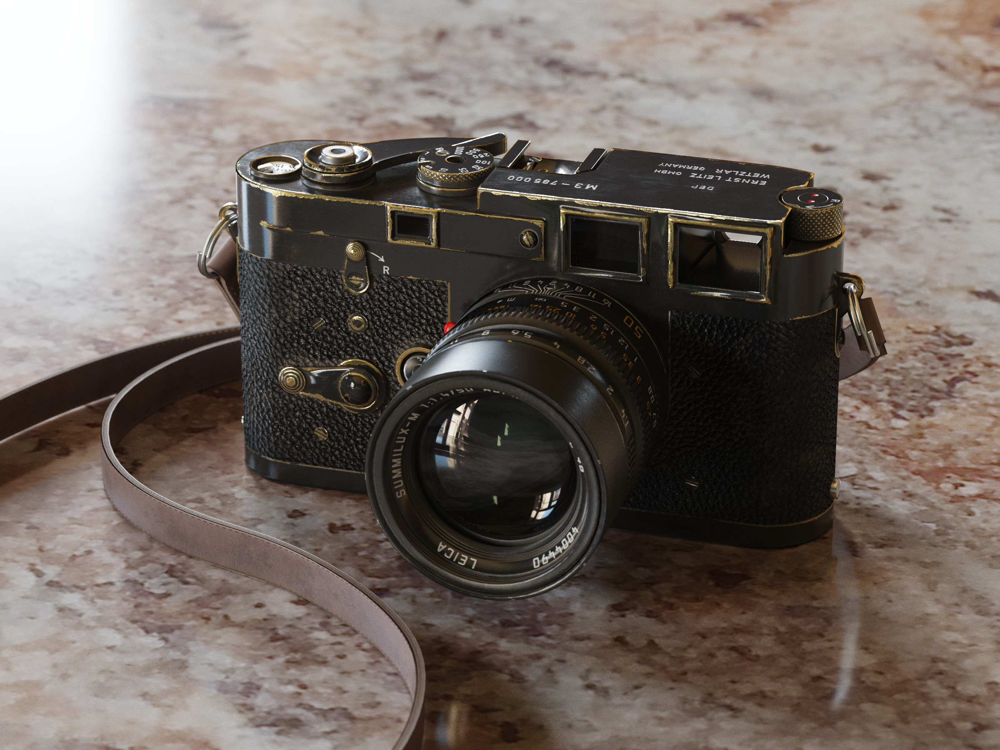
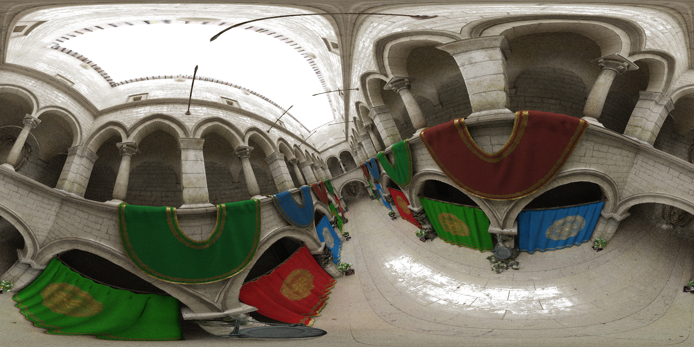
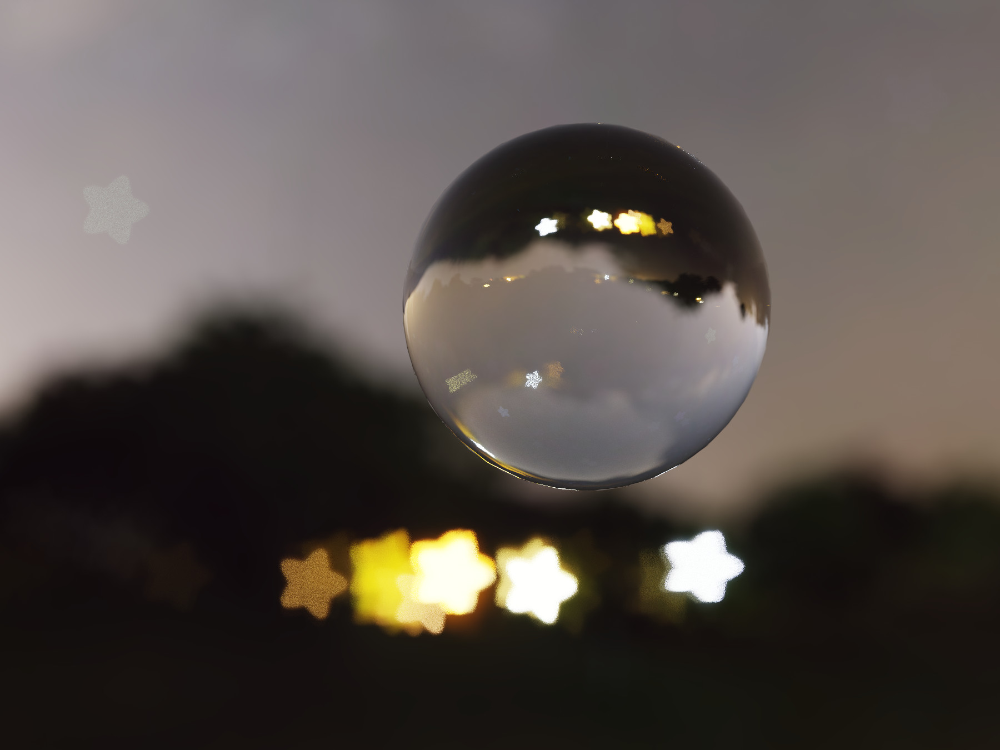
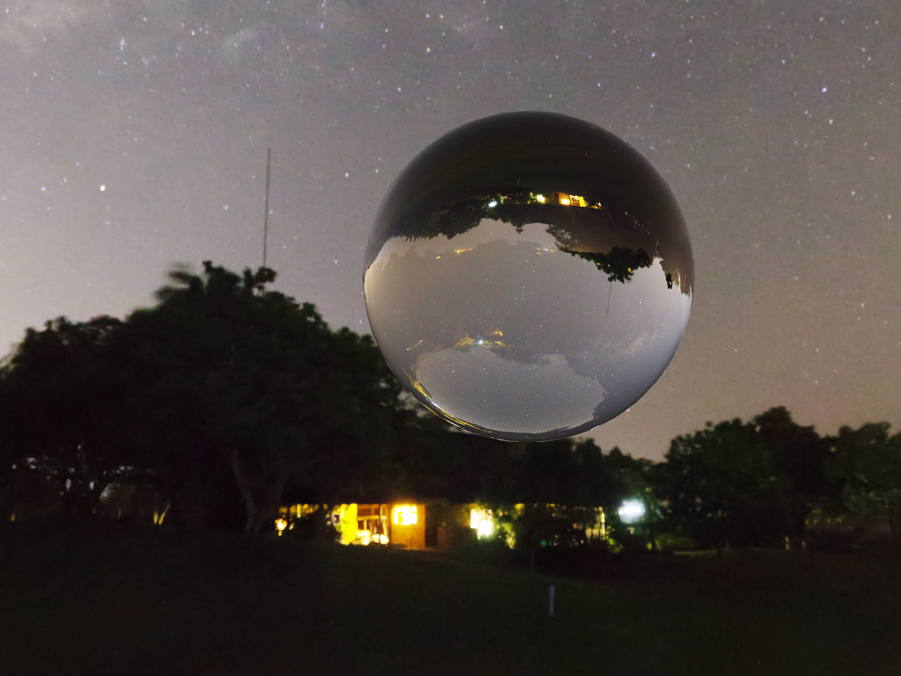
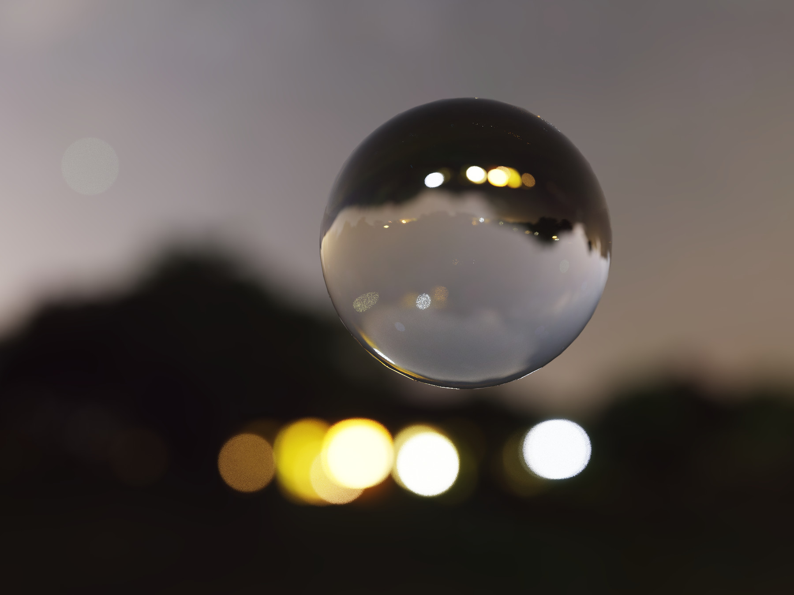
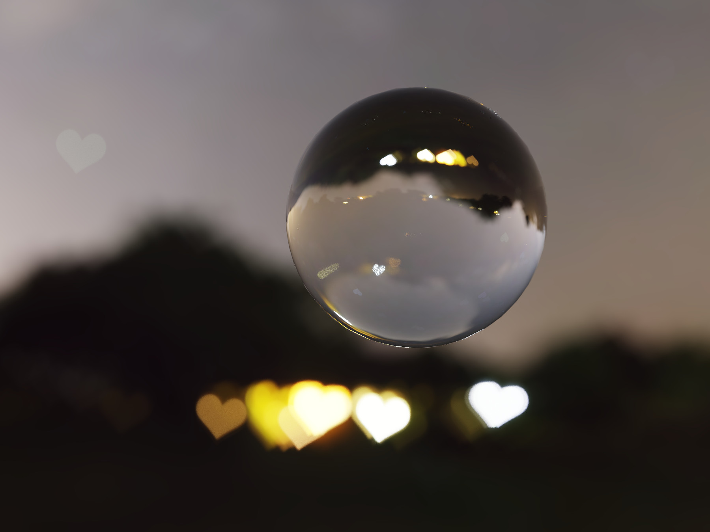
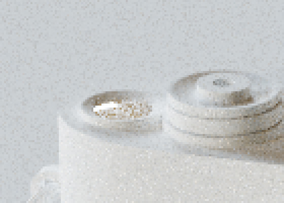
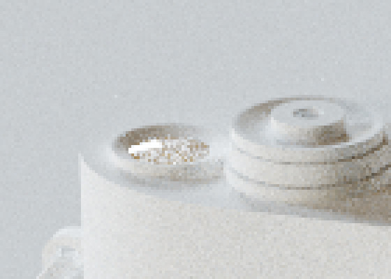
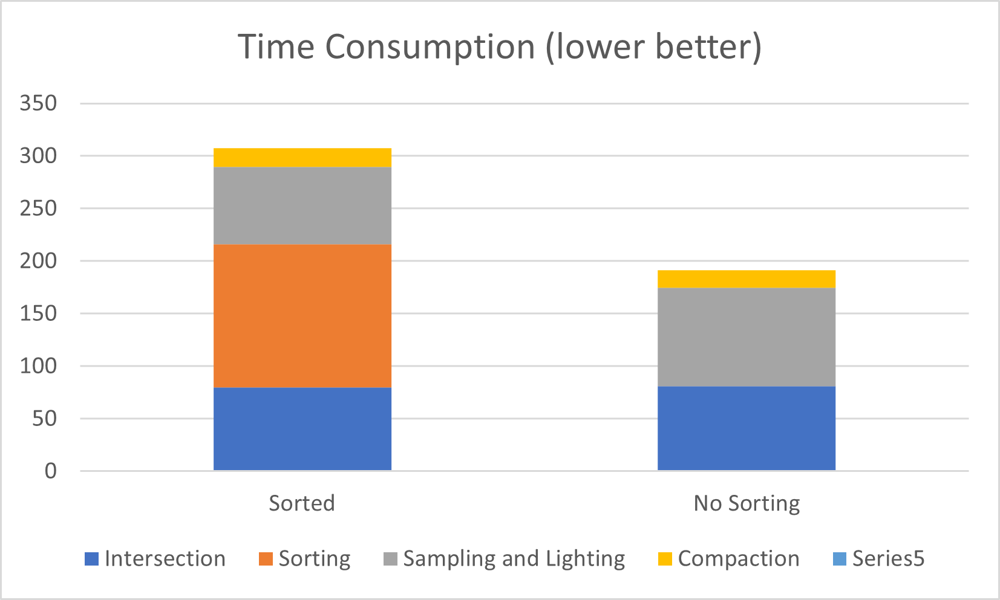

CUDA Path Tracer
================

**University of Pennsylvania, CIS 565: GPU Programming and Architecture, Project 3**

* Chang Liu
  * [LinkedIn](https://www.linkedin.com/in/chang-liu-0451a6208/)
  * [Personal website](https://hummawhite.github.io/)
* Tested on personal laptop:
  - i7-12700 @ 4.90GHz with 16GB RAM
  - RTX 3070 Ti Laptop 8GB

## Introduction

This is our third project of CIS 565 Fall 2022. In this project, we implemented a GPU-based path tracer with stream compaction

## Representative Outcome

A virtual camera is capturing another virtual camera

| Scene Specs             | [[./scenes/pbr_texture.txt]](./scenes/pbr_texture.txt) |
| ----------------------- | ------------------------------------------------------ |
| Resolution              | 2400 x 1800                                            |
| Samples Per Pixel       | 3000                                                   |
| Render Time             | < 7 minutes (> 7.5 frames per second)                  |
| Million Rays Per Second | > 32.4                                                 |
| Triangle Count          | 25637                                                  |

Twisted Sponza rendered with panorama camera

| Scene Specs             |             |
| ----------------------- | ----------- |
| Resolution              | 2400 x 1200 |
| Samples Per Pixel       | 8000        |
| Render Time             | 38 minutes  |
| Million Rays Per Second | 10          |
| Triangle Count          | 262193      |

Lens effect: star-shaped bokehs

## Features

### Visual

#### Direct Lighting with Multiple Importance Sampling

#### Importance Sampled HDR Environment Map (Skybox)

Tired of "virtual artificial" light sources? Let's introduce some real-world lighting.

#### Physically-Based Materials

##### Lambertian Diffuse

##### Metallic Workflow: Expressive and Artist-Friendly

#### Normal Map & PBR Texture

#### Physically-Based Camera: Depth of Field & Custom Bokeh Shape & Panorama

This is my favorite part of the project.

| No DOF                      | DOF                     |
| --------------------------- | ----------------------- |
|  |  |

This idea can even be extended by stochastically sampling a mask image instead of the whole disk area of the aperture:

	
	

| Star Mask                      | Heart Mask                    |
| ------------------------------ | ----------------------------- |
|  |  |

Which creates very interesting and amazing results.

#### Efficient Sampling: Sobol Quasi-Monte Carlo Sequence

In path tracing or any other Monte Carlo-based light transport algorithms, apart from improving

the performance from a point of view of programming, we can also improve it mathematically. Quasi-Monte Carlo sequence is a class of quasi-random sequence that is widely used in Monte Carlo simulation. This kind of sequence is mathematically proved to be more efficient than pseudorandom sequences (like what `thrust::default_random_engine` generates).

Theoretically, to maximize the benefit of Sobol sequence, we need to generate unique sequences for every pixel during each sampling iteration at real-time -- this is not trivial. Not to say that computing each number requires at most 32 bit loops. A better choice would be precomputing one pixel's sequence, then use some sort of perturbation to produce different sequences for different pixels.

Here is the result I get from testing the untextured [PBR texture scene](#representative-outcome). With the same number of samples per pixel, path tracing with Sobol sequence produces much less noise (lower variance).

| Pseudorandom Sequence        | Xor-Scrambled Sobol Sequence |
| ---------------------------- | ---------------------------- |
|  |  |

#### Post Processing

##### Gamma Correction

Implementing gamma correction is very trivial. But it is necessary if we want our final image to be correctly displayed on monitors, through which we see by our eyes.

##### Tone Mapping

### Performance

#### Fast Intersection: Stackless SAH-Based Bounding Volume Hierarchy

Ray-scene intersection is probably the best time consuming part of of ray tracing process. In a naive method we try to intersect every ray with every object in the scene, which is 

I did two levels of optimization.

##### Better Tree Structure: Surface Area Heuristic 

First, I implemented a SAH-based BVH. SAH, the Surface Area Heuristic, is a method to determine how to split a set of bounding volumes into subsets when constructing a BVH, that the constructed tree's structure would be highly optimal.

##### Faster Tree Traversal on GPU: Multiple-Threaded BVH

The second level of optimization is done on GPU. BVH is a tree after all, so we still have to traverse through it during ray-scene intersection even on GPU.

### Other

#### Single-Kernel Path Tracing

To figure out how much stream compaction can possibly improve a GPU path tracer's performance, we need a baseline to compare with. Instead of toggling streamed path tracer's kernel to disable stream compaction, we can separately write another kernel that does the entire ray tracing process. That is, we shoot rays, find intersection, shading surfaces and sampling new rays in one kernel.

#### First Ray Caching (G-Buffer)

In real-time rendering, a technique called deferred shading stores scene's geometry information in texture buffers (G-Buffer) at the beginning of render pass, so that . It turns out we can do something similar with offline rendering. 

## Performance Analysis

### Why My Multi-Kernel Streamed Path Tracer Not Always Faster Than Single-Kernel?

What got me surprised it wasn't that efficient as expected. In some scenes, it was even worse than the single kernel path tracer. 

In general, it's a tradeoff between thread concurrency and time spent accessing global memory.

There is a paper stressing this point, from which I also got the idea to additionally implement a single kernel tracer

- [*Progressive Light Transport Simulation on the GPU: Survey and Improvements*](https://cgg.mff.cuni.cz/~jaroslav/papers/2014-gpult/2014-gpult-paper.pdf)

### Material Sorting: Why Slower

After implementing material sorting, I found it actually slower. And not by a little bit, but very significantly. With NSight Compute, I got to inspect how much time each kernel takes before and after enabling material sorting.

Like what the figure below shows, sorting materials does improve memory coalescing for intersection, sampling and stream compaction (I grouped sampling and lighting together because I did direct lighting). However, the effect is not sufficient to tradeoff the additional time introduced with sorting at all. As we can see the test result below, sorting makes up more than 1/3 of ray tracing time.

Or, there is another possibility that BSDF sampling and evaluation is not that time consuming as expected. The bottleneck still lies in traversal of acceleration structure.

Therefore, in my opinion, material sorting is best applied when:

- There are many different materials in the scene
- Primitives sharing the same material are randomly distributed in many small clusters over the scene space. The clusters' sizes in solid angle are typically less than what a GPU warp can cover

### How Much GPU Improves Path Tracing Efficiency Compared to CPU

### Image Texture vs. Procedural Texture

