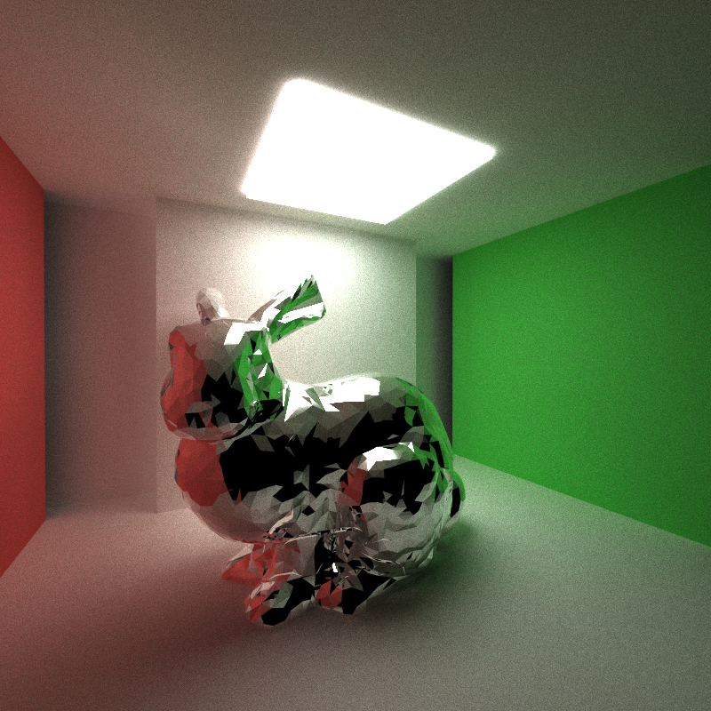

CUDA Path Tracer
================

**University of Pennsylvania, CIS 565: GPU Programming and Architecture, Project 3**

* Yilin Liu
  * [LinkedIn](https://www.linkedin.com/in/yilin-liu-9538ba1a5/)
  * [Personal website](https://www.yilin.games)
* Tested on personal laptop:
  - Windows 10, Intel(R) Core(TM), i7-10750H CPU @ 2.60GHz 2.59 GHz, RTX 2070 Max-Q 8GB

Features
=============
* Shading Kernel with BSDF Evaluation
* Uniform diffuse
* Perfect specular reflective (mirror)
* Specular refractive (Fresnel dielectric)
* Path Continuation/Termination with Stream Compaction
* Sorting of ray Paths by material type
* First bounce intersection cache to be used by subsequent iterations
* Anti-aliasing rays with sub-pixel samples
* Arbitrary OBJ Mesh Loading
* Camera depth of field

#### Problems of Performing BSDF in a big kernel 
CUDA can only launch a finite number of blocks at a time. Some threads end with only a few bounces while others may end with a lot. Therefore, we will waste a lot of threads. 

To solve this problem, we  launch a kernel that traces ONE bounce for every ray in the pool. According to the results, we remove terminated rays from the ray pool with stream compaction. 

Sort by Materials Type 
============
Using Radix Sort by material ID, we can batch rays according to material type. Therefore, we can further parallelize rays and perform intersection testing and shading evaluation in separate kernels. 

Anti-aliasing
===========
I jitter the direction of sample ray to reduce the aliasing effects

| With AA | No AA |
:-------:|:-------:
|||

Mesh Loading
===========
I used tinyOBJ to load obj file.

Refraction
===========

#### Sort by Materials Type 

*DO NOT* leave the README to the last minute! It is a crucial part of the
project, and we will not be able to grade you without a good README.

### Analysis

### Snapshots

### Bloopers

  ||
  |:--:| 
  | *Refraction fail* |