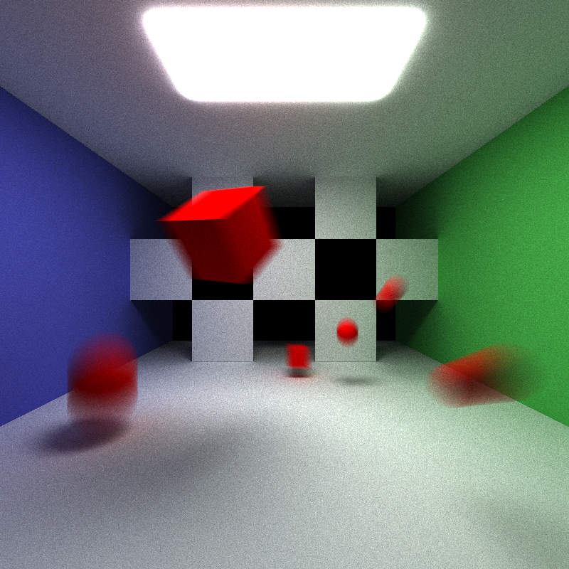

CUDA Path Tracer
================

(leading img here)

**University of Pennsylvania, CIS 565: GPU Programming and Architecture, Project 3**

* Evan S
* Tested on: Strix G15: Windows 10, Ryzen 7 4800H @ 2.9 GHz, GTX 3050 (Laptop)

## Overview
This program takes in a text file describing a scene(objects, locations, materials) and renders it with the canonical path tracing algorithm.     
This README contains many images. Click on them (on Github) to open the full size.

Features:
* [Different materials](#material-types)
	* Diffusive
	* [Reflective](#specular--imperfect-specular) (specular + imperfect specular)
	* [Refractive](#dielectric) (dielectric)
	* [Translucent](#translucent) (subsurface ray scattering)
* [Visual effects](#visual-effects)
	* [Motion blur](#motion-blur)
	* [Anti-aliasing](#antialiasing)
	* [Depth of field](#depth-of-field)
* [Toggle-able sampling options](#sampling-options)
	* [Stratified diffuse sampling](#stratified-diffuse-sampling)
* [Toggle-able performance enhancement options](#performance-enhancement-options)
	* [Stream compaction](#stream-compaction)1
	* [Sorting rays by intersected material type](#sorting-rays-by-intersected-material-type)1
	* [Caching first intersection](#caching-first-intersection)1

1 denotes a core feature of the assignment - see INSTRUCTIONS.md

## Feature Breakdown and Performance Analysis
The performance of the features in this section are measured with frames per second (FPS) of the overall render, so a higher FPS is better.

### Material Types
Material types can be specified in the scene text files.   
A material type is means a different BSDF, an inherent part of the ray tracing evaluation. Any CPU path tracer that tries to implement the same thing will be orders of magnitude slower.  
Adding approximations to respective material types could improve performance, at the cost of physical accuracy (e.g., Schlick approximation for Fresnel equations). The implementations of different material types here are all quite approximated already, and therefore don't have huge performance impacts.

#### Translucent
The material type TRANSLUCENT enables subsurface scattering of rays beneath the surface of the material, the degree of which is determined by SPECEX, IOR, ABSORPTION of the material in the scene file. IOR and SPECEX determine how rays are either reflected or refracted by the material, and absorption determines how easily light travels through the object (lower is easier). The parameter TRANSRGB determines the transmission color of the material, which colors the light ray depending on how far into the material it goes.   
Subsurface scattering is enabled by a very approximate interpretation of the BSSRDF, assuming that the internal geometry of the object is uniform and diffuses evenly. The implementation is inspired by [PBRT](https://github.com/mmp/pbrt-v3) and Disney BRDF. The polynomial fit for the "first moment" of the Fresnel reflectance function used to determine if a ray enters the material is pulled directly from the PBRT implementation.     
| Material | Diffuse | Translucent(ABSORPTION = 0.3) | Translucent(ABSORPTION = 0.03) | 
| :------- | :-------: | :-------: | :-------: |
| FPS | 49.7 | 47.5 | 47.4 |
| Scene |  |  |  |

Other scene parameters are SPECEX=30, IOR=1.45, TRANSRGB(.98 .5 .5). Notice how the otherwise skin-colored objects in the diffuse scene become brighter and redder(due to the TRANSRGB color) from the light transport underneath the surface, depending on their proximity to light, which is more pronounced as the absorption of the material goes down.

#### Dielectric
The material type DIELECTRIC specifies a material to both reflect and refract light according to its index of refraction(IOR). I used the [Schlick approximation](https://en.wikipedia.org/wiki/Schlick%27s_approximation), of the Fresnel equations since it achieves results at up to 32x speed for less than 1% average error (see Ray Tracing Gems II).    
The frames per second(FPS) - a rough benchmark of rendering speed - of this material is comparable to diffuse or specular. 
| Material | Diffuse | Specular | Dielectric(IOR = 1.52) | 
| :------- | :-------: | :-------: | :-------: |
| FPS | 51.8 | 52.6 | 52.1 |
| Scene |  |  |  |

Note the subtle reflection of the light on the dielectric spheres; that is the light reflection contribution.   

#### Specular / Imperfect Specular
The material type SPECULAR specifies a material to reflect light; the degree of this is determined by the specular exponent(SPECEX). The higher the SPECEX, the more reflective.

| Material | Diffuse | SPECEX = 80 | SPECEX = 5000 | 
| :------- | :-------: | :-------: | :-------: |
| FPS | 51.8 | 52.6 | 52.6 |
| Scene |  |  |  |

Note the way the reflections look muddled, like a dirty mirror as a consequence of the lower SPECEX.

### Visual Effects

The following visual effects are achieved in-code by manipulating either the inital raycasts or intersection calculations. As these are parallelized, per-pixel, they benefits from being a GPU operation. They generally have very little performance impact, though some have more.   
Nonetheless, performance could be improved at the cost of less true-to-life DOF behavior(e.g., instead of jittering rays on a circular disk to mimic a lens, which requires concentric mapping from square to circle, one could just use the square). 

#### Motion Blur
Motion blur, the effect of an object smudged across the image, is implemented by randomly giving each casted ray a particular "time" at which it is sent out. The time is multiplied by a VELOCITY given per-object in the scene file to shift the object's position in time. 

| Effect | None | Motion blurred |
| :------- | :-------: | :-------: |
| FPS | 49.7 | 31.3 |
| Scene |  |  |

Note the nontrivial performance impact here as a result of needing to modify the inputs to the intersection tests, which happen per iteration at every depth(above benchmark computed with depth 8). The other visual effects (below) are performed in ray generation, which happens just once per iteration.

#### Antialiasing
Antialiasing (AA) is the process of removing artifacts (alias) that occur when representing an image on a pixelated screen. A smooth line, if crossing vertically or horizontally across a pixel, creates a stair-like artifact called "jaggies".      
AA is implemented by altering the direction of casted rays in a normally distributed(standard deviation of 0.5 pixel length) manner. The result is that a pixel color is determined by the average colors of its surrounding pixels. This is nondeterministic, so it is incompatible with caching first intersection.

AA is disabled if ANTIALIAS(in the scene file camera) equals 0; otherwise it is enabled. 

| Effect | None | Anti-aliased |
| :------- | :-------: | :-------: |
| FPS | 53.0 | 52.8 |
| Scene |  |  |
| Zoom |  |  |

The zoom demonstrates how jaggies in the aliased image is smoothed out after anti-aliasing.

#### Depth of Field
Depth of field (DOF) is the distance between the closest and furthest things that look clear in an image. The focal distance specifies the distance at which the image should be the most clear. Wider camera lens means pictures come out with lower DOF; things at the focal distance plane get clearer, but everything else becomes blurrier. This is implemented by spreading ray origins about a disk and directions toward a specific distance, mimicking a lens and its ability to focus light. 

FOCAL_DIST and LENS_RAD are specified as part of the camera values in the scene file. DOF is disabled if either value is less than or equal to 0.

| Effect | None | DOF(LENS_RAD = 0.2) | DOF(LENS_RAD = 1) | 
| :------- | :-------: | :-------: | :-------: |
| FPS | 48.7 | 47.4 | 47.1 |
| Scene |  |  |  |

The scene dielectrics have IOR = 2.42 (diamond). The FOCAL_DIST is kept constant, at 12.5. Note how as LENS_RAD = 0.2 increases, the clarity decreases on everything not on the plane defined by the focal distance.      

### Sampling Options
Sampling options are performed as a core part of the ray tracing evaluation, so it benefits greatly from the GPU. 

#### Stratified diffuse sampling
The diffusive material type is implemented with a simple BSDF that returns a ray, cosine-weighted on the hemisphere of the normal. By default, the inputs to that mapping come uniformly from [0, 1). If unlucky, clumping of samples and empty regions could mean that many iterations are needed to get a satisfying result. Stratified/jittered sampling breaks down the intervals into equal sections; returned rays correspond to jittering within a section. In essence, the returned rays are "smoothed" to be more uniform.

| Sampling | Default(500 iterations) | Stratified(500 iterations) | 
| :------- | :-------: | :-------: |
| FPS | 51.3 | 44.4 |
| Scene |  |  |
  

The images above are rendered by stratifying the interval into a 64x64 section. The intended final scene can be seen to the left here.

The clearest point of difference is how the stratified image manages to convey the darkened upper left corner(recommend to click on each image and rapidly switch back and forth).      
Nonetheless, stratified sampling uses expensive operations like modulo, so there is a nontrivial FPS impact. Whether the decrease in FPS is worth the faster convergence is likely on a scene-by-scene basis (e.g., scenes with thin pockets of color that random sampling fails to pick up on).

 

### Performance Enhancement Options

A basic Cornell box scene, used for benchmarks. Note that benchmarks are performed in isolation.

 

#### Stream compaction
Stream compaction/partitioning of terminated paths allows warps to go offline early, which is good for memory coalescence. The below graph gives the average FPS (a benchmark of the speed of the path tracing) of path tracing with and without stream compaction as depth of the tracing goes up on the (above) basic Cornell box scene.   
    
The chart indicates that while tracing depth is low, the overhead of partitioning the rays presents a huge slowdown. However, when depth is higher (when it is expected that rays have to bounce numerous times before terminating), the ability to free up threads operating on terminated rays from stream compaction becomes worthwhile. 

#### Sorting rays by intersected material type
Sorting rays by the material type they intersect with means that the code path of contiguous threads (warps) will be grouped together when calculating the BSDF, ensuring parallelization and therefore performance improvement. The average FPS of this sorting on the basic Cornell box scene as well as a modified box scene with 8 spheres, some diffusive and some specular, is noted in the table below: 
| (FPS) | Sorting | No Sorting |
| :------- | :-------: | :-------: |
| Basic scene | 9.1 | 75.3 |
| More materials | 9 | 70.4 |

Clearly sorting causes enormous slowdown on these simple scenes. The greater dip in the object heavy scene when sorting(compared to the basic) implies that the two different materal types causes some serialization in the program, where thread paths have to go down either the diffusive or specular BSDF. Still, sorting only seems like a worthwhile thing to enable if there is a huge variety of materials/code paths. 

#### Caching first intersection
The first intersection of rays is static, as it is initiated by the static ray casts per-pixel of the render. Caching the first intersection for use across subsequent iterations is expected to boost performance overall at a slight memory cost. The table below compares the FPS for the [stratified diffusive sampling scene](#stratified-diffuse-sampling):
| (FPS) | Caching | No caching |
| :------- | :-------: | :-------: |
| Stratified scene | 59.1 | 51.2 |   

As expected, caching the first intersection provides a general speedup, with better returns for more complicated scenes (provided there is a need to bounce more than once).

## References
[Physically Based Rendering (PBRT)](https://pbr-book.org/)     
[Disney BRDF](https://media.disneyanimation.com/uploads/production/publication_asset/48/asset/s2012_pbs_disney_brdf_notes_v3.pdf)     
[Extending Disney's BRDF to a BSDF](https://blog.selfshadow.com/publications/s2015-shading-course/burley/s2015_pbs_disney_bsdf_notes.pdf)     
[Ray Tracing Gems II](http://www.realtimerendering.com/raytracinggems/rtg2/)     
[Ray Tracing in One Weekend](https://raytracing.github.io/)      
[Fresnel Equations, Schlick Approximation, Metals, and Dielectrics](http://psgraphics.blogspot.com/2020/03/fresnel-equations-schlick-approximation.html)      
[GPU Gems III](https://developer.nvidia.com/gpugems/gpugems3/part-iii-rendering/chapter-20-gpu-based-importance-sampling)     