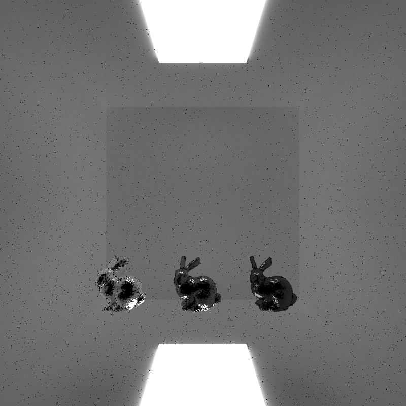
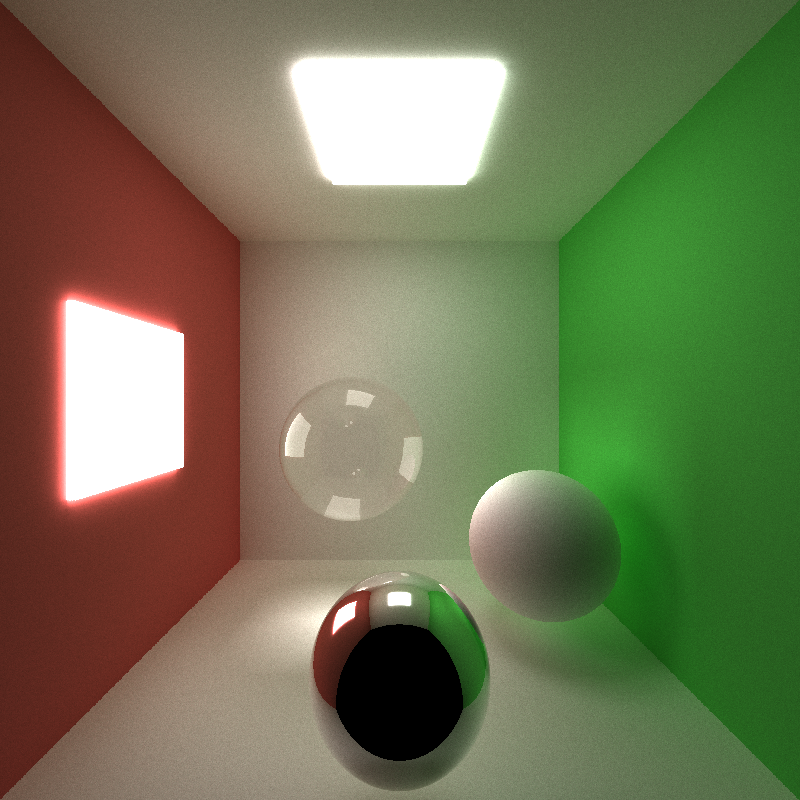

CUDA Path Tracer
================

**University of Pennsylvania, CIS 565: GPU Programming and Architecture, Project 3**

* Shixuan Fang  
  - [LinkedIn](https://www.linkedin.com/in/shixuan-fang-4aba78222/)
* Tested on: Windows 11, i7-12700kf, RTX3080Ti (Personal)

<p align="center">
  
</p>

## Project Overview

In this project, I implemented a CUDA-based path tracer, which is very different from CPU path tracer. Pathtracing in CPU is used to be recursive, but since CUDA doesn't support recursion(or very slow on new GPUs), this path tracer uses a iterative way.
<p align="center">
  
</p>

Also, traditional CPU pathtracing is down pixel by pixel, but as the figure shows, doing the same algorithm(parallel by pixel) on GPU will cause different threads finish in different time and therefore cause many divergence. The solution, then, is to parallel by rays. We launch a kernel that traces **one** bounce for every ray from a ray pool, update the result, and then terminate rays with stream compaction


## Core Features

### 1. Basic shading

There are three basic shadings implemented --- pure diffuse, pure reflection, and both reflection and refraction. Diffuse is done by generating a new direction randomly across the hemisphere, reflection is done by reflecting the incident ray direction by the surface normal, and refraction is done by using Schlick's approximation to create Fresnel effect.
<p align="center">
  
</p>

### 2. Acceleration

- Stream Compaction

<p align="center">
  
</p>

The first acceleration is to remove unnecessary rays that are terminated(remaining bounce = 0) by using Stream Compaction. In this project I used ```thrust::stable_partition``` to compact. As seen in the chart, stream compaction will give noticeable performance improvement, especially with higher object number. This is because there will be many rays shooting outside the scene and then be terminated.

- Sort rays by material type

<p align="center">
  
</p>

The second acceleration is to sort all rays by their material types, which can result in good memory access pattern for CUDA. In this project I used ```thrust::sort_by_key``` to sort. However, the result isn't as I expect, as sorting the material actually slow down the performance. I assume that sorting materials takes much longer than performance gain through memory coalescing.


- Cache the first bounce for re-use

<p align="center">
  
  
</p>

The third acceleration is to cache the first bounce intersection data, therefore all other iterations can use the same data and save some performance. As seen in the graph, with different max ray depth there is always approximately 4 second performance inprovement.

### 3. Microfacet shading model

Microfacet shading model is a very popular pbr model, which works by statistically modeling the scattering of light from a large collection of microfacets. This model is based on Cook-Torrance Reflection Model, which is showed as the following equation.
<p align="center">
  
</p>

In this equation, D represents the distribution of all microfacets' normal distribution, G is the geometry term which discribes the shadowing and masking effects of the surface, and F is the Fresnel term which describes how many light are reflected. There are many ways to describe these three terms, and in this project I choose GGX approximation for normal distribution function, Smith's shadowing and masking term as approximation for G function, and Schlick's approximation for F function. In these functions, there are **2** important factors, **Metalness** and **Roughness**. The following two figures demonstrate how these two factors affect the result. In the left, all three bunnys have the same roughness but different metalness, and from right to left the bunny looks more like metal. In the right, all three bunnys have same metalness but different roughness, and from left to right the bunny reflects less light and therefore looks darker.

<p align="center">
  
   
</p>

However, in this model the energy is not conservative, which is because this model doesn't consider multiple bounces, shown in the following figure(from [Kulla](https://blog.selfshadow.com/publications/s2017-shading-course/))

<p align="center">
  
</p>

This can be solved using Kulla-Conty Approximation, but since it's a little complicated and needs pre-computation, I didn't implemented in this project.

### 4. Mesh loading with tinyObj

In order to test my microfacet shading model, I need to add more complex meshes and decided to use tinyObj to load ```OBJ``` format meshes.  In order to speed up ray-mesh intersetion, I created a toggleable AABB bounding box for intersection culling.

<p align="center">
  
</p>

As seen in the chart, with AABB mesh culling there is some performance improvement, but it's not that huge as I expect. I think it's because the bounding box is very small anyway, so there isn't too much improvement. 

### 5. Stochastic Sampled Antialiasing

According to [Stochastic Sampling](https://web.cs.wpi.edu/~matt/courses/cs563/talks/antialiasing/stochas.html), in stochastic sampling, every point has a finite probability of being hit. Stochastic sampling is extremely powerful as the visual system is much more sensitive to aliases than noise. The one that I choose to implement is Jittered, which is done by perturbing the position that camera shoot rays.

**Left: no antialiasing**                  
**right: with antialiasing**


<p align="center">
  
   
</p>

### 6. Physically-based Depth-of-field

In regular pathtracing, we assume that the camera is an ideal pinhole camera, which is not physically possible. In order to create a physically-based camera, a classic way is the **thin lens approximation**. The algorithm I choose to implement is adapted from [PBRT[6.2.3]](https://www.pbr-book.org/3ed-2018/Camera_Models/Projective_Camera_Models), and the idea is quite simple. We set another 2 parameters for the camera, which are **lensRadius** and **focalDistance**. We sample on a concentric disk based on the lensRadius, and then jitter the camera ray based on that sample position and focalDistance. This simple algorithem can actually create very beautiful results.

<p align="center">
  
   
   
</p>

### 7. Direct Lighting

This is done by taking the final ray(remaining bounce = 1) to a random point on an emissive object.
It's a little hard to tell the difference, but the left one has no direct lighting and the right one has direct lighting.
The right one is slightly brighter that the left one, and it also converges faster

<p align="center">
  
   
</p>

## References

- https://www.pbr-book.org/3ed-2018/Reflection_Models/Microfacet_Models
- https://blog.selfshadow.com/publications/s2017-shading-course/
- https://www.pbr-book.org/3ed-2018/Camera_Models/Environment_Camera
- https://web.cs.wpi.edu/~matt/courses/cs563/talks/antialiasing/stochas.html
