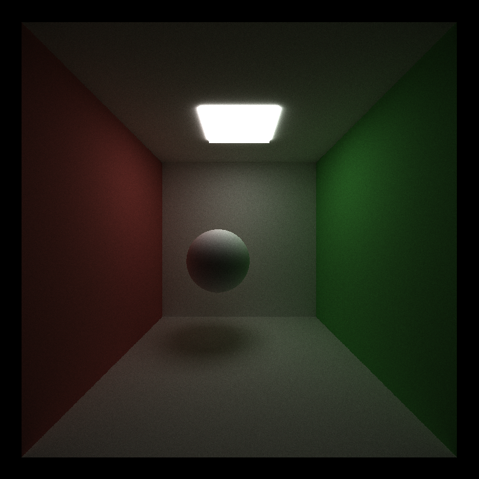

CUDA Path Tracer
================

**University of Pennsylvania, CIS 565: GPU Programming and Architecture, Project 3**

* Megan Reddy
  * [LinkedIn](https://www.linkedin.com/in/meganr25a949125/), [personal website](https://meganr28.github.io/)
* Tested on: Windows 10, AMD Ryzen 9 5900HS with Radeon Graphics @ 3301 MHz 16GB, NVIDIA GeForce RTX 3060 Laptop GPU 6GB (Personal Computer)
* Compute Capability: 8.6

### Overview

**Path tracing** is a an algorithm for synthesizing images by simulating the physical properties of light. Some
common effects that you can obtain for free in a path tracer include global illumination, caustics, and depth-of-field.
This path tracer is implemented for the GPU, meaning that it parallelizes several steps that would run serially on the CPU. 
This includes computing ray intersections for each pixel, shading, and writing to the output image.

  

<em>Stanford Dragon, 5000 iterations</em>

#### Features Implemented

- Core Features
    * Shading kernel for ideal diffuse, perfectly specular, and imperfectly specular surfaces
    * Path continuation/termination with stream compaction
    * Material sorting
    * Caching first bounce intersections
- Extra Features
    * Performance
      * Linear Bounding Volume Hierarchy (LBVH)
      * Bounding Volume Hierarchy (with Midpoint and SAH split methods)
      * Russian roulette ray termination
    * Visual
      * Refraction (with Fresnel)
      * Depth-of-field
      * Stochastic sampled anti-aliasing
      * Arbitrary mesh loading (with bounding box culling)
      * Reinhard operator and gamma correction (conversion to sRGB)

### Usage

Explanation of macros/how to enable different features

#### Core Features

Perfect Diffuse

Perfect Specular

Imperfect Specular

(Add here)

#### Extra Features

##### Refraction (With Fresnel)

##### Depth-of-field

Lens Radius: 2.4 \
Focal Distance: 29.5

##### Anti-Aliasing

Without Anti-Aliasing

With Anti-Aliasing

##### Mesh Loading

Refractive Stanford Bunny, 5000 iterations

#### Performance Analysis

  

<em>Stanford Dragon Traversal Heatmap (Yellow = More)</em>

- Comparisons between:
  * Iterating through all triangles
  * Bounding box culling
  * LBVH
  * BVH with Midpoint split
  * BVH with SAH split
- Discussion of debugging tree structures
- Material sorting vs. no material sorting
- Stream compaction vs. no stream compaction
- Caching vs. no caching first bounce intersections

#### Bloopers

Broken AABB intersection test

Flat normals

#### References

