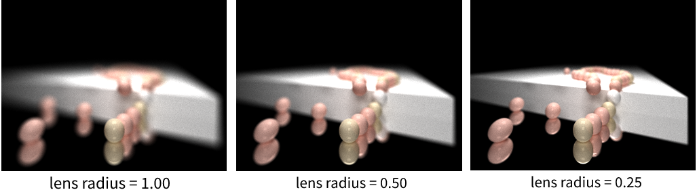
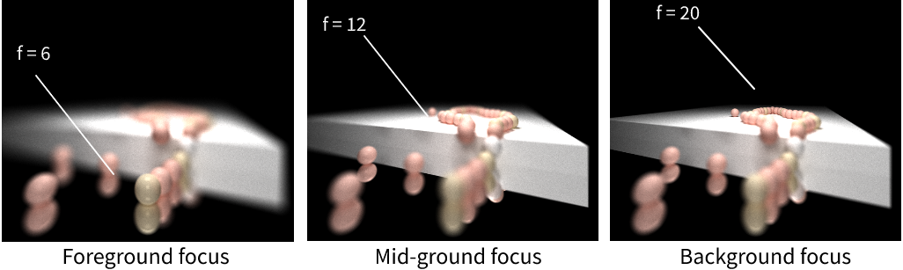
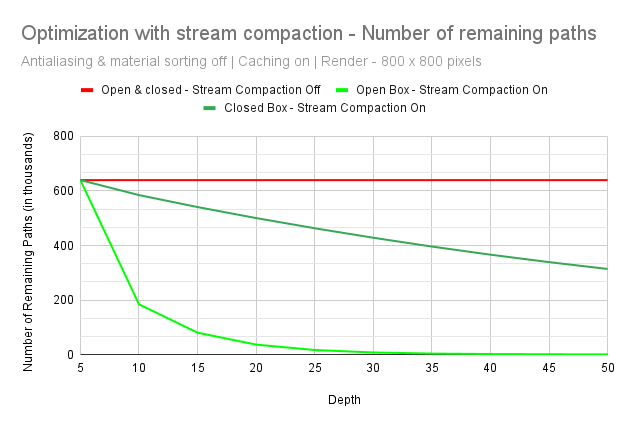

CUDA Path Tracer
================

**University of Pennsylvania, CIS 565: GPU Programming and Architecture, Project 2**

* RHUTA JOSHI
  * [LinkedIn](https://www.linkedin.com/in/rcj9719/)
  * [Website](https://sites.google.com/view/rhuta-joshi)

* Tested on: Windows 10 - 21H2, i7-12700 CPU @ 2.10 GHz, NVIDIA T1000 4096 MB
* GPU Compatibility: 7.5

## Introduction

Ray-tracing is a computer graphics technique to generate 3-dimensional scenes in which we calculate the exact path of reflection or refraction of each ray and trace them all the way back to one or more light sources. Path tracing is a specific form of ray tracing that simulates the way light scatters off surfaces and through media, by generating multiple rays for each pixel(sampling) and bouncing off those rays based on material properties.

Since we cast many rays per pixel in order to get enough light information, we can get effects like caustics, soft shadows, anti-aliasing, and depth of field. Since this technique involves computing a large number of rays independently, it can be highly parallelized to converge images incredibly faster on a GPU as compared to a path tracer implementation on CPU. In this project, I have used CUDA to compute intersections and shading per iteration for multiple rays parallelly.

## Features

|Implemented features|
|---|
||

Some of the visual improvements implemented include:
- [Specular refraction and reflection](#specular-refraction-and-reflection)
- [Physically based depth of field](#physically-based-depth-of-field)
- [Stochastic sampled antialiasing](#stochastic-sampled-antialiasing)
- [Procedural shapes and textures](#procedural-shapes-and-textures)
- [Aritrary obj mesh loading](#aritrary-obj-mesh-loading)

Some performance improvements implemented include:
- [First bounce cached intersections](#first-bounce-cached-intersections)
- [Path continuation/termination using stream compaction](#path-continuationtermination-using-stream-compaction)
- [Sorting rays by material](#sorting-rays-by-material)

## Visual Improvements

### Specular refraction and reflection

Perfectly smooth surfaces exhibit specular reflection and transmission of incident light. The outgoing direction for reflecting surfaces is the incident direction reflected against the surface normal. For transmissive materials, it is determined by the refractive index of incoming and outgoing medium of the light. [Schlick Approximation](https://en.wikipedia.org/wiki/Schlick%27s_approximation) gives us a formula for approximating the contribution of the Fresnel factor in the specular reflection of light from a non-conducting interface (surface) between two media.

Since the operations for this approximation are primitive arithmetic operations without multiple conditions, it can be easily parallellizeed on the GPU. A CPU implementation can be significantly less efficient in comparison.

The following image obtained from the path tracer shows a fully specular transmissive material, specular reflective material and a lambertian diffused material.
|Left to Right - Transmissive (ROI=1.5), Mirror-like, Diffused|
|---|
|  |

The following render has a cube placed inside spheres of varying refractive index. Note how the size distortion of the refracted sphere varies
|Schlick's approximation for varying index of refraction|
|---|
||

### Physically based depth of field

Depth of field (DOF) gives a sense of how near or far an object is by adjusting two parameters- focal length, and aperture (2 x lens radius of camera). Focal length determines how far objects must be from the camera to be in focus; this number should always be positive. Aperture size will determine how blurry objects that are out of focus will appear.

Generally, renders without this effect are generated by a pin-point camera (It has a lens radius of 0). This limits origin of the rays generated from the camera. If we set an aperture for the camera, rays can originate from anywhere within its aperature area. So, to implement depth of field, the ray origin is obtained by sampling a point within a circle of lens radius around the camera position.
The following renders of a string of pearls show depth of field as cameras with different lens radius generate varying depth of field.
|As lens radius increases, the blur/jitter on non-focused objects increases|
|---|
|  |

The focal distance sets how far the rays go. To get the focal point, we can just multiply ray.direction by focal length of the camera. We can set the focal length of our camera to focus on foreground, mid-ground or background. The render comparisons are as follows.
|Lesser focal length focuses on objects closer to camera and blurs the rest|
|---|
||

### Stochastic sampled antialiasing

To implement antialasing by this method in every iteration for each pixel of the path-tracer, a small random offset or jitter less than the pixel's dimensions is added, effectively inserting noise to each created ray which smooths (and slightly blurs) the image.
|Observe aliasing along the surface of the sphere in the left image|
|---|
||

Anti-aliasing can slightly decrease the performance of our path tracer, a detailed analysis for which is presented [below](#first-bounce-cached-intersections).

### Procedural shapes and textures

Implicit surfaces are the set of all solutions to some function F(x, y, z) = 0, where x or y or z are unsolved. To generate implicit surfaces instead of tracing a ray and calculating intersection, we march along the ray. Given a ray and an implicit surface function F(x, y, z), test points along the ray to see if they solve F = 0.

|Using SDF operations by [Inigo Quilez](https://iquilezles.org/articles/distfunctions/) and noise functions|
|---|
||

An SDF is a function that takes a point and returns a distance to a shape’s surface. SDF evaluates to 0 on the surface, > 0 outside, and < 0 inside. An SDF must always be linear.
Since we know the distance to any SDF in the scene, we know that if the ray marches the distance of the closest SDF, it will never overshoot anything.
Therefore we can take big, variable steps instead of small uniform ones.

In terms of performance, ray marching is generally more efficient for standard primitive structures or analytic intersection. As in the above render example, boolean operations on simple primitive sdfs can be used to generate objects. If these were loaded as meshes, it is possible that it will consist of many triangles resulting in a large number of intersection calculations. More on this [linked here](https://graphicscodex.courses.nvidia.com/app.html?page=_rn_rayMrch).

### Aritrary obj mesh loading

OBJ meshes are triangulated and all triangles are stores in contiguous memory locations. The mesh is rendered by performing intersection test against each of the triangles. To make this more efficient, we store a bounding box around the mesh by calculating the minimum and maximum coordinates in 3 dimensions.  

|OBJ mesh loading with bounding box intersection culling|
|---|
||
 
The bounding box method eliminates many unnecessary checks but much more precise optimizations could be made on this feature. Especially with hierarchical data structures such as kd-Tree, octTree or BVH implementation.
 
## Performance Optimizations

All performance analysis has been performed using the following cornell box with a single material.

### First bounce cached intersections

Since the target pixel coordinates don't change with each iteration, the camera shoots the same rays into the scene and hits the same geometry every time, before using random sampling to scatter into different parts of the scene. Thus, the rays' intersections from the first bounce can be stored to improve performance, since they won't be repeatedly calculated with each iteration.
As you can see in the graph below, while caching the intersection can take some time initially, in most cases following the initial caching time is less as compared to implementation without caching.

|Tested on basic cornell box with 1 diffused sphere in the center|
|---|
||

For the above observations, anti-aliasing was turned off. Anti-aliasing is an expensive operation as you can see from the following chart, especially as the number of iterations increases.
Note, it becomes even more expensive if implemented along with intersection caching.

|Anti-aliasing tested with intersection caching|
|---|
||

### Path continuation/termination using stream compaction

In an open cornell box used above, stream compaction greatly improves performance. We can see how stream compaction efficiently removes the rays that are terminated which extremely reduces the time taken per bounce. Since the number of rays getting terminated per depth would be very large in case of an open cornell box, we also need to observe if it improves performance in a closed cornell box. The following graph shows the number of remaining paths per bounce when stream compaction is off against observations when it is turned on for a open box as well as an closed cornell box. Number of paths in case of both open and closed box remains constant when stream compaction is off.

| Number of paths remaining versus depth (1 iteration cycle)|
|---|
||

While the number of remaining rays decreases in case of both open and closed box, the following graph shows us that stream compaction may be very efficient for an open cornell box because many rays get terminated per iteration when they do not hit anything. In case of closed cornell box however, even though time taken is decreasing per bounce, the cost of computation for stream compaction increases the overall time taken. 

| Time-taken by GPU versus depth (1 iteration cycle)|
|---|
||

### Sorting rays by material

Each material in the scene has a unique ID that scene intersections reference whenever they collide with a material. Continguous intersections in memory can have different materials between them, thus leading to random memory access in the materials' global memory bank. To improve memory access, intersections who share the same material can be sorted based on material ID, so intersections with the same materials are coalesced in memory.
