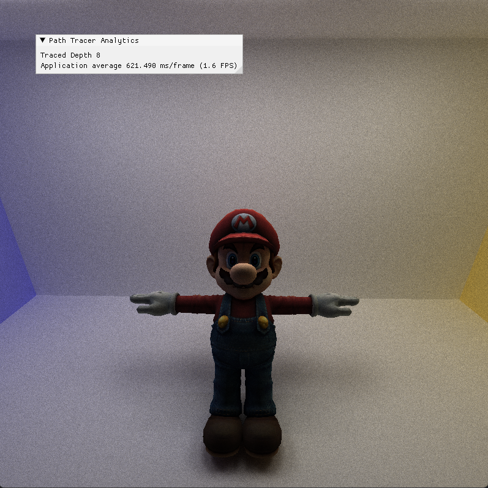

CUDA Path Tracer
================

**University of Pennsylvania, CIS 565: GPU Programming and Architecture, Project 3**

* Di Lu
  * [LinkedIn](https://www.linkedin.com/in/di-lu-0503251a2/)
  * [personal website](https://www.dluisnothere.com/)
* Tested on: Windows 11, i7-12700H @ 2.30GHz 32GB, NVIDIA GeForce RTX 3050 Ti

## Introduction

In 3D rendering, Pathtracing is a technique that generates realistic looking scenes/images by simulating light ray bounces. For this project, I implemented a CUDA path tracer for the GPU. In order to get the least noisy final output, 5000 calls to pathtrace are made whenever the camera is moved. The result of all pathtrace calls are then averaged to produce the final output. For this pathtracer, we parallelize operations by Rays (AKA Path Segments), and made sure to sync all threads before moving on to the next parallel operation.

Overall, this project is a continuation of learning how to write CUDA kernel functions, optimize performance by adding memory coalescence, and very simple acceleration structures. The second part of the project introduced me to using TinyObjLoader, CudaTextureObjects, and various rendering techniques to get specific types of images:

1. Core Features: 
*  Simple Diffuse, Specular, and Imperfect Specular BSDF shading
*  Path continuation/termination using stream compaction
*  Continugous arrangement of materials based on materialId
*  First-bounce-cache for a specific camera angle.

3. Additional Features
*  Refractive materials
*  Depth of Field
*  Direct Lighting
*  Stochastic-sampled antialiasing
*  Arbitrary Mesh Loader with TinyObjLoader
*  UV Texturing, Procedural Texturing, and Bump Mapping

## Scene File Description

The scene files used in this project are laid out as blocks of text in this order: Materials, Textures (if any), and Objects in the scene. Each Object has a description of its translation, scale, and rotation, as well as which material it's using, and if it's a basic shape (such as sphere or cube), then that is also specified. If not a basic shape, then it specifies a path to its obj. If the Object also has a texture, then it will refer to the Id of the texture. Using Ids to keep track of scene attributes prevent over-copying of shared data between Objects.

## Core Features
1. Shading kernel with BSDF Evaluation for Diffuse and Perfect/Imperfect Specular.

Each Object in the scene has a reference to its material. Each material has attributes representing Reflection, Refraction, Specular, Index of Refraction, Color, and Emittance. For each ray, once it has gotten information about the object it has hit, I use a random number generate to generate a float between 0 and 1. Using this number, each ray will behave in a probabilistic manner and will either reflect, refract, or completely diffuse randomly in a cosine-weighted hemisphere (for lambertian reflection) based on the Reflection and Refraction material values in the scene file. 

3. Path continuation/termination using Stream Compaction

In order to avoid processing any unnecessary information, all paths which do not hit any of the Objects in the scene are removed from the list of active paths. This is done through the thrust library's built in stream-compaction function. Stream Compaction takes an array, runs a predicate on each element, and returns another list containing all the elements for which the predicate is true. 

5. Contiguous arrangement of materials based on materialId

For scenes which have a lot of different materials, sorting materials based on materialId makes sense to make reading from global memory faster.

7. First bounce caching

## Additional Features
### Refractive Material

### Depth of Field

### Stochastic Sampled Anti-Aliasing

### Direct Lighting

### Arbitrary Mesh Loading with TinyObjLoader

### UV Texture, Procedural Texture and Bump Mapping

## Performance Analysis

## Bloopers! :)

Too much antialiasing: me without my contacts

