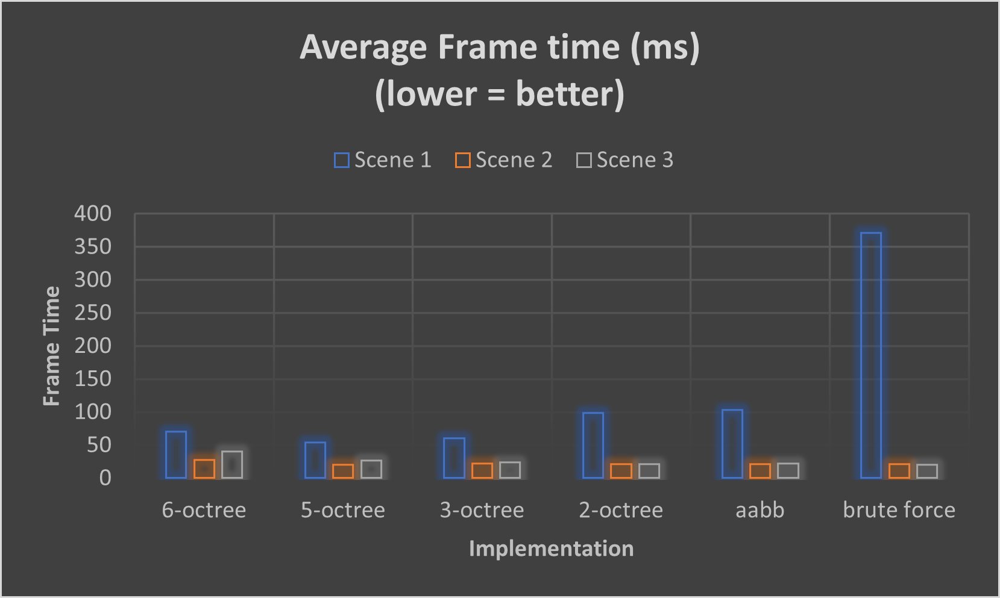

## 
 University of Pennsylvania, CIS 565: GPU Programming and Architecture 

# 
 CUDA Path Tracer 

- Name: Tongwei Dai
	- [LinkedIn Page](https://www.linkedin.com/in/tongwei-dai-583350177/)
- Tested on: Windows 10, i7-8700 @ 3.20 GHz 16GB, RTX 2070

## Overview

- This is a basic path tracer written in C++ using the CUDA framework.
- Path tracing is a rendering method that simulates how the light scatters in the real world. Due to its physically accurate nature, many complex illumination phonomena come for free in path tracing.
- In path tracing, different physical materials are modeled with BSDF (Bidirectional Scattering Distribution Function). Each material would have such a function that describes how the light will bounce or transmit on its surface based on the directions of incoming and outgoing lights. 
	- In this project, I implemented some rudimentary BSDFs for ideal diffuse, reflective, refractive surfaces. I also attempted to simulate rough surfaces with microfacet models.
- Although a simple and powerful algorithm, path tracing can be quite costly as it simulates thousands if not millions of rays bouncing around in a 3D space. Spatial data structures are often used to quickly perform ray-object intersection tests.
	- In this project, I implemented an octree to avoid unnecessary computation in sparse areas of the scene.

## Table of Contents
- [Feature Overview](#features)
- [Implementation Toggles](#implementation-toggles)
- [Physically Based Rendering](#physically-based-rendering)
	- [Microfacet Reflection](#microfacet-reflection)
- [Denoising](#denoising)
	- [Edge Avoidance](#edge-avoidance)
	- [Diffuse (Albedo) Map](#diffuse-map)
	- [G Buffer](#g-buffer)
	- [G Buffer Optimization](#g-buffer-optimization)
	- [Performance Analysis](#performance-analysis)
		- [Filter Size / Resolution vs. Denoising Time](#filter-size--resolution-vs-denoising-time)
		- [A-trous Filter vs. Gaussian Filter vs. No Denoising](#a-trous-filter-vs-gaussian-filter-vs-no-denoising)
	- [How Good is the Denoiser?](#how-good-is-the-denoiser)
		- [Image Quality over Time and Increasing Filter Size](#image-quality-over-time-and-increasing-filter-size)
		- [Denoising Quality and Materials](#denoising-quality-and-materials)
- [Anti-aliasing](#anti-aliasing)
- [Mesh Loading and Texture Mapping](#mesh-loading-and-texture-mapping)
	- [Diffuse Texture Mapping](#diffuse-texture-sampling)
	- [Normal Mapping](#normal-mapping)
	- [Per-face Material](#per-face-material)
- [Performance Improvements](#performance-improvements)
	- [Stream Compaction](#stream-compaction)
	- [Material Sorting](#material-sorting)
	- [First Bounce Caching](#first-bounce-cache)
	- [Performance Analysis of the Above](#performance-impact-by-the-above-optimizations)
	- [AABB Culling](#aabb-culling)
	- [Octree](#octree)
	- [Performance Analysis of the Above](#performance-comparison-intersection-test)
	- [Room for Further Improvement](#room-for-further-improvement)
- [Restartable Ray Tracing](#restartable-ray-tracing-saving--loading)

## Features
### Visual Features
- [x] Simple Diffuse
- [x] Perfect Reflection
- [x] Fresnel-Modulated Specular Reflection and Refraction
- [x] Microfacet Reflection
- [x] Transparency
- [x] Antialiasing
- [ ] Depth of Field
- [x] Edge-avoiding A-trous Denoiser

### Performance Improvement
- [x] AABB bounding box
- [x] Octree Spatial Partition
- [x] First Bounce Caching
- [x] Ray Parallelization using Stream Compaction
- [x] Sort by Material Type

### Other
- [x] Checkpointing (Pause & Save to render later)
- [x] Arbitrary .obj file Loading
- [x] Diffuse, Normal Texture Mapping, Per-face Material
- [x] Octree/AABB Visualization

## 3rd Party Libraries Used
- [dear-imgui](https://github.com/ocornut/imgui): for graphical user interface
- [tiny-objloader](https://github.com/tinyobjloader/tinyobjloader): for loading and parsing .obj mesh files and .mtl material files
- [color-console](https://github.com/aafulei/color-console): for coloring error and warning messages in the console

## 3D Models Used
- all 3rd Party models are downloaded from [free3D](https://free3d.com/3d-models/obj) under the **Personal Use License**
	- [Humvee Vehicle](https://free3d.com/3d-model/humvee-vehicle-49947.html)
	- [Sofa](https://free3d.com/3d-model/sofa-801691.html)
	- [Toy Truck](https://free3d.com/3d-model/toy-truck-481161.html)

## Implementation Toggles
- most features can be turned on or off by macro defines in `src/consts.h`
- below is a table pairing the macros with functionalities they toggle 

| macro define | functionality |
|--|--|
|`OCTREE_BOX_EPS`|epsilon used by octree for node AABB|
|`OCTREE_DEPTH`|maximum depth of the octree|
|`OCTREE_MESH_ONLY`|only store mesh triangles in octree|
|`COMPACTION`| use stream compaction for the path pool|
|`SORT_MAT`|sort materials|
|`CACHE_FIRST_BOUNCE`|cache first bounce intersections|
|`AABB_CULLING`|use AABB to optimize intersection test for meshes and primitives|
|`OCTREE_CULLING`|use octree to optimize intersection test|
|`ANTI_ALIAS_JITTER`|use stochastic anti-aliasing|
|`FAKE_SHADE`|use a fake (minimal) shading kernel|
|`PROFILE`|record profiling information and display it in GUI|
|`DENOISE`|use denoiser|
|`DENOISE_GBUF_OPTIMIZATION`|use g-buffer optimization for the denoiser|

## Physically-based Rendering
- I heavily referenced [Physically Based Rendering: From Theory to Implementation](https://pbrt.org/) when writing the shading code.
- The cover image is actually a full picture of all the BSDFs I have implemented so far, as shown.

### Microfacet Reflection
- Microfacet distribution can be thought of as a collection of surface normals. The rougher the surface, the greater the normal variation. When a ray is incident on the surface, a microfacet normal is sampled from that point. This irregularity gives us a rough-looking surface.
- When combined with reflection, a microfacet model is excellent in simulating an imperfect metallic surface, with a sharp highlight that gradually falls off.
- The roughness factor (r) controls how rough the surface is. Its effect is illustrated below.

## Denoising
- Denoising is a technique that averages the pixels in some way to smooth out an image with "noises" (black dots resulting from lights dying off and not enough samples are being accumulated)
- The denoising technique used in the path tracer is based on A-trous wavelet filter from the paper https://jo.dreggn.org/home/2010_atrous.pdf
- It is a guided-blurring filter driven by G-buffer data such as position map, normal map, and diffuse map.
- It approximates the expensive gaussian filter by dilated convolution.

	> image taken from [ResearchGate](https://www.researchgate.net/figure/The-illustration-of-the-2D-dilated-convolution-with-spatial-size-of-33-and-dilation_fig1_338780378) under the [Creative Common Attribution 4.0 International License](https://creativecommons.org/licenses/by/4.0/)
- in the following analysis, two images will be put alongside the denoised ones for reference
	- one image is the path-traced output at the same SPP (samples per pixel) as the denoised images, and the other one is the final path-traced output (usually 5000 SPP).

### Edge Avoidance
- Edge-avoiding techniques detect the presence of edges by comparing the normals & positions of neighbor pixels and thus avoid blurring out the edges in the image.
- Below is a comparison between A-trous filter with edge avoiding techniques and without them.

| naive convolution at 80 SPP | edge avoiding at 80 SPP | none at 80 SPP | reference at 5000 SPP |
|--|--|--|--|
|||||

### Diffuse Map
- The output doesn't look good with only edge avoidance. The texture details are lost as a result of blurring.
- The Diffuse Map (Albedo Map) helps preserve texture details.

| diffuse map at 80 SPP | edge avoiding + diffuse map at 80 SPP | none at 80 SPP | reference at 5000 SPP |
|--|--|--|--|
|||||

### G-buffer
- The above techniques rely on the information stored in G-buffer. In the case of Edge-avoiding A-trous filter, the following maps are used:

| diffuse map | normal map | position map | path-traced image |
|--|--|--|--|
|||||

### G-buffer Optimization
- space-time trade off
- normal map space optimization (float3 --> float2)
	- only x and y values of normals are stored
	- the z value is computed by `sqrt(1 - x * x - y * y)`
- position map space optimization (float3 --> float)
	- only clip space depth is stored
	- the position is recovered by inverse view and projection matrix + screen coordinate + clip space depth
- in this way, we save the space of a `float3` in the G buffer at the cost of more computation to reconstruct normals and postions
- Before G-buffer optimization, performance is not bottlenecked by computation but rather by memory access. Profiling data suggest that the denoiser kernel has significant long scoreboard stalls, which means warps often need to wait for memory loads.

- Although this doesn't have a noticeable impact on SPP time, I see a great improvement on cache hit rate and a reduction of memory usage, as expected.
	- no optimization

	- with gbuf optimization

### Performance Analysis
- The following chart shows the impact on the time per SPP by denoising
- Test specification
	- G-buffer Optimization is off
	- Material Sorting is off
	- Tested on Windows 10, i7-8700 @ 3.20 GHz 16GB, RTX 2070
	- Time per SPP is an average value over 100 iterations
	- Filter Size is set to 60, all weights to 0.5
	- Time refers to the total time that the relevant kernels have been running on GPU; CPU operations in the interim are not measured.

#### Filter Size / Resolution vs. Denoising Time

- As one would expect, the denoising time increases with the image resolution, because more pixels need to be processed.

- The number of applications of the A-trous filter has a logarithmic time complexity w.r.t. the desired filter size, so the denoising kernel stays performant despite the increasing filter size.

#### A-trous Filter vs. Gaussian Filter vs. No Denoising

- As shown, A-trous adds around 12ms to the SPP time. It is a significant improvement on the Gaussian filter it approximates.
- The reason why Gaussian filter is so slow is that it has an O(n2) time complexity w.r.t. the filter size, whereas A-trous does a constant amount of work per iteration. To illustrate this, consider the simple 1D case below:

### How Good is the Denoiser?
#### Image Quality over Time and Increasing Filter Size
- To measure how "smooth" the image is after denoising, I used Peak Signal-to-Noise Ratio (abbr. PSNR). It can be defined in terms of Mean Square Error (MSE) as shown:
$$
\mathrm{MSE}\left( S,R \right) =\frac{1}{N}\sum_{i=0}^{n-1}{\left( S_i-R_i \right) ^2}
\\
\mathrm{PSNR}\left( S,R \right) =10\log _{10}\left( \frac{255^2}{\mathrm{MSE}\left( S,R \right)} \right) 
$$

- I have incorporated the functionality of measuring PSNR interactively through ImGui. Below is a simple demo of how to do it.

- Given a reference image of 20000 SPP (ground truth), the following charts shows how the quality of image changes (1) over time, (2) over increasing filter size.

- A few Observations
	- The A-trous filter seems to quickly approach certain PSNR and stay there for the duration of the path tracing.
	- As filter size increases, the quality actually becomes "worse" because details are lost.
	- In conclusion, A-trous filter can achieve a good-looking image (~30 PSNR) with as few as 20 SSP, but it also hinders the image from converging to the ground truth.

#### Denoising Quality and Materials
- It is also worthwhile to investigate the relationship between denoised image quality and the type of materials.
- Emissive, Reflective, or Smooth Materials tend to yield better denoising results, and as a matter of fact, they converge much more quickly even without denoising. This is because lights scatter less randomly on these surfaces and will be less likely to die off. With rough surfaces, there are more nuanced lighting interations that will be smoothed away.
- A simple experiment confirms the above speculation.
- the original cornell box

| 20000 SPP | 10 SPP | 10 SPP A-Trous Denoised |
|--|--|--|
|Ground Truth, PSNR=100 dB|PSNR=17.55397 dB|PSNR=15.264759 dB|
||||

- cornell box with ceiling light (33 dB with just 10 samples!)

| 20000 SPP | 10 SPP | 10 SPP A-Trous Denoised |
|--|--|--|
|Ground Truth, PSNR=100 dB|PSNR=18.229178 dB|PSNR=33.054626 dB|
||||

## Anti-aliasing
- Stochastic Anti-aliasing is used to reduce aliasing artifacts.
- The camera rays are randomly jittered within a pixel to introduce noises and therefore the "averaging" effect.
> the right picture shows the result of stochastic anti-aliasing
>
> 

## Mesh Loading and Texture Mapping
- currently only .obj files are supported
- materials of the mesh are stored in the .mtl of the same name, in the same directory

### Diffuse Texture Sampling

### Normal Mapping
- normal mapping is done by computing BTN matrices at each vertex and interpolating between them using barycentric coordinates
- the right hand side shows the object with a normal map in the following pictures

### Per-face Material
- a mesh may have multiple materials, so material-information is stored per face to allow for more freedom of adding textures and colors to a mesh
- in the pictures below, the toy truck has no UV and is textured by several diffuse materials, whereas the spider uses multiple diffuse textures.

## Performance Improvements
### Stream Compaction
- An iteration takes as long as the longest traced path to complete
- Each segment of a path is a ray and is handled by a kernel instance
- A pool of rays is maintained, and at each iteration we check if there are any unfinished paths. It would be inefficient to loop through all rays and check if a ray has any remaining bounces. Stream Compaction is used to partition the rays so that those with remaining bounces are grouped together.

### Material Sorting
- Each material has a differnt BSDF, and some of them may be significantly more complex and take longer to compute than others.
- If we process sampling points with no defined order, then there is a good chance the threads in a single warp will handle all kinds of materials. This causes considerable warp divergence and lowers the performance.
- Sorting sampling points by material is a good way to reduce warp divergence.

### First Bounce Cache
- It is also possible to cache the intersection points of the first-bounce rays. These points will always stay the same regardless of the number of iterations. It is only true for the first bounce because the BSDFs often utilize random numbers to determine ray directions.
- Note: this optimization does not play well with Anti-aliasing which causes the first-bounce intersections to be non-deterministic.

### Performance Impact by the above optimizations

- The sample scene is used for the test. It consists of all the materials (6 in total) supported by this path tracer. The scene only contains simple shapes to minimize the variation introduced by intersection tests.
- One optimization technique will be applied at a time and its performance measured.
- Tested on Windows 10, i7-8700 @ 3.20 GHz 16GB, RTX 2070
- Average time spent to render a frame is used as the metric of performance.

- **You are not seeing this wrong.** The performance actually got worse when optimizations are applied.
- I think it has something to do with the thrust library used for sorting & partition.
- I did some profiling and found that thrust functions take a lot of compute cycles and have a low compute throughput. Maybe there is an unintended CPU-to-GPU copy every iteration?
- I will do more research and hopefully provide an explanation.

### AABB Culling
- Each object is assigned an AABB (Axis-Aligned Bounding Box)
- During the intersection test, the object's AABB will always be tested against the ray first.
- This is especially useful in scenes where there are lots of complex yet small meshes, because if a ray does not intersect with the AABB of a mesh (which happens a lot in such scenes), we can skip a great number of ray-triangle intersection tests.

### Octree
- An octree can be viewed as a 3D version of a binary tree; it recursively and evenly divides a cube into 8 smaller cubes.
- We start with an AABB that encapsulates the entire scene as the root of the tree, and recursively subdivide it until either:
	- we have reached a pre-configured depth limit
	- or there is nothing but vacuum in the current AABB
- When we reach a leaf node, we store information about the objects it contains. Intermediate nodes do not contain object information.
- The octree is first constructed top-down on the CPU and uploaded to the GPU where it is read-only.
	- any operations that modify its internal states are not supported on GPU.
- I have implemented a tool based on Imgui that helps with debugging and visualizing the octree, as shown below.

- However, the naive octree **does not** always outperform brute force.
	1. The depth limit of the octree is a crucial factor of performance. A poorly chosen depth limit will cause objects to be stored for multiple times in a lot of leaves. In the gif above, there are only 29,156 triangles in the scene, but an octree of depth 5 will contain 465,142 pieces of information in its leaf nodes!
	2. The worst case scenario for the octree is a scene where there is a single low-poly mesh and nothing else, as shown here. It becomes essentially a uniform grid. A similar situation happens if we have a very large mesh that spans the entire scene.

### Performance Comparison (Intersection Test)

| 1 | 2 | 3 |
|--|--|--|
||||

- 3 Test Scenes
	1. two meshes with medium poly count, taking roughly 50% of the space
	2. single low-poly mesh
	3. the cornell box, a fairly large empty space
- Material Sort, Stream Compaction, and First-Bounce Cache optimizations are assumed.
- Minimal Shading is used so that the result would better reflect the computational cost of ray-object intersection tests.
- Tested on Windows 10, i7-8700 @ 3.20 GHz 16GB, RTX 2070
- Average time spent to render a frame is used as the metric of performance.
- 3 types of implementations are tested:
	1. octree with depth limits of 2,3,5,6. For an octree of depth limit x, it will be labelled as "x-octree".
	2. simple AABB culling
	3. brute force

- The result conforms to my expectations.
	1. For a scene with a large number of triangles (Scene 1), octree and AABB greatly outperform brute force. 
	2. For a scene with a single low-poly mesh (Scene 2), all implementations have similar performance, because we're essentially checking most (if not all) of the triangles for each implementation.
	3. For the cornell box scene (Scene 3), octrees actually tend to perform slightly worse than AABB and brute force. This is probably because the 4 large walls create a lot of subdivisions and hence duplicate information in the leaves.
	4. The performance of a very shallow octree (2-octree) is nearly identical to AABB. Maybe it's because the things in the test scenes are more or less evenly/uniformly spaced.
	5. As the depth of the octree increases, the cost of maintaining leaf information outweighs the benefits.
- Considering the strengths of different implementations, I developed a hybrid approach:
	- The octree is responsible for ray-triangle tests. It only partitions the scene based on meshes (triangles). (see `consts.h` for the toggles)
	- Brute force with AABB handles large, low-poly meshes or primitives.

### Room for Further Improvement
- There are several potential problems with my current ray tracer. If time permits, I would continue to work on this project in the future.
	- suboptimal octree construction and implementation
		- octree construction can be parallized. CPU-side construction can only handle octree up to a depth limit of 6 within a reasonable amount of time.
		- non-leaf nodes & leaf nods use the same structures
		- the leaf information is not stored in the node and is scattered around in the GPU memory
	- inaccurate AABB-triangle test
		- currently I test the AABB agianst the triangle's AABB instead, which seems good enough but will probably result in duplicate information stored in the leaves

## Restartable Ray Tracing (Saving & Loading)
- Being able to pause and save the rendering progress is always a nice thing to have, especially when the scene takes hours to converge.
- Below is a short demo of how to use the saving & loading function.

