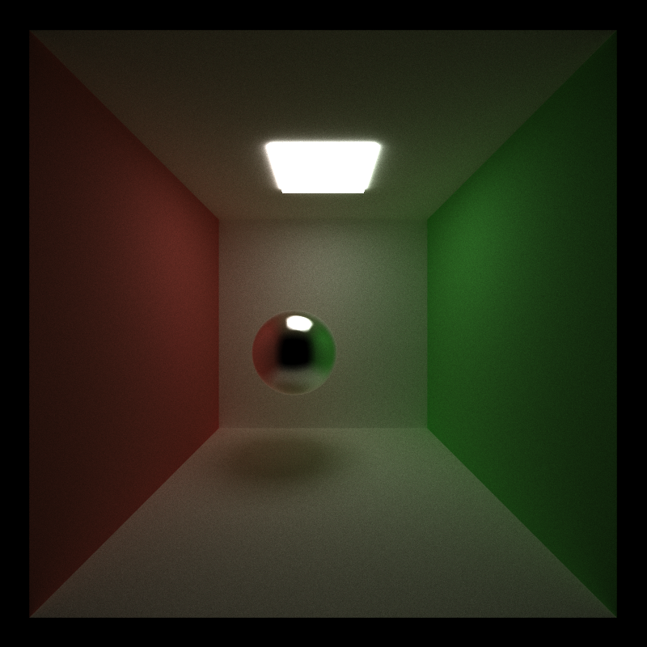

CUDA Path Tracer
======================

**University of Pennsylvania, CIS 565: GPU Programming and Architecture, Project 2**

* Yu-Chia Shen
  * [LinkedIn](https://www.linkedin.com/in/ycshen0831/)
* Tested on: Windows 10, i5-11400F @ 4.3GHz 16GB, GTX 3060 12GB (personal)

# Overview
This project is a CUDA-based path tracer used to generate high-quality images. The concept is to generate rays from camera and maintain the rays using parallel computing. This enables the Physically-based Rendering work in a very fast speed. 


# Visual Effect


## Reflective, Refraction and Diffuse Surfaces

### **Diffuse & Reflection**
The following images are the two basic shading kernel: *ideal diffuse surface* and *perfectly specular-reflective surface*.

For the diffuse material, cosine-weighted sampling is used to determine the direction ofthe generated ray.

For the perfect specular surface, the function ```glm::reflect``` is used to generate a perfectly reflected ray.
| Reflection      | Diffuse    |  
:---------------:|:-------------------: 
 |  

### **Specular Surface**
In the real world, not every specular surface has perfectly reflection just like mirror. The followings are the results for comparison between perfect and imperfect specular.

In path tracing, specular materials are simulated using a probability distribution. Equations 7, 8, and 9 of [GPU Gems 3, Chapter 20](https://developer.nvidia.com/gpugems/gpugems3/part-iii-rendering/chapter-20-gpu-based-importance-sampling) are used to generate a random specular ray to perfrom imperfect specular surfaces.

A parameter *shininess* is used to determine the surface's *perfection*. For the images from left to right, the surfaces become more imperfect. 

| Perfect Specular     | Imperfect Specular    | Imperfect Specular    |  
:---------------:|:-------------------: |:-------------------: 
 |  |  

### **Refraction**
Refraction, like glass and water, with *Frensel effects using Schlick's approximation* is used in the following images. The following results use the function ```glm::refract``` to determine the resulting ray with Snell's law. 

| Front View      | Different View     |  
:---------------:|:-------------------: |
 |  

### **Refraction with Different IOR**
A parameter *index of refraction (IOR)* is used for Frensel effects and Snell's law. From left to right are the images which have IOR 1.5, 1.8, and 2.4. 

| IOR ~ 1     | Medium IOR    |  High IOR  |  
:-------------------: |:-------------------: |:-------------------: 
|  |  |  

## Physically-Based Depth-of-Field
With the Depth-of-Field, one can focus on specific object on arbitrary distance. The following images show the comparison between different focal length and different size of aperture.

| | Low Focal Length | Medium Focal Length | High Focal Length |  
:---------------:|:-------------------: |:-------------------: |:-------------------: 
| Small Aperture |  |  | |
| Large Aperture |  |  | |

To enable Physically-Based Depth-of-Field, a random point on the aperture is first sampled. Also, a point on the focus plane is calculated using the original ray. Then, the new origin of the ray is the connection of the sampled point and the focus point.


## Stochastic Sampled Antialiasing

| Without Antialiasing | With Antialiasing | 
:---------------:|:-------------------: |
|  |  |
|  |  |

# TODO
Type Something Here

## Direct lighting

# Mesh Loading

## GLTF Loading

## Texture and Normal Mapping

## Emissive Mapping

# Performance Improvements

## Path Termination using Stream Compaction
This optimization is to terminate the paths which have not remaining bounces. In this implementation, a stream compaction function ```thrust::partition``` is used to separate the existing paths and terminated paths. This have a great performance improvement when the trace depth increase due to less paths have to be processed after each bounce.

We can see that with Path Termination, the run time is high at the first bounce. This is because we add a partition function. However, when the Trace Depth increase, the run time decrease significantly.

.png)


## Path Sorting

## First Bounce Cache

## Hierarchical Spatial Data Structures - Octree
Hierarchical spatial data structure is used to avoid checking a ray against every primitive int the scene of every triangle in a mesh. Here, *Octree* is being used to quickly find the triangle(s) intersected by a particular ray

The following image is the architecture of the Octree. The root node will store the bounding box of the entire mesh. Then, the bounding box is divided into 8 small boxes for 8 children of the root node, and so on. Finally, the triangles will be stored in the leaf node according to the bounding volume of that node.


Below is the scene for testing the Octree data structure. This mesh has *208890* triangles, which is good to test the acceleration. 


The following is the comparison between different maximum depth of the Octree. Here, we can see that the performance becomes better (Run time is lower) when increasing the maximum depth. However, starting from maximum depth equl to 6, the performance decrease significantly. 

The reason is that the more depth we have, the more nodes needed to be checked. Also, when the bounding boxes become smaller, one triangle may overlap multiple bounding boxes. Therefore, there will be duplicate intersection check for the same triangle since this triangle is existed in multiple leaf nodes. Thus, this will increase the run time. 

