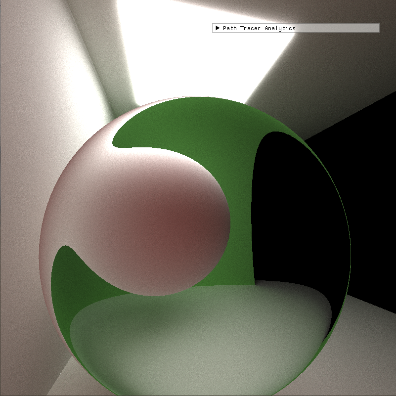

CUDA Path Tracer
================

**University of Pennsylvania, CIS 565: GPU Programming and Architecture, Project 3**

* Haoquan Liang
  * [LinkedIn](https://www.linkedin.com/in/leohaoquanliang/)
* Tested on: Windows 10, Ryzen 7 5800X 8 Core 3.80 GHz, NVIDIA GeForce RTX 3080 Ti 12 GB

# Overview

This project is a CUDA-based GPU path tracer capable of rendering globally-illuminated images very quickly. Path tracing is a ray tracing algorithm that sends rays from the Camera and, when a ray hits a reflective or refractive surface, recurses the process util it reaches a light source. Fundamentally, the algorithm is integrating over all the illuminance arriving to a single point on the surface of an object to achieve the effect of physically accurate rendering.

# Table of Contents  
[Features](#features)   
[Feature Showcase](#showcase)   
[Bloopers](#bloopers)    
[Reference](#reference)

# <a name="features"> Features</a>
## Core features
* [Ideal Diffuse surfaces](#diffuse)
* [Perfectly specular-reflective](#perf-specular)
* [Imperfect specular-reflective](#imperf-specular)
* [Path termination with Stream Compaction](#stream_compaction_term)
* [Sorting rays by materials](#ray_sorting)
* [Caching the first bounce intersections](#cache)
## Additional features
* [Refraction](#refract)
* [Physically-based depth-of-field](#dof)
* [Direct lighting](#directlighting)
* [Motion blur](#motionblur)
* [Stochastic Sampled Antialiasing](#ssaa)
* [Arbitrary obj mesh loading](#mesh)
* [Texture mapping with a basic procedural texture](#texture)
* [Post-processing shaders (greyscale, sepia, inverted, and high-contrast filters)](#post)


# <a name="showcase">Features Showcase and Analysis</a>

## BSDF Evaluation

### <a name="diffuse">Ideal Diffuse</a>
   
Diffuse is the most basic BSDF. It samples a cosine-weighted hemisphere on the intersection points, and evaluate the sampled rays from the surface. It gives a rough look on the surface.   
   

### <a name="perf_specular"> Perfectly Specular Reflective</a>   
A perfectly specular surface will reflect all the rays at the angle of incidence. It gives the surface a mirror look.   
    

### <a name="imperf-specular">Imperfect Specular Reflective</a>   
Instead of always reflecting the rays in the angle of incidence, the imperfect specular surface blends the result of perfect specular and perfect diffuse to give it a more natural metalic look. To enable imperfect specular, set `IMPERFECT_SPECULAR` to 1 in `interactions.h`   


## <a name="stream_compaction_term">Path Termination using Stream Compaction</a>
The code for path termination using stream compaction is as followed. The idea is to use the ray terminated function to determine which rays have terminated (no longer bounce around), and mark the terminated rays. Then, use the stream compaction algorithm to partition the running rays and the terminated rays, in order to achieve better performance by improving the threads locality.
Unfortunately, there isn't a baseline to compare the performance with. But path-termination using stream compaction is expected to improve the performance.

```
struct rayTerminated   
{     
    __host__ __device__    
        bool operator()(const PathSegment& pathSegment)    
    {    
        return pathSegment.remainingBounces;    
    }    
};     
PathSegment* path_end = thrust::stable_partition(thrust::device, dev_paths, dev_paths + num_paths, rayTerminated());    
num_paths = path_end - dev_paths;    
iterationComplete = (num_paths == 0); 
```


## <a name="ray_sorting">Sorting Rays</a>
To enable ray sorting, set `SORT_RAYS` to 1 in `pathtrace.cu`.   
Since each ray can hit a material of different BSDF computation, some rays might terminate early, while others can be in flight for a long time. This results in threads finishing at different times. To solve this problem, we can use radix sort to sort the rays by the material types. By making the rays that hit the same material contiguous in memory, we can improve the performance by terminating the idling warps early so they can be utilized again. However, since sorting adds a significant amount of computation overheads, this algorithm only helps improve the performance when there are many different material types in the scene. In a simple scene like Cornell box, toggling sorting rays on will actually decrease the performance.

## <a name="cache">Caching the First Bounce Intersections   </a>
To enable first bounce intersections caching, set `CACHE_FIRST_BOUNCE` to 1 in `pathtrace.cu`.    
One small improvement is to cache the first bounce intersections so it can be re-used for all the subsequent iterations. According to my test result, this provides a very small performance improvement. 

## <a name="refract">Refraction</a>
This uses the Schlick's approximation to implement the refraction effect.    
From the left to the right, the refraction indices are 1.33 (water), 1.77 (sapphire), and 2.42 (diamond)   


## <a name="dof">Depth of Field</a>
Depth of Field in a path tracer is done by jittering rays within an aperture. It will add noises to the rays that does hit objects on the focal length, and create a blurry effect.   
To enable DOF, set `DEPTH_OF_FIELD` to 1 in `pathtrace.cu`, and use `FOCAL_LENGTH` and `APERTURE` to adjust the effect.    


## <a name="directlighting">Direct Lighting</a>
In a path tracer, light intensity is the most important information, and ideally we want each bounce and iteration to carry as much information as possible. One way to achieve this is by always taking the final ray directly to a random point on the light source.   
To enable direct lighting, set `DIRECT_LIGHTING` to 1 in `pathtrace.cu`.   
Comparing the same scene with direct lighting on (left) and off (right), direct lighting makes the scene brighter.    
 

## <a name="motionblur">Motion Blur</a>
Motion blur is achieved by averaging samples at different times in the animation.    
To enable direct lighting, set `MOTION_BLUR` to 1 in `pathtrace.cu`, and define the motion of the objects in the scene by setting its "ENDPOS". The object will then move from its starting postion to the endpos.    


## <a name="ssaa">Stochastic Sampled Anti-aliasing</a>
Stochastic sampled anti-aliasing is a relatively low-cost anti-aliasing technique ahieved by jittering the sample locations that are spaced out regularly. This increase in low frequency noise would cause an image convoluted with this filter to scatter the high frequencies into low frequencies. Since the human visual system is more sensitive to low frequencies, this "tricks" people into thinking the there are less aliasing in the scene.    
To enable antialiasing, set `ANTI_ALIASING` to 1. Note that in my current implementation, DOF can't be turned on with AA simultaneously.       
Below is the comparison of the same scene with anti-aliasing on (left) and off (right).   
 

## <a name="mesh">Mesh Loading</a>
My pathtracer supports loading any number of arbitrary meshes in .obj format into the scene.    
It uses the [tinyObjLoader](https://github.com/tinyobjloader/tinyobjloader) to parse the data in the .obj file. With the vert/face/norm/texture data, it assembles the triangles in the scene, and test ray-triangle intersection to render the mesh.  
It also does bounding volume intersection culling by first checking rays against a volume that completely bounds the mesh.   
Please see the sample scene files to learn how to load a mesh into the scene.     

### Performance Analysis - Bounding Volume Check On vs. Off   

## <a name="texture">Texture Mapping with Simple Procedural Texture</a>
Loading a mesh without its texture is no fun! Fortunately, my pathtracer also loads the texture and maps it on the mesh according to the given uv coordinates.    
When there is no texture file, it will generate a simple procedural texture. 
Please see the sample scene files to learn how to load a texture into the scene.   
    
     
### Performance Analysis - Image Texture vs. Procedural Texture

## <a name="post">Final Rays Post-processing</a>
Final rays post-processing is basically taking the final color of the scene, and apply interesting filters to it by tuning its rgb value.    
I implemented 3 simple post-proessing filters: greyscale, sepia, inverted, and high-contrast. 
To enable direct lighting, set `POST_PROCESS` to 1 in `pathtrace.cu`, and set the desired filter (like `GREYSCALE`) to 1, while setting the other filter types to 0. 
### No Filter
        
### Greyscale   
   
### Sepia   
   
### Inverted   
   
### High-contrast   
 

# <a name="bloopers">Bloopers</a>
### Wahoo! Toxic mushrooms!   
    
This is caused by normalizing the interpolated UV coords
### Cow-rio   
   
This is caused by forgetting to clear the triangle buffer (one is meant to be just the cow and the other is meant to be just the Mario)   
### Motion refraction?
   
This is caused by unknown computation bugs when implementing motion blur. Instead of looking blurred, the supposedly blurry part looks like it's refracting. 


# <a name="reference">Refrence</a>
* Meshes: [titanic](https://sketchfab.com/3d-models/lego-sinking-titanic-8048d606fcb54bcc9b3e0b52c5d6a394), [train](https://sketchfab.com/3d-models/train-fb2d125c67fe44c69c4238a9f5a12d5a#download), [Mario and Cow](https://www.cis.upenn.edu/~cis4600/22fa/hw/hw04/openglFun.html)   
* [Formulas reference](https://pbr-book.org/)   
* [Base structure reference](https://onedrive.live.com/view.aspx?resid=A6B78147D66DD722!96250&ithint=file%2cpptx&authkey=!AHM5o0OIig5tENc)
