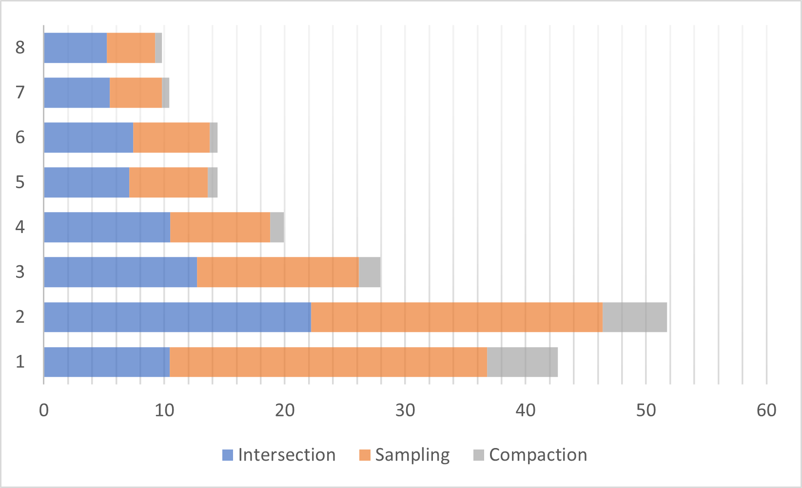

CUDA Path Tracer
================

**University of Pennsylvania, CIS 565: GPU Programming and Architecture, Project 3**

* Chang Liu
  * [LinkedIn](https://www.linkedin.com/in/chang-liu-0451a6208/)
  * [Personal website](https://hummawhite.github.io/)
* Tested on personal laptop:
  - i7-12700 @ 4.90GHz with 16GB RAM
  - RTX 3070 Ti Laptop 8GB

This project is about implementing a GPU path tracer with CUDA programming library. 

## Representative Outcome

A virtual camera is capturing another virtual camera

    <table>
    <tr>
        <th>Scene Specs</th>
        <th><a href="./scenes/pbr_texture.txt">[./scenes/pbr_texture.txt]</a></th>
    </tr>
    <tr>
        <td>Resolution</td>    
        <td>2400 x 1800</td> 
    </tr> 
    <tr> 
        <td>Samples Per Pixel</td> 
        <td>3000</td>
    </tr>
    <tr> 
        <td>Render Time</td> 
        <td>&lt; 7 minutes (&gt; 7.5 frames per second)</td>
    </tr>
    <tr> 
        <td>Million Rays Per Second</td> 
        <td>32.4</td>
    </tr>
    <tr> 
        <td>Triangle Count</td> 
        <td>25637</td>
    </tr>
</table>

Large scene (6,704,264 triangles)
 

Lens effect: depth of field with heart-shaped bokehs

## Features

### Visual

#### Direct Lighting with Multiple Importance Sampling

The base code's lighting strategy is to shoot new ray at every intersected point until the ray hits a light source. This works fine with most scenes having large light sources and dominated by diffuse surfaces. However, if light sources are very small, like a point light source, rays are hardly able to hit them, thus the result image will be dark and noisy.

<table>
    <tr>
        <th>BSDF Sampling</th>
        <th>Light Sampling</th>
        <th>MIS Combined</th>
    </tr>
    <tr>
        <th></th>
        <th></th>
        <th></th>
    </tr>
</table> 

Rendered at 32 spp

Instead of passively waiting our rays to hit the light sources, we can "pull" them to the light source that we want to get direct illuminance from. This strategy is called light sampling. Light sampling converges much faster than BSDF sampling, as you can see from the images. However, it introduces another problem: when surfaces are very specular, it becomes hard to produce any valid contribution.

In this path tracer, I implemented Multiple Importance Sampling to combine samples from BSDF sampling and light sampling. MIS takes the advantage of both while avoiding the disadvantage of each, producing less noisy results.

#### Importance Sampled HDR Environment Map (Skybox)

Tired of repeatedly setting up and adjusting "virtual artificial" light sources for the best effect? Let's introduce some natural light from real world that can easily improve our rendering quality at no cost. That is, we retrieve luminance values stored in HDR photographs when calculating lighting and color of surfaces. As you can see, the [demo images](#representative-outcome) all benefited from such HDR images.

A very simple implementation is to transform the direction of escaped rays from spherical direction to 2D texture coordinate and get the correspondent color from HDR images. However, if we want it to work well with our MIS direct lighting, we should treat it as a light source to perform importance sampling on it.

The idea of importance sampling on HDR image is to first convert the color of image to a 2D brightness distribution. Then, we stretch the distribution to 1D and perform importance sampling on it. For sampling a 1D distribution, I used the alias method, which requires to build an alias table for the distribution. Sampling with alias table is $O(1)$, pretty efficient.

<table>
    <tr>
        <th>No Importance Sampling</th>
        <th>Importance Sampling</th>
    </tr>
    <tr>
        <th></th>
        <th></th>
    </tr>
</table>

These are rendered with an HDR image that has a very bright but tiny dot in it (the sun). You can see only importance sampling can capture it and correctly light the ground -- the sun is too small to be hit by a random ray sampled by BSDF.

#### Physically-Based Materials

For materials, I didn't implement many this time in the renderer. There are three material models implemented:

- Lambertian: a classic diffuse material used to represent rough surfaces
- Dielectric: a transparent material having both reflection and refraction. Used to simulate glass, water, air or any "clear and specular" media
- Metallic workflow: a popular material model used in the industry. It has two parameters, Metallic and Roughness. By changing the value of two parameters, we can simulate a variety of materials such as plastic, glossy metal and mirror. It's very expressive and artist friendly, and easy to combine with textures to create realistic rendering. The model implemented by the renderer is a mixture of Lambertian diffuse and Trowbridge-Reitz (GGX; GTR2) microfacet specular

Metallic workflow: changing metallic and roughness; Dielectric: IOR

#### Normal Map & PBR Texture

The following picture shows the type of textures supported. You can see how the workflow make a difference to turn a plain white model to very realistic image.

Initially I only implemented normal map. When I first tried to add texture channels for metallic an roughness and rendered that camera image, I was shocked too by how expressive PBR material and PBR textures are.

#### Physically Based Camera

##### Depth of Field

Real world cameras' lens system compose of sets of glasses that focus the light to the sensor. In path tracing, the basic model of camera is the pinhole model, which creates precise one-to-one mapping from world position to pixel coordinate. If we want to simulate depth of field, we'd allow one world position to be mapped to a range of pixels.

How to achieve this? The answer is to create a virtual aperture and randomly generate points on the aperture, then connect the point to another point we sample in the pixel to generate the ray.

| No DOF                      | DOF                     |
| --------------------------- | ----------------------- |
|  |  |

##### Custom Bokeh Shape

This is my favorite part of the project.

In DOF, we sample points on the camera's aperture disk to create blurred background and foreground. This idea can even be extended by stochastically sampling a mask image instead of the circle shape of the aperture, which creates very interesting and amazing results.

	
	

| Star Mask                      | Heart Mask                    |
| ------------------------------ | ----------------------------- |
|  |  |

The sampling method is the same as what is used to pick up a direction of the skybox.

You can toggle this by changing the value of `ApertureMask` in scene files. Set it to the path of mask image, or leave it `Null` to disable the effect.

##### Panorama (360 Degree Spherical)

Also a trivial feature. This can used to create some funny looking image.

Twisted Sponza rendered with panorama camera
 

Toggle for this feature is compile time -- change the value of `CAMERA_PANORAMA` in [`./src/common.h`](./src/common.h)

#### Post Processing

##### Gamma Correction

Implementing gamma correction is very trivial. But it is necessary if we want our final image to be correctly displayed on monitors, through which we see by our eyes. Otherwise, the image will always look darker.

##### Tone Mapping

Tone mapping is also a feature that does not require heavy workload but improves overall appearance easily. It's simply remapping the value stored in color buffer from HDR to LDR before gamma correction and being displayed on monitor.

<table>
    <tr>
        <th>No Tone Mapping</th>
        <th>ACES</th>
    </tr>
    <tr>
        <th></th>
        <th></th>
    </tr>
</table>

I implemented Filmic and ACES tone mapping. The images in this readme are all processed with ACES. By comparison we can see that ACES lifts contrast so that pictures will look more appealing.

You can toggle tone mapping through GUI, or by pressing `T` on your keyboard.

### Performance

#### Fast Intersection: Stackless SAH-Based Bounding Volume Hierarchy

Ray-scene intersection is probably the best time consuming part of of ray tracing process. In a naive method we try to intersect every ray with every object in the scene, which is quite inefficient when there are numerous objects.

You can enable this BVH visualizer through GUI
 

An alternative is to setup spatial culling data structure according to how the objects distribute in the scene space and intersect the data structure before intersecting objects. For example, we could assign each object a bounding box and only try to find intersection with an object if the ray intersects its bounding box first. However, this is not sufficient to reduce intersection time. Therefore, we need more advanced spatial structures, like bounding volume hierarchy, octree or K-D tree. These tree-based structures usually have an average height of $O(\log{n})$, meaning if traversal is well handled our intersection cost will benefit.

I implemented BVH as the acceleration structure in this render. Also, I did two levels of optimization to make it fast and robust. These optimizations allow my path tracer to build BVH for the [Rungholt](https://casual-effects.com/data/) scene (6,704,264 triangles) in 7 seconds and run at 3 FPS, 2560 x 1440. (Click the images to see details)

<table>
    <tr>
        <th>Rendering</th>
        <th>Bounding Volume Hierarchy of the Whole Scene</th>
    </tr>
    <tr>
        <th></th>
        <th></th>
    </tr>
</table>

##### Better Tree Structure: Surface Area Heuristic 

SAH, the Surface Area Heuristic, is a method to determine how to split a set of bounding volumes into subsets when constructing a BVH, that the constructed tree's structure would be highly optimal.

##### Faster Tree Traversal on GPU: Multiple-Threaded BVH

The second level of optimization is done on GPU. BVH is a tree after all, so we still have to traverse through it during ray-scene intersection even on GPU. Tree traversal is usually based on recursion or stack, but we know that it's hard to do these with GPU: first, recursion is almost impossible with standard GPU programming; if we use stack instead of recursion, we need to maintain a stack in every thread -- the registers required would limit thread concurrency, not to say when BVH depth exceeds the limit.

For the BVH in this project, I implemented stackless traversal. The idea is to preprocess tree structure to know in advance which node to visit if the ray intersects/does not intersect the node's bounding box. By doing so we actually create a automated machine, whose traversal only requires $O(1)$ runtime memory.

##### How much BVH Enhances Performance

I only tested relatively small scenes considering that it would take fairly long to render without BVH.

    

This result came with the demo camera scene, rendered at 1800 x 1350. It's obvious BVH beats naive intersection.

To disable BVH, you can toggle `BVH_DISABLE` in [`./src/common.h`](./src/common.h), but I highly discourage you to do so.

#### Efficient Sampling: Sobol Quasi-Monte Carlo Sequence

In path tracing or any other Monte Carlo-based light transport algorithms, apart from improving the performance from a point of view of programming, we can also improve it mathematically. Quasi-Monte Carlo sequence is a class of quasi-random sequence that is widely used in Monte Carlo simulation. This kind of sequence is mathematically proved to be more efficient than pseudorandom sequences (like what `thrust::default_random_engine` generates). You can find that QMC sequences look more uniformly distributed.

    
    
    
Pseudorandom vs. Sobol

Theoretically, to maximize the benefit of Sobol sequence, we need to generate unique sequences for every pixel during each sampling iteration at real-time -- this is not trivial. Not to say that computing each number requires at most 32 bit loops. A better choice would be precomputing one pixel's sequence, then use some sort of perturbation to produce different sequences for different pixels.

I precomputed Sobol sequence of 10000 size and 200 dimension in [`./sobol_10k_200.bin`](./sobol_10k_200.bin), so that no runtime computation is needed. For the perturbation approach, I used is xor perturbation, simply xoring a random number for each pixel's sequence.

Here is the result I get from testing the untextured [PBR texture scene](#representative-outcome). With the same number of samples per pixel, path tracing with Sobol sequence produces much lower variance (less noise).

<table>
    <tr>
        <th>Pseudorandom Sequence</th>
        <th>Xor-Scrambled Sobol Sequence</th>
    </tr>
    <tr>
        <th></th>
        <th></th>
    </tr>
</table>

### Other

#### Single-Kernel Path Tracing

To figure out how much stream compaction can possibly improve a GPU path tracer's performance, we need a baseline to compare with. Instead of toggling streamed path tracer's kernel to disable stream compaction, we can separately write another kernel that does the entire ray tracing process. That is, we shoot rays, find intersection, shading surfaces and sampling new rays in one kernel. Unlike streamed path tracing where you have to store path information in global memory after each pass, this single kernel keeps those required variables only in threads' local memory.

#### First Ray Caching (G-Buffer)

In real-time rendering, a technique called deferred shading stores scene's geometry information in texture buffers (G-Buffer) at the beginning of render pass, so that later passes can save time by retrieving geometry information directly from buffer rather than rasterization process. It turns out we can do something similar with offline rendering.

    

However, my test result shows NO significant improvement after ray caching. I think probably the time for first intersection is sufficiently short.

Toggle the pragma `ENABLE_GBUFFER` in [`./src/common.h`](./src/common.h) for comparison.

#### Material Sorting

Before shading and sampling surfaces, we can sort intersection information by material type (or id) in order that same or similar materials are contiguous in memory, which potentially reduces thread divergence during shading and sampling. I simply used `thrust::sort_by_key` to do this job. 

## Other Performance Analysis

Some of required performance analysis is already presented in the passage above.

### Streamed PT vs. Material Sorted Streamed PT vs. Single-Kernel PT

I decide to put these three together for comparison and analysis.

    
    

This is the result I got by inspecting the exact execution time of kernels during each pass and sum them together using NSight Compute. As we can see from the graph, stream compaction improves overall performance, which depends on scenes' spatial structures: if the scene is more open, stream compaction will remove the majority: escaped rays after the first intersection, while single kernel PT has to keep the threads idle. However, if the scene is more closed, the improvement would be less significant, probably because the number of valid rays does not descend obviously after each iteration.

In general, it's a tradeoff between thread concurrency and time spent accessing global memory.

After implementing material sorting, I found it actually slower. Sorting materials does improve memory coalescing for intersection, sampling and stream compaction -- from the graph they take less time. However, the effect is not sufficient to tradeoff the additional time introduced by sorting. As we can see the test result below, sorting makes up more than 1/3 of ray tracing time in the open scene, which is unacceptable.

There is also another possibility that BSDF sampling and evaluation is not that time consuming as expected.

Therefore, in my opinion, material sorting is best applied when:

- The scene is more closed than open
- There are many objects, many different materials in the scene
- Objects sharing the same material are randomly distributed in many small clusters over the scene space. The clusters' sizes in solid angle are typically less than what a GPU warp can cover

Here is a more detailed graph recording the time spent by each kernel for each depth of tracing. In closed scenes the time consumed after each depth can even grow, which is probably due to memory coalescence of path segment and intersection information.

|               | Open Scene                | Closed Scene              |
| ------------- | ------------------------- | ------------------------- |
| Sorted        |    |    |
| Streamed      |  |  |
| Single Kernel |    |    |

### Image Texture vs. Procedural Texture

To fulfill the requirement, I did implement a basic procedural texture to compare with (the code has been changed after I saved this picture so it will look different):

It shows no much difference no matter what kind of texture is used.

To use this procedural texture, simply set `BaseColor` of a material to `Procedural`.

## Extra Points Count

- All core features
- Refraction (2)
- Depth of field (2)
- Antialiasing (2)
- Texture mapping & normal mapping combined with mesh loading (6)
- Direct lighting (2)
- Better sampling method (Sobol) (3)
- Post processing (?)
- OBJ loading (2)
- BVH (6)
- HDR skybox (?)
- And more...

## Third Party Credit

### Code

Apart from what was provided with the base code, two additional third party libraries are included:

- [*tinyobjloader*](https://github.com/tinyobjloader/tinyobjloader)
- [*tinygltf*](https://github.com/syoyo/tinygltf) (not used. I didn't implement GLTF mesh loading)

### Assets

[*Stanford Dragon*](http://graphics.stanford.edu/data/3Dscanrep/)

The following scene assets are licensed under [CC BY 3.0](https://creativecommons.org/licenses/by/3.0/). They are modified to fit in the path tracer's scene file structure.

- [*Rungholt*](https://casual-effects.com/data/)
- [*Crytek Sponza*](https://www.cryengine.com/marketplace/product/crytek/sponza-sample-scene)
- Background image of dragon demo from [*sIBL HDRI Archive*](http://www.hdrlabs.com/sibl/archive.html)

The rest of assets all have CC0 license from [*Poly Haven*](https://polyhaven.com/), a very good website where you can download free and public models, textures and HDR images.

