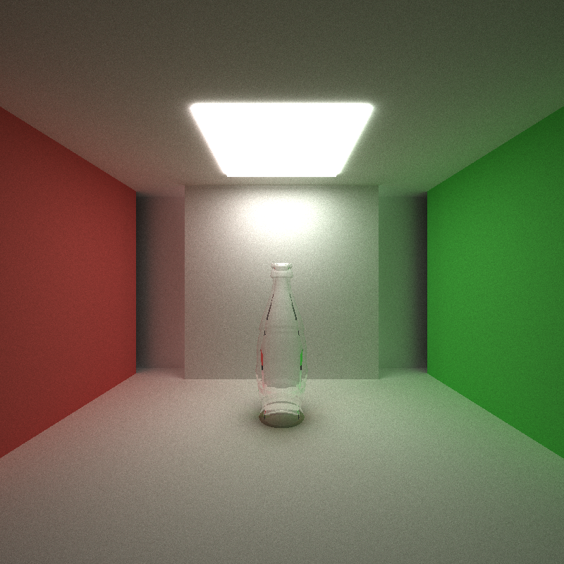
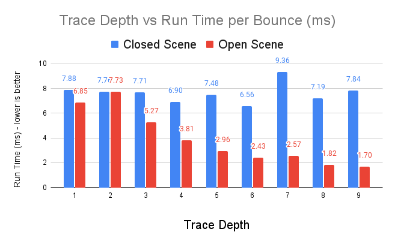
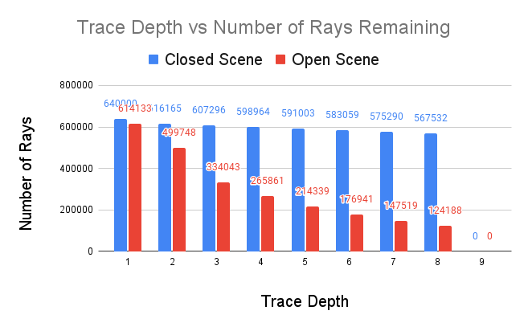
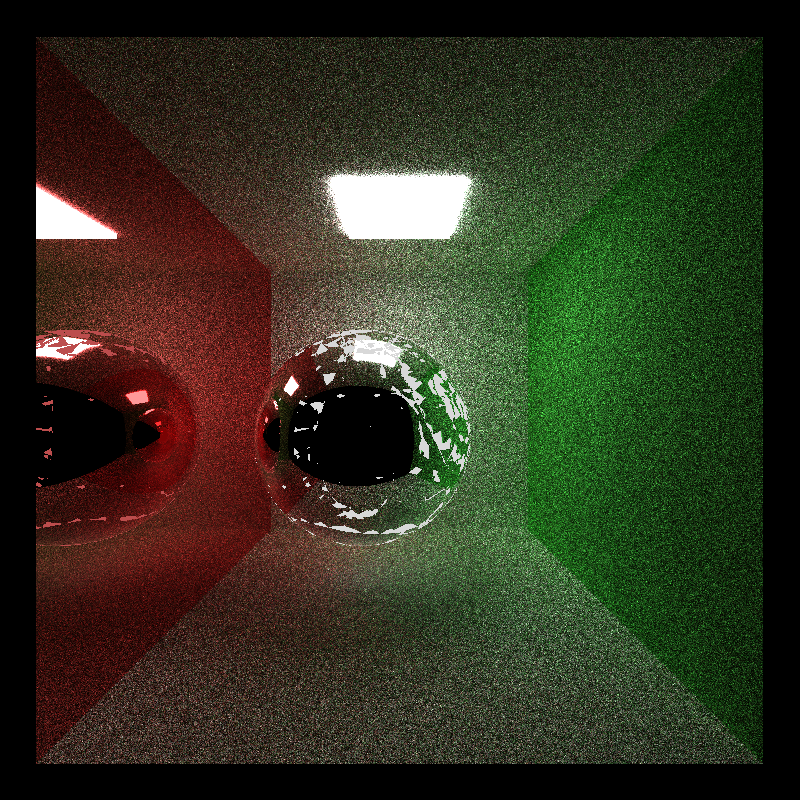

CUDA Path Tracer
======================

**University of Pennsylvania, CIS 565: GPU Programming and Architecture, Project 2**

* Yu-Chia Shen
  * [LinkedIn](https://www.linkedin.com/in/ycshen0831/)
* Tested on: Windows 10, i5-11400F @ 4.3GHz 16GB, GTX 3060 12GB (personal)

# Overview
This project is a CUDA-based path tracer used to generate high-quality images. The concept is to generate rays from camera and maintain the rays using parallel computing. This enables the Physically-based Rendering work in a very fast speed. 


* Latern Model Credit (https://github.com/KhronosGroup/glTF-Sample-Models)

# Visual Effect

* Stanford Bunny Model Credit (http://graphics.stanford.edu/data/3Dscanrep/)

## Reflective, Refraction and Diffuse Surfaces

### **Diffuse & Reflection**
The following images are the two basic shading kernel: *ideal diffuse surface* and *perfectly specular-reflective surface*.

For the diffuse material, cosine-weighted sampling is used to determine the direction ofthe generated ray.

For the perfect specular surface, the function ```glm::reflect``` is used to generate a perfectly reflected ray.
| Reflection      | Diffuse    |  
:---------------:|:-------------------: 
 |  

### **Specular Surface**
In the real world, not every specular surface has perfectly reflection just like mirror. The followings are the results for comparison between perfect and imperfect specular.

In path tracing, specular materials are simulated using a probability distribution. Equations 7, 8, and 9 of [GPU Gems 3, Chapter 20](https://developer.nvidia.com/gpugems/gpugems3/part-iii-rendering/chapter-20-gpu-based-importance-sampling) are used to generate a random specular ray to perfrom imperfect specular surfaces.

A parameter *shininess* is used to determine the surface's *perfection*. For the images from left to right, the surfaces become more imperfect. 

| Perfect Specular     | Less Imperfect Specular    | Imperfect Specular    |  
:---------------:|:-------------------: |:-------------------: 
 |  |  

### **Refraction**
Refraction, like glass and water, with *Frensel effects using Schlick's approximation* is used in the following images. The following results use the function ```glm::refract``` to determine the resulting ray with Snell's law. 

| Front View      | Different View     |  
:---------------:|:-------------------: |
 |  

### **Refraction with Different IOR**
A parameter *index of refraction (IOR)* is used for Frensel effects and Snell's law. From left to right are the images which have IOR 1.5, 1.8, and 2.4. 

| IOR ~ 1     | Medium IOR    |  High IOR  |  
:-------------------: |:-------------------: |:-------------------: 
|  |  |  

## Physically-Based Depth-of-Field
With the Depth-of-Field, one can focus on specific object on arbitrary distance. The following images show the comparison between different focal length and different size of aperture.

| | Low Focal Length | Medium Focal Length | High Focal Length |  
:---------------:|:-------------------: |:-------------------: |:-------------------: 
| **Small Aperture** |  |  | |
| **Large Aperture** |  |  | |

To enable Physically-Based Depth-of-Field, a random point on the aperture is first sampled. Also, a point on the focus plane is calculated using the original ray. Then, the new origin of the ray is the connection of the sampled point and the focus point.


## Stochastic Sampled Antialiasing
Antialiasing is the process that attempts to eliminate or reduce the impact of aliasing objects in teh scene. The idea is to divide one pixel into several sampled points, and calculate the colors of these points in this pixel. Then, assign the average of the sampled points to that pixel. Here, a Stochastic Sampling method is used to determine the sampled points. Then, we can jittering the rays' direction when generating them.

| Without Antialiasing | With Antialiasing | 
:---------------:|:-------------------: |
|  |  |
|  |  |

We can see the antialiasing has a better result for the edges of the object. Also, the faces of the cube becomes smoother than before. This is because antialiasing take the average of the sampled points.

## Direct lighting
The concept of Direct Lighting is to make the final ray bounce directly to a random point on an emissive object, such as light source. Therefore, the image will become lighter. Also, the image will converge faster for open scene, since there will be less useless ray that bounce to nowhere.

To take a random point on light source, the sampling process is necessary. Therefore, for every bounce, the intersections will be recorded when there is a ray hit the light source. Then, when one ray has only one remaining bounce, it will randomly choose one point on light source from the perviously sampled points.

| Without Direct Lighting | With Direct Lighting | 
:---------------:|:-------------------: |
|  |  |
|  | 

# Mesh Loading


## GLTF Loading 
In order to render more complex objects, GLTF files loading is used to generate mesh objects. GLTF was chosen as the scene description format since it is much powerful than OBJ. Here, [tinygltf](https://github.com/syoyo/tinygltf/) is implemented to support GLTF loading. 

GLTF data is parsed into custom ```struct``` when loading into the program. To avoid passing nested struct into GPU kernels, a giant data buffer is created to store all the vertex data, such as position, normal, and uvs, in the scene. Then, for each mesh object, it only needs to store the indice of those vertex data.

## Texture and Normal Mapping

| Textue Mapping | Normal Mapping | Normal Mapping with Reflection
| :--------------------------: | :-------------------: | :-------------------: |
|  |  | 

## Emissive Mapping
Emissive map shows where the light source is in the mesh object. Just likes texture mapping, it uses ```uv``` to do mapping. Also, only light source has value greater than 0, and thus it is a good condition to check if the ray hit the light source.

| Without Emissive Mapping | Emissive Map | With Emissive Mapping
| :--------------------------: | :-------------------: | :-------------------: |
|  |  | 

## Procedural Texture

| Procedural Texture | Procedural Texture | Procedural Texture
| :--------------------------: | :-------------------: | :-------------------: |
|  |  | 


# Performance Improvements

## Path Termination using Stream Compaction
This optimization is to terminate the paths which have not remaining bounces. In this implementation, a stream compaction function ```thrust::partition``` is used to separate the existing paths and terminated paths. This have a great performance improvement when the trace depth increase due to less paths have to be processed after each bounce.

We can see that with Path Termination, the run time is high at the first bounce. This is because we add a partition function. However, when the Trace Depth increase, the run time decrease significantly. Also, the right image shows the decreasing of the number of rays. This means that there will be less rays needed to be computed when the trace depth increases.

| Run Time | Number of Rays Remaining | 
| :--------------------------: | :-------------------: |
|  |  |

### Close & Open Scene Comparison 
Since the stream compaction only affect to the rays which have no remaining bounce. Therefore, if all the ray have the same remaining bounce, stream compaction will have less impact. 

The following shows the difference between closed and open scene. Since there will be no ray escape, the closed scene will have most ray remaining during the iteration. Hence, stream compaction will have less effect.
| Run Time | Number of Rays Remaining | 
| :--------------------------: | :-------------------: |
|  |  |

## Path Sorting by Materials
This improvement is to sort the path by the intersection's materials for memory coalescing. Also, since the same materials will always do the same thing in one kernel, the will be less warp divergence. Therefore, it will be a performance increase. The function ```thrust::sort_by_key``` is used to do key-value sorting.

However, this implementaion does not seem to impact the performance for above kernels. In addition, the run time increase due to the cost of sorting. Perhaps introducing very distinctively different materials would make a bigger difference.

## First Bounce Cache
This implementation is to store the intersection of the first bounce at iteration 1 and skip the first bounce after. This can be done because each ray starts at the same spot for each pixel, and thus the first bounce will always be the same for all iterations. 

## Hierarchical Spatial Data Structures - Octree
Hierarchical spatial data structure is used to avoid checking a ray against every primitive int the scene of every triangle in a mesh. Here, *Octree* is being used to quickly find the triangle(s) intersected by a particular ray

The following image is the architecture of the Octree. The root node will store the bounding box of the entire mesh. Then, the bounding box is divided into 8 small boxes for 8 children of the root node, and so on. Finally, the triangles will be stored in the leaf node according to the bounding volume of that node.


Below is the scene for testing the Octree data structure. This mesh has *208890* triangles, which is good to test the acceleration. 


The following is the comparison between different maximum depth of the Octree. Here, we can see that the performance becomes better (Run time is lower) when increasing the maximum depth. However, starting from maximum depth equl to 6, the performance decrease significantly. 

The reason is that the more depth we have, the more nodes needed to be checked. Also, when the bounding boxes become smaller, one triangle may overlap multiple bounding boxes. Therefore, there will be duplicate intersection check for the same triangle since this triangle is existed in multiple leaf nodes. Thus, this will increase the run time. 


# Blooper
An Abnormal Duck


Got confused for Normal Mapping


Something missing for Octree


It's a really big aperture


# Reference
* Latern Model Credit (https://github.com/KhronosGroup/glTF-Sample-Models)
* Stanford Bunny Model Credit (http://graphics.stanford.edu/data/3Dscanrep/)
* GLTF loading tinygltf (https://github.com/syoyo/tinygltf/)
* Imperfect Specular Surface (https://developer.nvidia.com/gpugems/gpugems3/part-iii-rendering/chapter-20-gpu-based-importance-sampling)
* Paul Bourke's notes for Antialiasing (http://paulbourke.net/miscellaneous/raytracing/)