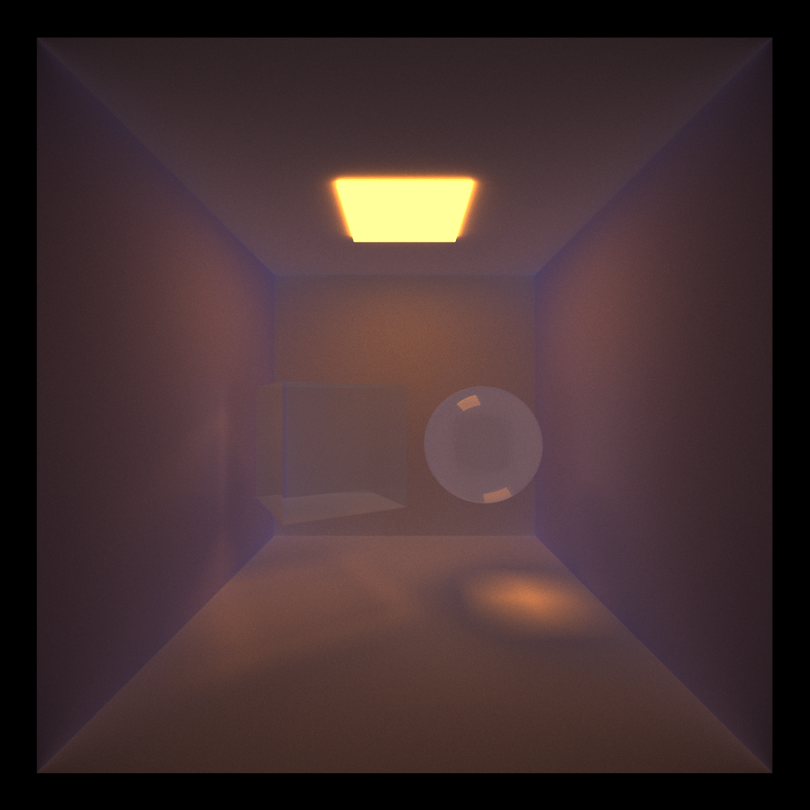

CUDA Path Tracer
================

**University of Pennsylvania, CIS 565: GPU Programming and Architecture, Project 3**

* Zhuohao Lin
  * [LinkedIn](https://www.linkedin.com/in/zhuohao-lin-960b54194/)
* Tested on: Windows 10, i7-10875H @ 2.30GHz 16GB, NVIDIA Grforce RTX 2060 6GB (personal machine)

# Overview
This is a GPU based path tracer. The project contains both visual and performance improvements so that mutiple objects with different kinds of materials can be rendered quickly.

# Features
### `Arbitrary mesh loading and rendering with obj file`

### `Antialiasing`
Before Antialiasing            |  After Antialiasing 
:-------------------------:|:-------------------------:
  |  

### `Refraction material`
Index of refraction of cube and sphere: 1.5

### `Bounding volume hierarchy acceleration data structure`
I implemented bounding volume hierarchy data structure in order to accelerate the intersection testing process. This data structure organize primitives into a binary tree based on their bounding box. There are various ways to split primitives. What I did is simply divide primitives into equal subsets. The BVH tree was built in CPU and then passed into GPU in a linear array. When doing intersection tests, first find box intersections within BVH tree apparently improve performance since a lot of primitives are abandoned.

# Performance Analysis

## Cache the First Bounce
For the first intersection of every iteration, it's always the same without any doubts. Therefore, I cache the first intersection data so that the computation can be skipped in every iteration except the first one. To see how much performance this brings, I make a graph as below (all data are got from the same scene)

By caching the first bounce in the scene, we always get a higher FPS than no cache. However, as the max ray depth increases, the percentage increase in FPS is going down.

## Bounding Volume Hierarchy
I put 3 objects with different number of faces in the same scene for performance comparison. In order to keep the number of intersections as close as possible, I set 3 objects in similar sizes.

It's obvious that BVH tree brings a huge performance improvement. The more the number of faces a mesh has, the lower the FPS will be. However, the FPS is dropping much slower using BVH than not using BVH. This is expected since BVH is a binary tree. The time cost to search intersections using BVH is roughly log(N) but N for not using BVH.  
Note: Search intersections in BVH tree is roughly log(N) because it can get into different leaf nodes if some bounding boxes overlap.
