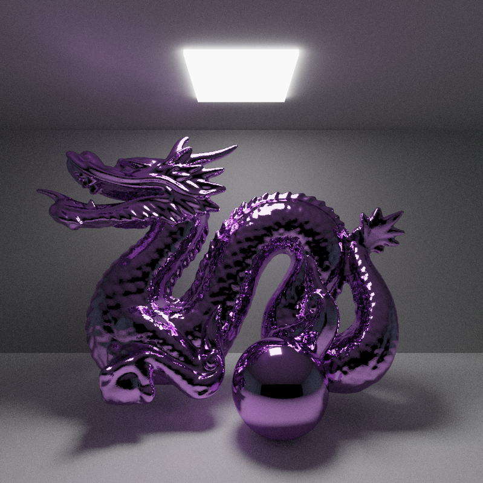

CUDA Path Tracer
================

**University of Pennsylvania, CIS 565: GPU Programming and Architecture, Project 3**

* Megan Reddy
  * [LinkedIn](https://www.linkedin.com/in/meganr25a949125/), [personal website](https://meganr28.github.io/)
* Tested on: Windows 10, AMD Ryzen 9 5900HS with Radeon Graphics @ 3301 MHz 16GB, NVIDIA GeForce RTX 3060 Laptop GPU 6GB (Personal Computer)
* Compute Capability: 8.6

### Overview

**Path tracing** is a an algorithm for synthesizing images by simulating the physical properties of light. Some effects 
that you can obtain for free in a path tracer include global illumination, caustics, soft shadows, motion blur, and depth-of-field.
Generating a converged, noise-free image involves tracing millions of rays for each scene. Tracing ray paths is an "embarrassingly parallel"
problem, meaning that it can be easily converted into a parallel task on the GPU.

This path tracer is implemented for the GPU using NVIDIA's CUDA API. It parallelizes several steps that would run serially on the CPU,
greatly reducing rendering time from hours to minutes. This includes generating camera rays, computing ray intersections for each pixel, 
shading, and writing to the output image.

<p align="center">
  
</p>
<p align="center"><em>A custom-made model of a violin mesh with reflective and refractive spheres (183,024 triangles) </em></p>

#### Features Implemented

- Core Features
    * Shading kernel for ideal diffuse, perfectly specular, and imperfectly specular surfaces
    * Path continuation/termination with stream compaction
    * Material sorting
    * Caching first bounce intersections
- Extra Features
    * Performance
      * Linear Bounding Volume Hierarchy (LBVH)
      * Bounding Volume Hierarchy (with Midpoint and SAH split methods)
      * Russian roulette ray termination
    * Visual
      * Refraction (with Fresnel)
      * Depth-of-field
      * Stochastic sampled anti-aliasing
      * Arbitrary mesh loading (with bounding box culling)
      * Reinhard operator and gamma correction (conversion to sRGB)

### Usage

#### Loading and Running a Scene

In order to run a `.txt` file from the `scenes` folder, you must provide it as a command line argument. You can do this two ways:
* Call the program with the argument: `cis565_path_tracer scenes/sphere.txt` 
* In Visual Studio, navigate to your project `Properties` and select `Configuration Properties -> Debugging -> Command Arguments` and provide the path to the scene file:
 `../scenes/sphere.txt`. Note that you may need to provide the full path instead of the relative path.

#### Macros
There are several macros that enable the user to test out different performance features and visual improvements.
They are located in the following files:

##### pathtrace.cu

* `ANTIALIASING`           - jitter the camera ray direction to remove jagged edges from shapes.
* `MATERIAL_SORT_`         - sort materials so that the same materials are contiguous in memory.
* `STREAM_COMPACTION_`     - remove rays that have terminated early.
* `CACHE_FIRST_BOUNCE`     - cache first bounce intersections to use in subsequent iterations.

##### utilities.h

I have added these two macros to easily enable/disable features in this file.

* `ENABLE`            1
* `DISABLE`           0

An example usage would be `RUSSIAN_ROULETTE ENABLE`.

* `RUSSIAN_ROULETTE` - turn on to use russian roulette ray termination.
* `CONVERT_TO_SRGB`  - convert final image from HDR to sRGB.
* `BB_CULLING`        - first check if a ray intersects the bounding volume encompassing a mesh. If so, check all the triangles within the mesh.
* `USE_LBVH`          - use a Linear Bounding Volume Hierarchy to accelerate intersection testing. 
* `USE_BVH`           - use a standard Bounding Volume Hierarchy to accelerate intersection testing. One of the split methods below must also be enabled.
* `USE_BVH_MIDPOINT`  - split BVH based on midpoint of primitives' centroids.
* `USE_BVH_SAH`       - split BVH based on Surface Area Heuristic.
* `DISPLAY_HEATMAP`   - enable heatmap visualization of BVH to diagnose areas with most intersections.

### Visual Features

#### Materials

In path tracing, we sample a Bidirectional Scattering Distribution Function (BSDF) to choose a direction for the ray to bounce.
This function describes the probability that light incoming along a ray `wi` will leave along a direction `wo`. In this implementation,
there are four material types available: diffuse, perfectly specular reflective, imperfectly specular reflective, and specular transmissive.

##### Diffuse

Perfectly diffuse surfaces scatter illumination equally in all directions. In order to choose a new ray direction, we choose a random
direction within the hemisphere centered about the normal (see `calculateRandomDirectionInHemisphere`).


##### Perfect Specular Reflective

Perfectly specular reflective surfaces only have one outgoing direction that contributes light energy. This single direction
is computed using `glm::reflect` and is the reflection of `wo` about the surface normal. 



##### Imperfect Specular Reflective

Imperfectly specular surfaces commonly include microfacet materials, however I opted to implement a more plastic-like material. To do
this, I generated a random variable `xi` between 0 to 1. This represents the probability of choosing the Diffuse BRDF or Specular BRDF.
We use this variable to choose one and then scatter the ray in that direction, multiplying the ray's throughput by the Fresnel term and diffuse or specular
color, depending on which branch was chosen. 


##### Refraction (with Fresnel)

For specular transmission, we use Snell's Law to compute the direction of the transmitted ray. If the angle of incidence is greater than a critical angle,
we must reflect the ray instead. In the code, we check the return value of `glm::refract` to determine whether we should reflect or not. Additionally,
we compute the Fresnel term and factor this into the color. The Fresnel effect describes the relationship between reflectance and viewing angle, where surfaces
tend to be more reflective at grazing angles. 


#### Anti-Aliasing

Anti-aliasing is a technique to remove jagged edges from images. The idea is to jitter the samples within a pixel, obtain the color
from casting rays in those directions, and then average the samples to get the final color. Since we are already taking many samples 
per pixel (each sample is an "iteration"), we can get this for free by simply jittering the x and y pixel position by some random value between 0 and 1
every time we generate a ray from the camera. This produces the "smoothed" appearance seen in the images below. 

| No Anti-Aliasing           |  Anti-Aliasing |
:-------------------------:|:-------------------------:
  |  

#### Depth-of-field

Depth-of-field is when objects that are within some focal distance appear in-focus whereas other objects appear out-of-focus. 
To achieve this effect, we sample a point on a concentric disk with radius `r`. This disk represents the camera aperture. Once we have
this sample point, we add it to the ray origin and compute the focal distance as the distance between the camera `lookAt` point and
`eye`. To use depth-of-field, be sure to set `LENS_RADIUS` to a value greater than zero in the scene file.

| No Depth-of-Field             |  Depth-of-Field (Lens Radius: 0.5) |
:-------------------------:|:-------------------------:
  |  

#### Reinhard Tone Mapping and Gamma Correction

Before writing to the output image, the Reinhard operator is applied to map the output color from HDR to sRGB. Additionally,
gamma correction is applied to control the brightness of the image. These can be toggled using the `CONVERT_TO_SRGB` macro in `utilities.h`.

| No Tone Mapping or Gamma             |  Tone Mapping and Gamma |
:-------------------------:|:-------------------------:
  |  

#### Mesh Loading

This project relies on the `tinyobj` header file for loading meshes. In a scene file, the user must specify a mesh in the
following format:

```
OBJECT 0
mesh dragon.obj
material 1
TRANS       0 0 0
ROTAT       0 0 0
SCALE       1 1 1
```

The `mesh` keyword must be followed by an `.obj` file to load. In this implementation, the transformations in the file are ignored
since the transformations are already baked into the mesh being imported. Mesh loading involves iterating through all the faces in the mesh,
constructing a `Triangle` struct, and pushing this back to a vector of triangles that lives in the `Scene` class. Each mesh is `Geom` that stores
an offset into this array of triangles. 

<p align="center">
  
</p>
<p align="center"><em>Two Dragons</em></p>

### Performance Improvements

The following features are intended to improve total render time by reducing the total number of ray intersections
and re-ordering materials so that they are contiguous in memory before shading. 

#### Testing Methodology

To measure performance, I used a `PerformanceTimer` class with methods `startGpuTimer()`, `endGpuTimer()`, 
and `getGpuElapsedTimeForPreviousOperation()`. These methods are wrappers around calls to to the CUDA runtime library.
For measuring individual kernels, I placed a call to `startGpuTimer` and `endGpuTimer` around the kernel and called `getGpuElapsedTime` after 
the call to `endGpuTimer`. To measure the performance of one iteration, I summed the times for each kernel/thrust call within a single call to the 
`pathtrace` function. I could have also placed a timer around the `pathtrace` call, but I wanted to obtain timing without memory I/O and setup.  

During performance testing, I noticed that the timing for the first iteration is usually an outlier within the data 
(the value is either much higher or much lower than the rest of the iterations),
which might be caused due to the application startup/warmup being factored into the elapsed time. This number is factored into the averages below, meaning
that the averages might be slightly higher/lower than normal, but still capture the performance of each feature well. 

#### Acceleration Structures

For this project, I wanted to learn more about path tracer performance and acceleration structures, so I chose to implement a Linear Bounding Volume Hierarchy (LBVH), which is described further
in [this paper](https://research.nvidia.com/sites/default/files/pubs/2012-06_Maximizing-Parallelism-in/karras2012hpg_paper.pdf).
After implementing this feature, I was interested to see the comparison between an LBVH and a BVH that uses the Midpoint split method
and the SAH split method, so I added those too. The BVH with both Midpoint and SAH splits is currently functional, but also suffers from performance bug that may be caused by
a bug in the splitting code. Since the LBVH was my main focus, I didn't quite polish this aspect of the BVH (therefore it runs slowly for larger triangle counts), 
but have still included it here in the discussion.

In the future, I would also like to explore spatial-partitioning schemes such as an octree or kd-tree.

##### Linear Bounding Volume Hierarchy

The Linear Bounding Volume Hierarchy (LBVH) was first described in [this paper](https://luebke.us/publications/eg09.pdf) by Lauterbach, et al. (2009). The basic idea
is to order the primitives (in this case triangles) in a way that will place primitives that are close to each other in 3D space
close to each other in the tree structure. To do this, we sort the triangles by the centroid of their bounding boxes expressed relative to the "scene" bounding box. In other words,
we compute a normalized centroid:

```glm::vec3 norm_centroid = (centroid - sceneAABB.min) / (sceneAABB.max - sceneAABB.min);```

Once we have the Morton codes, we sort them using `std::sort`. The paper mentions using parallel radix sort, which is a good option if we're doing construction on the GPU. Since the construction
is being done on the CPU, it suffices to use the C++ STL function. After sorting, we start building the tree. The method presented in Karras (2012) uses a numbering scheme to assign a range of Morton codes
to each tree node. This numbering scheme was developed so that construction could be parallelized, but I followed the same method incase I wish to do GPU construction later on. The most important part is the split
criteria - the nodes are split according to their highest differing bit in their Morton Codes. This diagram demonstrates this idea:

<p align="center">
  
</p>
<p align="center"><em>Linear Bounding Volume Hierarchy Split Based on Highest Differing Bit (credit: NVIDIA)</em></p>

After splitting the nodes, we construct the bounding boxes in a bottom-to-top fashion by first assigning boxes to the leaf nodes and then constructing
the parents' bounding boxes based off of those. This is to ensure less overlap between bounding boxes, but it is not perfect. 

To traverse the LBVH, we use an iterative traversal with a per-thread stack. For each node, we check whether the current ray intersects the children, and depending
on the results, we choose whether to keep traversing the left subtree, right subtree, or both. If we choose to traverse both, we move to the left child, and push the right
child onto the stack. This essentially allows us to search the entire left subtree first before moving to the right-hand side. One downside of the LBVH is that it is optimized for 
fast construction, which isn't really necessary for this path tracer since the construction is only done once at startup. If this were a dynamic scene with moving, then it would have been more important 
to have optimized construction. As a result, this can lead to less-optimal or unbalanced tree structures.

##### Bounding Volume Hierarchy (Midpoint and SAH)

Initially, I was only planning to implement the LBVH, but after getting extremely slow runtimes for it, 
I decided to try out a BVH with Midpoint split. Turns out, the LBVH was working fine, but I just had a minor bug in my AABB intersection
test! (see the bloopers below). After I fixed that, the LBVH outperformed the BVH.

The first method I implemented was splitting by the midpoint of the triangles' centroids. This gave some performance improvement, but led to very
unbalanced trees. For the teapot, it placed close to ~2000 triangles in one leaf node. I believe there is another bug that's causing this imbalance, but in
general it is possible for Midpoint split to result in very unbalanced trees. Since the Midpoint split was inefficient, I gave the Surface Area Heuristic (SAH)
a try. In this method, we compute the cost of splitting along a particular axis at a triangle's centroid. This means we perform `3 * num_triangles` cost checks 
to determine a split. The cost function is dependent on the number of triangles that would be placed in each child of the current node as well as
the surface area of those boxes. We give a higher probability of being hit by a ray to larger boxes. After implementing this heuristic, the trees were more balanced,
but the construction time had increased immensely. The construction time was too long for the Stanford Bunny and Stanford Dragon, so I have omitted these from the
graphs.   

##### Bounding Box Culling

A basic optimization I implemented was bounding box culling for loaded meshes. This can be toggled with `BB_CULLING` in `utilities.h`. 
I calculated a bounding box for the entire mesh once loaded, and if the ray hits this box during intersection testing, it will check all its triangles.
If it misses, it will skip the entire mesh. Bounding box culling works best if the mesh takes up a smaller portion of the screen. If the mesh is very large, then
the probability of hitting the bounding box and check all the triangles is higher. 

The follow meshes were used to analyze the performance of each acceleration structure:

| Teapot           |  Bunny  | Dragon
:-------------------------:|:-------------------------:
  |   |  

Performance comparisons for each acceleration structure can be found in the table and chart below:

<p align="center">
  
</p>
<p align="center"><em>Table 1. Performance Comparison of Different Acceleration Structures</em></p>

<p align="center">
  
</p>
<p align="center"><em>Figure 1. Performance Comparison of Different Acceleration Structures</em></p>

The LBVH performed the best out of all optimizations. Even for meshes with high triangle counts, it still ran much faster and did not 
suffer from a large performance drop like the rest of the implementations. One cause of this is its balanced tree structure and ordering of 
of the nodes (see heatmap below). Sibling nodes are always next to each other in memory. The performance bug in the BVH implementations is apparent from the table and chart, since the 
runtimes are unusually long.

<p align="center">
  
</p>
<p align="center"><em>Stanford Dragon Heatmap</em></p>

The following performance tests were done using the scenes below. A closed version of the scene is provided for use during stream compaction analysis. 

| Pastel Room Open             |  Pastel Room Closed |
:-------------------------:|:-------------------------:
  |  

#### Path Termination with Stream Compaction

Stream compaction helps remove terminated rays after each bounce. This ensures that we spend less time performing computations
for rays that will contribute no light energy to the final image. This graph shows the effect of performing stream compaction
within a single iteration for an open scene and a closed scene. Without stream compaction, the total number of ray paths would be
800,000 for this scene (resolution 1000x800). 

<p align="center">
  
</p>
<p align="center"><em>Figure 2. Stream Compaction Performance, Unterminated Rays</em></p>

<p align="center">
  
</p>
<p align="center"><em>Figure 3. Stream Compaction Performance, Time in Intersections and Shading</em></p>

From the charts, it is evident that stream compaction lowers the amount of time spent in the intersection and shading kernels
and reduces time wasted on terminated rays. The contrast between open and closed scenes is also apparent, where stream compaction removed
significantly more rays from the open scene than the closed scene. This is expected because the rays have an easier way to "escape" out of the scene,
whereas a closed room does not allow them to terminate as quickly since they can still bounce around for multiple depths. 

#### Russian Roulette Ray Termination

Russian roulette is an optimization technique intended to terminate ray paths that contribute very little to the final result. This
involves a simple check of whether some random value `xi` is less than a value based on the `maxColorChannel` and terminating the path if so.
If it is not, we boost this path's contribution by dividing by `maxColorChannel` and continue iterating. This is to account for the contribution 
of paths that would have contributed to the pixel color, but have terminated due to Russian roulette.

<p align="center">
  
</p>
<p align="center"><em>Figure 4. Russian Roulette Performance Impact</em></p>

Looking at this graph, it seems as if turning Russian Roulette off is faster. However, the numbers are very close and do not have
an extremely noticeable performance impact. One possible reason it could take slightly longer when enabled is that Russian Roulette adds
a branch condition in the shading kernel, which could lead to thread divergence.

#### Caching First Bounce Intersections

Since the result of the first intersection is deterministic, we can cache the first bounce intersections and save
them for future iterations. This will save us from performing one extra `computeIntersections` call per run. Note
that this feature cannot be used with anti-aliasing or depth-of-field since we jitter the camera rays, which may result
in different outcomes for the first bounce intersection. 

<p align="center">
  
</p>
<p align="center"><em>Figure 5. Caching vs. No Caching Across Iterations (Total Elapsed Time)</em></p>

<p align="center">
  
</p>
<p align="center"><em>Figure 6. Caching vs. No Caching For 10 Iterations With Varying Trace Depth</em></p>

Caching first bounce intersections had a very subtle effect, but still improved performance. Overall, it
decreased the amount of time taken during each iteration since we are reducing the amount of `computeIntersections`
calls by 1. 

#### Material Sorting

Shading computations can take different amounts of time depending on the type of material. To further improve performance,
we can sort materials by type after intersections are computed so that the same materials are contiguous in memory. This ensures
that materials with similar computational complexity will be executed together. 

<p align="center">
  
</p>
<p align="center"><em>Figure 7. Shading Kernel Execution Time, Sorting vs. No Sorting</em></p>

Based on this graph, material did improve performance for this scene. I think this is slightly suprising because
when I tested on simpler scenes, it led to a major performance decrease. I suspected that it was because there are only a 
handful of materials in the scene, making the benefits of sorting unnoticeable. My assumption was that sorting will only improve performance
when there is a large number of different materials in the scene, but it was nice to see that re-ordering the materials had a positive impact
for this particular scene. 

#### Bloopers

**Broken AABB** - Buggy AABB Intersection Test


**Chrome Bunny** - Flat Normals


**Crazy Reflections**


#### References

* [Tero Karras' Blog - Linear Bounding Volume Hierarchy](https://developer.nvidia.com/blog/thinking-parallel-part-ii-tree-traversal-gpu/)
* [Paper - Maximizing Parallelism in the Construction of BVHs, Octrees, and k-d Trees](https://research.nvidia.com/sites/default/files/pubs/2012-06_Maximizing-Parallelism-in/karras2012hpg_paper.pdf)
* [Surface Area Heuristic - Jacco Bikker](https://jacco.ompf2.com/2022/04/18/how-to-build-a-bvh-part-2-faster-rays/)
* [Raycasting AABBs](https://gdbooks.gitbooks.io/3dcollisions/content/Chapter3/raycast_aabb.html)
* [Fast, Branchless Ray/Bounding Box Intersections](https://tavianator.com/2011/ray_box.html)
* Physically Based Rendering: From Theory to Implementation - Pharr, Jakob, Humphreys

##### Third Party Libraries

* tinyobj
* libmorton (included but not used)

##### Models

* Stanford Dragon - [The Stanford 3D Scanning Repository](http://graphics.stanford.edu/data/3Dscanrep/)
* Stanford Bunny and Teapot - [Alec Jacobson's Common 3D Test Models](https://github.com/alecjacobson/common-3d-test-models) 

