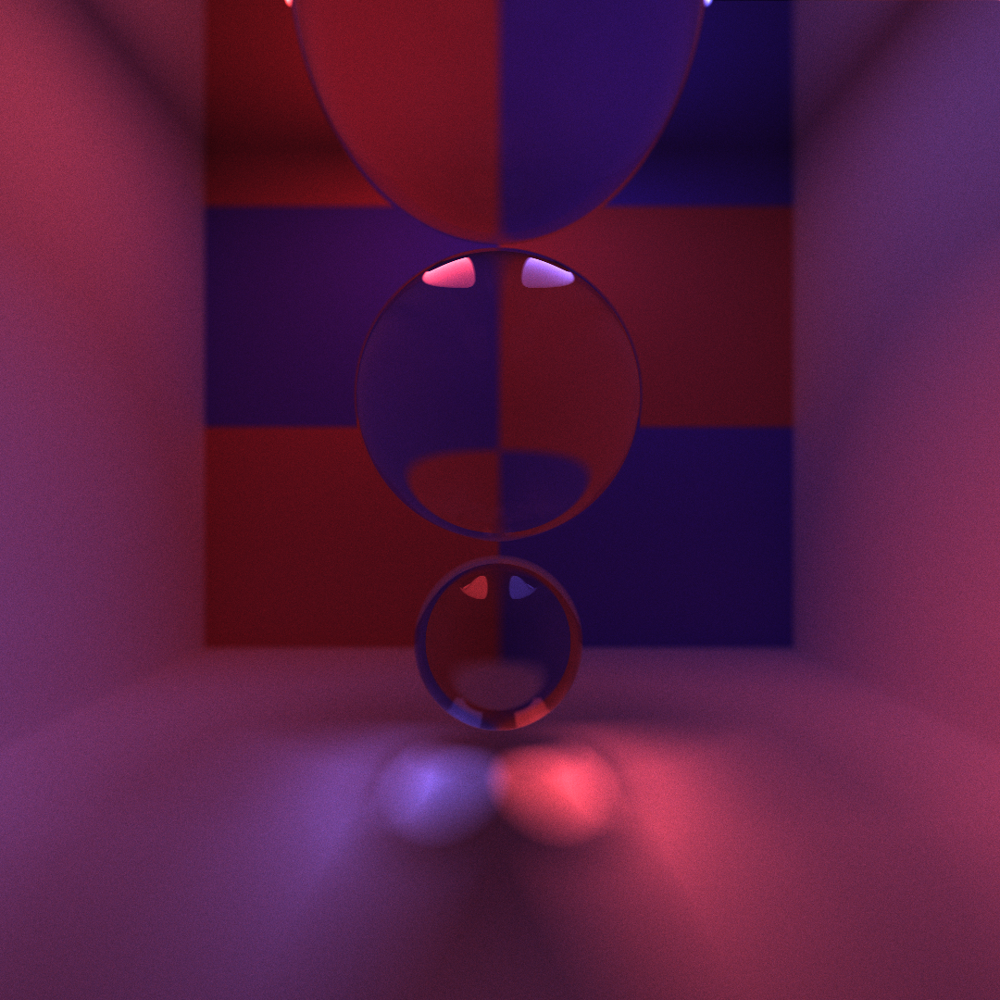

CUDA Path Tracer
================

**University of Pennsylvania, CIS 565: GPU Programming and Architecture, Project 3**

* Eyad Almoamen
  * [LinkedIn](https://www.linkedin.com/in/eyadalmoamen/), [personal website](https://eyadnabeel.com)
* Tested on: Windows 11, i7-10750H CPU @ 2.60GHz 2.59 GHz 16GB, RTX 2070 Super Max-Q Design 8GB (Personal Computer)

Introduction
================
I've built a GPU accelerated monte carlo path tracer using CUDA and C++. The parallelization is happening on a ray-by-ray basis, with the terminated rays being eliminated via stream compaction and sorted by material type in order to avoid warp divergence. The path tracer takes in a scene description .txt file and outputs a rendered image. 

Features implemented include:

* [Specular Reflective Material](#specular-reflective-material)
* [Refractive Material](#refractive-material)
* [Thin Lens Model DOF](#thin-lens-model-dof)
* [Motion Blur](#motion-blur)
* [Stochastic Antialiasing](#stochastic-antialiasing)
* [Direct Lighting](#direct-lighting)

Specular Reflective Material(#reflective-material)
================
The specular reflective material either reflects light perfectly (incident angle == exitent angle), or diffusely, the rate of each is manually set and the two percentages sum up to 100% (for example, if the material was 63% specular, it'd have to be 37% diffuse):

Refractive Material(#refractive-material)
================
The specular refractive material either reflects light or transmits it according to [Snell's Law](https://en.wikipedia.org/wiki/Snell%27s_law), the rate of each is based on the material type and index of refration. This is usually calculated by the [Fresnel Equations](https://en.wikipedia.org/wiki/Fresnel_equations), however, here I use the [Schlick approximation](https://en.wikipedia.org/wiki/Schlick%27s_approximation) to calculate the rates as it's more computationally efficient with a very low error rate:

Thin Lens Model DOF(#thin-lens)
================
I utilized the [Thin Lens Model](https://pbr-book.org/3ed-2018/Camera_Models/Projective_Camera_Models#TheThinLensModelandDepthofField) in order to replace the pinhole camera we have with a more realistic virtual lens which allows me to introduce depth of field effects and bokeh:

| Focal Distance | 0 | 3 | 8.5 | 20.5 |
| :------- | :-------: | :-------: | :-------: | :-------: |
| Iterations | 7759 | 5082 | 5142 | 5009 |
| Scene |  |  |  |   |

Motion Blur(#motion-blur)
================
I added a velocity component to the geometry struct and that allows me to render the image in such a way that it seems the object is moving in the direction of the velocity:

Stochastic Antialiasing(#antialiasing)
================
I added support for stochastic antialiasing by jittering the ray produced from the camera randomly within the range of a pixel length:

| Antialiasing | Without | With |
| :------- | :-------: | :-------: |
| Scene |  |  |
| Scene |  |  |

Direct Lighting(#direct-lighting)
================
To optimize the result and speed up the convergence of the image, I had the pathtracer trace its last ray to a light source in the scene, guaranteeing that we get light contribution. To demonstrate, I've rendered the same scene up to 1000 iterations with and without direct lighting:

| Direct Lighting | With | Without |
| :------- | :-------: | :-------: |
| Scene |  |  |

Performance Testing
================
I ran a few tests to see the effect of some of the optimizations I've performed on this path tracer:

The effect of caching is very much evident and it increases as the size of the image increases:

This is because we're precomputing a potentially very large computation, sparing ourselves the trouble for upcoming iterations

The effect of material sorting doesn't seem to be too encouraging; initially I tried testing it on a scene with one material, it wasn't an improvement (since we'd be sorting to avoid nonexistent warp divergence). However I switched to a scene with diffuse, reflective, and refractive material to no avail:

