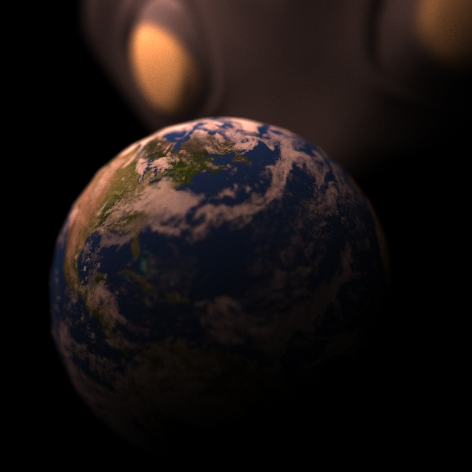

CUDA Stream Compaction
======================

**University of Pennsylvania, CIS 565: GPU Programming and Architecture, Project 2**

* Ryan Tong
  * [LinkedIn](https://www.linkedin.com/in/ryanctong/), [personal website](), [twitter](), etc.
* Tested on: Windows 10, i7-8750H @ 2.20GHz 16GB, GeForce GTX 1060 6144MB (Personal Laptop)

### Project Description
This project is a path tracer implemented on the GPU using CUDA. Specifically, the path tracer shoots out rays from the camera and bounces the rays arround to accumulate a color and does this over many iterations to generate an image. By using path tracing, we are able to render images with features such as global illumnation, color bleed, and 'free' soft shadows.

### Project Features
This project has the following features:
1. Diffuse surfaces where rays bounce of the surface randomly
2. Specular surfaces where rays bounce of the surface in a predictable way
3. Inperfect specular surfaces where rays probablistically bounce of the surface in a diffuse or specular way
4. Refractive surfaces where rays are refracted into the object
5. Physically based depth of field
6. Stochastic sampled anti-aliasing
7. Direct Lighting

### Different Materials
The effect of different materials (diffuse/specular/refractive) is acheived through a shading kernel which evaluates the direction that the incoming ray should bounce. Specifically, diffuse surfaces reflect rays randomly in the hemisphere of intersection, specular surfaces reflect rays in the surface normal direction, and refractive surfaces refract rays into the object according to snells law. This gives the following effect:
### Perfectly Diffuse

### Perfectly Specular

### Imperfect Specular (Diffuse and Specular)

### Refractive

### Physically Based Depth of Field
A depth of field effect can be achieved by simulating a lens effect. To do this, we must determine a lens size and focal length where the image will be in focus. 
### Close Object (Focal Length = 9)

### Far Object (Focal Length = 13)

### Stochastic Sampled Anti-Aliasing
Anti-aliasing can be acheived by jittering the rays shot from the camera such that they no longer always point to the center of the pixel. Since we do this randomly at the beggining of each iteration, the first bounce caching optimization (disscussed below) is no longer valid since the rays no longer intersect at the same spot for every iteration.
### Anti-Aliasing Comparison

### Direct Lighting
A path traced scene can be made brighter by having rays have their final bounce directed towards a lightsource. In my implementation, if a remaining ray only has used its last bounce, then I randomly select a light source and randomly select a point on the light source and set the ray direction to that point. 

