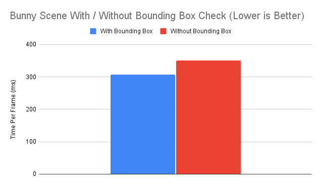

CUDA Path Tracer
================

**University of Pennsylvania, CIS 565: GPU Programming and Architecture, Project 3**

* Yilin Liu
  * [LinkedIn](https://www.linkedin.com/in/yilin-liu-9538ba1a5/)
  * [Personal website](https://www.yilin.games)
* Tested on personal laptop:
  - Windows 10, Intel(R) Core(TM), i7-10750H CPU @ 2.60GHz 2.59 GHz, RTX 2070 Max-Q 8GB

Features
=============
* Shading Kernel with BSDF Evaluation
* Path Termination using Stream Compaction
* Sorting of Paths Segment by Material type
* First Bounce Intersection Cache
* Uniform diffuse
* Perfect Specular Reflective
* Refraction (Fresnel dielectric)
* Stochastic Sampled Antialiasing
* OBJ Mesh Loading using TinyOBJ
* Physically-based depth-of-field
* Motion Blur

Path Termination using Stream Compaction
============
CUDA can only launch a finite number of blocks at a time. Some threads end with only a few bounces while others may end with a lot. Therefore, we will waste a lot of threads. 

To solve this problem, we launch a kernel that traces ONE bounce for every ray in the pool. The ray should be terminated while its remaining bounce equals 0 (reaches the limit or hits the light source). According to the results, we remove terminated rays from the ray pool with stream compaction. Therefore, we free idle threads and could save many computation resources.

I initially tested with the Cornell Box scene and it does not seem to have a difference. However, if I switch the camera directly towards the light(ray will be terminated and removed by stream compaction), we can see that the method gives an improvement to the overall performance.

| With vs Without Stream Compaction |
:-------:|
|{:width="800px"}|

Sort by Materials Type 
============
Using Radix Sort by material ID, we can batch rays according to material type. Therefore, we can further parallelize rays and perform intersection testing and shading evaluation in separate kernels. 

We tested the method in a scene that has more than 10 material types. We can see from the figrue below that there is no sigificant difference between two methods, altough turning material sort on will be slightly faster.

| With vs Without Material Sorting |
:-------:|
|{:width="800px"}|

First Bounce Intersection Cache
============
We further cache the first bounce intersection and store it in a buffer. Later bounces can use it since this bounce stays the same regardless of iterations. 

From the figure below, we don't see a sigificant difference with our single bunny object. Perhaps this will work in scenarios with denser objects or high resolution. 

| With vs Without First Bounce Intersection Cache |
:-------:|
|{:width="800px"}|

Refraction
===========
The refraction effects was implemented using glm's `refract()` function according to Schlick's approximation and Snell's Law. 

| Refraction Ball | Refraction Glass Bottle |
:-------:|:-------:
|||

Anti-aliasing
===========
The anti-alising was implemented by jittering the direction of sample ray with random numbers. From the figure below, we find that the result is acceptable.

| With AA | No AA |
:-------:|:-------:
|||
|{:height="800px" width="800px"} | {:height="800px" width="800px"}|

Mesh Loading
===========
I used [tinyObj](https://github.com/tinyobjloader/tinyobjloader) to load obj file. During the loading, we determine the min and max bound of the mesh for bounding box check so that ray does not have to compute intersection with every triangle. 

For each ray, there may be multiple intersection with the mesh. Therefore, we need to select the closest one.

| Bunny | Refraction |
:-------:|:-------:
|||

For a single bunny scene, we can see that adding a bounding box could improve the performance by ~10%.

| With vs Without Bounding Box |
:-------:|
||

Depth of Field
============
I implemented a physically-based thin lens model camera with focal distance and lens radius based on [pbrt6.2.3](https://www.pbr-book.org/3ed-2018/Camera_Models/Realistic_Cameras). The idea is that, instead of a pinhole camera model, the ray falls on a disk area of the lens and then focus onto the focal plane. We sample points on the disk and re-compute the ray origin(points on the lens) and direction (towards points on focal plane). 

| Focal Distance: 10, Lens Radius: 0.5 | Focal Distance: 10, Lens Radius: 1.0 |
:-------:|:-------:
|||

Motion Blur
===========
I developed two ways to achieve motion blur in path tracer. The first one works on the camera and it is global based. It simply adds offset to the sample direction with respect to the iterations.

| Sphere Motion Blur 1 | Sphere Motion Blur 2 |
:-------:|:-------:
|||

The second one works on certain objects and users can define a direction of the movement. By adding offset to objects, there will be an echo remained at the original place due to the sampling delay at that region. 

| Camera Motion Blur 1 | Camera Motion Blur 2 |
:-------:|:-------:
|||

Bloopers
===============
  | *Refraction Fail* |
|:--:|  
 ||
 

  | *Lonely Cow (Bounding Box Predicate Fail)* |
  |:--:|
  ||
   
Reference
===============
[tinyObj](https://github.com/tinyobjloader/tinyobjloader)

[pbrt](https://pbrt.org/)