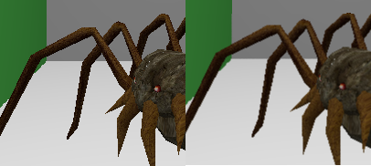

## 
 University of Pennsylvania, CIS 565: GPU Programming and Architecture 

# 
 CUDA Path Tracer 

- Name: Tongwei Dai
	- [LinkedIn Page](https://www.linkedin.com/in/tongwei-dai-583350177/)
- Tested on: Windows 10, i7-8700 @ 3.20 GHz 16GB, RTX 2070

## Feature List
### Visual Features
- [x] Simple Diffuse
- [x] Perfect Reflection
- [x] Fresnel-Modulated Specular Reflection and Refraction
- [x] Microfacet Reflection
- [x] Transparency
- [x] Antialiasing
- [ ] Depth of Field

### Performance
- [x] AABB bounding box
- [x] Octree Spatial Partition
- [x] First Bounce Caching
- [x] Ray Parallelization using Stream Compaction
- [x] Sort by Material Type

### Other
- [x] Pausable, Restartable Ray Tracing
- [x] Arbitrary .obj file Loading
- [x] Diffuse, Normal Texture, Per-face Material
- [x] Octree/AABB Visualization using ImGui

## Showcase
### Simple Diffuse, Refraction, Transparency, and Microfacet

### Anti-aliasing

### Mesh Loading

### Diffuse Texture Sampling

### Normal Mapping
- the left hand side shows the object without normal mapping, while the right hand side shows the object with a normal map

### Octree Spatial Partition

### Restartable Ray Tracing (Saving & Loading)
