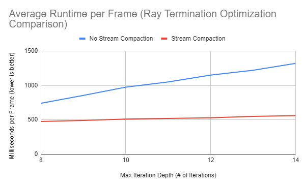
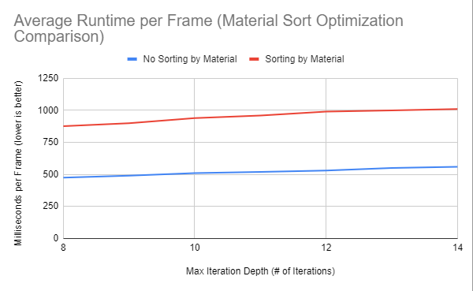
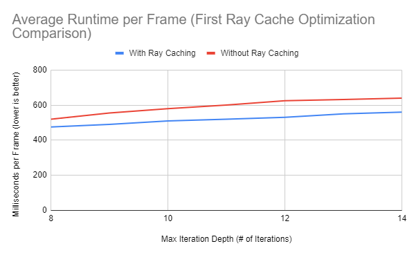
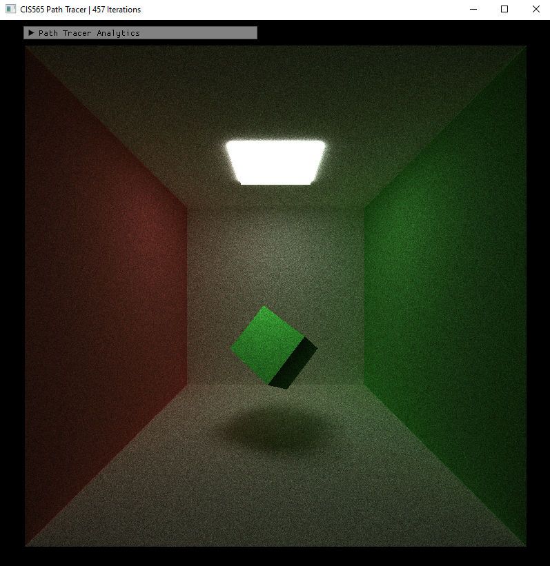
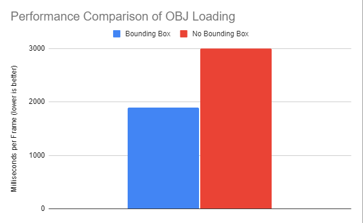
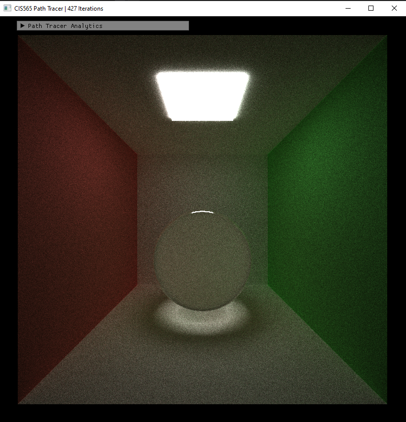
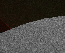
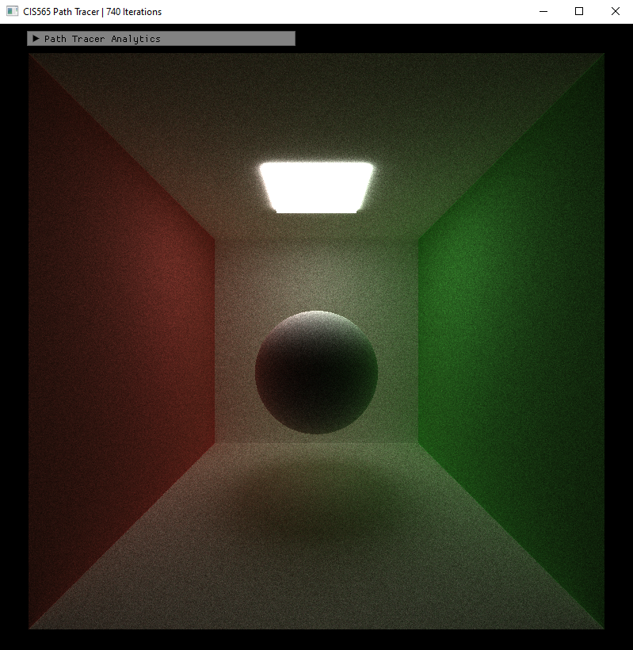

CUDA Path Tracer
================

**University of Pennsylvania, CIS 565: GPU Programming and Architecture, Project 3**

* Edward Zhang
  * https://www.linkedin.com/in/edwardjczhang/
  * https://zedward23.github.io/personal_Website/
 
* Tested on: Windows 10 Home, i7-11800H @ 2.3GHz, 16.0GB, NVIDIA GeForce RTX 3060 Laptop GPU

## Background
The Cuda Path Tracer Project - The Big Boi

## Representative Render

### Requirements Fulfilled
#### Core Features
- Ideal Diffuse
- Specular (perfect and imperfect)
- Ray Termination using Stream Compaction
- Contiguous Memory Usage for Difference Materials
- Caching the first ray bounce
#### Additional Features
- OBJ Loading (with bounding box) (2)
- Refraction using Schlick approximation (2)
- Physically based Depth of Field effect (2)
- Antialiasing (2)
- Stratified Random Hemisphere Sampling (3)

## Ideal Diffuse

An ideal diffuse material shows the characteristics of being a perfectly smooth matte surface; approximated by lambertian shading in rasterization but it only judged by multiplicative color accumilation in this path tracer.
## Specular
Specular materials showcase the characteristics of being polished or shiny. Reflective in nature, meaning that rays that interact with this surface are reflected away from the surface in a more focused manner.

### Perfect

Perfectly specular materials are like mirrors since reflection angles are deterministic.
### Imperfect

Specular Exponent: 100 (As the exponent increases, the surface gets closer and closer to being perfectly specular.

Imperfectly specular materials are just shiny since reflection angles are, while more focused than diffuse materials, nondeterministic.
## Stream Compaction

Remove all rays that hit nothing in the scene; this significantly improved performance as maximum iteration depth was increased; this is likely because there were less rays to process the deeper into the iteration we had to go when we had stream compaction active. 

Numbers taken with material sort inactive, but with ray cache active.

## Material Sorting in Memory

Sort all ray intersections by the materials they hit with the intent of enabling memory coalescence for bsdf interactions based on different materials. This did not pan out to be an optimization; the sort employed by thrust sort seems to only have added a constant lump sum runtime for the actual runtime of the employed sorting algorithm.

Numbers taken with with ray cache and ray terminiation active.

## Ray Caching

The first rays cast into the scene are deterministic based on the camera's position; thus there is no need to recalculate their interactions and intersections for each iteration that the Pathtracer renders. This offered a marginal improvement in runtime that gradually widened as max iteration depth was increased; this is likely because the increased depths allowed for more work saved by ray caching. 

## OBJ Loading
 
Tested this implementation against importing a basic cube that was stored as an OBJ.

Implemented functionaltiy loads in an arbitrary, but untextured mesh. Implemented bounding box acceleration data structure as well.

Performance is significantly improved when loading the Low Poly Among Us Crewmate obj into the scene as shown in chart above. This is because the triangles inside of the bounding box did not need to be individually tested for intersection unless the ray was actually inside of that bounding box of the object itself.

## Refractive

Refractive materials like glass both refract and reflect light. Using schlick approximation, we nondeterministically have some rays get refracted into the object while other rays are reflected away.

## Depth of Field

Focal Dist of 12
Lens Radius of 1

Lenses in real life have radii and focal distances (based on their concavity) which bend light rays in a way that only certain objects a certain distance away are actually in focus. This is approximated using random disk sampling to artificially bend cameras cast into screen space.

## Antialiasing

Sending out multiple rays approximated by small scale directional jitter per camera ray per pixel to get sub-pixel values.

Close up of a sphere with Anti Aliasing applied.

Close up of a sphere without Anti Aliasing applied.

A closer look:

Less iterations but smoother.

More iterations but more jagged edges.

## Stratified Sampling
Improve random hemisphere sampling by using a grid to stratify the portions of the hemisphere upon which we sample ray directions.

Random ray bounces employing stratified random hemisphere sampling.

Standard random ray bounces used for random hemisphere sampling.

The shadows are slightly different in terms of noise levels, though they converge to very similar results.

## References

* [PBRT] Physically Based Rendering, Second Edition: From Theory To Implementation. Pharr, Matt and Humphreys, Greg. 2010.
* Antialiasing and Raytracing. Chris Cooksey and Paul Bourke, http://paulbourke.net/miscellaneous/aliasing/
* [Sampling notes](http://graphics.ucsd.edu/courses/cse168_s14/) from Steve Rotenberg and Matteo Mannino, University of California, San Diego, CSE168: Rendering Algorithms

## Bloopers

These are my most visually interesting bloopers; I got lots of black and white screens. Most of my obj loading bloopers were just the object not showing up in the scene.
