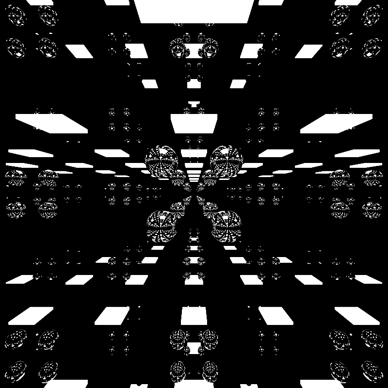

CUDA Path Tracer
================

**University of Pennsylvania, CIS 565: GPU Programming and Architecture, Project 3**

* Zhangkaiwen Chu
  * [LinkedIn](https://www.linkedin.com/in/zhangkaiwen-chu-b53060225/)
* Tested on: Windows 10, R7-5800H @ 3.20GHz 16GB, RTX 3070 Laptop GPU 16310MB (Personal Laptop)

This project implement a CUDA-based path tracer.

## Core Features
* A shading kernel with BSDF evaluation for ideal diffuse surfaces and non perfect specular-reflective surfaces.

  Perfect reflection
  

  Non perfect reflection
  

* Path termination using stream compaction.

I implemented this function by directly using thrust::partition for best performance.

* Sort the rays by material type.

I implemented this function by directly using thrust::sort_by_key.However, it actually lower the performance.

* Cache first bounce intersections to speed up. 

## Visual Improvements
* Refraction.

Refraction is implemented based on the approximated fresnel equations in this [note](http://psgraphics.blogspot.com/2020/03/fresnel-equations-schlick-approximation.html). 

Upper left is a blue sphere with refractive index = 2.0, and middle right is a white sphere with refractive index = 1.5.

* Stochastic Sampled Antialiasing.

Stochastic sampled antialiasing is implemented according to this [note](http://paulbourke.net/miscellaneous/raytracing/).

Mirror room without antialiasing

Mirror room with antialiasing

The effect of antialiasing is very obvious. The image generated with antialiasing have far more details. And since there is only perfect reflection, the image do not change after the first iteration without using antialiasing.

* Physically-based depth-of-field.

Physically-based depth-of-field is implemented according to PBRT 6.2.3.

This picture is generated with focal length = 10.5 and lens size = 1.0. The sphere in the middle lays on the focus plane. The bottom-left sphere is a perfect reflective sphere moving from back to front.

* Motion blur.

Motion blur is done by modifying the transformation matrix of a geometric object at each itreration. Only linear translation is implemented. Further work can include angular movements and complex trajectories.

The bottom sphere in this image is a reflective sphere moving from left to right.

## Performance Improvements
* Re-startable Path tracing.

I overwrite the command 'esc' to be exiting the rendering process and saving intermediate states, and add a command 'l' to load intermediate states. Saving the iteration number, camera settings and rendering->stats.image is enough for restarting the rendering. I save the intermediate states as a .txt file with each line a float number.  

## ANALYSIS

* Sort by material

Sorting is expected to increase the frame rate, since the threads in a ward is expected to excuete the same code, which will lower branch divergent. However, the rendering speed is actually lowered. Probabily because the sorting consumes too much time.

* Stream Compaction 

Stream compaction can compact the path nearly exponentially, both in the case of open environment and closed environment. This is as expected, since the probability that a random ray escape the scene (hit blank or light) is a constant. Although, the probability of a continual ray escape is dependent to the previous run, the randomness of diffuse and reflection makes the dependence weak.

* Caching

Closed scene

Open scene

Caching the first intersection makes the time elapsed per iteration lowered by a constant number, which is the time needed for calculating the first intersections and generating the rays.

