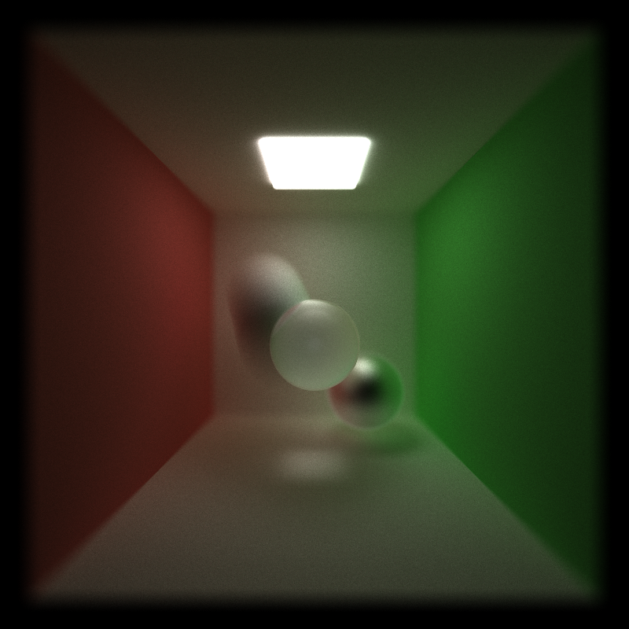

CUDA Path Tracer
================

**University of Pennsylvania, CIS 565: GPU Programming and Architecture, Project 3**

* Zhangkaiwen Chu
  * [LinkedIn](https://www.linkedin.com/in/zhangkaiwen-chu-b53060225/)
* Tested on: Windows 10, R7-5800H @ 3.20GHz 16GB, RTX 3070 Laptop GPU 16310MB (Personal Laptop)

This project implement a CUDA-based path tracer.

## Core Features
* A shading kernel with BSDF evaluation for ideal diffuse surfaces and non perfect specular-reflective surfaces.
* Path termination using stream compaction.
* Sort the rays by material type.
* Cache first bounce intersections to speed up.

## Visual Improvements
* Refraction.
* Physically-based depth-of-field.
* Stochastic Sampled Antialiasing.
* Motion blur.

## Performance Improvements
* Re-startable Path tracing.

## ANALYSIS
Sorting is expected to increase the frame rate, since the threads in a ward is expected to excuete the same code, which will lower branch divergent. However, the rendering speed is actually lowered. Probabily because the sorting consumes too much time.

The effect of caching the first intersection is not obvious. Also, it conflicts with anti aliasing. Detailed analysis will be done later.

