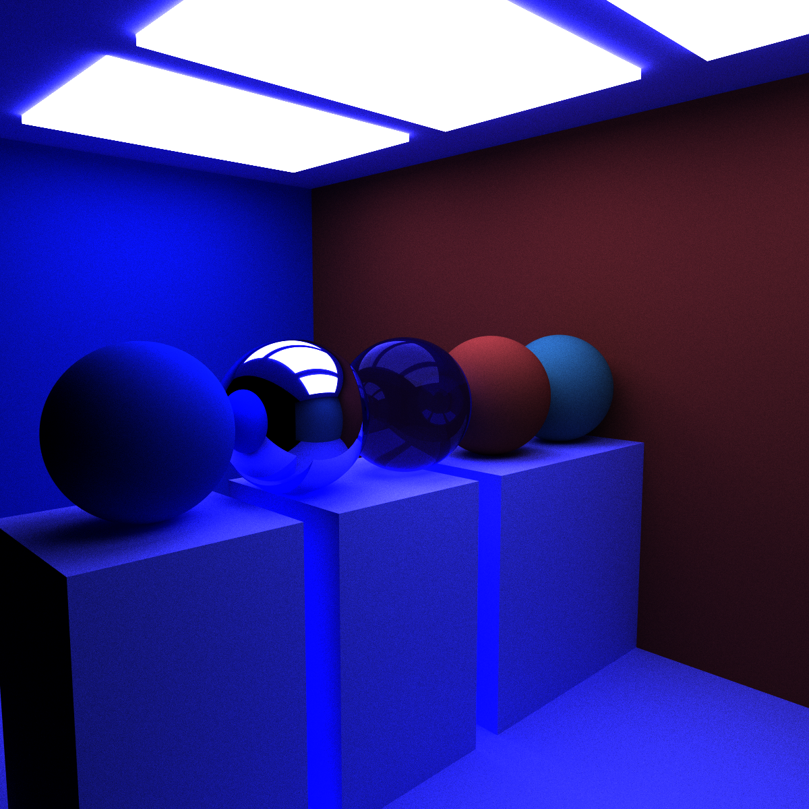

CUDA Path Tracer
================

**University of Pennsylvania, CIS 565: GPU Programming and Architecture, Project 2**

* Shutong Wu
  * [LinkedIn](https://www.linkedin.com/in/shutong-wu-214043172/)
  * [Email](shutong@seas.uepnn.edu)
* Tested on: Windows 10, i7-10700K CPU @ 3.80GHz, RTX3080, SM8.6, Personal Computer 

In this project, I implemented GPU Path Tracer with multiple features and learned the foundamentals of path tracing and physical based rendering.

## Feature List
### Core Features 
- Shading kernel with BSDF Evaluation for Diffuse and Specular
- Path continuation/termination using Stream Compaction
- Toggleable ray sorting/first-bounce caching

### Visual and Performance Features
- Refraction
- Physically-based Depth of Field
- Stochastic Sampled Antialiasing
- glTF mesh loading with AABB Bounding Box
- Texture Mapping and Bump Mapping
- Direct Lighting
- Naive Post Processing

### Shading Kernel With BSDF Evaluation for Diffuse/Specular/Refraction
The first part I did was to implement the basic BSDF evaluation, where reflection/refraction/diffusion are distributed based on every object's material, and refraction is distributed based on Fresnel's computation and Schlick's approximation. Here is a picture with three different kind of material in it.

Left: Diffuse Material Colored with Klein Blue 
Middle: Perfect Specular 
Right: Refractive with an index of refraction of 1.52(Glass)

Another Refraction:

### Stream Compaction & Ray Sorting & First Bounce Caching
To make the path tracer more efficient, we did three optimizations: Stream Compaction, Ray Sorting, and First Bounce Caching.

Stream Compaction removes the unnecessary ray paths every iteration until every ray finishes its bounce. This saves a lot of computation from kernel and brings up the performance. I use thrust::partition to fulfill this step.

Ray sorting helps us sort the intersections based on materialId for memory coalescing. I use thrust::sort_by_key to do key-value sorting. The performance is significantly slowed down by the sorting process when the scene is comparatively simple(No mesh/texture loading), and is similar to the performance without sorting when the scene is very complex(multiple shapes, multiple meshes and 100K+ Triangles)

First Bounce Caching let us cache the intersection data at the first bounce. Because in our method every ray start at the same spot at the same pixel, so the first bounce will save the first round computation for the later rays. I did not notice a significant improve in performance with First Bounce Caching, but it still make the performance better by 1 or 2 iteration per minute. 

### Depth of Field
Depth of Field is a technology we use to achieve vision we want with selected aperture radius and focal length. Objects located at the focal length within the aperture radius stay in focus, while others being blurred. (Tested with focal length 10, aperture radius 0.2)
DoF Off      |  Dof On | Another Dof
:-------------------------:|:-------------------------:|:---------------------:|
   |    | 

### Stochastic Anti-aliasing
To achieve anti-aliasing I jiggle the ray's direction with a small amount of value to smooth the sharp edge of every object. This only takes very little effort but end in a huge visual improvement. 
Anti-aliasing Off      |  Anti-aliasing On
:-------------------------:|:-------------------------:
   |  

### Mesh Loading and Texture Mapping
- To include better scenes and objects in this project, I use tinyglTF to load glTF file. 
- This framework is really hard for first-time user(like me), So I put a lot of time learning the framework and see how to import the mesh/texture. The hardest part probably is how to parse the data into GPU, since GPU does not support tinygltf classes. I construct similar classes in sceneStruct.cpp, so when we load the glTF file, we can copy and generate a GPU-compactible class in the program.
- The advantage of glTF over Obj is that it contains multiple materials/textures within an object, so you do not need to specify them in your program; with a correct implementation just specify a file will give you the right model. Of course there is more to glTF like animation/scene/node, but in this project we are only introducted to model loading.
- I use an AABB Intersection test to implement the culling, and smooth the triangles on meshes with barycentric interpolation.

Before I fully understand how to use glTF and use cudaTextureObj to load texture, I also implement a method for a loaded mesh to use specified material.
This CesiumLogoTexture is manually specified as an material, then pointed to the box. Textures are loaded as vectors of floats in this scenario. Also here is a comparison of a procedural checkboard and a textured checkboard. The difference at the side I think is caused by implementation, and you can see procedural generated checkboard has more aliasing effect, while the textured one(after the anti-aliasing process) is smoother.
Textured       |  Procedural
:-------------------------:|:-------------------------:
   |  

### Direct Lighting
I implemented a basic version of direct lighting, where at the second last bounce every ray will change its direction, going towards a random position that consists the light. To do this I will first do a iteration that will save light's position to an array. This will cause performance to go down, but the visual effects are significantly different from normal path tracing.
Without Direct Lighting       |  With Direct Lighting
:-------------------------:|:-------------------------:
   |  

### Naive Post Processing
A RGB color tinting is also implemented using an extra shader.

### Bloopers

This one is defined as a cube, but there is a space after cube("cube "), so it got generated as a sphere(Undefined behavior I assume)

