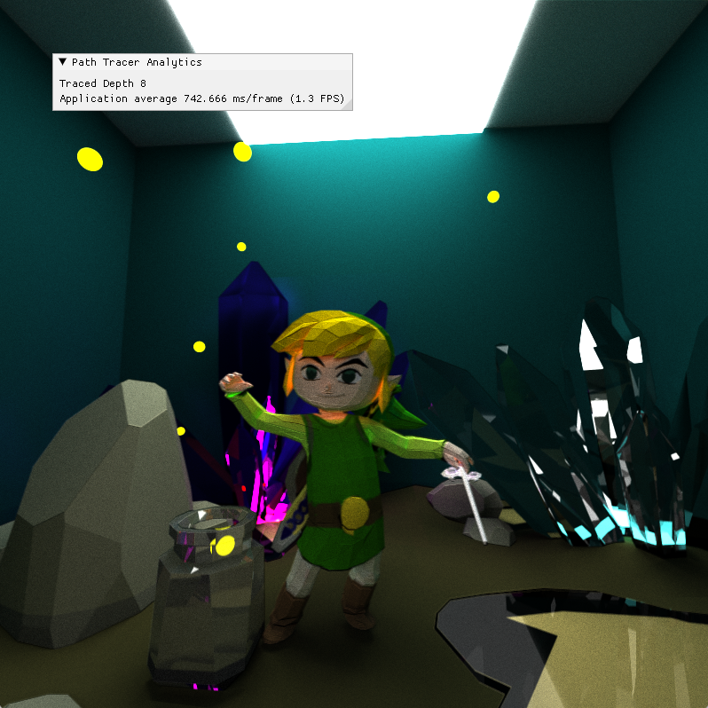

CUDA Path Tracer
================

**University of Pennsylvania, CIS 565: GPU Programming and Architecture, Project 3**

* Di Lu
  * [LinkedIn](https://www.linkedin.com/in/di-lu-0503251a2/)
  * [personal website](https://www.dluisnothere.com/)
* Tested on: Windows 11, i7-12700H @ 2.30GHz 32GB, NVIDIA GeForce RTX 3050 Ti

## Introduction

In 3D rendering, Pathtracing is a technique that generates realistic looking scenes/images by simulating light ray bounces. For this project, I implemented a CUDA path tracer for the GPU. In order to get the least noisy final output, 5000 calls to pathtrace are made whenever the camera is moved. The result of all pathtrace calls are then averaged to produce the final output. For this pathtracer, we parallelize operations by Rays (AKA Path Segments), and made sure to sync all threads before moving on to the next parallel operation.

Overall, this project is a continuation of learning how to write CUDA kernel functions, optimize performance by adding memory coalescence, and very simple acceleration structures. The second part of the project introduced me to using TinyObjLoader, CudaTextureObjects, and various rendering techniques to get specific types of images:

1. Core Features: 
*  Simple Diffuse, Specular, and Imperfect Specular BSDF shading
*  Path continuation/termination using stream compaction
*  Continugous arrangement of materials based on materialId
*  First-bounce-cache for a specific camera angle.

3. Additional Features
*  Refractive materials
*  Depth of Field
*  Direct Lighting
*  Stochastic-sampled antialiasing
*  Arbitrary Mesh Loader with TinyObjLoader
*  UV Texturing, Procedural Texturing, and Bump Mapping

## Core Features
1. Shading kernel with BSDF Evaluation for Diffuse and Perfect/Imperfect Specular.
3. Path continuation/termination using Stream Compaction
4. Contiguous arrangement of materials based on materialId
5. First bounce caching

## Additional Features
### Refractive Material

### Depth of Field

### Stochastic Sampled Anti-Aliasing

### Direct Lighting

### Arbitrary Mesh Loading with TinyObjLoader

### UV Texture, Procedural Texture and Bump Mapping

## Performance Analysis

## Bloopers! :)

Too much antialiasing: me without my contacts

