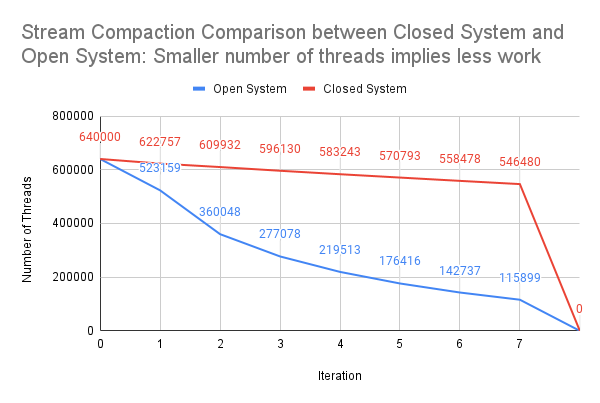
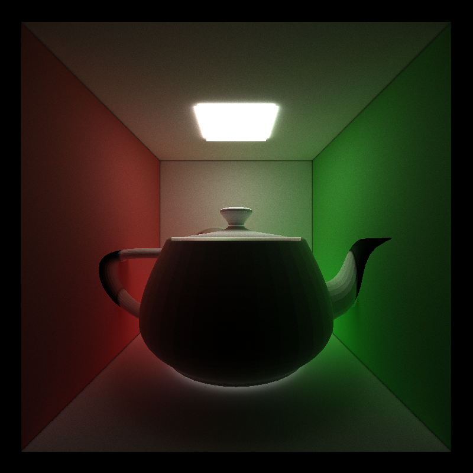
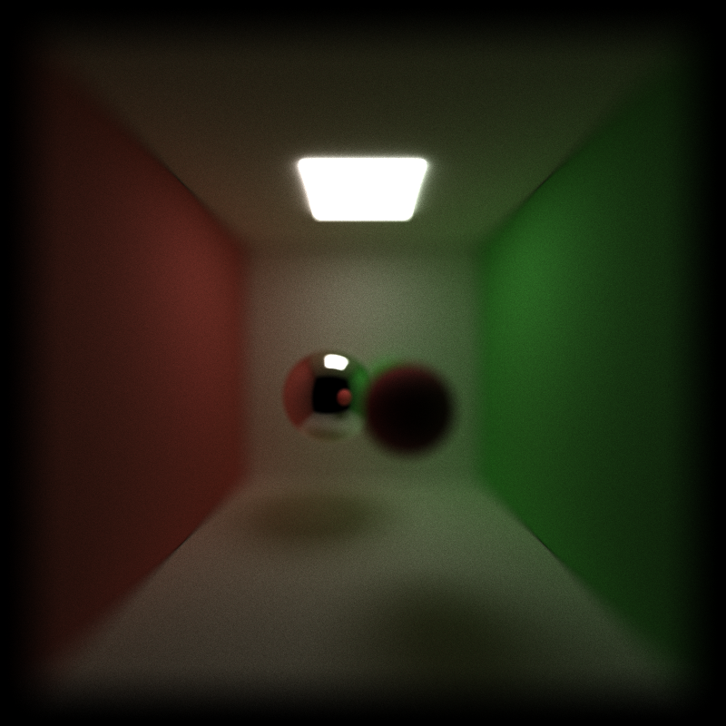
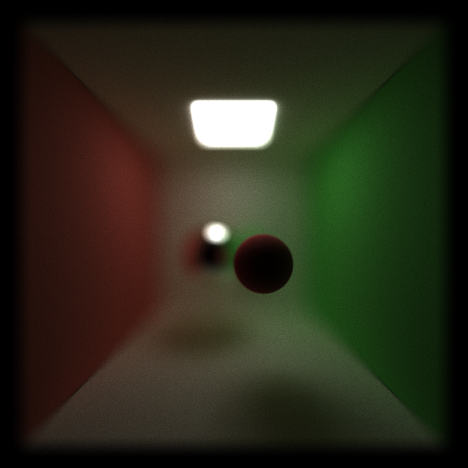
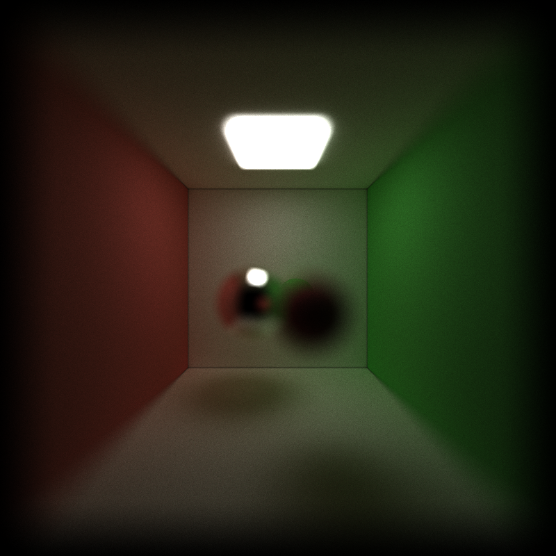
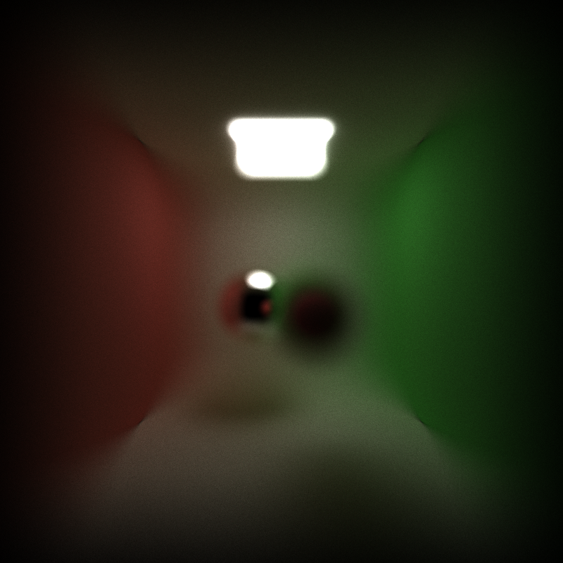
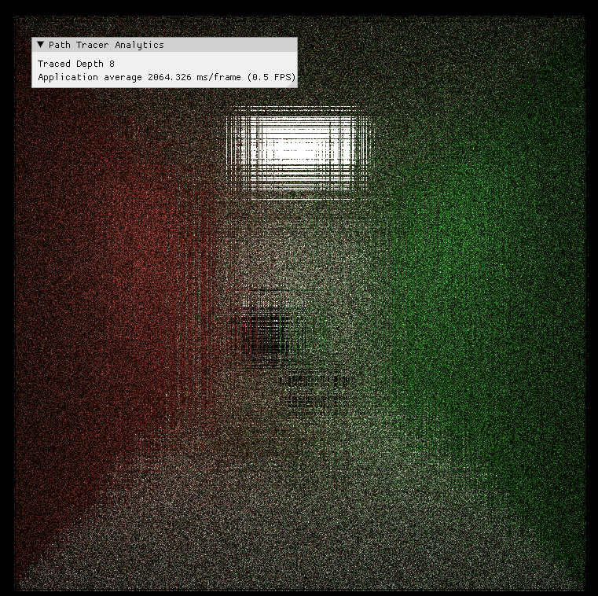

CUDA Path Tracer
================

**University of Pennsylvania, CIS 565: GPU Programming and Architecture, Project 3**

* David Li
* [LinkedIn](https://www.linkedin.com/in/david-li-15b83817b/)
* Tested on: Windows 10, Intel(R) Core(TM) i9-10980HK CPU @ 2.40GHz 32Gb, GTX 2070 Super (Personal Computer)

[Repo Link](https://github.com/theCollegeBoardOfc/Project3-CUDA-Path-Tracer)

### Why Path Trace?

The primary motivation behind path tracing is to properly render light in a scene. This is done essentially by shooting several rays into a scene, letting them bounce around and accumulate color. If however, this is only performed once, the render looks rather poor, thus we instead will repeat the process hundreds sometimes thousands of times and take an average of all those colors to yield a final sample. This takes a rather long time: an 800x800 resolution image would have 640000 pixels, we would shoot out at least one ray (sometimes more) per pixel for each sample, if we take 5000 samples, then the path tracer would be shooting out 3.2 billion rays. This rendered scene shoots out four times more rays than that.

This scene is rendered with around 1000 samples.

### "Embarassingly Parallel"

Perhaps the one saving grace about all those rays is that much of the work in path tracing can be parallelized. The color accumulated by one ray does not depend on the color of another. The CPU can only parallelize a small quantity of processes, capped by number of cores on the CPU. The GPU on the other hand was designed for this kind of work. Thousands of processes can be run on the GPU at once, making that 3.2 billion figure a lot less daunting.

### Stream Compaction

Simply developing the path-tracer on the GPU rather the CPU yields an incredible increase in performance, but we can still do better. The first major step in improving performance is to do stream compaction on terminated rays. In order to properly simulate light, every single ray bounces around the scene until one of three termination conditions. 1. It hits a light. 2. It hits nothing. 3. It reaches its maxdepth. Hitting the max depth is the latest a ray will terminate. It's basically telling the ray, "Ok you've gone on long enough, time to just tell me what you have and move on." Going to max depth for a ray is the worst case scenario, we would much rather the ray not hit anything or hit a light, these are earlier termination conditions, and are the reason stream compaction works. For a single sample, here is the effects of stream compaction. 

As the depth increases, we have to do less and less work because stream compaction is removing terminated rays. Also, note that there are zero rays at depth 8, this was the max depth, so all rays were terminated. The next chart compares a closed system and an open system. The open system has no wall behind the scene, meaning ray can terminate by bouncing out and hitting nothing. The closed system has a wall behind the scene, meaning any ray that would have bounced out are reflected back into the scene.

As is likely expected: the closed system benefits much less from stream compaction. One of ray termination condtions, not hitting anything, will never be satisfied under the closed system. 

### Other performance "improvements"
Another "improvement" that was introduced was sorting by material type. In other words, when the rays intersect an object that object has a material type which encompasses objects color, emittance and how rays should bounce off it. If we sort by material type, then we leverage the architecture of the GPU to be more efficient. This is because processes or threads are executed in groups of 32: called a warp. If just one thread in a warp is running, then the other 31 threads just sit idle. By sorting by material, we minimize the chance of this sort of thing happening with the idea that rays with the same material type will do a similar amount of work and terminate at around the same time. Unfortunately, this did not really work out, on running a test scene, the FPS (frames per second) on the render dropped ever so slightly from a little over 4.0 to around 3.9. this is bad and is likely because the work of sorting by materials takes longer than the amount of time saved by the sorting. Another performance improvement that actually increased performance was caching the fist bounce. For every sample we take, the first ray intersection is almost always the same, so we can save this first bounce and reuse it. For the test scene this almost doubled the FPS from 4.0 to hovering around 6.0. Testing both at the same time gave an FPS of around 5.0. 
 
Here is the test scene for reference.

### Depth of Field
Often times in photography, the camera can focus on a subject while making the background blurry. This effect is known as depth of field. There are two paramaters to consider when simulating this effect in a path tracer. Focal length and aperture. In layman's terms, focal length is how far away the in focus part should be, and aperture is how blurry the blurry part should be. The way we achieve this effect is actually quite simple. Every ray has an origin (a starting point) and a direction. What we can do is calculate the point on the ray's direction that would be at the focal length, then randomly jitter the origin based on the aperture, and lastly recalculate the new direction using the jittered origin to the point at the focal length. The intuition behind this is that if our intersection is at the focal length, our ray will be exactly the same. The further away the intersect is from the focal length, the more the new ray will be off from the old ray. If we compound this effect over thousands of samples, we get the depth of field effect. 
 
 
Following Render- Focal Length: 10. Aperture: 1. Notice the reflective sphere is crisp, and the scene get blurrier when further away from it.

 
 
Following Render- Focal Length: 7. Aperture: 1. Focal Length decreased and now the sharper part of the image is closer.

 
 
Following Render- Focal Length: 15. Aperture: 1. Focal Length increased and now the sharper part of the image is at the back wall.

 
 
Following Render- Focal Length: 10. Aperture: .2 Focal length is 10 so the reflective sphere is in focus. Note that the aperture is very small, that means we move the ray origin very little and get very little blurring.

 
 
Following Render- Focal Length: 10. Aperture: 3 Increasing the apperture makes the blurry parts much blurrier.

 
 
Admittedly, getting this to work took a lot longer than it should have. 

 
 
This pile of mess occured because I was not properly changing my random numbers. The random number generator I was using requires a seed. This seed is generated using a number of inputs, one of them being a pixel index. Instead of indexing every pixel uniquely. I indexed using x and y. This means pixels that share the same row and column were getting the same random number. Hence all those lines. After figuring this one out, I stumbled upon this. 

 
 
This happens because I was till caching the first bounce. Meaning the ray was shooting into the exact same spot for every sample. 

### Anti-Aliasing
[Paul Bourke](http://paulbourke.net/miscellaneous/raytracing/) provides a great explaination of this. Basically, the goal is to create smoother transistions between pixels. We do this by shooting more than one ray per pixel, randomly offseting their origins, and averaging their colors at the end. 
 
 
Here is a render without anti-aliasing.

 
 
Here is a render with anti-aliasing

