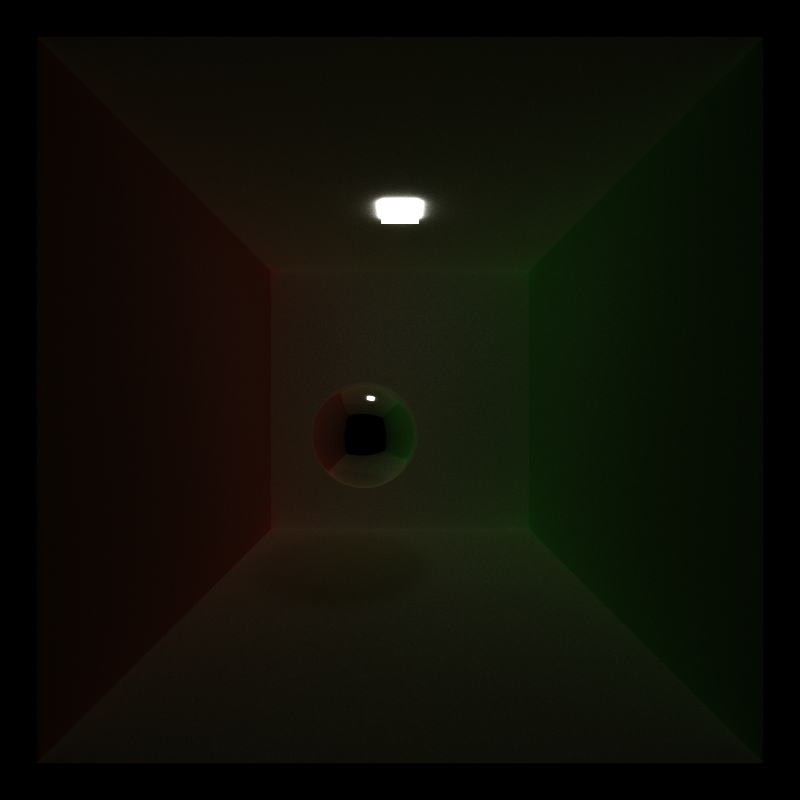

CUDA Path Tracer
================

**University of Pennsylvania, CIS 565: GPU Programming and Architecture, Project 3**

An implementation of a path tracer including simulated diffuse, specular, and refractive materials, loading from checkpoints, Anti-Aliasing, and Depth of Field.
* Tom Donnelly
  * [LinkedIn](https://www.linkedin.com/in/the-tom-donnelly/)
* Tested on: Windows 11, AMD Ryzen 9 5900X, NVIDIA GeForce RTX 3070 (Personal Desktop)

---
## Materials
Materials are able to be loaded from a scene including RGB color, specular color, diffuse, specular, and refraction interactions with light.

Diffuse:

Perfectly Specular:

Imperfect Specular:

Refraction with Fresnel Effects:

---

## Stream Compaction
An optional flag can be set to stream compact terminated threads in the path tracer after they've reached their bounce limit, hit a light, or exited the scene. We can examine how this affects performance for a number of scenes. 
Cornell          |  No Walls | Big Light | Small Light
:-------------------------:|:-------------------------:|:-------------------------:|:-------------------------:
       |   |  | 

Stream compaction greatly reduces the number of running rays in a iteration of pathtracing for open or well lit scenes as seen in No Walls and Big Light. When there are not early opportunities for rays to terminate then stream compaction does not have a large impact, as seen in Small Light and Cornell.

When rays can terminate early, stream compaction greatly reduces running time for higher depth ray tracing. No Walls with compaction average iteration time stayed constant for all tested bounces as it was able to terminate early. Cornell achieved better running time without compaction at 128 bounces where the tradeoff between the stream compaction overhead and simulating terminated rays became favorable. This could be optimized in the future to reduce runtime in stream compaction leading to better runtimes at smaller depths. 

---
## First Bounce Cache
An optional flag can be set to cache the first intersection a ray will have with objects in the scene. As the rays path and direction are deterministic until the first bounce we can reuse this cache for subsequent iterations. We can examine the performance impact of this feature.

Caching the first bounce does not have a large impact on performance, with the average iteration time being about the same for multiple iteration depths. This is surprising as caching the first bounce would likely have a larger impact on low depths and small impact at high depths. It may be that this affect is only visible over very long iteration times or that there is enough overhead in copying the cache memory to counteract any performance benefits 

---
## Material Sorting
Materials can be sorted to be contiguous in memory using a flag. This may improve performance by allowing threads in the same warp to not be divergent due to different material shading requirements.    

Material sorting did not improve performance and greatly slowed the average iteration time when enabled. This may be because the scene tested is too simple and does not have enough materials for sorting to give any benefits over the overhead of sorting the materials buffer. This can be improved by testing on a more expensive scene when mesh loading is created and seeing if there is any performance increase.

---
## Anti-Aliasing  
| No AA  |  AA  |
|:-------------------------:|:-------------------------:|
|   |   |
|   |   |

Anti-Aliasing was implemented by jittering the ray inside a pixel as it is generated, creating noise that softens aliased edges. This option can be enabled by a flag but cannot be used with First Bounce Caching due to the randomness needed for implementation 

Anti-aliasing does not have a significant impact on performance. 

---
## Depth of Field

| DOF 0.1 Radius |  DOF 0.5 Radius  | DOF 1.0 Radius | DOF 10.0 Radius | No DOF |
|---	|---	|---	|---	|---	|
|  |   | |   |     |

Depth of field was implemented by jittering the rays origin in the camera to an offset focal point and then updating the rays direction. The blurriness can be set by adjusting the lens radius in the scenes camera option and the focal length and DOF flag can also be set.This option can be enabled by a flag but cannot be used with First Bounce Caching due to the randomness needed for implementation .

DOF does not have a significant impact on performance.

---
## Saving and Loading Checkpoints
Saving and reloading of the current path tracing iteration and camera angle can be done by pressing C at any point during the pathtracing iterations. The checkpoint documents are saved in the build folder under ./checkpoint. To load a checkpoint, pass the path to the checkpoint folder as the second argument to the pathtracer program.

Checkpoint filesize and time to load are based on the initial resolution of your path traced image. The image buffer as well as metadata is written to a text file and must be reloaded in order to load state. This can lead to a significant load time and file size for high resolution images. This could be optimized in the future by using a serialization library like boost or converting to a more compressed file format. 

### Install Instruction
git clone this repo
Add  to external/include/tinygltf  
mkdir build
cd build
cmake ..

Flags can be found in pathtracer.cu
DOF options are included in scene files under camera
Save a checkpoint by pressing c when running the program
Load a checkpoint by passing the path to the checkpoint as the second argument of the program
### Bloopers

Issues with ray bounces

Not offsetting intersection causing noise

Strange Refractions

Super zoomed in spheres getting DOF to work
