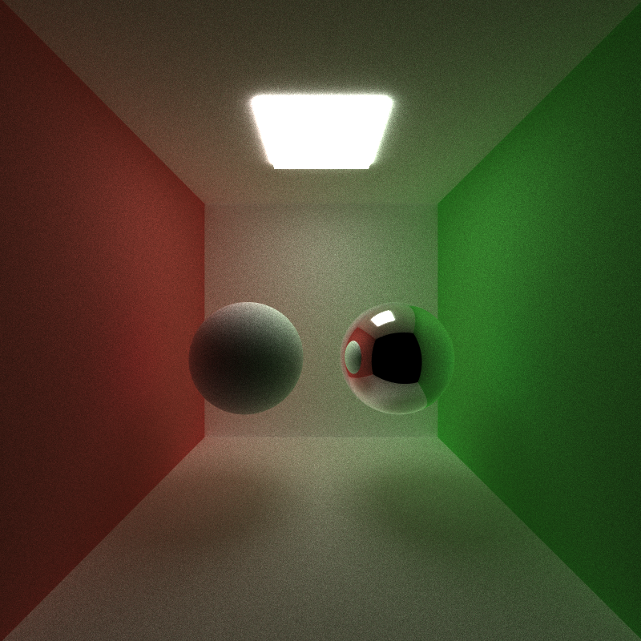
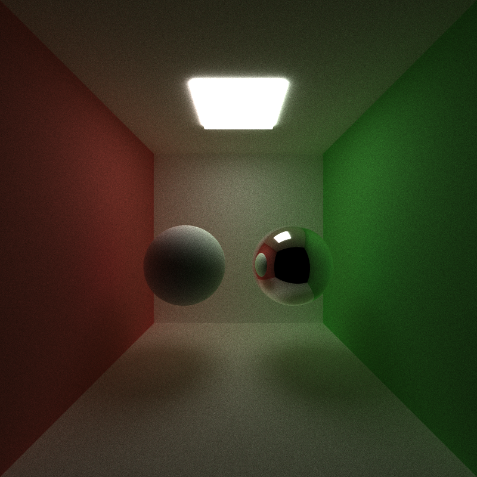

CUDA Path Tracer
============================

**University of Pennsylvania, CIS 565: GPU Programming and Architecture, Project 3**

* Runshi Gu
  * [LinkedIn](https://www.linkedin.com/in/runshi-gu-445648194/)
* Tested on: Windows 10, AMD Ryzen 7 5800X 8-Core Processor @ 3.80 GHz 32GB, RTX3070 24538MB, Personal

## Features Implementation
* Basic pathtracer

* Diffuse surface
* Specular reflective
* Specular refractive (Fresnel dielectric)
* OBJ Loading with bounding volume
* Toggleable Camera Depth of Field
* Toggleable Direct Lighting
* Anti-Aliasing
* Thread termination using Stream Compaction
* Toggleable thread sorting by material type
* Toggleable first bounce intersection cache

## Direct Lighting

* With Direct Lighting

* Without Direct Lighting

## Anti Aliasing

* Left With Anti-Aliasing; Right without Anti-Aliasing

