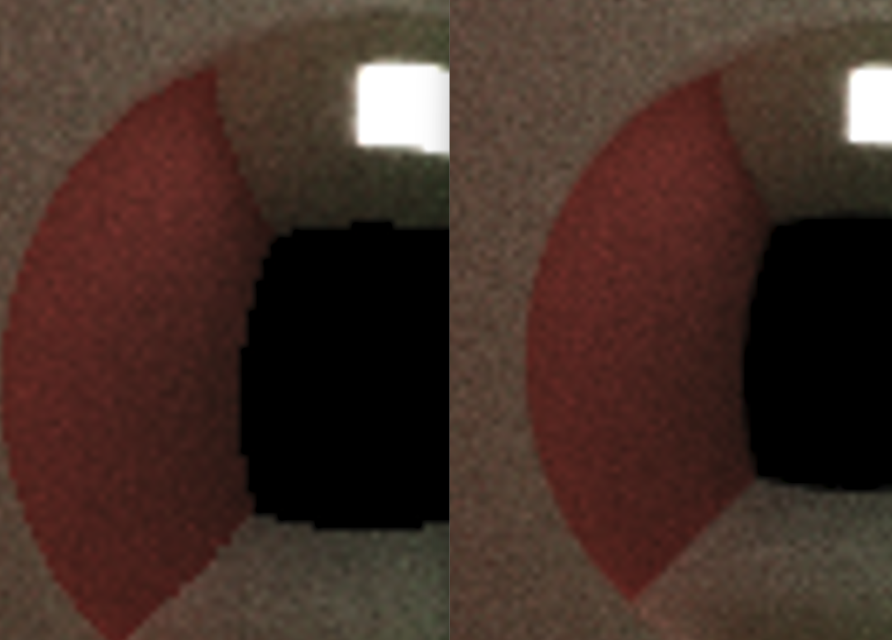
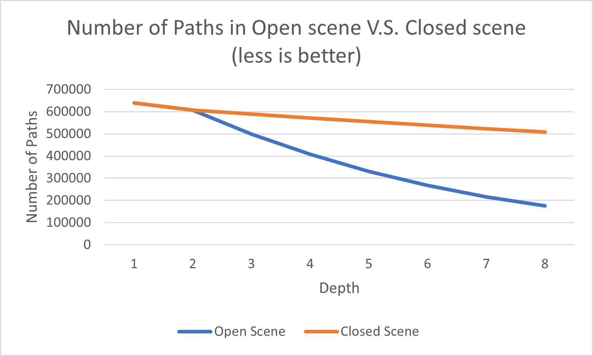
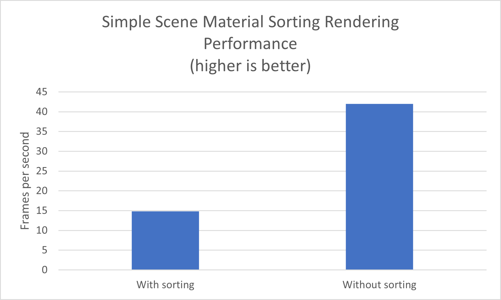
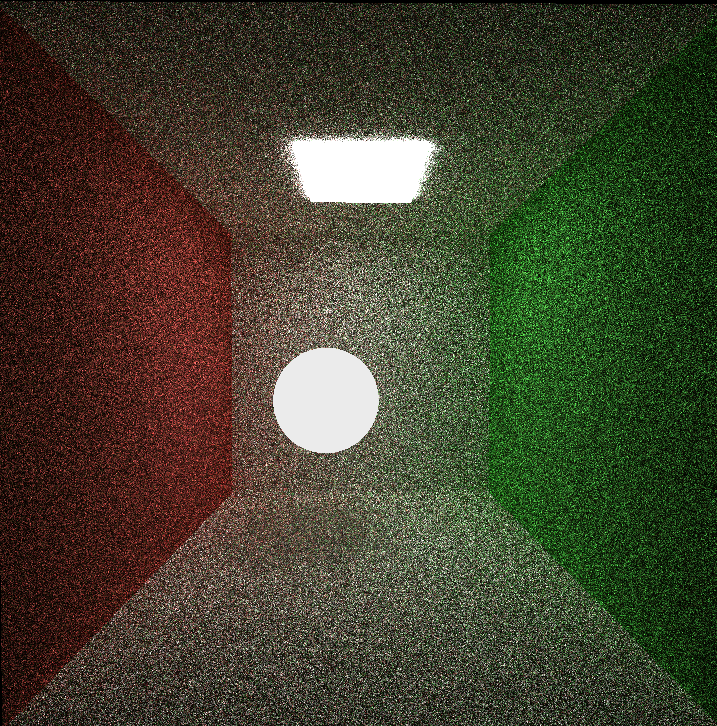

CUDA Path Tracer
================

**University of Pennsylvania, CIS 565: GPU Programming and Architecture, Project 3**

* Guanlin Huang
  * [LinkedIn](https://www.linkedin.com/in/guanlin-huang-4406668502/), [personal website](virulentkid.github.io/personal_web/index.html)
* Tested on: Windows 11, i7-8750H CPU @ 3.5GHz 16GB, RTX2070 8GB; Compute Capability: 7.5

## Representive Scene

- Scene file: title.txt
- Resolution : 800 x 800
- Iteration : 5000

* GLTF mesh loading with [tinyGLTF](https://github.com/syoyo/tinygltf)
* Texture mapping
* Physically based depth of field

## Features
- Ideal Diffuse
- Perfectly specular-reflective
- Physically-based depth-of-field 
- Antialiasing
- Texture and Normal mapping
- Arbitrary mesh loading and rendering
- Path continuation/termination with stream compaction
- contiguous in memory by material type
- cache the first bounce intersections

## Feature Descriptions
### Ideal Diffuse
- The light will bounce off a diffuse object in random directions, evenly dispersed in a hemisphere around the intersection point. The result is a surface that looks like plastic.

### Perfect Reflective/Specular
- A mirror effect is produced when a perfect specular material reflects the light along the opposite of its incoming angle; no random direction is involved.

### Anti-aliasing
- By jittering the rays' direction slightly, the result will average to an anti-aliased image with less zigzagged edges.

### Depth of Field
- Utilizing a thin-lens camera model achieves the appearance of the depth of field. The diagram below shows the general process of how an object is captured through camera lenses.

- Instead of projecting light directly into the scene from the camera eye, light rays are dispersed across a disk lens and then focussed onto a focal point a specific distance away. 

Focal Distance = 10         |  Focal Distance = 3
:-------------------------:|:-------------------------:
   |  

### GLTF Mesh Loading and Texture Mapping
- Models used are from:
https://github.com/KhronosGroup/glTF-Sample-Models/tree/master/2.0
- The texture map and normal map can be loaded in scene files. The texture data are then used for rendering if the texture coordinates for the mesh connected to the material are set. 

### Normal Mapping
- The renderer will compute them using vertex positions when loading the mesh if a normal map is not speified, or it will use the map. The scenes below were each rendered using a different texture: procedural texture, texture map, and texture and normal map. The normal map is not made for the demonstration below but it is easier to tell the difference between mapped and unmapped surfaces.

with normal map        |  without normal nap
:-------------------------:|:-------------------------:
   |  

## Performance Analysis
### Stream Compaction
- Inactive threads, which have ray paths with 0 remaining bounce, are terminated by stream compaction. The majority of rays are still bouncing around and active before depth 8, as in a closed box case, they can only become inactive by hitting a light or going beyond the maximum depth, which is 8 in the testing.  Because the rays leave the box and hit nothing in the open box scenario, many rays progressively become inactive with stream compaction, reducing the number of rays to test in the intersection test that follows. The following diagram supports this statement as well.

### Material Sorting
- We may require multiple shading algorithms for various materials at this level. This might cause warp divergences and is not the GPU's preferred memory access pattern. Sorting the rays according to their material ids is one approach we could lessen the severity of this problem. Theoretically, this lowers divergence by allowing contiguous memory access to material information.
- According to the performance analysis results for the cornell test.txt scene, sorting paths by materials takes longer than it does for the cornell scene without sorting. This is because there aren't as many materials and the cost of sorting itself outweighs any performance improvement from sorting by materials.

- However, sorting ray pathways by material should improve efficiency when the scene is more complicated.

## Bloopers
- "Camera malfunctioning!"

- "A mirror, or a light?"

