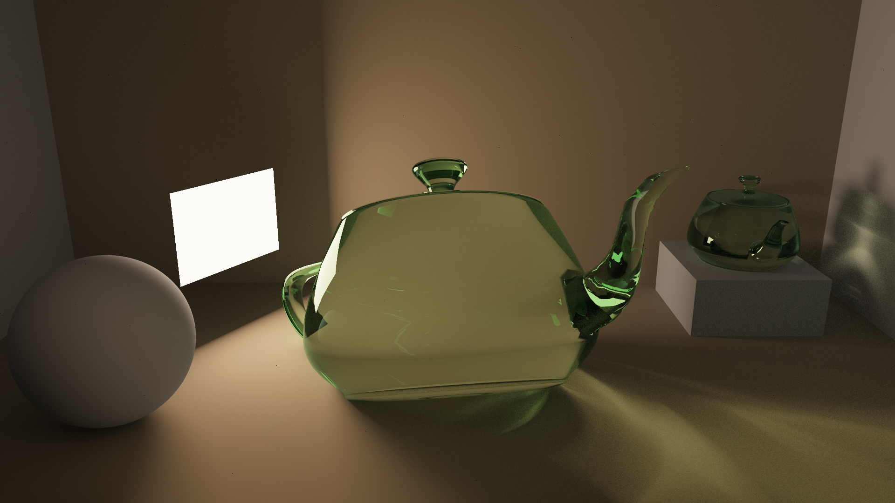

CUDA Path Tracer
================

**University of Pennsylvania, CIS 565: GPU Programming and Architecture, Project 3**

* Nick Moon
  * [LinkedIn](https://www.linkedin.com/in/nick-moon1/), [personal website](https://nicholasmoon.github.io/)
* Tested on: Windows 10, AMD Ryzen 9 5900HS @ 3.0GHz 32GB, NVIDIA RTX 3060 Laptop 6GB (Personal Laptop)

**USED 4 LATE DAYS**


**This is an offline Physically-Based Path Tracer accelerated on the GPU with CUDA. Path Tracing is a
technique of simulating the actual way light bounces around a scene from light sources towards an eye or
camera. Physically-Based implies energy conservation and plausibly accurate light simulation via solving
the Light Transport Equation** \
\
**I used this project to: learn path tracing
optimization techniques by utilizing the parallel nature of the GPU; review, reimplement, and extend
my work from CIS 561: Physically-Based Rendering; use this as an opportunity to learn and implement the
Bounding Volume Hierarchy acceleration structure, keeping in mind the limitations of GPU programming.**

**The result of the Multiple Importance Sampling (MIS) and Bounding Volume Hierarchy (BVH) I implemented is a PBR path tracer capable
of rendering scenes with millions of triangles and multiple area light sources with at least one sample
per second.**

## RESULTS


*7000 spp, ~300,000 triangles, max ray depth 16, rendered in ~1 hour*



*8000 spp, ~20,000 triangles, max ray depth 16, rendered in ~50 minutes*


*11000 spp, ~2,500,000 triangles, max ray depth 16, rendered in ~2 hour*

### All models obtained from either Alec Jacobson's or Morgan McGuire's common 3D model repositories. See references at the bottom of readme

## IMPLEMENTATION

### Physically-Based Rendering

Physically based rendering involves solving the Light Transport Equation, which describes how light is transmitted
from one direction into another at a particular surface. It is shown here below:


Lo is the direction in which a surface is viewed. Le is the light emitted from that surface. The integral indicates
a summing of all directions in the hemisphere surrounding the surface normal (all wi's). The f term represents the amount of light
transmitted from a certain incoming direction wi towards the viewing direction wo. The Li term represents the incoming
light from the direction wi. The V term is visiblity i.e. whether that surface is visible from the viewing direction.
The dot term represents the lambertian term, i.e. that less contribution of incoming
light is reflected the more perpendicular to the surface normal that the incoming direction is.

### Bidirectional Scattering Distribution Functions (BSDFs)

Bidirectional Scattering Distribution Functions describe the scattering of energy on a surface as a result
of the surface's material properties. Components of a BSDF can include the 
Bidirectional Reflectance Distribution Function and the Bidirectional Transmittance Distribution Function.
These describe the reflective and transmissive properties respectively. Sampling a BSDF involves generating
the **wi**, **pdf**, and **f** terms from the LTE in the above section. The **pdf** is needed, because we will never
be able to sample all possible ray directions in the hemisphere directed along the surface normal, so we need to account
for how much of the total domain of directions this wi takes up with respect to the particular BSDF.

#### Diffuse BRDF


The Diffuse BRDF scatters light in all directions in the hemisphere oriented along the surface normal.

#### Specular BRDF


The Specular BRDF reflects rays in only a single direction: the incoming ray reflected about the surface normal.
This yields a perfect mirror-like reflectance model.

#### Specular BTDF


The Specular BTDF reflects rays in only a single direction: the incoming ray refracted about the surface normal
based on the specified index of refraction according to Snell's Law. At some points of interesection, this may yield
total internal reflection, at which point the ray should be reflected outwards similar to the Specular BRDF. However,
this specific case is handled in full in the Specular Glass BxDF below.

#### Specular Glass BxDF


Specular Glass combines both the Specular BRDF and the Specular BTDF into one BSDF. The mix of reflection vs. refraction
is modulated by the Fresnel term for dielectrics, which specifies that more reflection occurs where the surface normal
is more perpendicular to the look direction, whilst
more refraction occurs in cases where the surface normal is more parallel with the look direction.

#### Specular Plastic BxDF


Specular Plastic is a BxDF mix between the diffuse BRDF and the specular BRDF. It functions nearly
identically to glass in terms of mixing these two BSDFs, and yields a partially rough and partially
mirror-like surface.

### Multiple Importance Sampling (MIS)

Multiple Importance Sampling, as well as Direct Light Sampling, are methods of optimizing the way rays are cast throughout
a scene. Direct Light Sampling, for every vertex along a path, sends a ray towards a light source in an effort to
directly sample the source for its incoming light. This ensures that every ray path at least tries to hit a light
source, instead of randomly being sent into a new direction based on the surface's BSDF.

The problem with this approach is that it does not work as well for nearly specular surfaces. Although I did not implement
microfacet BSDFs in this assignment, the idea is that directly sampling a light source for incoming light information
in a nearly specular surface doesn't account for the fact that a nearly specular surface only allows incoming light
to reflect off itself if it is within its "glossy lobe", which encompasses directions near the perfect "specular" reflection
direction where some amount of reflection can still occur. It would be better in this case to actually use the BSDF
to generate the new ray direction, because this will ensure that, if a light source is hit, that is from a direction
within this lobe. Multiple Importance Sampling seeks to bridge these two sampling techniques, Direct Light Sampling and
BSDF Sampling, and does both samples for every vertex in a ray path. The contribution from these two sampling rays are
then weighted based on how much that ray directiona aligns with the BSDF ray direction domain. This is a concept originally
proposed by Eric Veach, who also proposed the *Power Heuristic* as a good method of combining the two samples. That is
what is used in this path tracer.

This is the result of using a ray depth of 1, which is essentially just direct lighting. Note the glass teardrop is black
because there is no refraction or reflection with ray depth 1.


At ray depth 8, all the effects of global illumination are now visable.


This render shows the result of 1 sample of the scene rendered. In just 1 sample, we get a pretty good idea of what
the scene should look like:


And with 100 iterations, it looks nearly converged. This scene with roughly 5000 triangles and 100 iterations
at 1080p with ray depth 8 took only 25 seconds to render


### Depth of Field


Depth of Field models the way a lens works in the real world. In the real world, a lens is normally disk shaped,
and this causes the rays to focus on a certain distance in space depending on the radius of the lens and the
focal distance. Note that the curvature or thickness of the lens is not included in this **thin lens** approximation.
Thus, in order to achieve this effect, we simply need to randomly choose a point in a disk to set as the ray origin
for each of the rays we generate in a sample. This yields the blurring effect seen above.

### Stochastic Anti-Aliasing

Naively generating rays causes the primary ray from the camera for every pixel to deterministically hit
the same object every sample. The result of this is the appearance of "jaggies" as seen below:


By providing a small, random jitter in the x and y directions of a pixels grid cell and 
modifying the ray direction using this jittered value, the rays shot from a single pixel grid cell can
thus hit different, neighboring objects each sample yielding anti-aliasing for "free":


### Tone Mapping and Gamma Correction

The image that results from rendering this scene with a basic RGB path tracer is the following image:


This image looks overly dark in the areas further from the light, and is too bright near the top of the 
teardrop mesh. It is hard to tell there is even any global illumination going on! This is because
this render has not been tone mapped nor gamma corrected.

This is the result of adding Reinhard HDR tone mapping to the render:


The intense color near the tip of the teardrop has been eased out, providing a much more natural looking
diffuse gradient from top to bottom. This is achieved by dividing the final color by the final color plus 1.
The effect of this is that very high intensity light values are always less than 1, but the amount there are less than
one is not linear. Small light values will pretty much remain the same, while larger light values will be shrunk much
more.


This is the result of adding gamma correction to the render:


The color near the edge of the screen has now been boosted to more closely match human color perception,
and now those areas are now all clearly illuminated by a mix of global illumination and the far away light source.
However, without the Reinhard operator, the tip of the teardrop is still to bright. Gamma correction is implemented by
taking the final color and taking it to the power of 1 / 2.2.

Finally, combining both operations together yields:


This render has been properly tone mapped and gamma corrected, and now looks more cohesive, natural, and
follows physically-based rendering principles. See the links in the references for more detail in how these operations
work.

### OBJ Loading with TinyOBJ

Using the TinyOBJ library, a. .obj file can be specified in the scene description and then read in via
the library into arrays of triangle positions, normals, and texture coordinates. These are then grouped together
in a struct, and an array of these structs is sent to the GPU to be rendered. The wire frame render of the
teardrop model looks like this:


P.S. In order to render this wireframe version while still in a physically-based framework and in an
easy and quick to implement way, I changed my triangle intersection test. In the final check for if
the barycentric coordinates of the hit point are within the triangle, I simply added an upper limit to
the distance from an edge a point is that will still count as an intersection.

By using the normals read in from the obj file, the normal at the hit point of the ray-triangle intersection
test can be interpolated using the barycentric coordinates, yielding smooth shading, like that below:


### Optimizations Features
 
#### Bounding Volume Hierarchy (BVH)

During path tracing, a ray needs to intersect with the geometry in the scene to determine things like
the surface normal, the distance from the origin, and the BSDF at the surface. To do this, a naive
ray tracing engine has to perform a ray-primitive intersection test for every primitive in the scene.
While this is acceptable for scenes with a small amount of, for example, cubes and spheres, this quickly falls
apart for scenes with meshes, especially ones made up of thousands and more triangles.

The Bounding Volume Hierarchy is a binary-tree based primitive acceleration structure that can be used
to optimize this ray-scene intersection test. Instead of intersecting with every triangle, instead a ray
interesects with nodes in the BVH, represented spatially as an Axis Aligned Bounding Box (AABB). An intersection
test will only be performed on a node if the intersection test with its parent was found to be a hit. The
leaf nodes store the actual primitives, so the triangle intersection test, which is more expensive than
the AABB, is only done once a leaf node AABB is hit.

In terms of how to split a node in the BVH, I opted for splitting along the max extent of the centroids of the
triangles contained within the node. This is similar to the naive approach that PBRT takes. Thus,
all triangles with a centroid less than the average centroid value in the max extent axis is put in the
left node, and the rest in the right. If I had more time,
I would have tried the Surface Area Heuristic instead, as it constructs more well formed trees.

I then have to convert the CPU side nodes to GPU side nodes. This means storing the tree in an array.
I used some optimizations explained by PBRT, which includes
storing the tree in depth first order. What this means is that, for all nodes, their left child is always in the
next index of the array from it, while the second child is further down the array. This means an index to the first
child does not need to be stored in the nodes, and it also means that nodes will always be continuous in memory if
traversing down the left child path.

For traversing, recursion cannot be used, because it is on the GPU. So, an iterative approach must be
taken, which also means I must use a stack. While the stack is not empty, the front of the stack is popped and
the popped node is the current one. Its AABB is intersected with, and if it is not hit, then continue on to the next
thing in the stack. Otherwise, if the node is a leaf node, then intersect the ray with the node's triangle, and update
the ray t value. If the stack is empty, this means we are done, and have fully traversed the tree. Otherwise we go get
the next thing on the stack. If the node is not a leaf node, then we add the right child to the stack to process, and
set the next node to process to be the left child, as this is more memory coherent. At the end of traversal we have
our hit triangle.

This optimization should hopefully provide **O(logn)** runtime, as opposed to the **O(n)** of the naive linear scan.


#### Russian Roulette Ray Termination

Russian Roulette Ray Termination is an optimization that seeks to remove ray paths that have no additional
information to contribute to the scene by bouncing more times. For my renderer, I enable a ray termination
check if the depth is greater than 3. This is because, for a scene made of mostly diffuse surfaces,
4-5 bounces is usually enough to get the majority of the global illumination information for a path (assuming
MIS/direct light sampling is also used). Thus, on depth 4 and greater, a random number is generated for each
ray path. If the max channel of the throughput of the ray (the value which gets attenuated when hitting
diffuse surfaces) is less than this random number, then the ray is terminated. However, if the max channel
is greater, then the ray path continues bouncing (for at least one more bounce if applicable). Additionally,
the throughput of a ray path that passes this check is divided by it max channel. This is to counter
the "early" termination of the rays which did not pass this check on earlier (or later) samples, thus
preserving the overall light intensity at each pixel. The image would be slightly darkened without this,
as energy would no longer be conserved.

#### Stream Compaction Ray Termination

The following explanation is from my HW 02: Stream Compaction README:

"Stream compaction is an array algorithm that, given an input array of ints ```idata``` of size ```n```,
returns an output array ```odata``` of some size ```[0,n]``` such that ```odata``` contains only the
values ```x``` in ```idata``` that satisfy some criteria function ```f(x)```. This is essentially 
used to compact an array into a smaller size by getting rid of unneeded elements as determined by 
the criteria function ```f(x)```. Values for which ```f(x)``` return ```true``` are kept, while
values for which ```f(x)``` return false are removed."

For the purposes of path tracing, we have an array of ray paths, with the remaining bounces of a path
being the amount of bounces a ray has left to take in the scene. We obviously don't want to be doing
unecessary intersections and shading for rays that no longer contribute color to the final
image. We thus define the ```f(x)``` from Stream Compaction to be that a ray path's remaining bounces
is not equal to 0. By using the Thrust library's Stream Compaction function, we can thus move unneeded rays
to the back of the array of paths, and only call the intersection and shading kernels on the rays that
will actually contribute to the rendering.

#### Material Sorting

Another optimization that can be made is by recognizing that all the material shading is currently done in
a single "uber" kernel. This means that individual threads in a warp might be calculating the f, pdf, and wi
terms for the hit surface using different BSDFs. These BSDFs could potentially be very intsense and vary with
high spatial frequency across the scene. This means a lot of potential warp divergence, which could dramatically
slow down the shading kernel. Instead, if we sort the ray path's and intersections by the material type
returned by the intersection kernel, we could then insure that most ray paths with similar material
types are laid out sequentially in memory. This will yield less divergence, and thus faster runtime. Thrust
Radix Sort is used for this sorting process. Note that the material IDs are what are being sorted here,
not necessarily the BSDF or material type, so unfortunately materials that are the same in every aspect save
albedo will still count as seperate entries to be sorted.

#### First Bounce Caching

First bounce caching is an optimization used in settings where features like depth of field or anti-aliasing
are not needed (which I assume are pretty rare.) Because the direction and origin of the intitial camera
ray are deterministic in this scenario, then this means this ray will always hit the same primitive. Thus,
instead of computing this intersection every sample, we instead cache this first intersection into a seperate
device array on the first sample, and then load it into the main intersection device array for every sample
beyond the first. Especially for scenarios where the max ray depth is on the lower end, this should
improve the runtime.

## Performance Analysis

### Stream Compaction and Russian Roulette Ray Termination

**All the below figures are in a scene with 32 max depth (unless otherwise noted)
, 1920x1080 render target, 250000 tris, and 1 light. Runtimes
of an iteration are averaged over 50 samples.**


As can be seen from the two charts above, adding stream compaction actually increased the runtime. I believe this was
mostly because, in all my kernels, I always made sure to check that the returning bounces amount was 0, and to return
if so. This essentially negated a lot of the perceived benefit of the ray termination. Although not as many threads were
being launched by kernel calls, the performance impact this gave was negated by the cost in running the stream compact
algorithm. Like expected, the performance penalty of stream compaction was indeed smaller with the open scene,
where more rays terminate. However, it is still slightly worse than without, again because I still have those checks
in all my kernels.


Next, as can be seen from the two charts above, adding Russian Roulette Ray Termination **greatly** increases performance.
This is because, even in closed scenes, which normally would only terminate rays that hit the light, there are still
many rays per iteration that become terminated due to the feature. The performance gain from this feature is also better
when a higher max depth is used.


Finally, the above two charts showcase the number of active rays at each depth for a single sample.
As can be seen, without Russian Roulette in a closed scene, the number of rays that terminate per depth is very very
small. with Russian Roulette, the number of rays terminated almost matches that for the open scene. Except for the
first three depth, as this is before the feature takes effect. For the open scene,
the number of rays remaining with and without Russian Roulette is very similar. This is because most rays in the scene
are being terminated by hitting the void. If a ray is already terminated by hitting the void, then Russian Roulette
will not even be used on those rays. Overall, it appears that Russian Roulette Ray termination is a very useful and
cheap method of ray termiantion, whereas stream compaction is too expensive to justify its inclusion.


### Material Sorting


The above two charts display the runtime impact of material sorting with different numbers of materials. As can be seen,
while the runtime with material sorting got a bit faster with double the amount of materials, the runtime without
material sorting in both cases still is incredibly faster. This is probably because the impact of material sorting
can only really be felt with thousands of materials in the scene and much more expensive BSDF calculations. Both of
these are beyond the scope of this project, but would be an exciting test to run in the future.

### First Bounce Caching


The above chart shows the performance impact of adding a first bounce cache to the rendering pipeline (without AA or DOF).
As can be seen above, the performance impact is actually not that much. This is because of the other features I have
implemented, specifically the BVH and MIS. MIS means that, per depth, 3 intersection tests are made. So, caching
only the first intersection test of the first depth is not much in the grand scheme of things. The BVH means that the
intersection test is much faster, which decreases the total amount of impact that caching one of these tests can have
overall. As the ray depth increases, the performance impact from caching also decreased, as now the cached bounce is
only, for the example of max ray depth 8, 1 of 24 total intersection tests made per sample, as opposed to 1 of 3 total for
max ray depth 1.

### Anti Aliasing and Depth of Field


The chart above shows the performance penalties for Anti Aliasing and Depth of Field. Both of these features have very
small impact on the overall runtime of the program relative to the first bounce caching optimization, especially
because I handle most calculations and random number generation CPU side to make things easier for the kernel.

### Bounding Volume Hierarchy (BVH)

This chart shows the average runtime across 50 pixel samples:


As can be seen from the chart above, the runtime of the linear triangle intersection search is indeed O(n) (remember logarithmic axes). And,
the runtime with the BVH appears to be logarithmic. Note that there was some variance in the objects used, and mesh
topology, and scale in the scene definitely play a role in making the runtime vary per object tested. For anything past
1000 triangles, the linear search was less than 1 frame a second, and became untennable to actually test the runtime for.


## Bloopers


Accidentally made the walls specular

**For more bloopers, see img/bloops :)**

## References

Adam Mally's CIS 560 and 561 Slides and Lectures

Physically Based Rendering: https://pbrt.org/

TinyOBJ (used for obj loading): https://github.com/tinyobjloader/tinyobjloader

AABB traversal help: https://tavianator.com/2011/ray_box.html

Jacco Bikker Blog on BVHs: https://jacco.ompf2.com/2022/04/13/how-to-build-a-bvh-part-1-basics/

Alec Jacobson Common 3D Test Models: https://github.com/alecjacobson/common-3d-test-models

Morgan McGuire, Computer Graphics Archive, July 2017 (https://casual-effects.com/data)

Eric Veach. Multiple Importance Sampling: https://graphics.stanford.edu/courses/cs348b-03/papers/veach-chapter9.pdf

expf Reinhard Tone Mapping post: https://expf.wordpress.com/2010/05/04/reinhards_tone_mapping_operator/

LearnOpenGL Gamma Correction: https://learnopengl.com/Advanced-Lighting/Gamma-Correction
