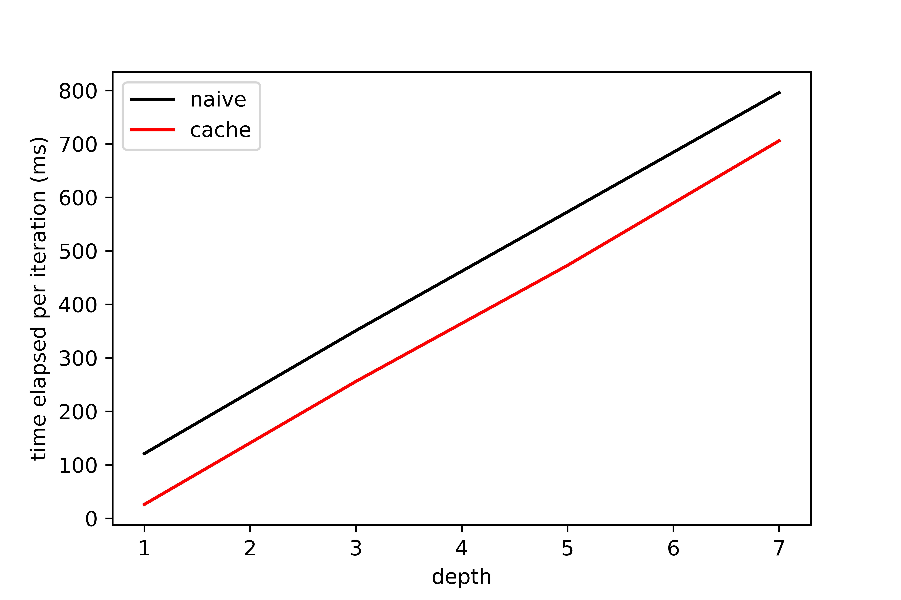
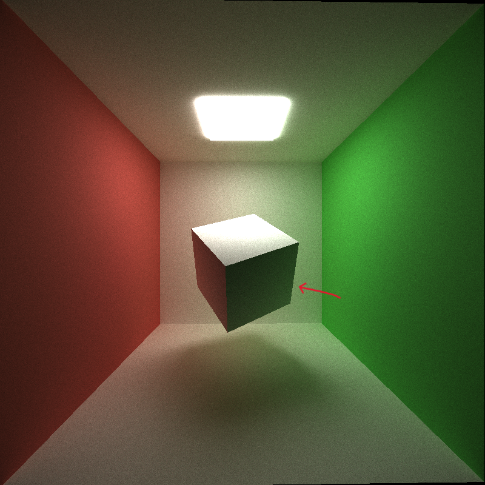

**CUDA Path Tracer**
================

**University of Pennsylvania, CIS 565: GPU Programming and Architecture, Project 3**

* Shineng Tang
  * [LinkedIn](https://www.linkedin.com/in/shineng-t-224192195/)
* Tested on: Windows 11, i9-10900k @3.7GHz 32GB, RTX 3090 24GB

## **Project Description**
This is a CUDA-based path tracer capable of loading multiple OBJ files and rendering globally-illuminated images based on the model at fast speed using GPU parallelization.

 
## **Main Features**
### **Stream compaction**
I used stream compaction to get rid of lights that have no intersections with the scene, which largely reduces the amount of useless rays being computed for intersections.
### **Refraction**
I used Schlick's approximation and `glm::refract` for Snell's law to implement refraction with Frensel effects. Given a specific refraction rate, it will create different effects. 
| IOR 1.5                          | IOR 3                             |                 
| ---------------------------------| ----------------------------------|
|           |                |

### **Physically-based depth of field**
For this part, I implemented a thin-lens camera with focal distance and lens radius as its input. By tweaking these numbers, the camera will change its focal point to create this DOF effect. When the focal point is at the object, the object will be clear, otherwise, it will be vague.
| Focal Distance 6                         | Focal Distance 14                           |                 
| -----------------------------------------| --------------------------------------------|
|           |                |

### **Stochastic Anti-Aliasing**
| Without Anti-Aliasing                           | With Anti-Aliasing                              |                 
| ------------------------------------------------| ------------------------------------------------|
|           |                |

### **Custom Obj Mesh Loading**
I used tinyObj loader to get all the vertex positions and vertex normals from the obj files and passed them to the GPU for doing triangle intersection tests.
 

### **BVH tree structure**
I implemented the Bounding Volume Hierarchy tree to accelerate the rendering process. I build the tree after all obj files are loaded on the cpu. To build the tree, I need to get the global positions of the bounding boxes of the triangles of the meshes. Based on the data of each bounding box, I can easily assign the bounding box to the tree node recursively. One thing to remember is that we have to deserialize the tree into an array so that it can be passed to the GPU. After finish building the tree, I pass the BVH tree "array" to the GPU to do ray intersection tests. If a ray hit the bounding box, then it keeps traversing the tree until the current bounding box belongs to a triangle of a mesh. By using BVH tree, we can save a lot of work doing useless intersection tests on irrelevant triangle primitives. For example, the following images would take forever to render without using BVH. With BVH, however, only takes me around fifteen minutes to render three refractive stanford dragons.

### **Performance Analysis for BVH tree**

As we can tell from the diagram, there is a huge performance gap when between these two options. When we are dealing with obj files with relatively lower poly counts, such as wahoo, cow, we can get four times more fps if we use BVH. When we are dealing with obj files with high poly counts, the fps gap is incredible: for the Stanford dragon model, we can get 360 times more framerates per second! This results from the fact that for each ray, we only need to search a small range of bounding boxes to get to our target comparing to traversing through all the primitive triangles, 5,500,000 triangles for the Stanford Dragon, for example.

### **Performance Analysis for caching the first bounce**

Since the first intersection test for each iteration is always the same, we can cache it so that we can reuse it in the subsquent iterations. This can help us gain some performance.

From the diagram above, I noticed that the gaps of using and not using caching among all max ray depths do not have a large difference, but it still has a pattern: the deeper the depth is, the smaller the gap between these two options. This is because of the more computation it needs for deeper depth so it will reduce the gap.