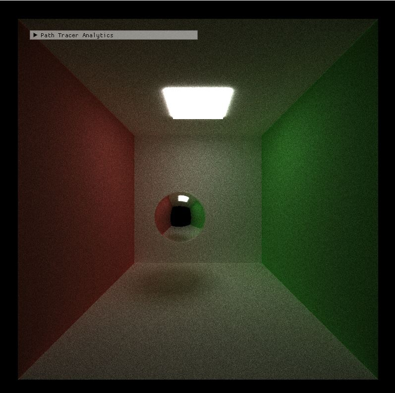

CUDA Path Tracer
================

**University of Pennsylvania, CIS 565: GPU Programming and Architecture, Project 3**

* Hanlin Sun
* Tested on: Windows 10, i7-8750H @ 2.22GHz 1024GB, NVIDIA Quadro P3200

## Background

This is a GPU Path Tracer implemented in C++/CUDA, based on fundamental PBR raytracing knowledge.
It allows loading GLTF files for meshes.

## Screen Shots

## Basic Features

### Basic Shading

First we need to convert the naive path tracing shading technique from CPU version to GPU version.This allows for global illumination
effect to be achieved. (But very slow)

Two basic shadings were implemented first: diffuse and perfect specular. The diffuse component is shaded by generating new ray using cosine weighted random direction in a hemisphere, and the perfect specular uses glm::reflect to generate a perfectly reflected ray.

Diffuse | Specular
:--------------------------:|:------------------------:
 | 

### Refraction

To implement refraction, we need to use snell's law and fresnel law to compute material's eta, then use fresnel formula to compute final ray color.

Pure Specular | Specular with Refraction
:--------------------------:|:-------------------------:
 | 

### SSAA & Depth of Field

Aliasing is the problem of artifacts on images as a result of discretization of pixels. This can be mitigated by taking more than one sample per pixel from regions around the center of the pixel. By performing stochastic sampled anti-aliasing, we are using a higher number of iterations to produce a sharper image. Stochastic sampled anti-aliasing definitely benefits from being implemented on the GPU because the rays generated for each pixel are always independent. This might be further optimized by launching more threads to per pixel. The exact effect cannot be known unless it is tried out. This depends on whether launching extra threads will help mask memory latency by doing more computations. Below is the comparison for 2000 iterations.

SSAA not Enabled | SSAA Enabled
:-------------------------:|:-------------------------:
 | 

Depth of field creates the thin lens effect of a real life camera as opposed to a pinhole camera. Objects in focus will be sharp while objects out of focus will be blurry. Depth of field significantly increases the number of iterations required to render an image since we need to shoot rays from not just a pinhole but rather the whole area of the circular lens. Depth of field definitely benefits from being implemented on the GPU because the rays generated are always independent. 

DoF not Enabled | Dof Enabled
:-------------------------:|:-------------------------:
 | 

### String Compaction

Since we are using naive path tracing method, many rays may reflect out of the scene and become useless computation.
To optimize it, we need to remove these useless ray from path tracer.

In this project I use the `thrust::stable_partition` kernal to partition these paths based on completion.

This method is really useful for unclosed scene and bring performance improvement to the MCPT since the GPU will compute less rays after each bounce.

But for closed scene, since no ray will bounce outside the scene, this method may not bring performance improvement in this case.

### Material Sorting

### First bounce Caching

Another optimization that's made is caching the intersection data for the first bounce (i.e. depth = 1). Since each ray starts at the same spot for each pixel, the first bounce result will always be the same for all iterations. Although not significant, first bounce caching does make things slightly faster on average.

### GLTF Mesh Loading

In order to render more complex scenes, we needs to support loading arbitrary mesh robustly. As long as the system is sufficiently robust (e.g. able to handle multiple hierarchies), the complexity can be defined by the file format itself thus making the scene more visually interesting. GLTF was chosen as the scene description format as it is much more powerful than OBJ and is a more modern 3D model file. I have never worked with GLTF before so I thought it would be a good opportunity to understand the specification through this project.

GLTF is different because the gltf file was constructed by nodes and only give you bufferView and bufferOffset, to fetch the vertex and texture information we have to check the bin and read them from buffer.

To support GLTF mesh loading, I used tinygltf to load in the GLTF file and parsed the data into custom struct data I defined in sceneStruct.cpp. This step is necessary because the tinygltf classes are not GPU-compatible. Additionally, in order to not have to deal with passing nested Struct Arrays to the GPU, each mesh vertex data is flattened into its own giant buffer containing the data for all meshes. The actual Mesh struct would only store the index offset for each data. This is similar to how GLTF/OpenGL defines VBOs.

I have tried my best to implement GLTF texture binding but I must say GLTF texture loading is far more difficult than Obj file, I know gltf file contain texture, but my implements still have some bugs but I have no time to fix them.

;

## Reference
