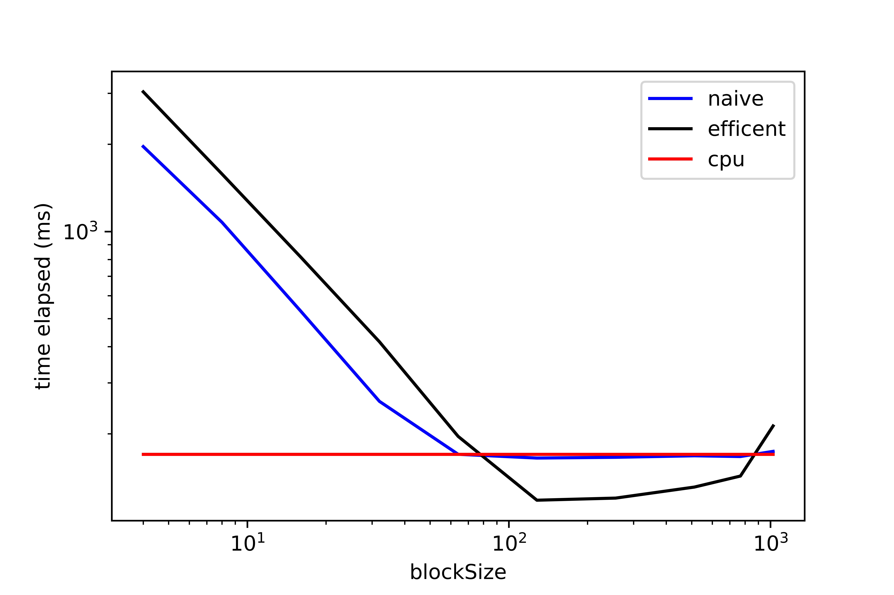
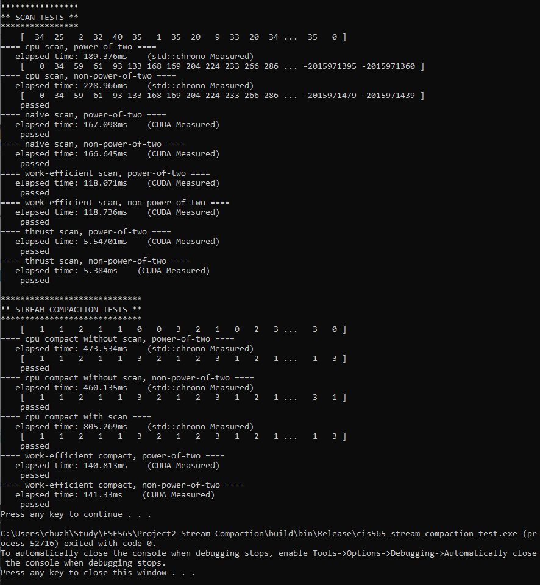

CUDA Stream Compaction
======================

**University of Pennsylvania, CIS 565: GPU Programming and Architecture, Project 2**

* Zhangkaiwen Chu
  * [LinkedIn](https://www.linkedin.com/in/zhangkaiwen-chu-b53060225/)
* Tested on: Windows 10, R7-5800H @ 3.20GHz 16GB, RTX 3070 Laptop GPU 16310MB (Personal Laptop)

This project implement GPU stream compaction in CUDA from scratch, including naive scan and work-efficient scan described in GPU Gem3 Ch39.

## Features:
* CPU Scan & Stream Compaction
* Naive GPU Scan Algorithm
* Work-Efficient GPU Scan & Stream Compaction
* Thrust's Scan

## Optimize Block Size:
Tested with array size = 2^28

* Optimal block size for naive scan: 128
* Optimal block size for naive scan: 128

## Scan Performance Comparation

## Compact Performance Comparation

## Analysis
The bottlenecks for different implementation is different, and it varys with different array size.

* For cpu implementation, the run time is always linear with the array size. The bottleneck should be the memory I/O. 
* For naive scan, it first scales with the log of array size, then becomes linear. Note that the total commputation is linear, while, the number of function calls are log, so I think when the array size is small, the branch divergence and function calls are the predominant factor, while when the array size is large, the memory I/O is the main factor. 
* For work-efficient scan, the pattern is alike. However, it is much slower when the array size is small. I found that cudaDeviceSynchronize() consumes most of the time. Note that the number of calls to synchronization also scales with log of array size. When the array size is large, memory I/O becomes the main factor.
* The thrust implementation is very efficient. It seems to change blocksize dynamically, and have fewer memory I/O. 

## Why is My GPU Approach So Slow? 
My work-efficient implementation outperforme cpu version with array size larger than 2^24. It is really a large array size, so it shows my implementation is not that efficient. Most threads in upper/down sweep is not working. However when the arraysize is very large, the compuitation advantage overcomes the overhead.

## Output of the Test Program
